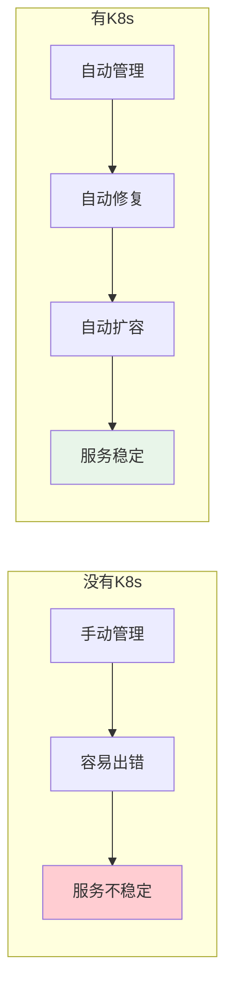
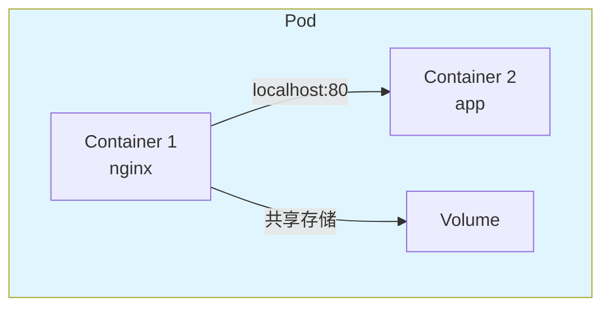
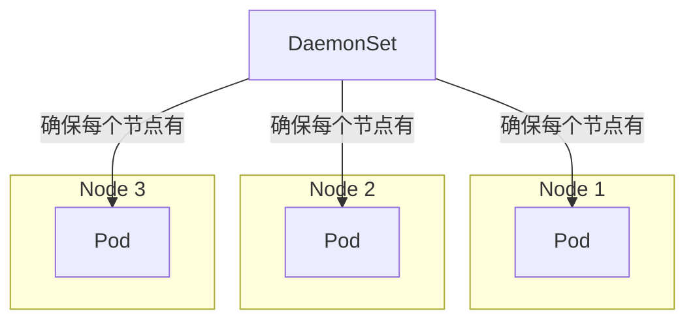
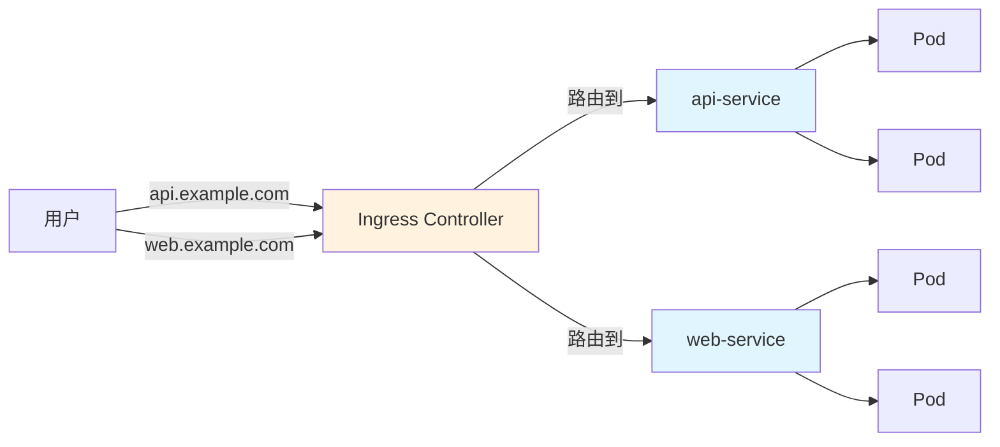
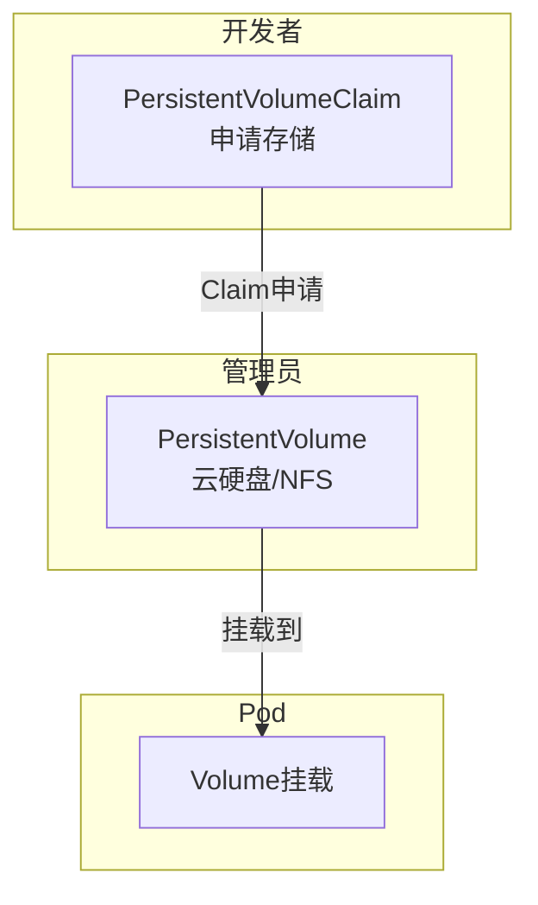
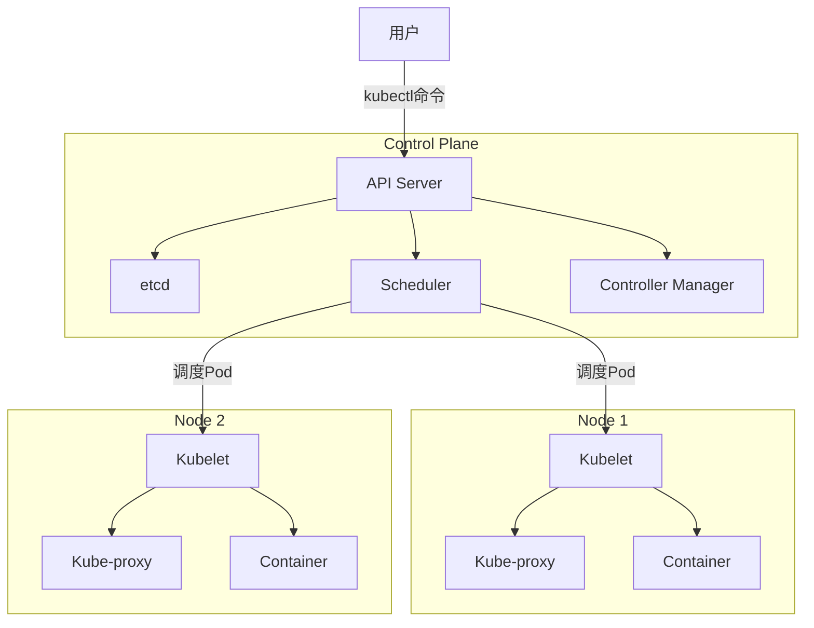
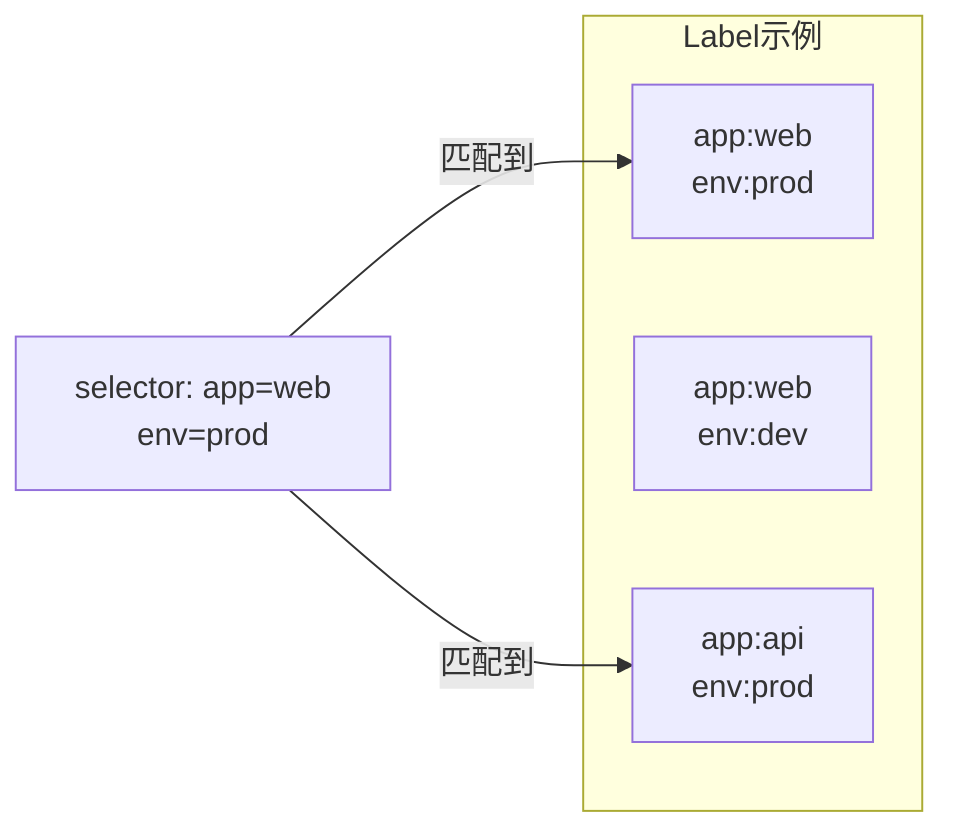
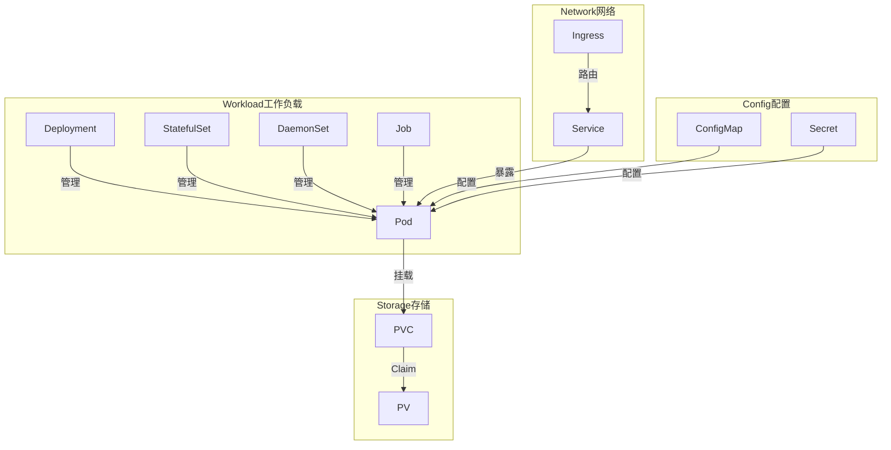

# Kubernetes入门看这一篇就够了：手把手带你从零入门K8s

> 写在前面：Kubernetes（简称K8s）现在是互联网大厂的"标配"，不懂K8s都不好意思说自己是做后端的。但K8s概念多、学起来曲线陡，让很多人望而却步。这篇文章，我会用最通俗的大白话，配合大量手绘图，一步步带你们入门。文章有点长，但全是干货，建议先收藏再看。

---

## 一、K8s到底是个啥？

### 1.1 先说说容器技术

在正式介绍K8s之前，我们先说说它的"前身"——容器技术。

你们用过虚拟机吗？VMware、VirtualBox那种？一个电脑开多个"假电脑"，每个都是独立的操作系统。

**容器呢？更轻量**。它不和操作系统玩"虚的"，而是直接把应用和依赖打包在一起。就像把"你的衣服、裤子、鞋子"装进行李箱，到哪儿都能直接用，不用再找地方换。

> "这个项目在我本地跑得好好的，为啥到你那儿就挂了？"  
> "环境不一样啊，我用的是Python 3.8，你那是3.6......"

有了容器，这种破事就没了。Docker就是最流行的容器技术。

### 1.2 那K8s又是啥？

好，现在我们有了容器技术。但问题是：

- 你有100个容器，怎么管？
- 某个容器挂了，怎么自动重启？
- 访问量大了，怎么自动扩容？
- 怎么实现零 downtime 更新？

**Kubernetes就是管这些破事的。**

官方定义是这么说的：

> Kubernetes是一个开源的容器编排平台，用于自动化容器化应用的部署、扩缩容和管理。

说人话：**K8s就是一个容器管理系统，专门帮我们管理一大波容器**。

### 1.3 K8s能干啥？

| 能力 | 说明 |
|------|------|
| **自动修复** | 容器挂了？自动重启！ |
| **弹性伸缩** | 访问量大？自动加容器！ |
| **负载均衡** | 多个容器轮流处理请求 |
| **滚动更新** | 更新版本不中断服务 |
| **回滚** | 更新出问题？一键撤回！ |



---

## 二、K8s核心概念：Pod到SSR

### 2.1 Pod：K8s的"最小单位"

你们可能会想：K8s直接管容器不就行了？要Pod干嘛？

**Pod是K8s里最小的部署单元**。你可以理解为：Pod是容器的"外壳"，K8s通过管理Pod来管理容器。

通常情况下，一个Pod里只跑一个容器。但有时候也会有特殊情况：

```yaml
apiVersion: v1
kind: Pod
metadata:
  name: my-pod
spec:
  containers:
  - name: web-container      # 主容器
    image: nginx
    ports:
    - containerPort: 80
  - name: log-sidecar   # 辅助容器（日志收集）
    image: log-collector
```

### 2.2 同一个Pod里的容器：共享一切

Pod有个特点：**同一个Pod里的容器共享网络和存储**。

这意味着：

- 它们之间可以用`localhost`直接通信
- 它们可以共享同一个存储卷
- 就像住在同一个房子里的室友



### 2.3 ReplicaSet：保证数量

好，现在我们有一个Pod了。但这个Pod可能会挂啊！

**ReplicaSet（RS）就是保���Pod数量的**。

你告诉它："我要3个Pod"，它就给你整3个。挂了一个？马上补上。

```yaml
apiVersion: apps/v1
kind: ReplicaSet
metadata:
  name: my-rs
spec:
  replicas: 3  # 永远保持3个
  selector:
    matchLabels:
      app: my-app
  template:
    metadata:
      labels:
        app: my-app
    spec:
      containers:
      - name: my-app
        image: my-app:latest
```

### 2.4 Deployment：更强大的管理

虽然ReplicaSet能保证数量，但用起来还是不太方便。**Deployment是更高级的封装**，它底层用ReplicaSet，但提供了更多能力：

- 滚动更新（逐步替换旧Pod）
- 回滚（出问题了一键撤回）
- 扩缩容（轻松调整数量）

```yaml
apiVersion: apps/v1
kind: Deployment
metadata:
  name: my-app-deployment
spec:
  replicas: 3
  selector:
    matchLabels:
      app: my-app
  template:
    metadata:
      labels:
        app: my-app
    spec:
      containers:
      - name: my-app
        image: my-app:1.0
```

**这就是我们最常用的写法！**

### 2.5 StatefulSet：有状态的应用

Deployment适合无状态应用。但如果是数据库呢？**StatefulSet**就是专门管有状态应用的。

区别：

| 特点 | Deployment | StatefulSet |
|------|-----------|-----------|
| Pod名称 | 随机 | 固定顺序 |
| 存储 | 随机 | 固定绑定 |
| 更新 | 并行 | 顺序更新 |

比如Redis集群、MySQL集群，用StatefulSet就对了。

### 2.6 DaemonSet：每个节点都要跑

还有个特殊的：**DaemonSet**。

它保证**每个节点**（或者符合规则的节点）都运行一个Pod。

典型场景：

- 日志收集（每个节点都要跑Fluentd）
- 监控代理（每个节点都要跑Prometheus Node Exporter）



---

## 三、服务访问：Service和Ingress

### 3.1 为什么需要Service？

问题来了：Pod的IP是**动态**的！

每次重启 Pod，IP 可能就变了。那客户端怎么稳定地访问？

**Service就是给一组Pod提供稳定入口的**。

你不用管后面有几个Pod、IP是什么，统一访问Service的IP就行。

```yaml
apiVersion: v1
kind: Service
metadata:
  name: my-service
spec:
  selector:
    app: my-app
  ports:
  - protocol: TCP
    port: 80        # Service端口
    targetPort: 8080  # Pod端口
  type: ClusterIP
```

### 3.2 Service的类型

Service有四种类型，适用场景不同：

| 类型 | 说明 | 适用场景 |
|------|------|----------|
| **ClusterIP** | 集群内部IP | 内部服务间通信 |
| **NodePort** | 在每个节点开放端口 | 测试环境 |
| **LoadBalancer** | 云厂商负载均衡器 | 生产环境暴露服务 |
| **ExternalName** | DNS别名 | 外部服务映射 |

### 3.3 Ingress：HTTP/HTTPS路由

Service已经很强大了，但它只能做TCP层面的负载均衡。

如果我们要：

- 不同的域名访问不同的服务
- 路径路由（/api走后端，/web走前端）
- HTTPS证书管理

**Ingress**就是干这个的。

```yaml
apiVersion: networking.k8s.io/v1
kind: Ingress
metadata:
  name: my-ingress
spec:
  rules:
  - host: api.example.com
    http:
      paths:
      - path: /
        pathType: Prefix
        backend:
          service:
            name: api-service
            port:
              number: 80
  - host: web.example.com
    http:
      paths:
      - path: /
        pathType: Prefix
        backend:
          service:
            name: web-service
            port:
              number: 80
```

> **注意**：Ingress本身只是"规则"，你还要部署一个Ingress Controller（比如Nginx Ingress Controller）才能生效。



---

## 四、配置管理：ConfigMap和Secret

### 4.1 ConfigMap：非敏感配置

应用的配置（配置文件、环境变量、命令行参数）可以放在ConfigMap里：

```yaml
apiVersion: v1
kind: ConfigMap
metadata:
  name: my-config
data:
  database.yaml: |
    host: localhost
    port: 3306
  LOG_LEVEL: "info"
```

然后挂载到Pod里：

```yaml
spec:
  containers:
  - name: my-app
    image: my-app
    env:
    - name: LOG_LEVEL
      valueFrom:
        configMapKeyRef:
          name: my-config
          key: LOG_LEVEL
```

### 4.2 Secret：敏感信息

密码、Token、证书这种敏感信息，用**Secret**：

```yaml
apiVersion: v1
kind: Secret
metadata:
  name: my-secret
type: Opaque
data:
  username: dXNlcg==        # "user"的Base64编码
  password: cGFzc3dvcmQ=    # "password"的Base64编码
```

> **注意**：Secret只是Base64编码，不是加密！如果要真加密，可以用Vault或者云厂商的KMS。

---

## 五、存储：PersistentVolume和PersistentVolumeClaim

### 5.1 为什么需要PV/PVC？

前面说了，Pod是"临时"的，重启后数据就没了。

但有些数据要持久化保存啊！比如数据库。

**PV/PVC就是解决这个问题的**：

- **PV（PersistentVolume）**：集群管理员创建的持久化存储（比如云硬盘、NFS）
- **PVC（PersistentVolumeClaim）**：开发者申请的存储请求

```yaml
# 创建存储请求
apiVersion: v1
kind: PersistentVolumeClaim
metadata:
  name: my-pvc
spec:
  accessModes:
    - ReadWriteOnce
  resources:
    requests:
      storage: 10Gi
```

```yaml
# Pod使用PVC
spec:
  containers:
  - name: my-app
    image: my-app
    volumeMounts:
    - name: data
      mountPath: /data
  volumes:
  - name: data
    persistentVolumeClaim:
      claimName: my-pvc
```



---

## 六、K8s架构：大BOSS和小弟

### 6.1 整体架构

K8s集群分为两部分：



### 6.2 控制平面组件

**API Server**：整个集群的"入��"，所有命令都找它。

**etcd**：集群的"大脑"，所有数据都存在这里。一个分布式的键值存储。

**Scheduler**：调度器，决定Pod该去哪个Node。根据资源、亲和性等因素来分配。

**Controller Manager**：包含各种控制器，自动修复故障、维持期望状态。

### 6.3 Node节点组件

**Kubelet**：每个Node上的"小管家"，负责和API Server通信，确保容器按规格运行。

**Kube-proxy**：负责网络转发，把请求Load Balancer到正确的Pod。

**Container Runtime**：容器运行时，比如Docker或者Containerd。

---

## 七、实战：怎么跑起来？

### 7.1 快速体验：Minikube

想在本地体验？用**Minikube**：

```bash
# 安装
brew install minikube

# 启动集群
minikube start

# 创建一个Deployment
kubectl create deployment hello-minikube --image=k8s.gcr.io/echoserver:1.4

# 暴露服务
kubectl expose deployment hello-minikube --type=NodePort --port=8080

# 查看服务
minikube service hello-minikube
```

### 7.2 命令行操作

**常用命令**：

```bash
# 查看集群信息
kubectl cluster-info

# 查看节点
kubectl get nodes

# 查看Pod
kubectl get pods

# 查看Service
kubectl get svc

# 查看Deployment
kubectl get deploy

# 创建资源
kubectl apply -f deployment.yaml

# 删除资源
kubectl delete -f deployment.yaml

# 查看日志
kubectl logs -f pod-name

# 进入容器
kubectl exec -it pod-name -- /bin/bash

# 扩缩容
kubectl scale deployment my-app --replicas=5

# 查看状态
kubectl rollout status deployment my-app
```

### 7.3 滚动更新

```bash
# 更新镜像
kubectl set image deployment/my-app my-app=my-app:2.0

# 查看更新状态
kubectl rollout status deployment/my-app

# 回滚
kubectl rollout undo deployment/my-app
```

---

## 八、Namespace和Label：资源隔离

### 8.1 Namespace：命名空间

可以把集群分成多个"房间"：

```bash
# 创建命名空间
kubectl create namespace dev

# 在指定namespace操作
kubectl get pods -n dev

# 设置默认namespace
kubectl config set-context --current --namespace=dev
```

### 8.2 Label和Selector：打标签

给资源打标签，然后筛选：

```yaml
spec:
  selector:
    matchLabels:
      app: web
      env: prod
```

```bash
# 查看带有某个标签的Pod
kubectl get pods -l app=web

# 查看包含多个标签的
kubectl get pods -l 'app in (web,api)'
```



---

## 九、Health Check：健康检查

### 9.1 为什么需要健康检查？

应用"活着"不代表它能正常工作。可能进程在，但数据库连接不上了。

**健康检查**就是检查应用是不是真的健康。

### 9.2 探针类型

**Liveness Probe**：检查是否存活，挂了的话重启。

**Readiness Probe**：检查是否就绪，没就绪的话不分配流量。

**Startup Probe**：检查是否启动完成，启动期间其他探针先别动。

### 9.3 配置示例

```yaml
spec:
  containers:
  - name: my-app
    image: my-app
    livenessProbe:
      httpGet:
        path: /health
        port: 8080
      initialDelaySeconds: 10
      periodSeconds: 5
    readinessProbe:
      httpGet:
        path: /ready
        port: 8080
      initialDelaySeconds: 5
      periodSeconds: 3
```

---

## 十、资源管理：ResourceQuota和Limit

### 10.1 资源限制

为了不让某个应用把资源吃光，需要限制：

```yaml
spec:
  containers:
  - name: my-app
    image: my-app
    resources:
      requests:
        memory: "256Mi"
        cpu: "250m"
      limits:
        memory: "512Mi"
        cpu: "500m"
```

- **requests**：调度时会看这个
- **limits**：最多只能用这么多

### 10.2 ResourceQuota

限制整个Namespace的资源：

```yaml
apiVersion: v1
kind: ResourceQuota
metadata:
  name: quota
spec:
  hard:
    requests.memory: "1Gi"
    limits.memory: "2Gi"
    pods: "10"
```

---



### 常用命令速查

| 命令 | 说明 |
|------|------|
| `kubectl get pods` | 查看Pod |
| `kubectl get svc` | 查看Service |
| `kubectl get deploy` | 查看Deployment |
| `kubectl apply -f xxx.yaml` | 应用YAML |
| `kubectl delete -f xxx.yaml` | 删除资源 |
| `kubectl logs -f pod名` | 查看日志 |
| `kubectl exec -it pod名 -- sh` | 进入容器 |
| `kubectl scale deploy名 --replicas=3` | 扩缩容 |
| `kubectl rollout undo deploy名` | 回滚 |
| `kubectl describe pod名` | 查看详情 |

---

## 写在最后

K8s确实概念很多，核心逻辑就是：**用声明式的YAML告诉K8s你要什么，它帮你搞定一切**。

从Deployment到Service，从ConfigMap到PV，从健康检查到资源限制，K8s提供了一整套完整的解决方案。

> "这个系统在我本地跑得好好的，为啥到你那儿就挂了？"  
> ".........."  
> "算了，我直接用K8s吧。"
---