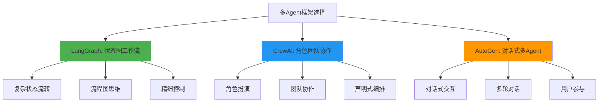
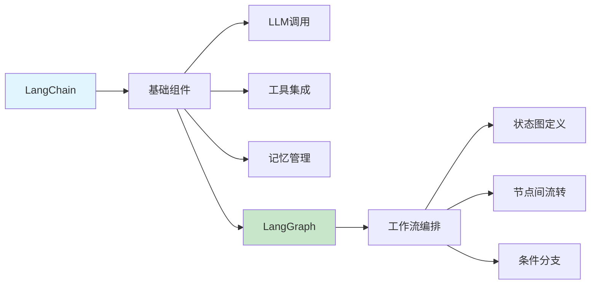
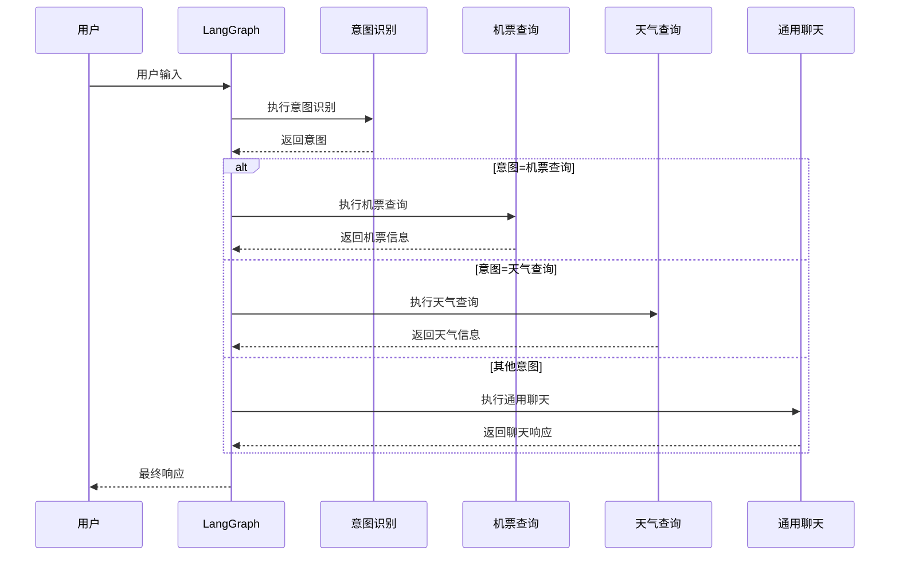
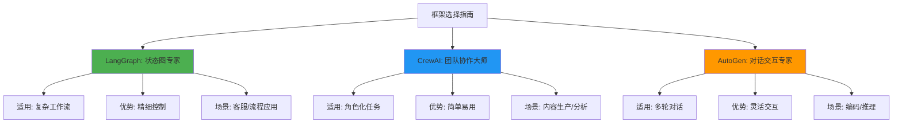
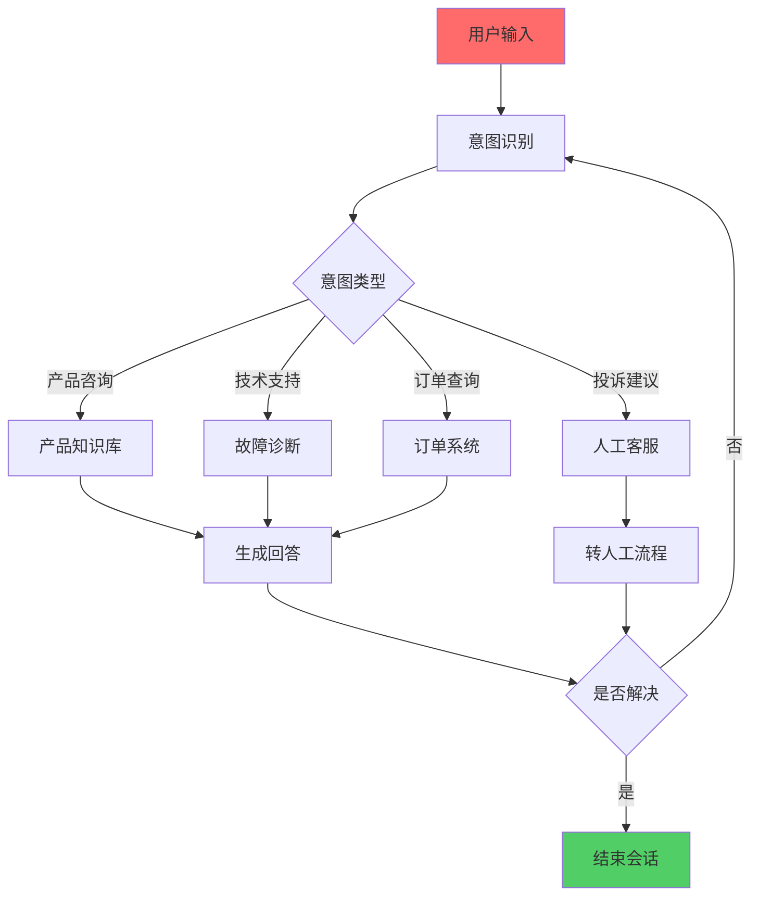
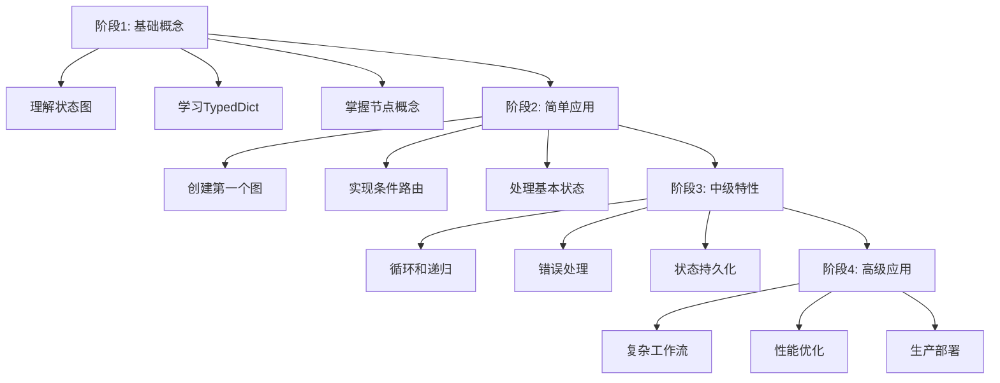

# LangGraph + LangChain完全指南：从状态图到AI工作流的智能编排

> 🤖 当单个AI不够用，当任务复杂到需要"流程图"来管理，那就是LangGraph + LangChain大显身手的时刻！这篇万字长文带你深入理解AI工作流编排的艺术。

朋友们，想象这样一个场景：

**AI客服小明的困扰**
> "用户说想订机票，我问了出发地，结果用户又突然问天气，然后说要查酒店，最后又回到机票价格...我的对话逻辑全乱套了！"

这就是复杂AI应用面临的核心挑战：**状态管理**。而LangGraph + LangChain正是为解决这个问题而生！

## 🌟 为什么需要LangGraph + LangChain？

**现实世界的复杂性：**
- 💬 **多轮对话** - 用户可能随时改变话题
- 🔄 **条件分支** - 根据不同输入走不同路径
- ⏱️ **异步处理** - 多个任务需要并行执行
- 📊 **状态持久化** - 记住之前的对话历史

### 三大主流框架对比



**LangGraph的独特优势：**
- 🎯 **图结构思维** - 像画流程图一样设计AI应用
- 🔄 **循环和条件** - 支持复杂的状态转移
- 💾 **状态管理** - 完整的应用状态持久化
- 🛠️ **精细控制** - 完全掌控每个节点的行为

---

## 🏗️ 核心架构：理解LangGraph的设计哲学

### LangGraph + LangChain = 完美组合



**LangChain提供基础设施：**
- LLM调用的标准接口
- 各种工具（搜索、计算、API）的集成
- 对话记忆的管理
- 提示词模板和链式调用

**LangGraph提供编排能力：**
- 定义复杂的工作流状态图
- 处理节点间的条件转移
- 管理应用的整体状态
- 支持循环和并行执行

### 状态图思维：从流程图到代码

传统编程思维 vs LangGraph思维：

```python
# 传统方式：线性代码
if user_input == "订机票":
    result = book_flight()
elif user_input == "查天气":
    result = check_weather()
else:
    result = default_response()

# LangGraph方式：状态图定义
graph = StateGraph(AgentState)
graph.add_node("flight_booking", book_flight)
graph.add_node("weather_check", check_weather)
graph.add_conditional_edges("start", route_by_intent)
```

---

## 🚀 第一个LangGraph应用：智能旅行助手

让我们通过一个完整的例子来理解LangGraph的工作原理。

### 环境准备

```bash
# 安装必要的包
pip install langgraph langchain-openai

# 设置API密钥
export OPENAI_API_KEY="your-openai-key"
```

### 第一步：定义状态结构

```python
from typing import Annotated, List, Dict, Any
from typing_extensions import TypedDict
from langgraph.graph import StateGraph, END

# 定义应用状态结构
class AgentState(TypedDict):
    """智能助手的完整状态"""
    # 用户输入
    user_input: str
    
    # 对话历史
    messages: Annotated[List[Dict], "对话消息列表"]
    
    # 当前执行步骤
    current_step: str
    
    # 中间结果
    flight_info: Dict[str, Any]
    weather_info: Dict[str, Any]
    hotel_info: Dict[str, Any]
    
    # 最终响应
    final_response: str
```

### 第二步：创建各个功能节点

```python
from langchain_openai import ChatOpenAI
from langchain_core.messages import HumanMessage, AIMessage
import json

# 初始化LLM
llm = ChatOpenAI(model="gpt-4o", temperature=0)

# 1. 意图识别节点
def intent_recognition(state: AgentState) -> AgentState:
    """识别用户意图"""
    
    prompt = f"""根据用户输入识别意图，可能意图包括：
    - flight_booking: 订机票相关
    - weather_check: 查天气相关  
    - hotel_search: 找酒店相关
    - general_chat: 普通聊天
    
    用户输入：{state['user_input']}
    
    返回JSON格式：{{"intent": "意图类型", "confidence": 置信度}}"""
    
    response = llm.invoke(prompt)
    intent_data = json.loads(response.content)
    
    # 更新状态
    state['current_step'] = 'intent_recognized'
    state['intent'] = intent_data['intent']
    
    return state

# 2. 机票查询节点  
def flight_booking(state: AgentState) -> AgentState:
    """处理机票预订逻辑"""
    
    # 模拟机票查询API调用
    flight_data = {
        "departure": "北京",
        "destination": "上海", 
        "date": "2025-04-25",
        "price": 680,
        "airlines": ["国航", "东航", "南航"]
    }
    
    prompt = f"""根据机票信息生成用户友好的回复：
    机票信息：{json.dumps(flight_data, ensure_ascii=False)}
    用户查询：{state['user_input']}
    
    要求：回复要亲切、详细，包含所有关键信息。"""
    
    response = llm.invoke(prompt)
    
    state['flight_info'] = flight_data
    state['final_response'] = response.content
    state['current_step'] = 'flight_completed'
    
    return state

# 3. 天气查询节点
def weather_check(state: AgentState) -> AgentState:
    """处理天气查询逻辑"""
    
    # 模拟天气API调用
    weather_data = {
        "city": "上海",
        "date": "2025-04-25", 
        "temperature": "18-25°C",
        "condition": "晴转多云",
        "humidity": "65%"
    }
    
    prompt = f"""根据天气信息生成用户友好的回复：
    天气信息：{json.dumps(weather_data, ensure_ascii=False)}
    用户查询：{state['user_input']}
    
    要求：回复要实用，包含穿衣建议等。"""
    
    response = llm.invoke(prompt)
    
    state['weather_info'] = weather_data
    state['final_response'] = response.content
    state['current_step'] = 'weather_completed'
    
    return state

# 4. 通用聊天节点
def general_chat(state: AgentState) -> AgentState:
    """处理普通聊天"""
    
    prompt = f"""作为智能旅行助手，友好地回答用户问题：
    用户输入：{state['user_input']}
    
    要求：回复要友好、有帮助，适当时候可以推荐旅行相关服务。"""
    
    response = llm.invoke(prompt)
    
    state['final_response'] = response.content
    state['current_step'] = 'chat_completed'
    
    return state
```

### 第三步：构建状态图

```python
# 创建状态图实例
graph_builder = StateGraph(AgentState)

# 添加节点
graph_builder.add_node("intent_recognition", intent_recognition)
graph_builder.add_node("flight_booking", flight_booking)
graph_builder.add_node("weather_check", weather_check)
graph_builder.add_node("general_chat", general_chat)

# 设置入口点
graph_builder.set_entry_point("intent_recognition")

# 定义条件路由函数
def route_by_intent(state: AgentState) -> str:
    """根据识别出的意图路由到不同节点"""
    intent = state.get('intent', 'general_chat')
    
    if intent == "flight_booking":
        return "flight_booking"
    elif intent == "weather_check":
        return "weather_check"
    else:
        return "general_chat"

# 添加条件边
graph_builder.add_conditional_edges(
    "intent_recognition",
    route_by_intent,
    {
        "flight_booking": "flight_booking",
        "weather_check": "weather_check", 
        "general_chat": "general_chat"
    }
)

# 所有功能节点执行后都结束
graph_builder.add_edge("flight_booking", END)
graph_builder.add_edge("weather_check", END)
graph_builder.add_edge("general_chat", END)

# 编译图
graph = graph_builder.compile()
```

### 第四步：运行智能助手

```python
# 初始化状态
initial_state = {
    "user_input": "我想查一下明天北京到上海的机票",
    "messages": [],
    "current_step": "start",
    "flight_info": {},
    "weather_info": {},
    "hotel_info": {},
    "final_response": ""
}

# 运行图
result = graph.invoke(initial_state)

print("=== 智能旅行助手响应 ===")
print(result['final_response'])
print("\n=== 执行路径 ===")
print(f"用户输入: {result['user_input']}")
print(f"识别意图: {result.get('intent', '未知')}")
print(f"执行步骤: {result['current_step']}")
```

**完整执行流程：**



---

## 🎯 LangGraph核心概念深度解析

### 1. 状态(State)管理

LangGraph的核心是状态管理，状态就像应用的"记忆"：

```python
class ConversationState(TypedDict):
    """对话状态示例"""
    # 必需字段
    messages: List[Dict]  # 对话历史
    
    # 可选字段（根据应用需求）
    user_profile: Dict    # 用户信息
    current_topic: str    # 当前话题
    conversation_phase: str  # 对话阶段
    collected_data: Dict  # 已收集的数据
    next_actions: List[str]  # 下一步动作
```

**状态的特点：**
- 📝 **持久化** - 状态在整个会话中持续存在
- 🔄 **可修改** - 每个节点都可以更新状态
- 🧩 **结构化** - 使用TypedDict定义清晰结构
- 🔍 **可观测** - 方便调试和监控

### 2. 节点(Nodes)设计

节点是状态图的基本执行单元：

```python
def smart_node(state: ConversationState) -> ConversationState:
    """智能节点的最佳实践"""
    
    # 1. 读取当前状态
    current_message = state['messages'][-1]
    
    # 2. 执行业务逻辑
    response = llm.invoke(f"回复用户: {current_message['content']}")
    
    # 3. 更新状态
    state['messages'].append({
        "role": "assistant", 
        "content": response.content
    })
    state['last_response_time'] = datetime.now()
    
    return state
```

**节点设计原则：**
- 🎯 **单一职责** - 每个节点只做一件事
- 🔄 **无副作用** - 不修改外部状态
- 📊 **状态驱动** - 输入输出都是状态
- 🐛 **易于测试** - 可以独立测试

### 3. 边(Edges)和条件路由

边定义了节点间的流转逻辑：

```python
# 无条件边 - 总是执行
graph_builder.add_edge("node_a", "node_b")

# 条件边 - 根据状态决定下一步
def should_continue(state: ConversationState) -> str:
    if state.get('user_wants_more', False):
        return "continue_chat"
    else:
        return END

graph_builder.add_conditional_edges("chat_node", should_continue)

# 映射条件边 - 多路选择
def route_by_topic(state: ConversationState) -> str:
    topic = state.get('current_topic', 'general')
    return topic

graph_builder.add_conditional_edges("router", route_by_topic, {
    "tech": "tech_support",
    "travel": "travel_planning", 
    "general": "general_assistant"
})
```

### 4. 循环(Loops)和递归

LangGraph支持复杂的循环逻辑：

```python
def conversation_orchestrator(state: ConversationState) -> ConversationState:
    """对话协调器 - 支持多轮对话"""
    
    # 检查是否需要继续对话
    last_message = state['messages'][-1]
    
    if "再见" in last_message['content'] or "结束" in last_message['content']:
        state['should_continue'] = False
    else:
        state['should_continue'] = True
        
    return state

def should_continue_conversation(state: ConversationState) -> str:
    """决定是否继续对话"""
    if state.get('should_continue', True):
        return "continue"
    else:
        return "end"

# 配置循环
graph_builder.add_edge("conversation_orchestrator", "chat_node")
graph_builder.add_conditional_edges(
    "chat_node",
    should_continue_conversation,
    {
        "continue": "conversation_orchestrator",  # 循环回去
        "end": END
    }
)
```

---

## 🔄 LangGraph高级特性

### 1. 并行执行(Parallel Execution)

```python
from langgraph.graph import StateGraph
from langgraph.prebuilt import create_react_agent

# 定义可以并行执行的任务
def parallel_task_1(state):
    # 任务1逻辑
    state['result_1'] = "任务1完成"
    return state

def parallel_task_2(state):
    # 任务2逻辑  
    state['result_2'] = "任务2完成"
    return state

def aggregate_results(state):
    # 汇总并行任务结果
    state['final_result'] = f"{state['result_1']} + {state['result_2']}"
    return state

# 配置并行执行（通过多个入口点）
# 注意：LangGraph本身是顺序执行，但可以设计为逻辑上的并行
```

### 2. 错误处理(Error Handling)

```python
def robust_node(state: AgentState) -> AgentState:
    """带有错误处理的节点"""
    try:
        # 主要业务逻辑
        result = some_risky_operation(state)
        state['operation_result'] = result
        state['last_operation_status'] = 'success'
        
    except Exception as e:
        # 错误处理
        state['last_operation_status'] = 'error'
        state['error_message'] = str(e)
        state['fallback_response'] = "抱歉，出现了技术问题，让我尝试其他方式帮助您。"
        
    return state

def route_by_error_status(state: AgentState) -> str:
    """根据错误状态路由"""
    if state.get('last_operation_status') == 'error':
        return "error_handler"
    else:
        return "next_normal_step"
```

### 3. 记忆持久化(Memory Persistence)

```python
import pickle
from datetime import datetime

class PersistentStateGraph:
    def __init__(self, graph):
        self.graph = graph
        self.state_file = "conversation_state.pkl"
    
    def save_state(self, state: AgentState, session_id: str):
        """保存状态到文件"""
        state['last_saved'] = datetime.now().isoformat()
        
        with open(f"{session_id}_{self.state_file}", 'wb') as f:
            pickle.dump(state, f)
    
    def load_state(self, session_id: str) -> AgentState:
        """从文件加载状态"""
        try:
            with open(f"{session_id}_{self.state_file}", 'rb') as f:
                return pickle.load(f)
        except FileNotFoundError:
            return self.get_initial_state()
    
    def get_initial_state(self) -> AgentState:
        """获取初始状态"""
        return {
            "messages": [],
            "current_step": "start",
            "session_start": datetime.now().isoformat()
        }
```

---

## 🆚 LangGraph vs CrewAI vs AutoGen：如何选择？

### 功能对比矩阵



### 详细对比表

| 特性 | LangGraph | CrewAI | AutoGen |
|------|-----------|--------|---------|
| **核心理念** | 状态图工作流 | 角色团队协作 | 对话式多Agent |
| **学习曲线** | 中高（需要理解图论） | 低（类公司管理） | 中（对话编程） |
| **控制粒度** | 精细（节点级控制） | 中等（任务级控制） | 灵活（消息级控制） |
| **状态管理** | 强大（完整状态机） | 基础（任务上下文） | 中等（对话历史） |
| **适用场景** | 复杂业务流程、客服系统 | 内容生产、数据分析 | 编码助手、复杂推理 |
| **开发速度** | 中（需要设计状态图） | 快（声明式配置） | 中（需要调试对话） |

### 选择建议

**选择LangGraph当：**
- 你的应用有明确的"状态"概念
- 需要处理复杂的条件分支和循环
- 要求精细控制每个执行步骤
- 应用需要持久化会话状态

**选择CrewAI当：**
- 任务可以清晰地分配给不同"角色"
- 需要快速构建多Agent协作应用
- 偏好声明式、配置化的开发方式
- 主要场景是内容生成和数据分析

**选择AutoGen当：**
- 应用以多轮对话为核心
- 需要Agent间的复杂交互
- 用户要参与对话过程
- 场景涉及编码或复杂推理

---

## 💡 实战案例：智能客服系统

让我们用LangGraph构建一个真实的智能客服系统：

### 系统架构设计



### 代码实现

```python
from typing import Literal
from langgraph.graph import StateGraph, END

class CustomerServiceState(TypedDict):
    """客服系统状态"""
    user_input: str
    intent: Literal["product", "support", "order", "complaint", "unknown"]
    conversation_history: List[Dict]
    current_agent: str
    resolution_status: Literal["resolved", "unresolved", "escalated"]
    fallback_count: int
    final_response: str

def intent_classifier(state: CustomerServiceState) -> CustomerServiceState:
    """意图分类器"""
    
    prompt = f"""分类用户意图：
    用户输入：{state['user_input']}
    
    可能意图：
    - product: 产品相关咨询
    - support: 技术问题求助  
    - order: 订单状态查询
    - complaint: 投诉建议
    - unknown: 其他问题
    
    返回意图标签。"""
    
    response = llm.invoke(prompt)
    state['intent'] = response.content.strip()
    
    return state

def product_agent(state: CustomerServiceState) -> CustomerServiceState:
    """产品咨询Agent"""
    
    # 查询产品知识库
    product_info = query_product_knowledge_base(state['user_input'])
    
    prompt = f"""基于产品信息回答用户问题：
    用户问题：{state['user_input']}
    产品信息：{product_info}
    
    要求：回答要准确、友好，可以适当推荐相关产品。"""
    
    response = llm.invoke(prompt)
    state['final_response'] = response.content
    state['current_agent'] = 'product_agent'
    
    return state

def should_escalate_to_human(state: CustomerServiceState) -> str:
    """判断是否需要转人工"""
    
    if state['fallback_count'] >= 2:
        return "escalate"
    elif state['intent'] == 'complaint':
        return "escalate"
    else:
        return "continue"

# 构建客服图
def build_customer_service_graph():
    graph_builder = StateGraph(CustomerServiceState)
    
    # 添加节点
    graph_builder.add_node("intent_classifier", intent_classifier)
    graph_builder.add_node("product_agent", product_agent)
    # 添加其他Agent节点...
    
    # 配置工作流
    graph_builder.set_entry_point("intent_classifier")
    graph_builder.add_conditional_edges("intent_classifier", route_by_intent)
    
    # 添加人工客服路由
    graph_builder.add_conditional_edges("product_agent", should_escalate_to_human)
    
    return graph_builder.compile()
```

---

## 🚀 LangGraph最佳实践

### 1. 状态设计原则

```python
# ✅ 好的状态设计
class WellDesignedState(TypedDict):
    messages: List[Dict]           # 对话历史
    current_intent: str            # 当前意图
    collected_data: Dict           # 已收集数据
    next_expected_input: str       # 期待的下次输入
    
# ❌ 不好的状态设计  
class PoorlyDesignedState(TypedDict):
    everything: Dict               # 太宽泛
    temp_variables: List           # 临时变量混乱
    unclear_fields: Any            # 类型不明确
```

### 2. 节点职责单一化

```python
# ✅ 职责单一
def extract_entities(state): ...    # 只做实体提取
def generate_response(state): ...   # 只做回复生成
def update_database(state): ...     # 只做数据更新

# ❌ 职责混乱
def do_everything(state):          # 做太多事情
    # 提取实体
    # 生成回复  
    # 更新数据库
    # 发送邮件
    # ...
```

### 3. 错误处理和降级

```python
def robust_node(state: AgentState) -> AgentState:
    """带有完整错误处理的节点"""
    
    # 尝试主要方法
    try:
        result = primary_method(state)
        state['result'] = result
        state['method_used'] = 'primary'
        
    except PrimaryMethodError:
        # 降级到备用方法
        try:
            result = fallback_method(state)
            state['result'] = result  
            state['method_used'] = 'fallback'
            
        except FallbackMethodError:
            # 最终降级
            state['result'] = "抱歉，暂时无法处理您的请求"
            state['method_used'] = 'final_fallback'
            state['needs_human_help'] = True
    
    return state
```

### 4. 测试和调试

```python
def test_single_node():
    """单独测试节点"""
    test_state = {
        "user_input": "测试输入",
        "messages": [],
        "current_step": "start"
    }
    
    result = intent_classifier(test_state)
    assert 'intent' in result
    print("节点测试通过")

def debug_graph_execution():
    """调试图执行"""
    
    # 使用verbose模式
    graph = graph_builder.compile(debug=True)
    
    # 逐步执行
    for step in graph.stream(initial_state, stream_mode="values"):
        print(f"步骤: {step['current_step']}")
        print(f"状态: {step}")
        print("---")
```

---

## 📈 学习路径和资源

### 循序渐进的学习路线

