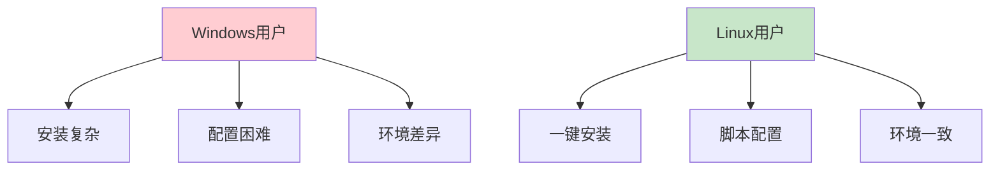
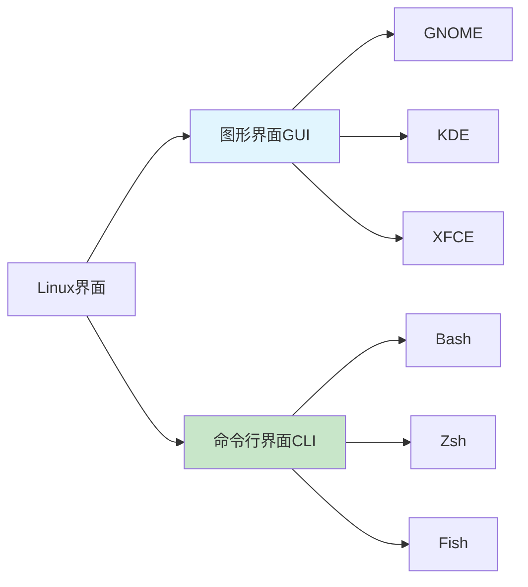
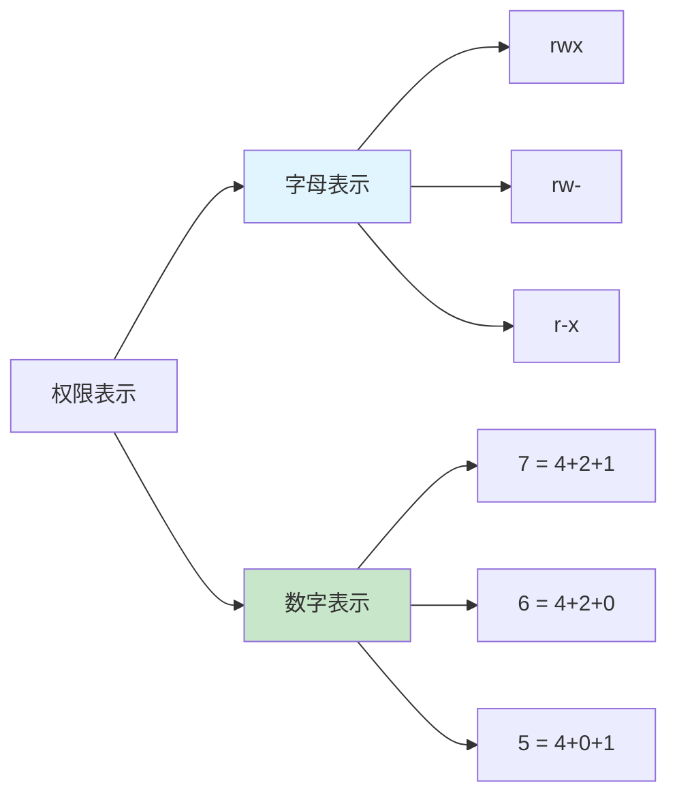
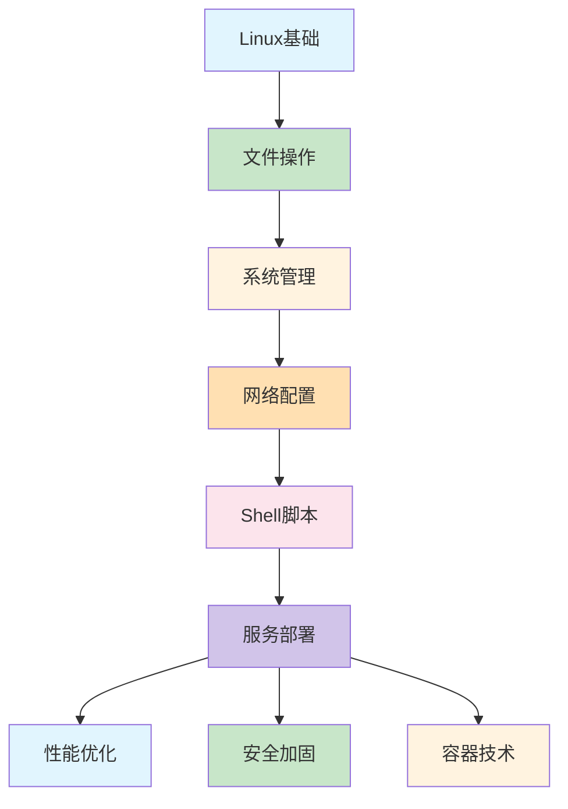

# Linux入门完全指南：从零到精通的系统管理之路

> 🐧 还在为黑乎乎的终端界面感到恐惧吗？今天我们来聊聊Linux这个强大的操作系统，让你从"小白"变成"命令行高手"！

## 🌟 为什么Linux如此重要？

想象一下这些场景：

**开发人员小张的故事**
> "为什么我的代码在Windows上跑得好好的，到了服务器就报错？"  
> "服务器环境配置好复杂，每次部署都像在开盲盒"  
> "为什么运维同事都用命令行，不用图形界面？"

**答案就是：Linux！**

**Linux无处不在的事实：**
- 🌍 **98%的超级计算机**运行在Linux上
- ☁️ **90%的云计算服务**基于Linux（AWS、Azure、GCP）
- 📱 **85%的智能手机**使用基于Linux的Android系统
- 🐳 **100%的Docker容器**运行在Linux内核上

### Linux为什么这么牛？



**核心优势：**
- ✅ **开源免费** - 不用花钱买许可证
- ✅ **稳定可靠** - 服务器可以几年不重启
- ✅ **安全性强** - 权限控制严格，病毒少
- ✅ **性能优异** - 资源占用低，运行效率高
- ✅ **生态丰富** - 海量开源软件和工具

## 💻 Linux环境准备：迈出第一步

### 选择适合的Linux发行版

**初学者推荐：**
- 🐧 **Ubuntu** - 用户友好，社区活跃，文档丰富
- 🎯 **Linux Mint** - 界面美观，开箱即用
- 🔴 **Fedora** - 技术前沿，适合开发者

**安装方式推荐：**

```bash
# 方式1：虚拟机安装（最安全）
# 下载VirtualBox或VMware
# 安装Ubuntu镜像，完全隔离环境

# 方式2：双系统安装
# 适合有一定经验的用户
# 注意备份重要数据

# 方式3：WSL2（Windows用户）
# 在Windows商店搜索"Ubuntu"
# 一键安装，原生Linux体验
```

### 常见错误1：安装过程卡住

```bash
# ❌ 错误：安装过程卡在某个步骤
# 系统无响应，鼠标键盘失灵

# ✅ 解决方法：
# 1. 检查镜像文件是否完整
#   下载后验证MD5/SHA256校验值
# 2. 调整虚拟机配置
#   增加内存到4GB以上
#   启用硬件虚拟化支持
# 3. 尝试不同的安装选项
#   选择"最小安装"或"快速安装"
```

**安装成功标志：**
- 看到登录界面
- 能正常输入用户名密码
- 进入桌面环境或命令行界面

## 🔧 第一印象：认识Linux界面

### 图形界面 vs 命令行界面



**初学者建议：**先熟悉图形界面，再逐步学习命令行

### 打开终端（命令行）

**不同系统的打开方式：**
- **Ubuntu GNOME**: `Ctrl + Alt + T`
- **Windows WSL**: 在开始菜单搜索"Ubuntu"
- **macOS**: 使用Terminal或iTerm2

**看到这个界面就对了：**
```bash
username@hostname:~$
# 用户名@主机名:当前目录$
```

## 📁 Linux文件系统：理解目录结构

### Linux目录树结构

```mermaid
graph TD
    A[/ 根目录] --> B[/bin 基本命令]
    A --> C[/etc 配置文件]
    A --> D[/home 用户目录]
    A --> E[/var 可变数据]
    A --> F[/tmp 临时文件]
    A --> G[/usr 用户程序]
    A --> H[/dev 设备文件]
    A --> I[/proc 进程信息]
    
    D --> D1[/home/username]
    D1 --> D2[文档]
    D1 --> D3[下载]
    D1 --> D4[桌面]
    
    style A fill:#f3e5f5
    style D fill:#e1f5fe
```

### 常用目录说明

| 目录 | 用途 | 重要文件示例 |
|------|------|-------------|
| `/home/用户名` | 你的个人文件夹 | 文档、下载、桌面 |
| `/etc` | 系统配置文件 | `passwd`, `hosts`, `nginx.conf` |
| `/var` | 可变数据文件 | 日志、数据库、邮件 |
| `/tmp` | 临时文件 | 自动清理，不要放重要数据 |
| `/usr` | 用户程序 | `bin`, `lib`, `share` |

## 🎯 核心命令：从零开始学起

### 第一组必须掌握的命令

```bash
# 1. 查看当前目录
pwd
# 输出: /home/username

# 2. 查看目录内容
ls
ls -l    # 详细列表
ls -a    # 显示隐藏文件

# 3. 切换目录
cd /home/username     # 绝对路径
cd Documents          # 相对路径
cd ..                 # 返回上级目录
cd ~                  # 返回家目录
cd -                  # 返回上次目录

# 4. 创建目录
mkdir new_folder
mkdir -p path/to/nested/folder  # 创建多级目录

# 5. 创建文件
touch new_file.txt

# 6. 查看文件内容
cat file.txt          # 显示全部内容
less file.txt         # 分页查看
head -10 file.txt     # 查看前10行
tail -10 file.txt     # 查看后10行
```

### 常见错误2：权限不够

```bash
# ❌ 错误：Permission denied
mkdir /usr/local/myapp
# mkdir: cannot create directory '/usr/local/myapp': Permission denied

# ✅ 解决方法1：使用sudo（管理员权限）
sudo mkdir /usr/local/myapp
# 输入密码后即可执行

# ✅ 解决方法2：在用户目录操作
mkdir ~/myapp         # 在家目录创建，无需权限

# ✅ 解决方法3：修改权限（高级）
sudo chmod 755 /some/directory
```

**权限小知识：**
- `rwx` = 读(read)写(write)执行(execute)
- 三个权限组：用户(user)、组(group)、其他(other)
- `755` = 用户有全部权限，其他用户只有读和执行权限

## 🔄 文件操作：复制、移动、删除

### 文件操作命令大全

```bash
# 1. 复制文件
cp file.txt file_backup.txt
cp file.txt /path/to/destination/
cp -r folder/ new_folder/    # 复制目录

# 2. 移动/重命名文件
mv old_name.txt new_name.txt
mv file.txt /path/to/destination/

# 3. 删除文件
rm file.txt
rm -r folder/                # 删除目录
rm -rf folder/               # 强制删除（危险！）

# 4. 查找文件
find /home -name "*.txt"     # 按名称查找
find . -type f -size +1M     # 查找大于1MB的文件

# 5. 文件统计
wc file.txt                  # 行数、词数、字节数
wc -l file.txt               # 只统计行数
```

### 常见错误3：误删重要文件

```bash
# ❌ 致命错误：rm -rf / （千万不要尝试！）
# 这会删除整个系统！

# ✅ 安全删除习惯：
# 1. 删除前先确认
ls folder/              # 先查看内容
rm -r folder/           # 再删除

# 2. 使用-i参数交互确认
rm -i file.txt          # 删除前会询问
# rm: remove regular file 'file.txt'? y/n

# 3. 重要文件先备份
cp important.txt important_backup.txt
rm important.txt

# 4. 使用trash-cli工具（推荐）
sudo apt install trash-cli
trash file.txt          # 移到回收站
trash-list              # 查看回收站
trash-restore           # 恢复文件
```

## 📊 系统信息：了解你的Linux

### 查看系统状态命令

```bash
# 1. 系统信息
uname -a                # 内核版本
cat /etc/os-release     # 发行版信息

# 2. 硬件信息
free -h                # 内存使用情况
df -h                  # 磁盘空间使用
lscpu                  # CPU信息

# 3. 进程管理
ps aux                 # 查看所有进程
top                    # 实时进程监控
htop                   # 增强版top（需安装）

# 4. 网络信息
ifconfig               # 网络接口信息
ping google.com        # 测试网络连接
netstat -tulpn         # 查看端口监听
```

### 常见错误4：命令找不到

```bash
# ❌ 错误：command not found
top
# bash: top: command not found

# ✅ 解决方法1：安装缺失的命令
# Ubuntu/Debian
sudo apt update
sudo apt install procps  # 安装top命令

# CentOS/RHEL
sudo yum install procps-ng

# ✅ 解决方法2：检查命令路径
which top               # 查看命令位置
whereis top             # 查找命令相关文件

# ✅ 解决方法3：更新PATH环境变量
echo $PATH              # 查看当前PATH
export PATH=$PATH:/usr/local/bin  # 添加新路径
```

## 🛠️ 软件管理：安装和更新

### 包管理器使用

**Ubuntu/Debian (apt)：**
```bash
# 更新软件包列表
sudo apt update

# 升级已安装的软件包
sudo apt upgrade

# 安装新软件
sudo apt install vim git htop

# 搜索软件包
apt search "web browser"

# 卸载软件
sudo apt remove vim
sudo apt autoremove    # 清理依赖
```

**CentOS/RHEL (yum/dnf)：**
```bash
# 安装软件
sudo yum install vim
# 或使用dnf（新版）
sudo dnf install vim
```

### 常见错误5：依赖冲突

```bash
# ❌ 错误：依赖关系问题
sudo apt install packageA
# Some packages could not be installed...
# Depends: packageB but it is not going to be installed

# ✅ 解决方法1：修复依赖
sudo apt --fix-broken install

# ✅ 解决方法2：更新源
sudo apt update
sudo apt upgrade

# ✅ 解决方法3：使用 aptitude（智能解决依赖）
sudo apt install aptitude
sudo aptitude install packageA
```

## 📜 Shell脚本编程：自动化你的工作

### 第一个Shell脚本

**创建脚本文件：**
```bash
# 创建脚本文件
nano hello.sh

# 添加内容：
#!/bin/bash
# 这是我的第一个Shell脚本
echo "Hello, Linux World!"
echo "当前用户: $(whoami)"
echo "当前目录: $(pwd)"
echo "当前时间: $(date)"
```

**运行脚本：**
```bash
# 给脚本添加执行权限
chmod +x hello.sh

# 运行脚本
./hello.sh

# 输出示例：
# Hello, Linux World!
# 当前用户: username
# 当前目录: /home/username
# 当前时间: Mon Apr 20 14:30:25 CST 2026
```

### 实用的Shell脚本示例

**备份脚本：**
```bash
#!/bin/bash
# 自动备份脚本

BACKUP_DIR="/home/$(whoami)/backups"
DATE=$(date +%Y%m%d_%H%M%S)

# 创建备份目录
mkdir -p "$BACKUP_DIR"

# 备份重要文件
tar -czf "$BACKUP_DIR/backup_$DATE.tar.gz" \
    /home/$(whoami)/Documents \
    /home/$(whoami)/Pictures \
    /home/$(whoami)/重要文件

echo "备份完成: $BACKUP_DIR/backup_$DATE.tar.gz"

# 删除7天前的备份
find "$BACKUP_DIR" -name "backup_*.tar.gz" -mtime +7 -delete
echo "已清理7天前的备份文件"
```

## 🔒 权限管理：理解Linux安全基础

### 用户和权限

```bash
# 查看当前用户
whoami

# 查看用户信息
id

# 切换用户（需要密码）
su - otheruser

# 查看文件权限
ls -l file.txt
# -rw-r--r-- 1 user group 1024 Apr 20 14:30 file.txt

# 修改文件权限
chmod 644 file.txt          # 用户可读写，其他只读
chmod +x script.sh          # 添加执行权限

# 修改文件所有者
sudo chown newuser:newgroup file.txt
```

### 权限数字表示法



**权限值对应：**
- 4 = 读 (r)
- 2 = 写 (w)  
- 1 = 执行 (x)
- 0 = 无权限 (-)

**常见权限组合：**
- `755` = `rwxr-xr-x` (用户全部，其他读执行)
- `644` = `rw- r-- r--` (用户读写，其他只读)
- `777` = `rwxrwxrwx` (所有人全部权限，危险！)

## 🚀 实用技巧：提升你的Linux效率

### 命令行效率技巧

```bash
# 1. 命令历史
history                  # 查看命令历史
!100                    # 执行第100条历史命令
Ctrl + R                # 搜索历史命令

# 2. 命令补全
Tab键                   # 自动补全命令和文件名

# 3. 快速导航
Ctrl + A                # 移动到行首
Ctrl + E                # 移动到行尾
Ctrl + U                # 删除到行首
Ctrl + K                # 删除到行尾

# 4. 进程控制
Ctrl + C                # 终止当前命令
Ctrl + Z                # 暂停当前命令
bg                      # 后台运行暂停的命令
fg                      # 切换到前台

# 5. 输出重定向
ls > file.txt           # 输出重定向到文件
ls >> file.txt          # 追加到文件
command 2>&1            # 错误输出重定向到标准输出
```

### 常见错误6：磁盘空间不足

```bash
# ❌ 错误：No space left on device
dd if=/dev/zero of=test.txt bs=1M count=100
# dd: error writing 'test.txt': No space left on device

# ✅ 解决方法1：检查磁盘使用
df -h                    # 查看各分区使用情况

# ✅ 解决方法2：清理临时文件
sudo apt autoremove      # 清理不需要的包
sudo apt autoclean       # 清理包缓存

# ✅ 解决方法3：查找大文件
find / -type f -size +100M 2>/dev/null  # 查找大于100MB的文件
du -sh /var/log/*        # 查看日志目录大小

# ✅ 解决方法4：清理日志
sudo journalctl --vacuum-size=100M  # 保留100MB日志
sudo rm /var/log/*.log.1           # 删除旧日志文件
```

## 📈 Linux学习路径建议

### 学习路线图

