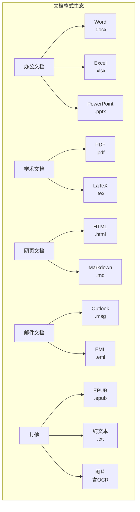
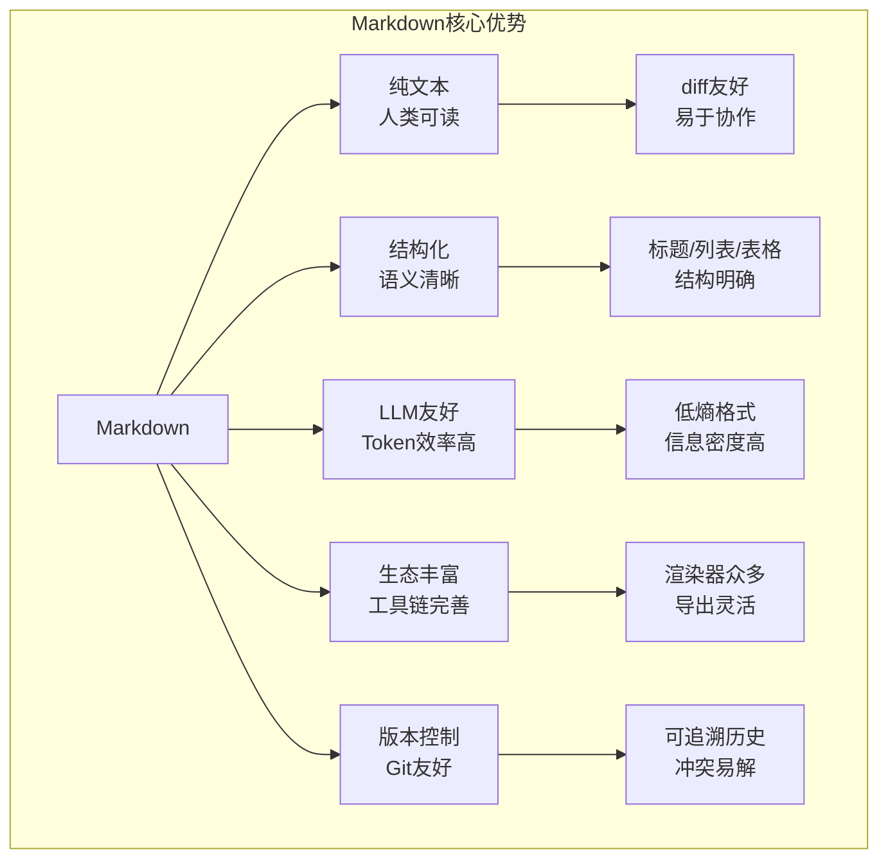
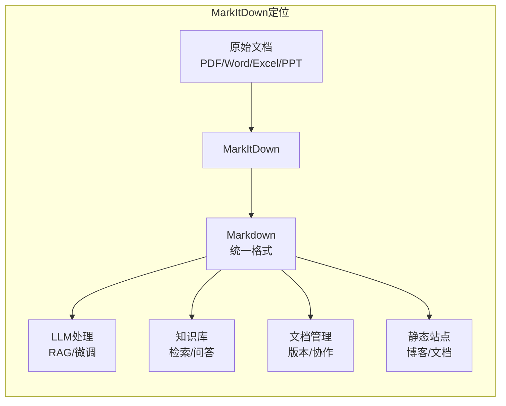
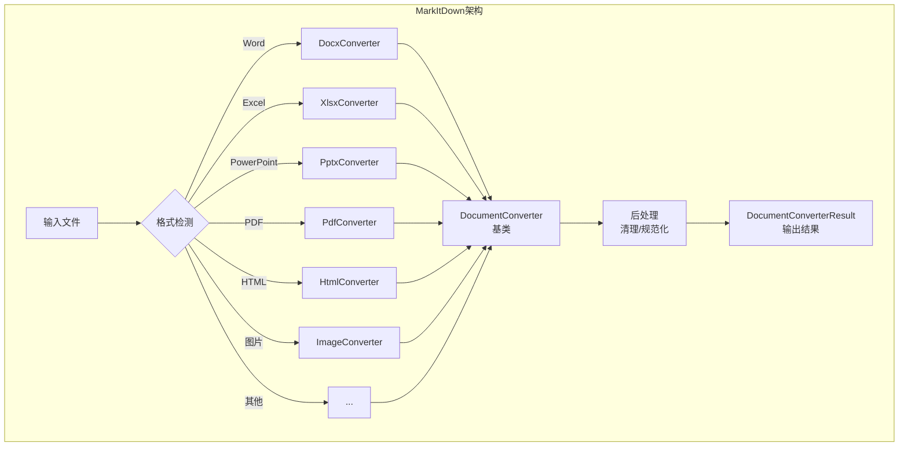
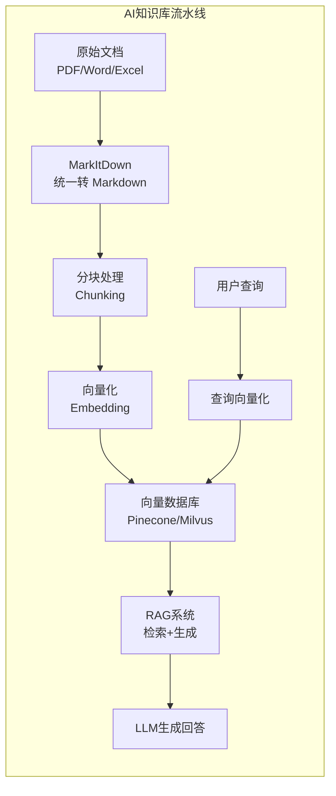

# MarkItDown 深度解析：从文档转换到 AI 知识库构建的完全指南

> 为什么微软要将所有文档都转换为 Markdown？

---

## 写在前面

如果你是一名 AI 应用开发者，当需要将 PDF 论文喂给大模型时，你如何处理格式混乱的问题？如果你是一名知识库管理员，当面对成千上万份 Word、Excel、PPT 文档时，你如何统一处理？如果你是一名数据工程师，当需要构建 RAG（检索增强生成）系统时，你用什么格式作为中间表示？

答案很可能指向同一个工具——**MarkItDown**。

这是微软开源的一款轻量级文档转换工具，能将几乎所有常见文档格式转换为 Markdown。在 AI 时代，Markdown 正在成为文档的"通用语"，而 MarkItDown 正是连接传统文档与 AI 世界的桥梁。

本文将从零开始，带你由浅入深地掌握 MarkItDown 的方方面面：从文档转换的技术原理，到源码架构的深度解析，再到与 LLM 结合的实战应用。读完这篇文章，你将理解为什么 Markdown 是 AI 时代的最佳文档格式，以及如何用 MarkItDown 构建高效的知识处理流水线。

---

## 第一篇：初识 MarkItDown——为什么需要它？

### 1.1 文档格式的困境

在数字化时代，我们被各种文档格式包围：



**多格式带来的问题：**

| 问题 | 说明 | 后果 |
|------|------|------|
| 格式碎片化 | 同一内容存为多种格式 | 版本混乱、检索困难 |
| 解析成本高 | 每种格式需要专门解析器 | 开发维护成本高 |
| 语义丢失 | 转换时结构信息丢失 | 内容理解困难 |
| LLM 不友好 | 二进制格式无法直接处理 | AI 应用受阻 |
| 检索困难 | 不同格式无法统一索引 | 知识库检索效率低 |

### 1.2 Markdown 的优势

为什么 Markdown 正在成为文档的"通用语"？



**Markdown vs 其他格式（LLM 视角）：**

| 维度 | Markdown | PDF | Word | HTML |
|------|----------|-----|------|------|
| Token 效率 | 高 | 低 | 低 | 中 |
| 结构语义 | 明确 | 需解析 | 需解析 | 需清洗 |
| 人类可读 | 是 | 否 | 否 | 困难 |
| 解析难度 | 简单 | 复杂 | 复杂 | 中等 |
| 信息密度 | 高 | 低（含排版） | 低（含样式） | 中 |

> **根本原因：** Markdown 是"内容与表现分离"理念的极致体现。它只保留内容的语义结构（标题、段落、列表、表格），丢弃所有表现层信息（字体、颜色、页边距）。这种"低熵"特性使其成为信息传递的最高效格式，而这正是 LLM 处理文本时最需要的。

### 1.3 MarkItDown 的定位



**MarkItDown 的核心价值：**

| 价值 | 说明 |
|------|------|
| 格式统一 | 将 10+ 种格式统一转换为 Markdown |
| 语义保留 | 尽可能保留原文档的结构信息 |
| 插件扩展 | 支持 OCR、LLM 描述等增强功能 |
| 轻量易用 | 纯 Python，安装简单 |
| 微软背书 | 与 Office 生态深度兼容 |

### 1.4 MarkItDown 支持的格式

| 格式 | 扩展名 | 转换质量 | 特殊说明 |
|------|--------|----------|----------|
| Word | .docx | 优秀 | 保留标题层级、表格、列表 |
| Excel | .xlsx | 良好 | 转换为 Markdown 表格 |
| PowerPoint | .pptx | 良好 | 每页转为章节 |
| PDF | .pdf | 良好 | 基于 pdfminer |
| HTML | .html | 优秀 | 清洗标签，提取内容 |
| 图片 | .png/.jpg | 依赖 OCR | 需配置 Tesseract |
| 音频 | .mp3/.wav | 需 LLM | 转录为文本 |
| EPUB | .epub | 良好 | 电子书格式 |
| 邮件 | .msg/.eml | 良好 | 保留元信息 |
| 纯文本 | .txt | 优秀 | 直接读取 |

---

## 第二篇：快速上手——安装与基础使用

### 2.1 安装 MarkItDown

```bash
# 基础安装
pip install markitdown

# 带 OCR 支持（图片转文字）
pip install markitdown[ocr]

# 带音频转录支持
pip install markitdown[audio]

# 完整安装
pip install markitdown[all]
```

**系统依赖：**

| 功能 | 依赖 | 安装命令 |
|------|------|----------|
| OCR | Tesseract | `apt install tesseract-ocr` |
| 中文 OCR | 中文语言包 | `apt install tesseract-ocr-chi-sim` |
| PDF | pdfminer.six | 随 pip 安装 |
| Word | python-docx | 随 pip 安装 |
| Excel | openpyxl | 随 pip 安装 |

### 2.2 命令行使用

```bash
# 基础转换
markitdown document.docx > output.md

# 指定输出文件
markitdown document.pdf -o output.md

# 处理图片（自动 OCR）
markitdown image.png -o output.md

# 处理多个文件
markitdown *.pdf -o combined.md

# 显示帮助
markitdown --help
```

### 2.3 Python API 使用

```python
from markitdown import MarkItDown

# 创建转换器实例
md = MarkItDown()

# 转换单个文件
result = md.convert("document.docx")
print(result.text_content)

# 转换并获取元信息
result = md.convert("paper.pdf")
print(f"标题: {result.title}")
print(f"作者: {result.author}")

# 保存到文件
with open("output.md", "w", encoding="utf-8") as f:
    f.write(result.text_content)
```

### 2.4 进阶配置

```python
from markitdown import MarkItDown

# 自定义配置
md = MarkItDown(
    # 启用 OCR
    enable_ocr=True,
    ocr_language="chi_sim+eng",  # 中英文混合

    # 启用 LLM 描述图片
    llm_client=openai_client,
    llm_model="gpt-4o",

    # 文档分割配置
    docintel_endpoint="https://...",
)

# 转换并获取结构化输出
result = md.convert("complex_document.pdf")

# 访问转换结果
print(result.text_content)      # Markdown 文本
print(result.title)             # 文档标题
print(result.author)            # 作者
print(result.keywords)          # 关键词
print(result.file_extension)    # 原始扩展名
```

---

## 第三篇：架构原理——MarkItDown 是如何工作的？

### 3.1 整体架构



### 3.2 核心类设计

```python
# markitdown/_markitdown.py

class DocumentConverterResult:
    """文档转换结果"""
    def __init__(
        self,
        title: Optional[str] = None,
        text_content: str = "",
        author: Optional[str] = None,
        keywords: Optional[List[str]] = None,
        file_extension: Optional[str] = None,
    ):
        self.title = title
        self.text_content = text_content
        self.author = author
        self.keywords = keywords
        self.file_extension = file_extension

class DocumentConverter(ABC):
    """文档转换器抽象基类"""

    @abstractmethod
    def convert(self, file_path: str) -> DocumentConverterResult:
        """将文件转换为 Markdown"""
        pass

    @abstractmethod
    def accepts(self, file_path: str) -> bool:
        """检查是否支持该文件类型"""
        pass

class MarkItDown:
    """主转换器类"""

    def __init__(
        self,
        enable_ocr: bool = False,
        ocr_language: str = "eng",
        llm_client: Optional[Any] = None,
        llm_model: Optional[str] = None,
    ):
        self._converters: List[DocumentConverter] = []
        self._enable_ocr = enable_ocr
        self._ocr_language = ocr_language
        self._llm_client = llm_client
        self._llm_model = llm_model

        # 注册转换器
        self._register_converters()

    def _register_converters(self):
        """注册所有支持的转换器"""
        self._converters.append(DocxConverter())
        self._converters.append(XlsxConverter())
        self._converters.append(PptxConverter())
        self._converters.append(PdfConverter())
        self._converters.append(HtmlConverter())
        # ... 更多转换器

    def convert(self, file_path: str) -> DocumentConverterResult:
        """转换文件"""
        # 找到合适的转换器
        for converter in self._converters:
            if converter.accepts(file_path):
                return converter.convert(file_path)

        raise UnsupportedFormatError(f"Unsupported file format: {file_path}")
```

### 3.3 Word 文档转换原理

Word 文档（.docx）本质上是一个 ZIP 压缩包，包含 XML 文件：

```
document.docx (ZIP)
├── [Content_Types].xml
├── _rels/
├── docProps/
│   ├── app.xml      # 应用属性
│   └── core.xml     # 核心属性（标题、作者等）
├── word/
│   ├── document.xml # 文档内容（主要）
│   ├── styles.xml   # 样式定义
│   ├── media/       # 嵌入图片
│   └── _rels/
└── ...
```

**转换流程：**

```python
class DocxConverter(DocumentConverter):
    """Word 文档转换器"""

    def accepts(self, file_path: str) -> bool:
        return file_path.lower().endswith('.docx')

    def convert(self, file_path: str) -> DocumentConverterResult:
        # 1. 读取文档
        doc = docx.Document(file_path)

        # 2. 提取元信息
        core_props = doc.core_properties
        title = core_props.title
        author = core_props.author
        keywords = core_props.keywords

        # 3. 提取内容
        markdown_parts = []

        for element in doc.element.body:
            if element.tag.endswith('p'):  # 段落
                para = self._convert_paragraph(element)
                if para:
                    markdown_parts.append(para)

            elif element.tag.endswith('tbl'):  # 表格
                table = self._convert_table(element)
                if table:
                    markdown_parts.append(table)

        # 4. 合并结果
        text_content = '\n\n'.join(markdown_parts)

        return DocumentConverterResult(
            title=title,
            text_content=text_content,
            author=author,
            keywords=keywords.split(',') if keywords else None,
            file_extension='docx',
        )

    def _convert_paragraph(self, element) -> Optional[str]:
        """将 Word 段落转换为 Markdown"""
        # 获取段落样式（标题级别）
        style = element.get('{http://schemas.openxmlformats.org/wordprocessingml/2006/main}pStyle')

        # 判断是否为标题
        if style and style.val.startswith('Heading'):
            level = int(style.val.replace('Heading', ''))
            prefix = '#' * level + ' '
        else:
            prefix = ''

        # 提取文本
        text = ''.join(t.text for t in element.iter() if t.text)

        return prefix + text if text else None

    def _convert_table(self, element) -> str:
        """将 Word 表格转换为 Markdown 表格"""
        rows = []
        for row in element.findall('.//{http://schemas.openxmlformats.org/wordprocessingml/2006/main}tr'):
            cells = []
            for cell in row.findall('.//{http://schemas.openxmlformats.org/wordprocessingml/2006/main}tc'):
                cell_text = ''.join(t.text for t in cell.iter() if t.text)
                cells.append(cell_text or '')
            rows.append(cells)

        if not rows:
            return ''

        # 构建 Markdown 表格
        lines = []
        lines.append('| ' + ' | '.join(rows[0]) + ' |')
        lines.append('|' + '|'.join(['---' for _ in rows[0]]) + '|')

        for row in rows[1:]:
            lines.append('| ' + ' | '.join(row) + ' |')

        return '\n'.join(lines)
```

### 3.4 PDF 转换原理

PDF 转换是最复杂的，因为 PDF 是"页面描述语言"而非"结构化文档"：

```python
class PdfConverter(DocumentConverter):
    """PDF 文档转换器"""

    def accepts(self, file_path: str) -> bool:
        return file_path.lower().endswith('.pdf')

    def convert(self, file_path: str) -> DocumentConverterResult:
        from pdfminer.high_level import extract_text
        from pdfminer.layout import LAParams

        # 使用 pdfminer 提取文本
        # LAParams 控制布局分析参数
        laparams = LAParams(
            line_margin=0.5,
            word_margin=0.1,
            char_margin=2.0,
        )

        text = extract_text(file_path, laparams=laparams)

        # 启发式分析：检测标题、段落结构
        structured_text = self._structure_text(text)

        return DocumentConverterResult(
            text_content=structured_text,
            file_extension='pdf',
        )

    def _structure_text(self, text: str) -> str:
        """启发式分析文本结构"""
        lines = text.split('\n')
        result = []

        for i, line in enumerate(lines):
            line = line.strip()
            if not line:
                continue

            # 检测标题：短行、大写字母开头、后面有空行
            if (len(line) < 100 and
                line[0].isupper() and
                i + 1 < len(lines) and
                not lines[i + 1].strip()):
                result.append(f'## {line}')
            else:
                result.append(line)

        return '\n\n'.join(result)
```

> **根本原因：** PDF 的设计初衷是"页面精确呈现"而非"内容结构化"。PDF 文件描述的是"在坐标 (x,y) 处绘制字符 C"，而不是"这是一个标题"。因此从 PDF 提取结构信息本质上是"逆向工程"，需要启发式算法来猜测哪些文本是标题、哪些是正文。

### 3.5 Excel 转换原理

```python
class XlsxConverter(DocumentConverter):
    """Excel 文档转换器"""

    def accepts(self, file_path: str) -> bool:
        return file_path.lower().endswith('.xlsx')

    def convert(self, file_path: str) -> DocumentConverterResult:
        import openpyxl

        wb = openpyxl.load_workbook(file_path, data_only=True)

        markdown_parts = []

        for sheet_name in wb.sheetnames:
            sheet = wb[sheet_name]

            # 添加工作表标题
            markdown_parts.append(f'## Sheet: {sheet_name}')

            # 转换为 Markdown 表格
            rows = []
            for row in sheet.iter_rows(values_only=True):
                row_data = [str(cell) if cell is not None else '' for cell in row]
                rows.append(row_data)

            if rows:
                # 表头
                markdown_parts.append('| ' + ' | '.join(rows[0]) + ' |')
                # 分隔线
                markdown_parts.append('|' + '|'.join(['---' for _ in rows[0]]) + '|')
                # 数据行
                for row in rows[1:]:
                    markdown_parts.append('| ' + ' | '.join(row) + ' |')

        return DocumentConverterResult(
            text_content='\n\n'.join(markdown_parts),
            file_extension='xlsx',
        )
```

---

## 第四篇：扩展功能——OCR 与 LLM 集成

### 4.1 OCR 图片文字识别

```python
from markitdown import MarkItDown

# 启用 OCR
md = MarkItDown(
    enable_ocr=True,
    ocr_language="chi_sim+eng",  # 中英文
)

# 转换扫描版 PDF 或图片
result = md.convert("scanned_document.png")
print(result.text_content)
```

**OCR 实现原理：**

```python
class ImageConverter(DocumentConverter):
    """图片转换器（含 OCR）"""

    def __init__(self, ocr_language: str = "eng"):
        self._ocr_language = ocr_language
        self._tesseract_available = self._check_tesseract()

    def _check_tesseract(self) -> bool:
        """检查 Tesseract 是否可用"""
        try:
            import pytesseract
            pytesseract.get_tesseract_version()
            return True
        except:
            return False

    def convert(self, file_path: str) -> DocumentConverterResult:
        from PIL import Image
        import pytesseract

        # 打开图片
        image = Image.open(file_path)

        # OCR 识别
        text = pytesseract.image_to_string(
            image,
            lang=self._ocr_language,
        )

        # 清理 OCR 结果
        cleaned_text = self._clean_ocr_text(text)

        return DocumentConverterResult(
            text_content=cleaned_text,
            file_extension=file_path.split('.')[-1],
        )

    def _clean_ocr_text(self, text: str) -> str:
        """清理 OCR 结果"""
        # 移除多余空行
        lines = [line.strip() for line in text.split('\n') if line.strip()]
        return '\n\n'.join(lines)
```

### 4.2 LLM 图片描述

MarkItDown 可以调用 LLM 为图片生成描述：

```python
from markitdown import MarkItDown
import openai

# 配置 OpenAI 客户端
client = openai.OpenAI(api_key="your-api-key")

md = MarkItDown(
    llm_client=client,
    llm_model="gpt-4o",
)

# 转换包含图片的文档
result = md.convert("document_with_images.docx")

# 图片会被描述为：
# ![Image: A diagram showing the architecture of a microservices system
# with API Gateway, Service Mesh, and various microservices connected
# through message queues.]
```

**实现原理：**

```python
def _describe_image_with_llm(self, image_path: str) -> str:
    """使用 LLM 描述图片"""
    import base64

    # 读取图片并编码为 base64
    with open(image_path, "rb") as f:
        image_data = base64.b64encode(f.read()).decode()

    # 调用 LLM
    response = self._llm_client.chat.completions.create(
        model=self._llm_model,
        messages=[
            {
                "role": "user",
                "content": [
                    {
                        "type": "text",
                        "text": "Describe this image in detail. "
                                "Focus on the content and any text visible.",
                    },
                    {
                        "type": "image_url",
                        "image_url": {
                            "url": f"data:image/jpeg;base64,{image_data}",
                        },
                    },
                ],
            },
        ],
        max_tokens=300,
    )

    return response.choices[0].message.content
```

### 4.3 音频转录

```python
from markitdown import MarkItDown

md = MarkItDown()

# 音频文件会被转录为文本
result = md.convert("meeting_recording.mp3")
print(result.text_content)
# 输出：转录的会议文本内容
```

---

## 第五篇：实战应用——构建 AI 知识库

### 5.1 文档处理流水线



### 5.2 批量文档处理脚本

```python
#!/usr/bin/env python3
"""批量文档转换工具"""

import os
import sys
from pathlib import Path
from concurrent.futures import ProcessPoolExecutor
from markitdown import MarkItDown

class BatchConverter:
    def __init__(self, output_dir: str, enable_ocr: bool = False):
        self.output_dir = Path(output_dir)
        self.output_dir.mkdir(parents=True, exist_ok=True)
        self.md = MarkItDown(enable_ocr=enable_ocr)

    def convert_file(self, input_path: str) -> dict:
        """转换单个文件"""
        try:
            result = self.md.convert(input_path)

            # 生成输出文件名
            input_name = Path(input_path).stem
            output_path = self.output_dir / f"{input_name}.md"

            # 保存结果
            with open(output_path, 'w', encoding='utf-8') as f:
                # 添加 YAML frontmatter
                f.write(self._generate_frontmatter(result))
                f.write(result.text_content)

            return {
                'input': input_path,
                'output': str(output_path),
                'status': 'success',
                'title': result.title,
            }
        except Exception as e:
            return {
                'input': input_path,
                'status': 'error',
                'error': str(e),
            }

    def _generate_frontmatter(self, result) -> str:
        """生成 YAML frontmatter"""
        lines = ['---']
        if result.title:
            lines.append(f'title: "{result.title}"')
        if result.author:
            lines.append(f'author: "{result.author}"')
        if result.keywords:
            lines.append(f'keywords: {result.keywords}')
        lines.append('---\n\n')
        return '\n'.join(lines)

    def convert_directory(self, input_dir: str, max_workers: int = 4):
        """批量转换目录"""
        input_path = Path(input_dir)

        # 收集所有支持的文件
        files = []
        for ext in ['.pdf', '.docx', '.xlsx', '.pptx', '.html', '.txt']:
            files.extend(input_path.glob(f'**/*{ext}'))

        print(f"Found {len(files)} files to convert")

        # 并行转换
        with ProcessPoolExecutor(max_workers=max_workers) as executor:
            results = list(executor.map(self.convert_file, [str(f) for f in files]))

        # 统计结果
        success = sum(1 for r in results if r['status'] == 'success')
        failed = sum(1 for r in results if r['status'] == 'error')

        print(f"\nConversion complete:")
        print(f"  Success: {success}")
        print(f"  Failed: {failed}")

        # 输出失败的文件
        for r in results:
            if r['status'] == 'error':
                print(f"  - {r['input']}: {r['error']}")

if __name__ == '__main__':
    import argparse

    parser = argparse.ArgumentParser(description='Batch convert documents to Markdown')
    parser.add_argument('input_dir', help='Input directory')
    parser.add_argument('output_dir', help='Output directory')
    parser.add_argument('--ocr', action='store_true', help='Enable OCR')
    parser.add_argument('--workers', type=int, default=4, help='Number of workers')

    args = parser.parse_args()

    converter = BatchConverter(args.output_dir, enable_ocr=args.ocr)
    converter.convert_directory(args.input_dir, max_workers=args.workers)
```

### 5.3 与 LangChain 集成

```python
from langchain_community.document_loaders import UnstructuredMarkdownLoader
from langchain.text_splitter import RecursiveCharacterTextSplitter
from langchain_openai import OpenAIEmbeddings
from langchain_community.vectorstores import Chroma

# 1. 加载 Markdown 文档
loader = UnstructuredMarkdownLoader("converted_docs/*.md")
documents = loader.load()

# 2. 分块处理
text_splitter = RecursiveCharacterTextSplitter(
    chunk_size=1000,
    chunk_overlap=200,
    separators=["\n## ", "\n### ", "\n\n", "\n", " ", ""],
)
chunks = text_splitter.split_documents(documents)

# 3. 创建向量数据库
embeddings = OpenAIEmbeddings()
vectorstore = Chroma.from_documents(
    documents=chunks,
    embedding=embeddings,
    persist_directory="./chroma_db",
)

# 4. 创建 RAG 链
from langchain.chains import RetrievalQA
from langchain_openai import ChatOpenAI

qa_chain = RetrievalQA.from_chain_type(
    llm=ChatOpenAI(model="gpt-4"),
    chain_type="stuff",
    retriever=vectorstore.as_retriever(search_kwargs={"k": 5}),
)

# 5. 查询
result = qa_chain.invoke({"query": "公司的年假政策是什么？"})
print(result["result"])
```

### 5.4 文档质量检查

```python
class DocumentQualityChecker:
    """文档转换质量检查器"""

    def __init__(self):
        self.md = MarkItDown()

    def check_conversion(self, original_path: str, markdown_path: str) -> dict:
        """检查转换质量"""
        with open(markdown_path, 'r', encoding='utf-8') as f:
            markdown_content = f.read()

        checks = {
            'file': original_path,
            'length_ratio': self._check_length_ratio(original_path, markdown_content),
            'structure_preservation': self._check_structure(markdown_content),
            'encoding_issues': self._check_encoding(markdown_content),
            'empty_sections': self._check_empty_sections(markdown_content),
        }

        checks['overall_score'] = self._calculate_score(checks)
        return checks

    def _check_length_ratio(self, original_path: str, markdown: str) -> dict:
        """检查内容长度比例"""
        original_size = os.path.getsize(original_path)
        markdown_size = len(markdown.encode('utf-8'))

        # 合理的 Markdown 通常比原始文档小 50-90%
        ratio = markdown_size / original_size if original_size > 0 else 0

        return {
            'ratio': ratio,
            'status': 'good' if 0.05 < ratio < 0.5 else 'warning',
        }

    def _check_structure(self, markdown: str) -> dict:
        """检查结构保留情况"""
        headers = len([l for l in markdown.split('\n') if l.startswith('#')])
        tables = markdown.count('| --- |')
        lists = len([l for l in markdown.split('\n') if l.strip().startswith('- ')])

        return {
            'headers': headers,
            'tables': tables,
            'lists': lists,
            'status': 'good' if headers > 0 or tables > 0 else 'warning',
        }

    def _check_encoding(self, markdown: str) -> dict:
        """检查编码问题"""
        # 检查常见的编码错误模式
        issues = []

        # 乱码检测（简化）
        if '�' in markdown:
            issues.append('replacement character found')

        return {
            'issues': issues,
            'status': 'good' if not issues else 'error',
        }

    def _check_empty_sections(self, markdown: str) -> dict:
        """检查空章节"""
        lines = markdown.split('\n')
        empty_sections = 0

        for i, line in enumerate(lines):
            if line.startswith('#') and i + 1 < len(lines):
                next_line = lines[i + 1].strip()
                if not next_line or next_line.startswith('#'):
                    empty_sections += 1

        return {
            'empty_sections': empty_sections,
            'status': 'good' if empty_sections == 0 else 'warning',
        }

    def _calculate_score(self, checks: dict) -> float:
        """计算总体质量分数"""
        scores = []

        if checks['length_ratio']['status'] == 'good':
            scores.append(1.0)
        else:
            scores.append(0.5)

        if checks['structure_preservation']['status'] == 'good':
            scores.append(1.0)
        else:
            scores.append(0.5)

        if checks['encoding_issues']['status'] == 'good':
            scores.append(1.0)
        else:
            scores.append(0.0)

        return sum(scores) / len(scores)
```

---

## 第六篇：源码深度解析

### 6.1 项目结构

```
markitdown/
├── src/
│   └── markitdown/
│       ├── __init__.py          # 包入口
│       ├── _markitdown.py       # 核心实现
│       ├── _exceptions.py       # 异常定义
│       └── converters/          # 转换器子模块
│           ├── __init__.py
│           ├── docx_converter.py
│           ├── xlsx_converter.py
│           ├── pptx_converter.py
│           ├── pdf_converter.py
│           ├── html_converter.py
│           ├── image_converter.py
│           └── ...
├── tests/                       # 测试
├── docs/                        # 文档
├── pyproject.toml              # 项目配置
└── README.md
```

### 6.2 核心转换逻辑

```python
# _markitdown.py 核心逻辑

class MarkItDown:
    def __init__(self, ...):
        self._converters = []
        self._register_default_converters()

    def _register_default_converters(self):
        """注册默认转换器"""
        # 按优先级注册
        self._converters.append(HtmlConverter())
        self._converters.append(DocxConverter())
        self._converters.append(XlsxConverter())
        self._converters.append(PptxConverter())
        self._converters.append(PdfConverter())
        self._converters.append(ImageConverter())
        self._converters.append(AudioConverter())
        self._converters.append(TxtConverter())

    def convert(self, file_path: str) -> DocumentConverterResult:
        """主转换方法"""
        # 1. 检查文件是否存在
        if not os.path.exists(file_path):
            raise FileNotFoundError(f"File not found: {file_path}")

        # 2. 尝试每个转换器
        for converter in self._converters:
            if converter.accepts(file_path):
                try:
                    return converter.convert(file_path)
                except Exception as e:
                    # 记录错误，尝试下一个转换器
                    logger.warning(f"Converter {type(converter).__name__} failed: {e}")
                    continue

        # 3. 所有转换器都失败
        raise UnsupportedFormatError(
            f"Could not convert file: {file_path}. "
            f"No suitable converter found."
        )
```

### 6.3 扩展自定义转换器

```python
from markitdown import DocumentConverter, DocumentConverterResult

class CustomLogConverter(DocumentConverter):
    """自定义日志文件转换器"""

    def accepts(self, file_path: str) -> bool:
        return file_path.endswith('.log')

    def convert(self, file_path: str) -> DocumentConverterResult:
        with open(file_path, 'r', encoding='utf-8') as f:
            lines = f.readlines()

        # 解析日志结构
        markdown_lines = []
        current_section = None

        for line in lines:
            line = line.strip()
            if not line:
                continue

            # 检测错误日志
            if 'ERROR' in line:
                markdown_lines.append(f"> **Error**: {line}")
            # 检测警告日志
            elif 'WARN' in line:
                markdown_lines.append(f"> **Warning**: {line}")
            # 普通信息
            else:
                markdown_lines.append(line)

        return DocumentConverterResult(
            text_content='\n'.join(markdown_lines),
            file_extension='log',
        )

# 使用自定义转换器
from markitdown import MarkItDown

md = MarkItDown()
md.register_converter(CustomLogConverter())

result = md.convert("app.log")
print(result.text_content)
```

---

## 第七篇：最佳实践与常见问题

### 7.1 性能优化

```python
# 批量处理优化
from concurrent.futures import ThreadPoolExecutor
import multiprocessing

def parallel_convert(files: List[str], max_workers: int = None):
    """并行转换多个文件"""
    if max_workers is None:
        max_workers = multiprocessing.cpu_count()

    md = MarkItDown()

    def convert_single(file_path):
        try:
            return md.convert(file_path)
        except Exception as e:
            return {'error': str(e), 'file': file_path}

    with ThreadPoolExecutor(max_workers=max_workers) as executor:
        results = list(executor.map(convert_single, files))

    return results
```

### 7.2 常见问题与解决方案

| 问题 | 原因 | 解决方案 |
|------|------|----------|
| 中文乱码 | 编码检测失败 | 指定 encoding='utf-8' |
| PDF 表格错乱 | PDF 无表格结构 | 使用 --docintel 选项 |
| 图片未识别 | OCR 未启用 | 安装 tesseract 并启用 OCR |
| 转换后格式丢失 | 原文档格式复杂 | 使用 LLM 增强描述 |
| 大文件内存溢出 | 一次性加载 | 使用流式处理 |

### 7.3 与其他工具对比

| 工具 | 优点 | 缺点 | 适用场景 |
|------|------|------|----------|
| MarkItDown | 轻量、微软背书、LLM集成 | 复杂格式支持有限 | AI 知识库 |
| Pandoc | 格式支持最全 | 重量级、依赖多 | 学术转换 |
| Unstructured | 结构提取精准 | 需要 GPU | 企业文档 |
| LlamaParse | LLM 原生、理解力强 | 付费、云端 | 复杂文档 |

---

## 附录：速查手册

### A. 支持的格式速查

| 格式 | 扩展名 | 需要额外依赖 |
|------|--------|--------------|
| Word | .docx | python-docx |
| Excel | .xlsx | openpyxl |
| PowerPoint | .pptx | python-pptx |
| PDF | .pdf | pdfminer.six |
| HTML | .html | beautifulsoup4 |
| 图片 | .png/.jpg | pytesseract |
| 音频 | .mp3/.wav | openai-whisper |
| EPUB | .epub | ebooklib |

### B. 命令行选项

```bash
markitdown [options] <input_file>

Options:
  -o, --output FILE       输出文件
  -t, --title             提取标题
  -a, --author            提取作者
  --ocr                   启用 OCR
  --ocr-lang LANG         OCR 语言
  --llm-model MODEL       LLM 模型
  -v, --verbose           详细输出
  -h, --help              显示帮助
```

### C. Python API 速查

```python
from markitdown import MarkItDown

# 基础使用
md = MarkItDown()
result = md.convert("file.pdf")

# 高级配置
md = MarkItDown(
    enable_ocr=True,
    ocr_language="chi_sim+eng",
    llm_client=openai_client,
    llm_model="gpt-4o",
)

# 访问结果
result.text_content   # Markdown 文本
result.title          # 标题
result.author         # 作者
result.keywords       # 关键词
```