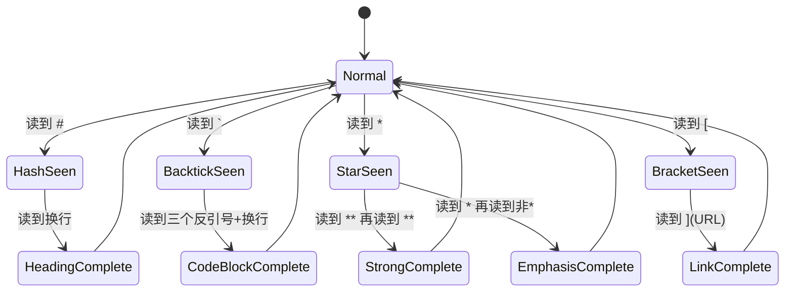
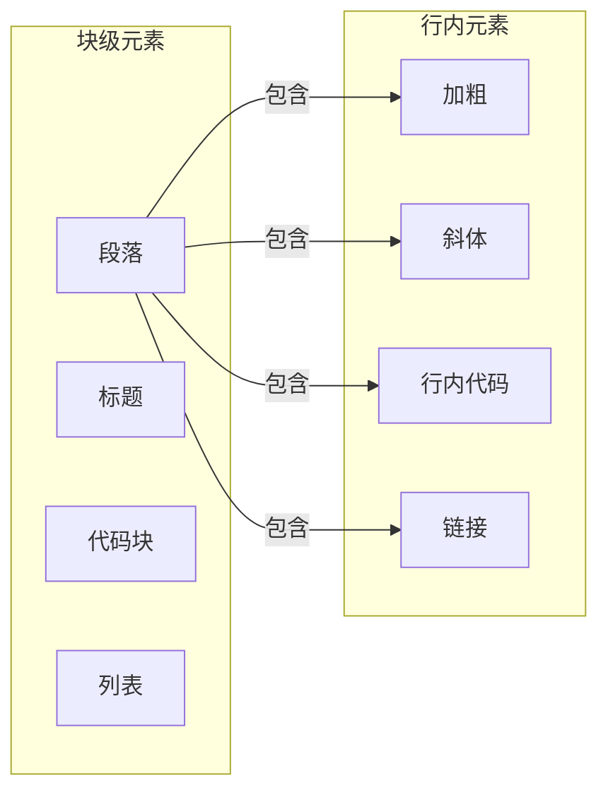
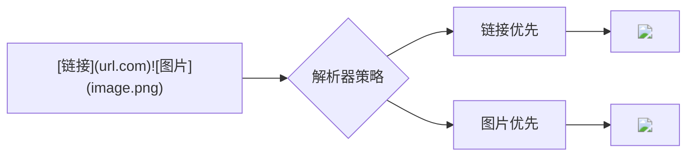
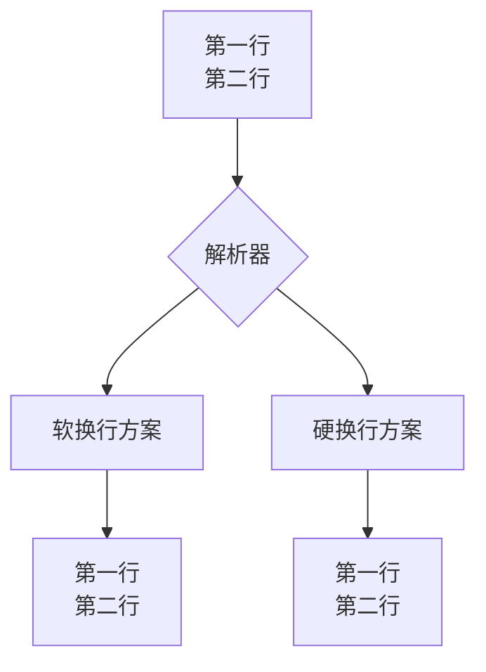
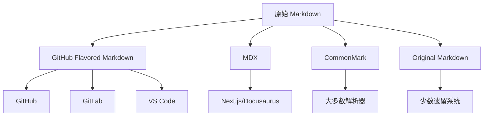
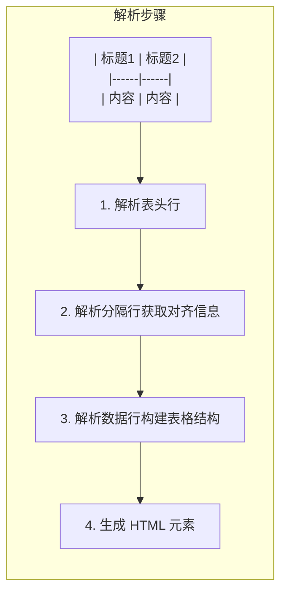
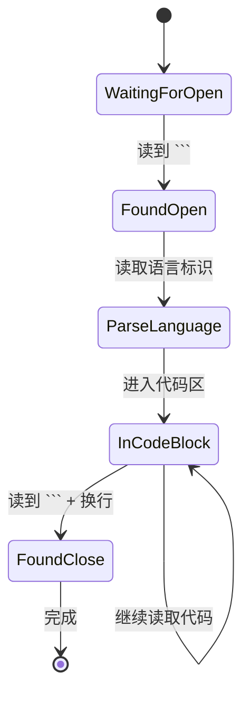
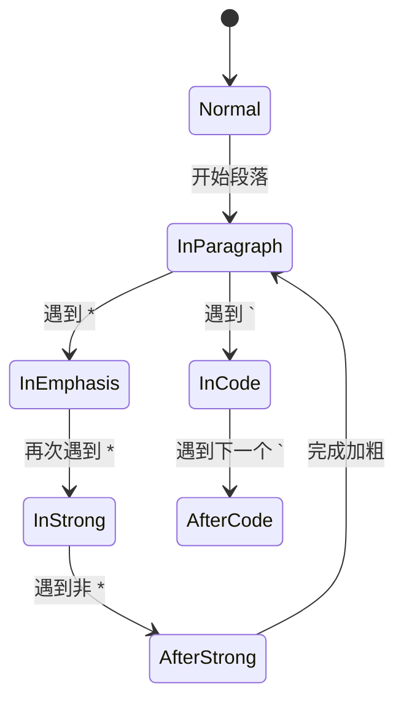
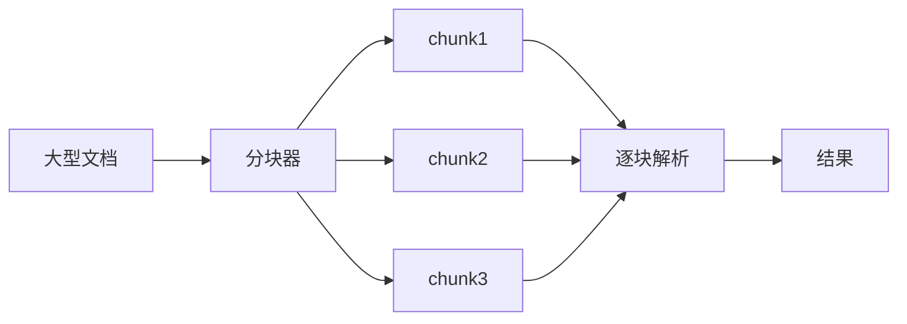
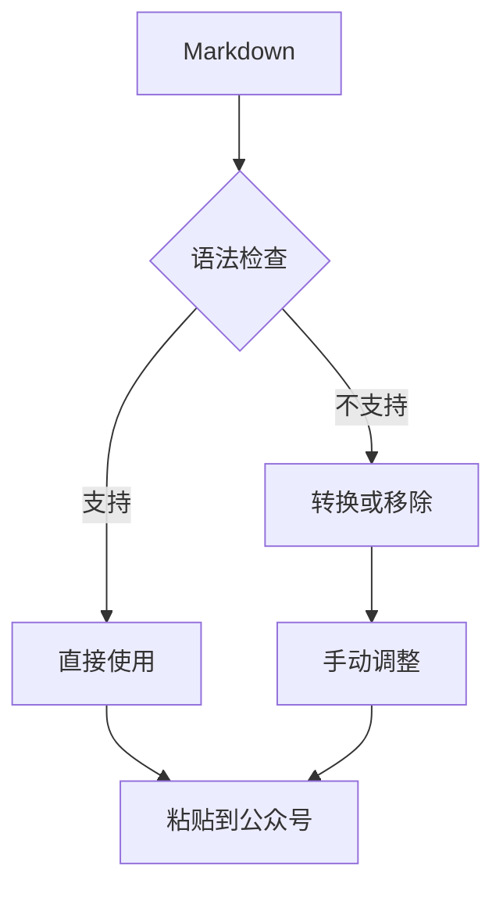

# Markdown 解析完全指南：从入门到原理的深度解析

> 当你打开一个 `.md` 文件，或者在微信公众号后台粘贴一段 Markdown 文字时，有没有想过计算机是如何"读懂"这些文本的？为什么有时候复制过来的格式会乱掉？为什么同样一段 Markdown 在不同平台显示效果不一样？本文将带你深入理解 Markdown 解析的完整过程，揭示那些你可能遇到过但从未深究的问题的根本原因。

## 第一章：什么是 Markdown？

### 1.1 Markdown 的诞生

Markdown 是一种轻量级标记语言，由约翰·格鲁伯（John Gruber）于 2004 年创建。它的设计理念非常简单：**用纯文本语法表达格式，让人类和机器都能轻松阅读和编写**。

```
# 这是一个标题
这是普通文本，**这是加粗**，*这是斜体*
- 这是一个列表项
```

上面这段纯文本，在 Markdown 解析器眼中，会被转换为带有层级结构的 HTML：

```html
<h1>这是一个标题</h1>
<p>这是普通文本，<strong>这是加粗</strong>，<em>这是斜体</em></p>
<ul>
<li>这是一个列表项</li>
</ul>
```

### 1.2 为什么选择 Markdown？

在 Markdown 出现之前，人们已经拥有了强大的标记语言——HTML。但 HTML 的问题是语法过于冗长：

```html
<h1>这是一个标题</h1>
<p>这是普通文本，<strong>这是加粗</strong>，<em>这是斜体</em></p>
<ul>
<li>这是一个列表项</li>
</ul>
```

对比 Markdown 的写法：

```
# 这是一个标题
这是普通文本，**这是加粗**，*这是斜体*
- 这是一个列表项
```

Markdown 用简洁的语法糖掩盖了底层的复杂性，让写作者可以专注于内容本身，而不是被标签语法分散注意力。这正是 Markdown 能够风靡全球的根本原因——它在**人类可读性**和**机器可解析性**之间找到了完美的平衡点。

## 第二章：Markdown 解析的宏观架构

### 2.1 解析器的核心任务

当你把一段 Markdown 文本输入到解析器中时，解析器需要完成以下核心任务：

1. **词法分析（Lexical Analysis）**：将原始文本分割成一个个有意义的"token"（标记）
2. **语法分析（Syntactic Analysis）**：分析 token 之间的关系和结构
3. **抽象语法树构建（AST Construction）**：建立文本的结构化表示
4. **渲染（Rendering）**：将 AST 转换为最终输出格式（HTML、PDF 等）

```mermaid
graph TD
    A[原始 Markdown 文本] --> B[词法分析器]
    B --> C[Token 流]
    C --> D[语法分析器]
    D --> E[抽象语法树 AST]
    E --> F[渲染器]
    F --> G[最终输出 HTML/PDF...]
    
    B -.-> B1[识别标题 #]
    B -.-> B2[识别加粗 **]
    B -.-> B3[识别链接 []()]
    B -.-> B4[识别代码块 ```]
    
    D -.-> D1[构建标题节点]
    D -.-> D2[构建段落节点]
    D -.-> D3[构建列表节点]
```

### 2.2 解析流程详解

让我们通过一个具体例子来理解整个解析流程：

**输入文本：**

```
# Hello World

这是一段包含 **加粗** 和 *斜体* 的文本。

```python
print("Hello")
```
```

**第一步：词法分析 - 分割 Token**

```
[Heading(1), Text("Hello"), Text(" "), Text("World")]
[Paragraph, Text("这是一段包含")]
[Strong, Text("加粗")]
[Text("和")]
[Emphasis, Text("斜体")]
[Text("的文本")]
[CodeBlock, Language("python"), Content("print(\"Hello\")")]
```

**第二步：语法分析 - 构建 AST**

```mermaid
graph TD
    A[Document] --> B[Heading level=1]
    A --> C[Paragraph]
    A --> D[CodeBlock]
    
    C --> C1[Text "这是一段包含"]
    C --> C2[Strong "加粗"]
    C --> C3[Text "和"]
    C --> C4[Emphasis "斜体"]
    C --> C5[Text "的文本"]
```

**第三步：渲染 - 输出 HTML**

```html
<h1>Hello World</h1>
<p>这是一段包含 <strong>加粗</strong> 和 <em>斜体</em> 的文本。</p>
<pre><code class="language-python">print("Hello")</code></pre>
```

## 第三章：词法分析——解析的第一关

### 3.1 什么是 Token？

Token 是文本解析中最基本的处理单元。想象一下你正在读一段英文文章，你的眼睛不会逐个字母地看，而是把字母组合成单词，把单词组合成句子。Token 的概念类似——它是介于单个字符和完整句子之间的**有意义的最小单元**。

在 Markdown 中，常见的 Token 类型包括：

| Token 类型 | 示例 | 说明 |
|------------|------|------|
| ATX 标题 | `# 标题` | 以 `#` 开头的行 |
| Setext 标题 | `标题\n======` | 用下划线定义的标题 |
| 代码块起始 | `` ``` `` | 三个反引号开始 |
| 加粗标记 | `**` | 双星号 |
| 斜体标记 | `*` | 单星号 |
| 链接 | `[text](url)` | 方括号包裹文本，圆括号包裹链接 |
| 行内代码 | `` `code` `` | 单反引号 |
| HTML 标签 | `<br>` | 尖括号包裹的标签 |

### 3.2 词法分析器的工作原理

词法分析器的核心是一个**有限状态机（Finite State Machine）**。你可以把它想象成一个忠诚的工人，它从文本的第一个字符开始，一个字符一个字符地阅读，每当读到一个特定的字符组合时，它就喊一声："这是一个标题标记！"或者"这是一段代码！"



### 3.3 解析优先级：为什么顺序很重要？

这里有一个非常关键的知识点：**解析器的处理顺序直接影响最终结果**。不同的 Markdown 解析器可能采用不同的优先级策略，这导致了同一个 Markdown 文本在不同平台上可能产生不同的结果。

考虑下面这个例子：

```
[百度](https://www.baidu.com)`code`
```

这段文本应该被解析为：

- **选项 A**：链接后面跟着行内代码 → `[百度](https://www.baidu.com)<code>code</code>`
- **选项 B**：链接的一部分包含反引号 → 解析为带反引号的链接文本

不同的解析器会给出不同的答案。**主流解析器（如 marked.js、commonmark）的处理顺序是：代码块 > 行内代码 > 加粗 > 斜体 > 链接 > 文本**，这个顺序确保了大多数情况下能得到"符合直觉"的结果。

## 第四章：语法分析与 AST 构建

### 4.1 抽象语法树（AST）是什么？

如果说 Token 是单词，那么 AST 就是句子结构。AST 以树形结构表示文档的层级关系，每个节点代表文档的一个组成部分。

```mermaid
graph TD
    subgraph AST结构
    Root[Document 文档节点] --> H1[Heading 标题]
    Root --> P1[Paragraph 段落]
    Root --> UL[Unordered List 无序列表]
    
    P1 --> T1[Text "这是一段"]
    P1 --> Strong[Strong 加粗]
    Strong --> T2[Text "重要"]
    P1 --> T3[Text "内容"]
    
    UL --> LI1[ListItem]
    UL --> LI2[ListItem]
    LI1 --> T4[Text "第一项"]
    LI2 --> T5[Text "第二项"]
    end
```

### 4.2 块级元素 vs 行内元素

Markdown 元素可以分为两大类：**块级元素（Block Elements）**和**行内元素（Inline Elements）**。

**块级元素**是文档的结构单元，它们独占一行，决定文档的整体布局：

- 段落（Paragraph）
- 标题（Heading）
- 代码块（Code Block）
- 列表（List）
- 引用块（Blockquote）
- 水平线（Horizontal Rule）

**行内元素**是块级元素内部的细粒度格式，用于格式化文本的某一部分：

- 加粗（Strong）
- 斜体（Emphasis）
- 行内代码（Code）
- 链接（Link）
- 图片（Image）



### 4.3 嵌套结构的处理

Markdown 允许元素之间相互嵌套，这增加了解析的复杂度。考虑以下例子：

```
> 这是一个引用块
> 里面包含 **加粗文本** 和 *斜体文本*
> - 还可以包含列表
```

解析器需要正确识别：

1. 外层是一个引用块（blockquote）
2. 引用块内部是多个段落
3. 段落内包含行内格式（加粗、斜体）
4. 引用块内还可以嵌套列表

这种嵌套关系的正确解析，依赖于解析器维护一个**栈（Stack）**来跟踪当前正在处理的元素层级：

```mermaid
sequenceDiagram
    participant Parser as 解析器
    participant Stack as 元素栈
    
    Parser->>Stack: 读取 ">"
    Stack push: [Blockquote]
    Parser->>Stack: 读取 "段落内容"
    Stack push: [Paragraph]
    Parser->>Stack: 读取 "**"
    Stack push: [Strong]
    Stack pop: Strong解析完成
    Parser->>Stack: 读取 ">"
    Stack push: [Blockquote, Paragraph]
    Parser->>Stack: 读取 "-"
    Stack push: [Blockquote, List]
```

## 第五章：常见解析问题的根本原因

### 5.1 问题一：列表缩进引发的"幽灵空格"

**现象**：当你复制一段列表文本到微信公众号或某些编辑器时，列表项的缩进突然错乱，或者某些列表项变成了普通段落。

**根本原因**：Markdown 对列表有严格的**缩进敏感**要求。列表项必须相对于父级列表有至少 4 个空格（或 1 个 tab）的缩进。

```markdown
- 第一项
    - 子项（4个空格缩进）
- 第二项
```

如果子项前面只有 2 个空格：

```markdown
- 第一项
  - 子项（2个空格缩进）
```

在严格的 Markdown 解析器中，这会被解析为两个独立的列表，而不是父子关系。

**微信公众号的特殊性**：微信公众号后台编辑器不是标准的 Markdown 解析器，它对列表的处理有自己的规则。当你在微信公众号后台粘贴 Markdown 时，它会尝试将列表转换为 HTML，但转换过程中可能会丢失原始的缩进信息。

### 5.2 问题二：代码块与行内代码的边界冲突

**现象**：当你想要在文本中输出像 `function()` 这样的代码片段时，解析器却把它识别为代码块的一部分，导致后面的内容全部变成代码。

**根本原因**：这是**贪心匹配（Greedy Matching）**策略的结果。解析器倾向于尽可能多地匹配它认识的语法。

考虑这个例子：

```
请调用 `function() 函数来完成这个任务
```

解析器可能将其解析为：

- 行内代码开始于 `` ` ``
- 遇到下一个 `` ` `` 时结束，输出：`function()`
- 然后遇到 ` 函数来完成这个任务`，这在某些解析器中可能被错误地继续识别为代码

**解决方案**：使用**转义字符**来告诉解析器这不是代码块的边界：

```markdown
请调用 `` `function()` `` 函数来完成这个任务
```

使用双反引号 `` `code` `` 可以正确处理包含单反引号的代码。

### 5.3 问题三：链接与图片的"抢夺"纠纷

**现象**：当你写 `` 时，解析器正确显示了图片，但当你在同一段落中写 `[链接](url.com)` 时，显示效果可能不符合预期。

**根本原因**：在某些 Markdown 方言中，图片被当作行内元素处理，这导致链接和图片之间产生**优先级冲突**。



不同的 Markdown 方言（CommonMark、GitHub Flavored Markdown、微信公众号等）有不同的处理策略，导致同一个文本产生不同的解析结果。

### 5.4 问题四：HTML 与 Markdown 的混合困境

**现象**：在 Markdown 中直接写 HTML 标签，有时会被渲染，有时会被原样输出，有时甚至会破坏整个文档的格式。

**根本原因**：这涉及 Markdown 解析器对 HTML 的**处理策略**。大多数解析器遵循以下规则：

1. **块级 HTML 标签**（如 `<div>`、`<table>`、`<pre>`）会被原样保留，不进行 Markdown 解析
2. **行内 HTML 标签**（如 `<span>`、`<a>`、``）会进行 Markdown 解析
3. **空行**会中断某些元素的连续性

```markdown
这是普通 **Markdown** 文本

<div>
这里的内容不会被解析为 Markdown
</div>

这是另一个 <span>段落</span>
```

在这个例子中：
- 第一行会被正确解析加粗
- `<div>` 标签内部的内容原样保留
- 最后一个段落的 `<span>` 内部依然会解析 Markdown

### 5.5 问题五：换行符的"千面人生"

**现象**：在编辑器中敲了回车换行，但渲染后的 HTML 却显示为同一段落。加粗、星列表等格式也受到影响。

**根本原因**：Markdown 对**硬换行（Hard Line Break）**的处理存在不一致性。

根据 CommonMark 规范：
- 在段落内部，一个换行符应该被解析为**软换行（Soft Break）**，即在 HTML 中渲染为 `<br>` 标签
- 但有些解析器默认不处理软换行，需要在换行符后面加两个空格才能产生 `<br>`



**GitHub Flavored Markdown（GFM）** 采用软换行方案，所以 GFM 兼容的平台（如 GitHub、VS Code）能正确渲染。而微信公众号编辑器对换行的处理更接近硬换行方案，导致在 VS Code 中预览正常的 Markdown 粘贴过去后格式全变。

## 第六章：Markdown 方言——混乱的根源

### 6.1 为什么会有这么多 Markdown 方言？

Markdown 的创造者约翰·格鲁伯设计了一套规范，但这份规范并不完美——它留下了一些**模糊地带**，比如：
- 如何处理列表的嵌套？
- 代码块的语言标识是否必须？
- 表格的语法是什么？
- 如何处理软换行和硬换行？

不同的实现者对这些模糊地带给出了不同的答案，这就产生了所谓的 **"Markdown 方言"**。



### 6.2 主流 Markdown 方言对比

| 特性 | 原始 Markdown | CommonMark | GFM | 微信公众号 |
|------|--------------|------------|-----|------------|
| 表格 | ❌ | ✅ | ✅ | ✅（部分支持） |
| 任务列表 | ❌ | ❌ | ✅ | ❌ |
| 删除线 | ❌ | ❌ | ✅ | ❌ |
| 脚注 | ❌ | ✅ | ❌ | ❌ |
| 自动链接 | ✅ | ✅ | ✅ | ❌ |
| 代码高亮 | ❌ | ❌ | ✅ | ❌ |
| 软换行 | 模糊 | ✅ | ✅ | ❌ |

### 6.3 微信公众号的 Markdown 支持现状

微信公众号的编辑器**不是**一个 Markdown 解析器。它是一个**富文本编辑器**，但提供了一些有限的 Markdown 语法支持。

**微信公众号支持的 Markdown 语法**：

- 标题（`#`、`##`、`###` 等）
- 加粗（`**text**`）
- 斜体（`*text*`）
- 删除线（`~~text~~`）
- 引用（`> text`）
- 链接（`[text](url)`）
- 图片（``）
- 列表（`- item` 或 `1. item`）

**微信公众号不支持的语法**：

- 代码块（会被转换为普通文本）
- 表格（会显示为单行文本）
- 任务列表
- 脚注
- 目录自动生成

当你复制 Markdown 到微信公众号时，实际上是经历了一个**从 Markdown 到富文本的转换过程**，这个过程不是完美的，会丢失或扭曲一些信息。

## 第七章：深度解析常见 Markdown 元素

### 7.1 标题的解析奥秘

标题是 Markdown 文档中最重要的结构元素之一。但你可能不知道，标题有两种语法：

**ATX 风格**（常用）：

```markdown
# 一级标题
## 二级标题
### 三级标题
```

**Setext 风格**（较少使用）：

```markdown
一级标题
=========

二级标题
---------
```

```mermaid
graph TD
    A["一级标题\n========="] --> B{解析器}
    B --> C[识别底部等号行]
    C --> D[创建 Heading level=1]
    D --> E[内容: "一级标题"]
    
    F["## 二级标题"] --> G{解析器}
    G --> H[识别 # 前缀]
    H --> I[创建 Heading level=2]
    I --> J[内容: "二级标题"]
```

在 AST 构建阶段，标题会被解析为一个独立的**块级节点**，包含级别信息和文本内容：

```json
{
  "type": "heading",
  "depth": 2,
  "children": [
    { "type": "text", "value": "二级标题" }
  ]
}
```

### 7.2 表格的解析原理

表格是 GFM 引入的重要特性。虽然原始 Markdown 不支持表格，但这不妨碍几乎所有现代 Markdown 解析器都实现了表格支持。

```markdown
| 左对齐 | 居中 | 右对齐 |
|:-------|:----:|-------:|
| 内容1  | 内容2 | 内容3  |
| 内容4  | 内容5 | 内容6  |
```

解析器对表格的解析过程如下：



**表格解析的关键难点**：
1. **对齐信息的提取**：解析器需要从 `|:---|:---:|---:|` 这样的分隔行中识别左对齐、居中、右对齐
2. **单元格数量不一致**：如果某行比其他行少几个单元格，解析器需要决定是报错还是自动填充空单元格
3. **行内格式的支持**：表格单元格内可以包含加粗、链接等行内元素，这增加了解析的复杂度

### 7.3 代码块的语言识别

代码块的语法标记了一个pre-formatted 文本区域，解析器需要识别：

1. 代码块的起始和结束边界
2. 可选的语言标识符
3. 代码内容



解析器在识别语言标识时，通常采用以下策略：

```
```javascript
console.log("hello")
```
```

1. 找到起始的 `` ``` ``
2. 读取直到遇到换行符的内容作为语言标识：`javascript`
3. 剩余内容作为代码正文
4. 遇到结束的 `` ``` `` 结束代码块

### 7.4 链接的解析细节

链接的完整语法是 `[显示文本](URL "可选标题")`。

解析器需要处理几种特殊情况：

**1. 自动链接**（某些方言支持）：

```markdown
<https://www.baidu.com>
```

会被解析为：

```html
<a href="https://www.baidu.com">https://www.baidu.com</a>
```

**2. 引用式链接**：

```markdown
[百度][baidu]

[baidu]: https://www.baidu.com "百度官网"
```

这种语法允许将链接定义放在文档末尾，便于管理和维护。

**3. 图片链接**：

```markdown

```

在 AST 中，图片被视为特殊的链接类型：

```json
{
  "type": "image",
  "alt": "alt文本",
  "url": "image.png",
  "title": null
}
```

## 第八章：解析器的内部工作机制

### 8.1 正则表达式 vs 状态机

Markdown 解析器的实现通常有两种主要策略：

**1. 基于正则表达式的方法**

使用一系列正则表达式来匹配不同的 Markdown 语法。这种方法简单直接，但对于嵌套和复杂情况的处理不够灵活。

```javascript
// 一个简化的加粗匹配正则
const boldRegex = /\*\*([^*]+)\*\*/g;
```

**2. 基于状态机的方法**

使用有限状态机来跟踪解析状态，能够更好地处理复杂的嵌套情况。



现代解析器（如 marked.js）通常**结合两种方法**：用正则表达式做快速的初步匹配，用状态机处理复杂情况。

### 8.2 解析器的性能优化

对于大型 Markdown 文档，解析性能是一个重要考量。常见的优化策略包括：

**1. 流式解析**

将文档分割成小块逐步解析，而不是一次性加载整个文档：



**2. 缓存已解析的 AST**

如果文档内容没有变化，直接返回缓存的解析结果，避免重复解析。

**3. 惰性求值**

对于复杂的嵌套结构，只在需要时才进行深度解析。

### 8.3 错误处理与容错机制

好的 Markdown 解析器应该能够容错，即使输入不是完全规范的 Markdown 语法，也能尽可能给出合理的输出。

```mermaid
graph TD
    A[输入: **未闭合的加粗] --> B{检查配对}
    B -->|发现不匹配| C[容错处理]
    C --> D[选项1: 忽略未闭合的标记]
    C --> E[选项2: 自动闭合]
    C --> F[选项3: 原样输出]
    D --> G[输出: 文本 "**未闭合的加粗"]
    E --> H[输出: <strong>未闭合的加粗</strong>]
    F --> I[输出: **未闭合的加粗]
```

不同的解析器有不同的容错策略，这导致同一个"不标准"的 Markdown 在不同平台产生不同结果。

## 第九章：实战——微信公众号的 Markdown 迁移

### 9.1 问题分析

将 Markdown 内容发布到微信公众号面临以下挑战：

1. **微信公众号不是 Markdown 编辑器**
2. **某些 Markdown 语法不被支持**
3. **复制粘贴过程中格式可能丢失**

### 9.2 解决方案

**方案一：使用转换工具**

使用专门的工具（如 PanDoc、Markdown to HTML 转换工具）将 Markdown 转换为微信公众号兼容的 HTML，然后复制到公众号后台。

**方案二：手动调整**

在 Markdown 中避免使用微信公众号不支持的语法：

```markdown
# 避免这样写

```python
def hello():
    print("hello")
```

# 改用这样

以下是 Python 代码示例：

```python
def hello():
    print("hello")
```

> 注意：由于微信公众号编辑器可能会过滤某些 HTML 标签，代码块复制后可能需要手动调整格式。
```

**方案三：使用微信公众号支持的 Markdown 语法子集**

