# Mermaid 图表完全指南

## 1. 流程图（Flowchart）

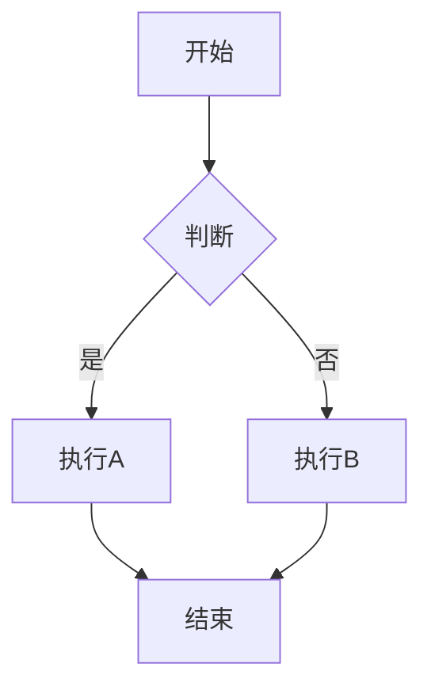

## 2. 时序图（Sequence Diagram）

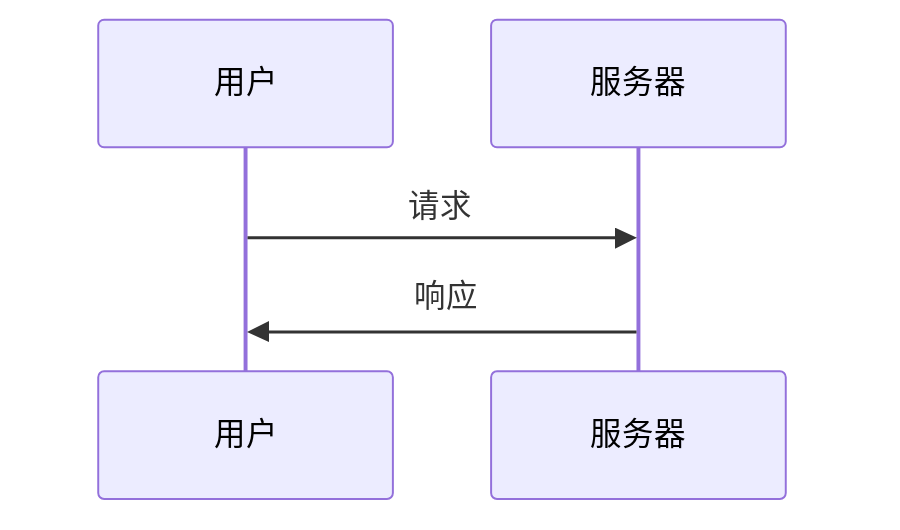

## 3. 状态图（State Diagram）


## 4. 类图（Class Diagram）

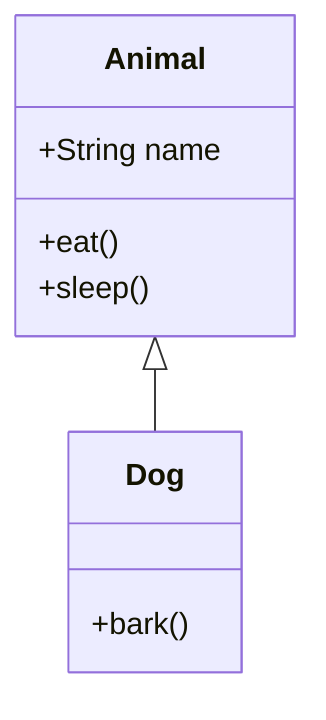

## 5. 饼图（Pie）

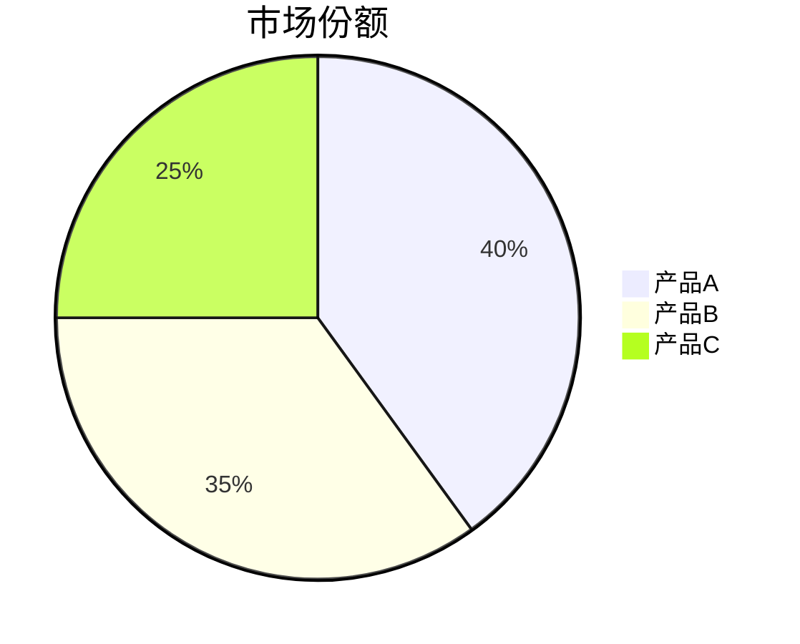

## 6. 甘特图（Gantt）

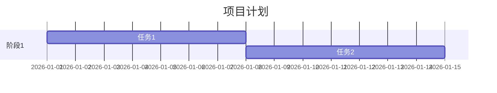

## 7. ER图

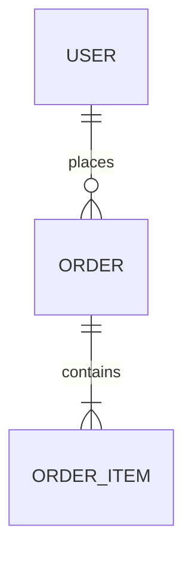

## 8. 思维导图

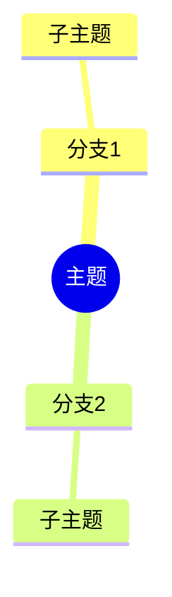

## 9. 需求图（Requirement Diagram）

```mermaid
requirementDiagram
    requirement req1 {
        id: 1
        text: "系统必须支持用户登录"
        risk: high
        verif: 测试用例1
    }
    requirement req2 {
        id: 2
        text: "系统必须支持数据导出"
        risk: medium
        verif: 测试用例2
    }
    req1 - req2: 依赖
```

## 10. 高级流程图

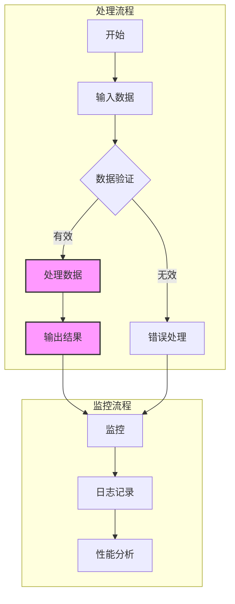

## 11. 高级时序图

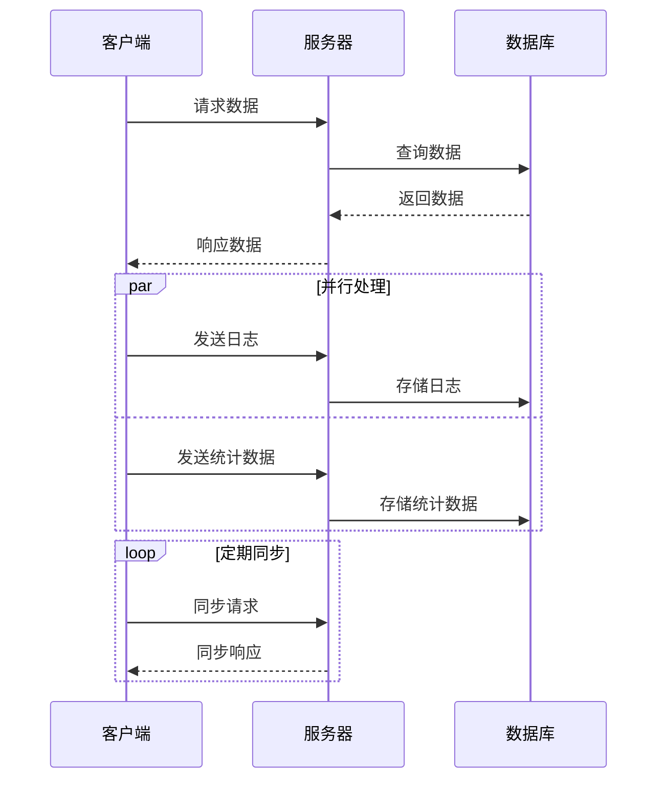

## 12. 高级状态图

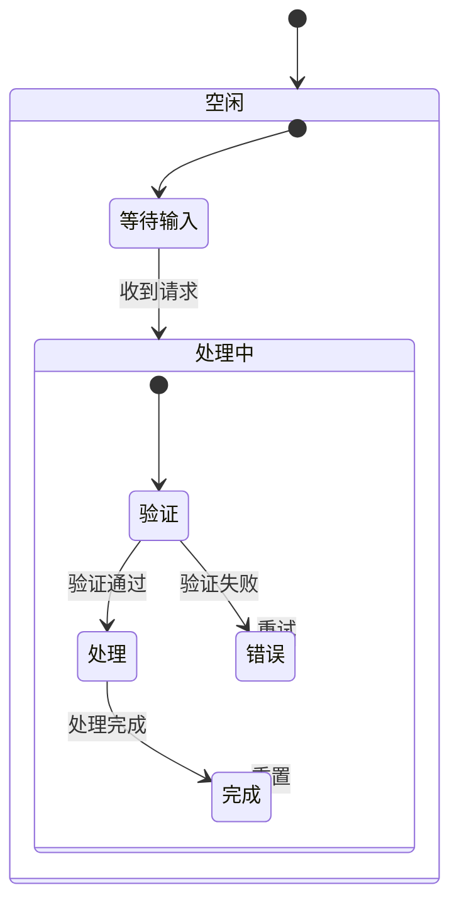

## 13. 高级类图

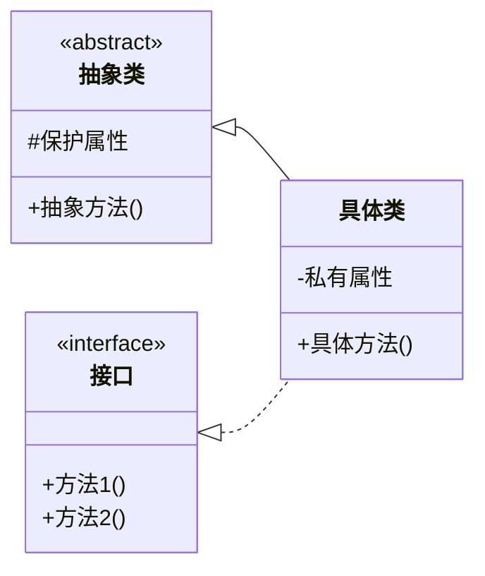

## 14. 带图例的饼图

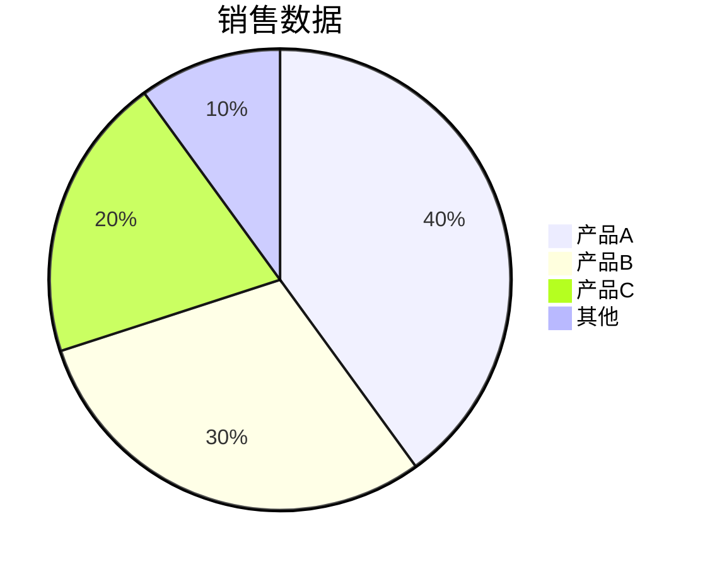

## 15. 高级甘特图

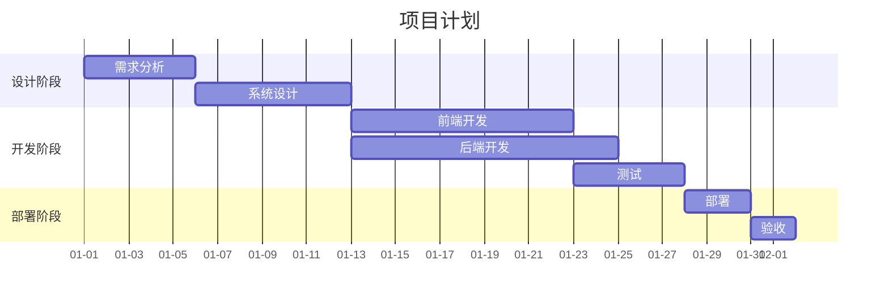

## 16. 用户旅程图

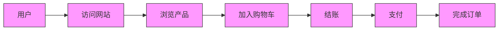