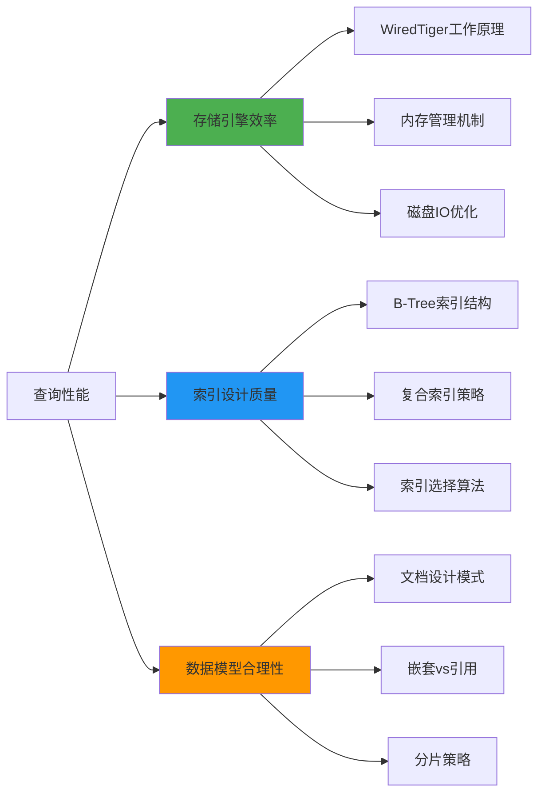
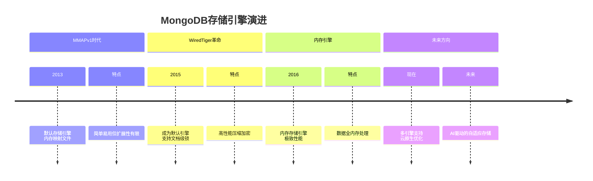
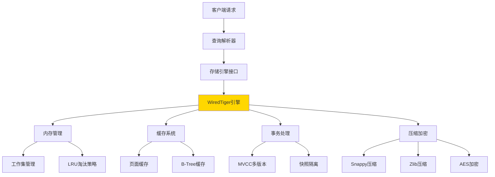
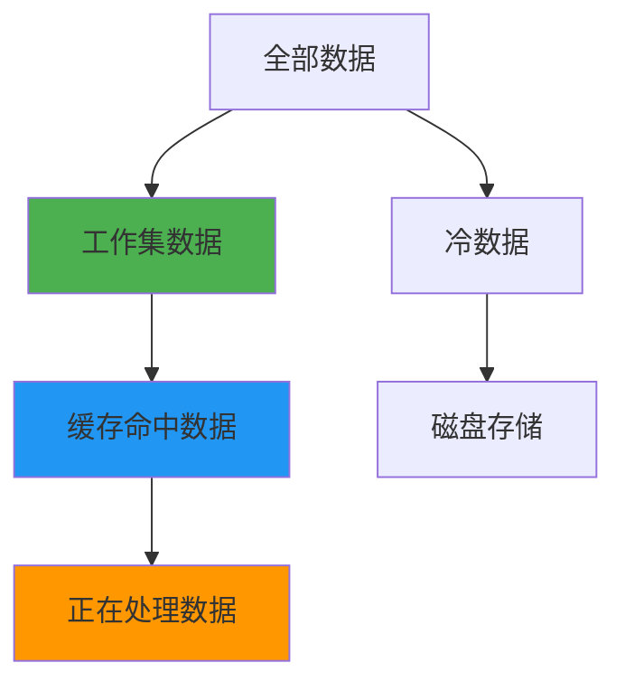
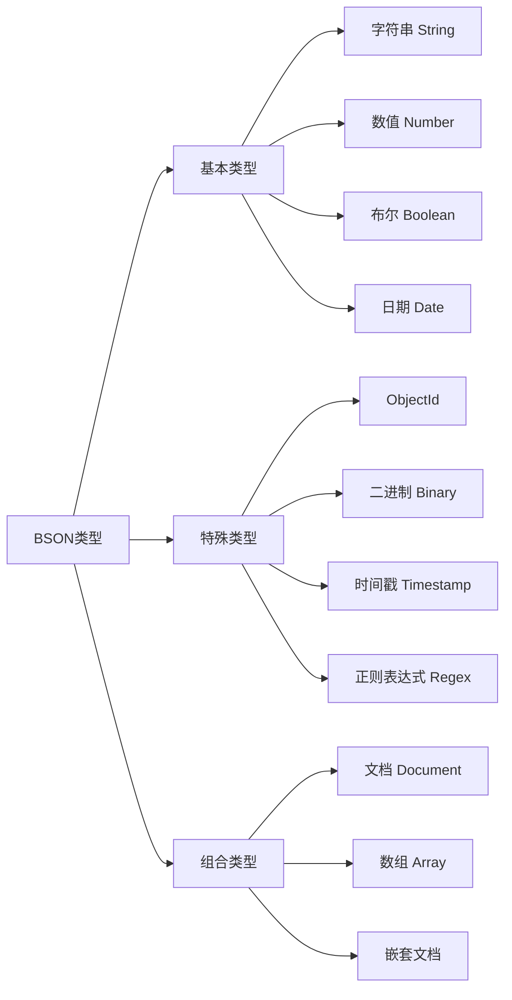
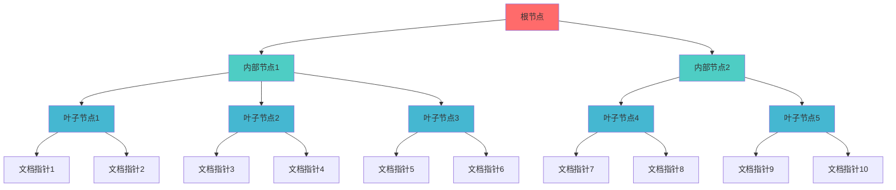
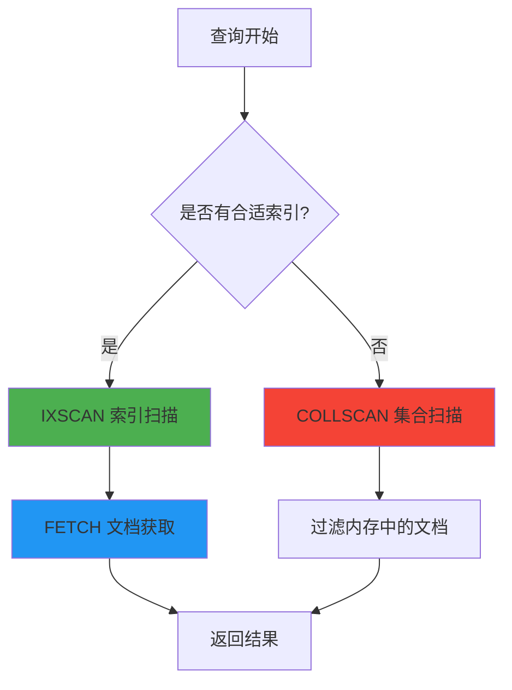
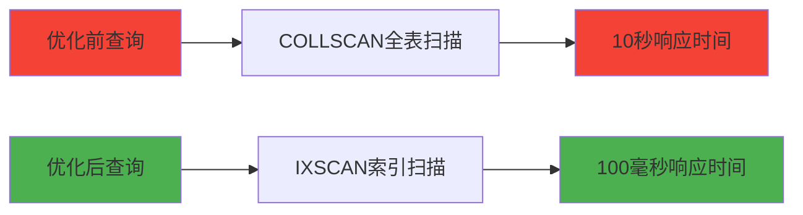
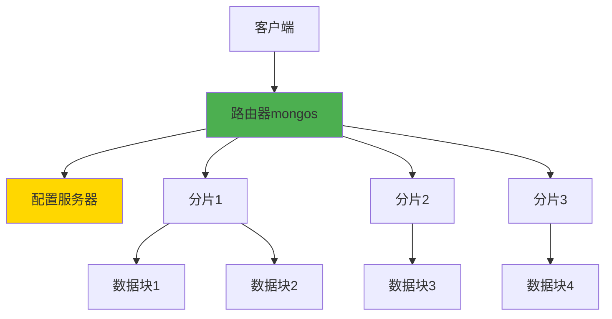

# MongoDB完全指南：从数据存储到索引优化的深度解析

> 💾 当你的应用数据量从几百条飙升到几百万条，当查询速度从毫秒级跌到秒级——这就是MongoDB存储和索引原理必须掌握的时刻！

朋友们，先来看一个真实的故事：

**电商小王的烦恼**
> "我们的用户表从1万增长到1000万，商品搜索从瞬间变成蜗牛。加了索引后，查询快了100倍！但为什么有的索引有效，有的却像摆设？"

今天，我就带你彻底搞懂MongoDB的**存储引擎秘密**和**索引魔法**！

## 🎯 为什么要深入理解MongoDB原理？

**现实世界的性能挑战：**
- 📈 **数据爆炸** - 从GB到TB的数据增长
- ⏱️ **响应延迟** - 用户无法忍受慢查询
- 💰 **成本控制** - 错误的索引=浪费内存和CPU
- 🔧 **运维难题** - 不懂原理，问题排查如盲人摸象

### 性能优化的核心公式



---

## 🏗️ MongoDB存储引擎：WiredTiger的魔法世界

### 存储引擎的演进历史



### WiredTiger核心架构解析



### 数据在磁盘上的真实模样

**一个文档的物理存储结构：**

```json
// 逻辑视图 - 我们看到的文档
{
  "_id": ObjectId("507f1f77bcf86cd799439011"),
  "name": "张三",
  "age": 25,
  "address": {
    "city": "北京",
    "street": "中关村"
  },
  "tags": ["技术", "编程"]
}

// 物理存储 - 实际在磁盘上的格式
{
  "header": {
    "length": 156,
    "type": "document",
    "flags": 0
  },
  "elements": [
    {"name": "_id", "type": "ObjectId", "value": "507f1f77bcf86cd799439011"},
    {"name": "name", "type": "string", "value": "张三"},
    {"name": "age", "type": "int32", "value": 25},
    {"name": "address", "type": "embedded", "value": {
      "city": "北京",
      "street": "中关村"
    }},
    {"name": "tags", "type": "array", "value": ["技术", "编程"]}
  ]
}
```

### WiredTiger的内存管理魔法

**工作集(Working Set)概念：**



**关键配置参数：**
```yaml
# mongod.conf 配置示例
storage:
  wiredTiger:
    engineConfig:
      cacheSizeGB: 8          # 缓存大小，建议是内存的50-80%
      journalCompressor: snappy  # 日志压缩算法
    collectionConfig:
      blockCompressor: snappy    # 数据压缩算法
    indexConfig:
      prefixCompression: true    # 索引前缀压缩
```

---

## 📊 深入理解文档存储格式：BSON的奥秘

### BSON vs JSON：为什么不用JSON存储？

**JSON的局限性：**
- 文本格式，解析慢
- 没有原生二进制类型支持
- 缺乏标准化的时间戳等类型

**BSON的优势：**
```python
# BSON的二进制结构示例
import bson

# 创建一个文档
doc = {
    "name": "张三",
    "age": 25,
    "salary": 15000.50,
    "birthday": datetime(1990, 5, 15),
    "skills": ["Python", "MongoDB"]
}

# 转换为BSON
bson_data = bson.BSON.encode(doc)
print(f"BSON大小: {len(bson_data)} 字节")

# 解析BSON
decoded_doc = bson.BSON(bson_data).decode()
print(decoded_doc)
```

### BSON类型系统详解



### 文档存储的物理布局

**一个集合的物理文件结构：**

```bash
# MongoDB数据目录结构
/data/db/
├── collection-0--123456789.wt      # 集合数据文件
├── index-1--123456789.wt           # 索引文件
├── index-2--123456789.wt           # 另一个索引文件
├── WiredTiger.wt                   # 元数据文件
├── WiredTiger.turtle               # 配置信息
└── journal/                        # 日志目录
    ├── WiredTigerLog.0000000001
    └── WiredTigerPreplog.0000000001
```

**数据文件的内部结构：**
```
┌─────────────────────────────────────────────┐
│               数据文件 (.wt)                 │
├─────────────┬─────────────┬─────────────┤
│   页面1     │   页面2     │   页面3     │
│   (16KB)    │   (16KB)    │   (16KB)    │
├─────────────┼─────────────┼─────────────┤
│ 文档A       │ 文档C       │ 文档E       │
│ 文档B       │ 文档D       │ 文档F       │
└─────────────┴─────────────┴─────────────┘
```

---

## 🌲 MongoDB索引原理：B-Tree的智慧

### 为什么需要索引？一个生动的比喻

**没有索引的查询就像：**
> 在图书馆的100万本书中，一页一页地找一本特定的书

**有索引的查询就像：**
> 使用图书目录卡片，直接找到书的位置

### B-Tree索引结构深度解析



### B-Tree的数学之美

**B-Tree的关键特性：**
- 🎯 **平衡树** - 所有叶子节点在同一层级
- 🔄 **多路搜索** - 每个节点有多个子节点
- 💾 **磁盘友好** - 节点大小匹配磁盘块大小
- 📈 **高效范围查询** - 叶子节点双向链接

**B-Tree的搜索复杂度：**
```
搜索时间复杂度: O(logₘn)
其中 m = 每个节点的最大子节点数
     n = 总文档数量

示例：如果有100万文档，m=100
则 log₁₀₀(1,000,000) ≈ 3次磁盘IO
```

### 索引的物理存储

**索引条目结构：**
```
┌─────────────┬─────────────┬─────────────┐
│   键值      │  文档位置   │  下一指针   │
│  (索引字段) │  (文件ID+偏移) │ (可选)     │
└─────────────┴─────────────┴─────────────┘
```

**实际索引文件示例：**
```javascript
// 创建索引
db.users.createIndex({ "name": 1 })

// 索引条目示例
{
  "key": "张三",
  "location": { "file": "collection-0", "offset": 12345 },
  "next": { "file": "index-1", "offset": 67890 }
}
```

---

## 🎯 MongoDB索引类型大全

### 1. 单字段索引（最常用）

```javascript
// 创建单字段索引
db.users.createIndex({ "email": 1 })  // 1表示升序，-1表示降序

// 支持的查询类型
- 精确匹配: db.users.find({ "email": "zhangsan@example.com" })
- 范围查询: db.users.find({ "age": { "$gte": 18, "$lte": 30 } })
- 排序: db.users.find().sort({ "email": 1 })
```

### 2. 复合索引（威力巨大）

```javascript
// 创建复合索引
db.orders.createIndex({ "customer_id": 1, "order_date": -1 })

// 索引前缀原则：复合索引支持前缀查询
// 有效查询：
db.orders.find({ "customer_id": "123" })  // 使用索引前缀
db.orders.find({ "customer_id": "123", "order_date": { "$gt": ISODate(...) } })  // 使用完整索引

// 无效查询：
db.orders.find({ "order_date": { "$gt": ISODate(...) } })  // 缺少前缀字段
```

### 3. 多键索引（数组字段）

```javascript
// 创建多键索引
db.products.createIndex({ "tags": 1 })

// 数组查询示例
db.products.find({ "tags": "electronics" })  // 使用多键索引

// 多键索引的限制：
// - 一个复合索引只能有一个数组字段
// - 不能创建{ "tags": 1, "categories": 1 }这样的索引
```

### 4. 地理空间索引

```javascript
// 2dsphere索引（球面几何）
db.places.createIndex({ "location": "2dsphere" })

// 地理查询示例
db.places.find({
  "location": {
    "$near": {
      "$geometry": {
        "type": "Point",
        "coordinates": [116.3974, 39.9093]  // 北京天安门
      },
      "$maxDistance": 1000  // 1公里范围内
    }
  }
})
```

### 5. 文本索引（全文搜索）

```javascript
// 创建文本索引
db.articles.createIndex({ "title": "text", "content": "text" })

// 全文搜索示例
db.articles.find({ 
  "$text": { 
    "$search": "MongoDB 索引 优化" 
  } 
})

// 文本搜索评分
db.articles.find(
  { "$text": { "$search": "数据库" } },
  { "score": { "$meta": "textScore" } }
).sort({ "score": { "$meta": "textScore" } })
```

### 6. 哈希索引（分片专用）

```javascript
// 创建哈希索引（用于分片）
db.users.createIndex({ "user_id": "hashed" })

// 分片配置
sh.shardCollection("mydb.users", { "user_id": "hashed" })

// 哈希索引特点：
// - 均匀分布数据
// - 只支持相等匹配查询
// - 不支持范围查询
```

---

## 🔍 查询执行计划：看懂Explain输出

### Explain()方法详解

```javascript
// 查看查询执行计划
db.users.find({ "age": { "$gte": 25 }, "city": "北京" })
   .explain("executionStats")

// 关键指标解读
{
  "queryPlanner": {
    "winningPlan": {
      "stage": "FETCH",           // 执行阶段
      "inputStage": {
        "stage": "IXSCAN",        // 索引扫描
        "keyPattern": { "age": 1, "city": 1 },  // 使用的索引
        "indexName": "age_1_city_1",
        "isMultiKey": false,
        "direction": "forward"
      }
    },
    "rejectedPlans": [...]         // 被拒绝的执行计划
  },
  "executionStats": {
    "nReturned": 123,              // 返回文档数
    "executionTimeMillis": 15,     // 执行时间(毫秒)
    "totalKeysExamined": 150,      // 检查的索引键数
    "totalDocsExamined": 123,      // 检查的文档数
    "stage": "FETCH"
  }
}
```

### 执行阶段类型解析



### 性能优化关键指标

**理想情况：**
```
nReturned ≈ totalDocsExamined ≈ totalKeysExamined
```

**问题信号：**
- `nReturned` << `totalDocsExamined` - 索引选择性差
- `totalDocsExamined` >> `totalKeysExamined` - 索引覆盖不完整
- `executionTimeMillis` 过大 - 需要优化查询或索引

---

## 💡 索引设计最佳实践

### 1. ESR规则：相等→排序→范围

```javascript
// 好的索引设计示例
// 查询: db.orders.find({ status: "completed", customer_id: "123" }).sort({ order_date: -1 })

// 根据ESR规则创建索引:
db.orders.createIndex({ 
  "status": 1,        // Equality - 相等匹配
  "customer_id": 1,   // Equality - 相等匹配  
  "order_date": -1    // Sort - 排序字段
})

// 范围查询字段应该放在最后
db.orders.createIndex({
  "category": 1,      // Equality
  "price": 1          // Range - 范围查询放在最后
})
```

### 2. 索引选择性原则

**选择性的计算：**
```javascript
// 计算字段的选择性
db.users.aggregate([
  { $group: { _id: "$city", count: { $sum: 1 } } },
  { $sort: { count: -1 } },
  { $limit: 10 }
])

// 选择性 = 唯一值的数量 / 总文档数
// 高选择性字段更适合建立索引
```

**选择性示例：**
```
字段       唯一值数量   总文档数   选择性   适合索引?
email      1,000,000   1,000,000  1.0      ✅ 非常适合
city       100         1,000,000  0.0001   ❌ 选择性太低
gender     2           1,000,000  0.000002 ❌ 绝对不适合
```

### 3. 覆盖查询优化

```javascript
// 创建覆盖索引
db.products.createIndex({ 
  "category": 1, 
  "price": 1, 
  "name": 1 
})

// 覆盖查询 - 只从索引获取数据，无需回表
// 查询字段都在索引中
db.products.find(
  { "category": "electronics", "price": { "$gte": 1000 } },
  { "_id": 0, "name": 1, "price": 1 }  // 只返回索引包含的字段
)

// 检查是否覆盖查询
db.products.find(...).explain("executionStats")
// 如果出现 "indexOnly": true，说明是覆盖查询
```

### 4. 索引的维护和监控

```javascript
// 查看索引使用情况
db.users.aggregate([{ $indexStats: {} }])

// 结果示例
{
  "name": "email_1",
  "key": { "email": 1 },
  "host": "server1:27017",
  "accesses": {
    "ops": 15000,        // 使用次数
    "since": ISODate(...)
  }
}

// 删除未使用的索引
db.users.dropIndex("unused_index_name")

// 重建索引（解决索引碎片化）
db.users.reIndex()
```

---

## 🚀 实战案例：电商系统索引优化

### 场景分析

**电商系统典型查询：**
1. 用户按商品名称搜索
2. 按分类和价格范围筛选
3. 按销量和评价排序
4. 商家管理后台的各种统计

### 索引设计方案

```javascript
// 商品集合索引策略
// 1. 主搜索索引
db.products.createIndex({ 
  "name": "text", 
  "description": "text" 
})

// 2. 分类+价格+销量复合索引
db.products.createIndex({ 
  "category_id": 1, 
  "price": 1, 
  "sales_count": -1 
})

// 3. 多维度筛选索引
db.products.createIndex({ 
  "category_id": 1, 
  "brand": 1, 
  "price": 1, 
  "rating": -1 
})

// 4. 商家后台统计索引
db.products.createIndex({ 
  "seller_id": 1, 
  "created_date": -1 
})

// 5. 地理空间索引（支持附近商品）
db.products.createIndex({ 
  "location": "2dsphere" 
})
```

### 查询性能对比

**优化前 vs 优化后：**



### 监控和调优脚本

```javascript
// 索引性能监控脚本
function monitorIndexPerformance() {
    const collections = db.getCollectionNames();
    
    collections.forEach(collectionName => {
        const stats = db[collectionName].stats();
        const indexStats = db[collectionName].aggregate([{ $indexStats: {} }]).toArray();
        
        print(`\n=== ${collectionName} 索引统计 ===`);
        indexStats.forEach(index => {
            const usageRate = index.accesses.ops / stats.count;
            print(`索引 ${index.name}: 使用次数 ${index.accesses.ops}, 使用率 ${(usageRate * 100).toFixed(2)}%`);
            
            if (usageRate < 0.01) {
                print(`⚠️  建议检查索引 ${index.name} 的使用情况`);
            }
        });
    });
}

// 运行监控
monitorIndexPerformance();
```

---

## 📈 高级主题：分片集群中的索引

### 分片集群索引策略



### 分片键选择原则

```javascript
// 好的分片键特征：
// 1. 基数高（唯一值多）
// 2. 写分布均匀
// 3. 支持常用查询模式

// 分片键示例
db.customers.createIndex({ "customer_id": "hashed" })  // 哈希分片
sh.shardCollection("mydb.customers", { "customer_id": "hashed" })

// 或者范围分片
sh.shardCollection("mydb.orders", { "order_date": 1, "customer_id": 1 })
```

### 分片集群的索引管理

```javascript
// 在分片集群中创建索引
// 方法1：通过mongos创建（推荐）
db.products.createIndex({ "category": 1, "price": 1 })

// 方法2：在每个分片上分别创建
db.getSiblingDB("mydb").getCollection("products").createIndex({ "category": 1, "price": 1 })

// 查看分片索引状态
db.products.getShardDistribution()
```

---

### 存储引擎关键记忆点

1. **WiredTiger是默认引擎** - 支持文档级锁和压缩
2. **内存管理很重要** - 合理设置cacheSizeGB
3. **日志保证持久性** - Journaling防止数据丢失
4. **压缩节省空间** - Snappy和Zlib压缩算法

### 索引设计黄金法则

1. **ESR原则** - 相等→排序→范围的字段顺序
2. **高选择性** - 选择唯一值多的字段建索引
3. **覆盖查询** - 让查询只使用索引
4. **复合索引** - 多字段查询的首选方案
5. **监控使用** - 定期检查索引的有效性

### 性能优化检查清单

- ✅ 为常用查询字段创建索引
- ✅ 使用复合索引替代多个单字段索引
- ✅ 确保索引的选择性足够高
- ✅ 定期监控和清理未使用的索引
- ✅ 使用explain()分析查询性能
- ✅ 考虑分片集群的索引策略