# PlantUML：程序员必备的画图神器，一篇文章彻底讲清楚

> 做技术文档、写技术博客、画架构图、画流程图……你是否有过这样的经历：想画个图，但专业的绘图工具太贵 Visio 要付费、ProcessOn 要联网、Sketch 太复杂。其实有一种更简单的方式，只需要写几行字，就能自动生成漂亮的图。这就是 PlantUML，一个用代码画图的神器。今天这篇文章，就让你彻底搞明白它。

---

## 一、什么是 PlantUML？

### 1.1  PlantUML 的定义

PlantUML 是一个用**纯文本**来绘制各种图表的工具。它的工作方式非常特别：你不需要用鼠标拖拽图标、不需要手动对齐线条，只需要用键盘写下特定的代码，PlantUML 就会自动把你的代码「翻译」成一张漂亮的图。

你可以把它理解成一种「**用代码画图**」的语言，就像 Markdown 可以用代码写文章一样，PlantUML 可以用代码画图。

### 1.2  PlantUML 能画哪些图？

PlantUML 支持的图表类型非常丰富，日常工作能用到的图它几乎都能画：

| 类型 | 用途 | 打个比方 |
|------|------|----------|
| **时序图** | 展示多个对象之间的交互顺序 | 像看电影时的对话记录 |
| **流程图** | 展示业务流程 | 像公司的流程审批图 |
| **类图** | 展示程序的结构 | 像族谱，告诉你谁是谁的爸爸 |
| **状态图** | 展示状态变化 | 像地铁线路图，一站一站的 |
| **组件图** | 展示系统架构 | 像积木拼成的城堡 |
| **用例图** | 展示功能需求 | 像菜单，列出所有能做的事 |
| **活动图** | 展示具体操作步骤 | 像食谱，告诉你每一步怎么做 |
| **部署图** | 展示服务器部署情况 | 像接线图，设备怎么连接 |
| **对象图** | 展示具体实例 | 像照片，定格某一个时刻 |
| **MindMap** | 思维导图 | 像大脑的思维发散图 |
| **Wireframe** | 界面线框图 | 像手绘的界面草图 |
| **密集图** | 密集数据可视化 | 像热力图 |

可以说，**PlantUML 几乎能画出你日常需要的任何图表类型**。

### 1.3  PlantUML 的工作原理

PlantUML 的工作流程大概是这样的：

```
+----------------+      翻译      +----------------+
|   你的代码    |  ───────>  |   生成的图   |
| @startuml     |            |      ↓      |
| Alice -> Bob |            |  Alice → Bob |
| @enduml      |            |             |
+----------------+      翻译      +----------------+
```

你写代码，PlantUML 生成图。

### 1.4  PlantUML 的优势

PlantUML 相比传统绘图工具，有几个非常明显的优势：

**第一，版本控制友好。**

传统绘图工具导出的图片是二进制的，Git 无法对比差异。但 PlantUML 导出的是文本，你可以用 Git 进行版本管理，每次修改都能看到改了哪些内容。

```
# 传统的图：
📄 流程图.vsd （二进制，Git 无法对比）

# PlantUML：
📄 流程图.puml （文本，每次修改都能看 diff）
```

**第二，修改方便。**

如果要让「订单审核」这个步骤多一个分支，传统方式需要重新画图。但用 PlantUML，只需要修改几行代码。

```plantuml
' 之前：
审核 --> 通过

' 之后：
审核 --> 通过
审核 --> 拒绝
```

**第三，免费开源。**

PlantUML 是一个开源项目，完全免费。你可以自己部署到服务器上，也可以用在线版本。

**第四，支持批量生成。**

如果需要给 100 个接口画 100 张时序图，只需要写一个脚本，就能自动批量生成。

---

## 二、第一个 PlantUML 示例：时序图

### 2.1  为什么从时序图开始？

��� PlantUML 的所有图表类型中，**时序图（Sequence Diagram）是最简单、也是最常用的一种**。它用来展示多个对象之间谁先调用谁、谁返回什么，就像记录电影里的对话场景一样。

我建议先从时序图开始学，因为：

1. 语法最简单，几行代码就能画出图
2. 工作中用的最多，学会就能解决大部分需求
3. 掌握了时序图，其他图就很好理解了

### 2.2  第一个示例

来看一个最简单的例子：用户问服务器一个问题，服务器回答。

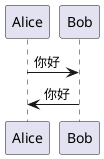

这段代码会生成这样一张图：

```
┌───┐       ┌───┐
│Alice│     │Bob │
└─┬─┘       └─┬─┘
  │ ──────>  │
  │  你好    │
  │ <─────── │
  │  你好   │
  └─────────┘
```

看起来非常简单：
- `Alice -> Bob: 你好` 表示 Alice 发了一条消息给 Bob
- `Bob -> Alice: 你好` 表示 Bob 回复了 Alice 一条消息

### 2.3  时序图的基本语法

时序图的基础语法非常简洁，只有几种元素：

**参与者（Participant）：**

在时序图里，参与者就是参与交互的对象。你需要先定义有哪些参与者：

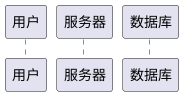

这一步可以省略，因为 PlantUML 会**自动识别**你用到的变量作为参与者。所以最简单的方式是直接写：

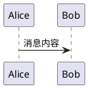

PlantUML 会自动创建「Alice」和「Bob」这两个参与者。

**消息（Message）：**

消息用箭头表示，箭头方向指向消息的接收方：

| 语法 | 意思 |
|------|------|
| `A -> B` | A 发同步消息给 B |
| `A --> B` | A 发异步消息给 B（虚线） |
| `A <- B` | B 返回给 A |
| `A <-- B` | B 异步返回给 A |

注意箭头方向：`A -> B` 表示消息从 A 发到 B，`A <- B` 表示消息从 B 返回到 A。

### 2.4  完整的时序图示例

来看一个稍微复杂一点的例子：一个用户登录的完整流程。

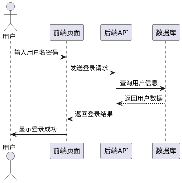

这段代码会生成一张图，展示用户登录的完整流程：

```
用户   前端页面  后端API   数据库
  │              │        │
  ├─输入账号密码─>│        │
  │              │        │
  │              ├─查询─>│
  │              │        │
  │              │<──结果─┤
  │              │        │
  │<─登录结果────┤        │
  │              │        │
  └─登录成功────>│        │
```

你能看到数据从用户开始，依次经过前端、后端、数据库，然后一层层返回。这就是典型的时序图。

### 2.5  时序图的进阶语法

**给参与者起别名：**

如果参与者的名字很长，可以给它起一个短的别名：

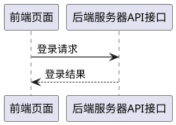

这样图会更清晰。

**给消息加标签：**

可以在箭头上加标签，说明消息的类型：

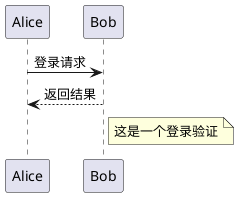

**创建条件分支：**

还可以���条��分支：

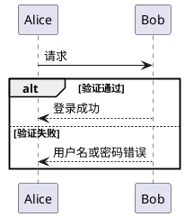

**创建循环：**

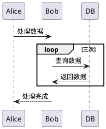

---

## 三、第二种图表：流程图

### 3.1  流程图的用途

**流程图（Activity Diagram）** 用来展示业务流程或者算法的执行步骤。它和时序图不同：时序图展示「谁调用谁」，流程图展示「一步一步怎么做」。

你可以把流程图理解成「**食谱**」：告诉你第一步做什么、第二步做什么、第三步做什么。

### 3.2  第一个流程图示例

来看一个最简单的例子：用户注册的流程。

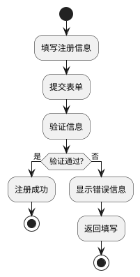

这段代码会生成一张流程图：

```
┌─────────────┐
│   开始      │
└──────┬──────┘
       │
       ▼
┌─────────────┐
│ 填写注册信息 │
└──────┬──────┘
       │
       ▼
┌─────────────┐
│  提交表单   │
└──────┬──────┘
       │
       ▼
┌─────────────┐
│  验证信息  │
└──────┬──────┘
       │
   ┌───┴───┐
   │       │
  是     否
   │       │
   ▼       ▼
┌────┐  ┌──────────┐
│成功 │  │ 显示错误 │
└────┘  └──────────┘
```

看起来就是一个标准的流程图：有开始、有步骤、有判断、有结束。

### 3.3  流程图的基本语法

流程图的核心语法只有几种：

**开始和结束：**

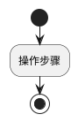

**步骤：**

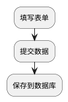

**条件判断：**

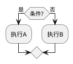

**并行处理：**

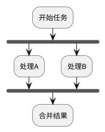

**泳道（Swimlane）：**

如果需要区分不同角色的职责，可以用泳道：

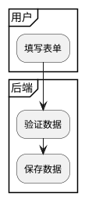

泳道可以把流程图分成不同的区域，每个区域代表不同的角色。

### 3.4  完整的流程图示例

来看一个电商下单的完整流程：

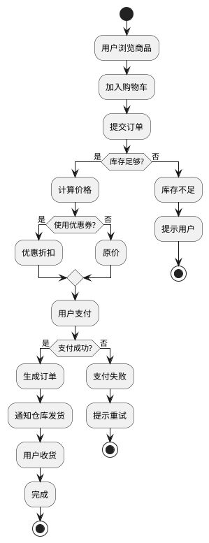

这就是一个完整的电商下单流程图，从浏览商品到完成订单，覆盖了各种可能的分支情况。

---

## 四、第三种图表：类图

### 4.1  类图的用途

**类图（Class Diagram）** 用来展示程序中类的结构，以及类和类之间的关系。在面向对象编程里，你可以把类图理解成「**族谱**」：告诉每个类有什么属性、什么方法，以及谁继承自谁。

### 4.2  类图的基本语法

**定义一个类：**

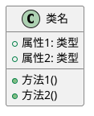

`+` 表示公开（public），`-` 表示私有（private），`#` 表示受保护（protected）。

### 4.3  类之间的关系

类图最强大的地方在于它可以展示**类和类之间的关系**：

| 关系 | 语法 | 意思 |
|------|------|------|
| 继承 | `<|--` | B 继承自 A |
| 实现 | `<|..` | B 实现 A 接口 |
| 关联 | `<--` | A 包含 B |
| 聚合 | `o--` | A 包含 B，但 B 可以独立存在 |
| 组合 | `*--` | A 包含 B，B 不能独立存在 |
| 依赖 | `<..` | A 依赖 B |
| 引用 | `--` | A 引用 B |

### 4.4  类图示例

**继承关系：**

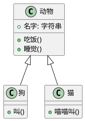

这张图展示了「狗」和「猫」都继承自「动物」类。

**组合关系：**

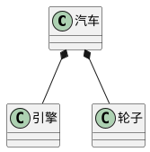

这表示「汽车」由「引擎」和「轮子」组成，它们不能独立存在（组合关系）。

### 4.5  完整的类图示例

来看一个完整的电商系统的类图：

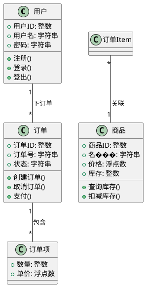

这张图展示了：
- 一个用户可以下多个订单（一对多）
- 一个订单包含多个订单项（一对多）
- 每个订单项对应一个商品（多对一）

---

## 五、第四种图表：状态图

### 5.1  状态图的用途

**状态图（State Diagram）** 用来展示一个对象在生命周期内的状态变化。你可以把它理解成「**地铁线路图**」：从一个状态到另一个状态，沿着线路走。

### 5.2  状态图的基本语法

**定义状态：**

```plantuml
@startuml
[*] --> 初始状态
状态1 --> 状态2
状态2 --> [*]
@enduml
```

`[*]` 表示开始和结束状态。

**状态之间的转换：**

```plantuml
@startuml
[*] --> 待支付
待支付 --> 已支付
已支付 --> 已发货
已发货 --> 已送达
已送达 --> 已完成
已完成 --> [*]
@enduml
```

这就是典型的订单状态流转图。

### 5.3  有分支的状态图

状态图也可以有分支：

```plantuml
@startuml
[*] --> 待支付
待支付 --> 已支付: 支付成功
待支付 --> 已取消: 支付失败
已支付 --> 已发货
已发货 --> 已送达
已送达 --> 已完成
已送达 --> 已退货: 退货申请
已退货 --> 已退款
已退款 --> [*]
@enduml
```

这张图展示了订单的完整生命周期：待支付 → 已支付 → 已发货 → 已送达 → 已完成，或者从已送达退换货。

---

## 六、第五种图表：组件图和部署图

### 6.1  组件图

**组件图（Component Diagram）** 用来展示系统的组成部分，以及各部分之间的关系。你可以把它理解成「**积木图**」：系统由哪些组件拼成。

```plantuml
@startuml
package "前端" {
    [Web应用]
    [手机App]
}

package "后端" {
    [API服务]
    [业务逻辑]
}

package "数据层" {
    [数据库]
    [缓存]
}

[Web应用] --> [API服务]
[手机App] --> [API服务]
[API服务] --> [业务逻辑]
[业务逻辑] --> [数据库]
[业务逻辑] --> [缓存]
@enduml
```

这就是一个典型的前后端分离架构。

### 6.2  部署图

**部署图（Deployment Diagram）** 用来展示系统部署在哪些服务器上、设备上。

```plantuml
@startuml
node "负载均衡" {
    [Nginx]
}

node "应用服务器" {
    [Tomcat 1]
    [Tomcat 2]
    [Tomcat 3]
}

node "数据库服务器" {
    [MySQL主库]
    [MySQL从库]
}

node "缓存服务器" {
    [Redis]
}

[Nginx] --> [Tomcat 1]
[Nginx] --> [Tomcat 2]
[Nginx] --> [Tomcat 3]
[Tomcat 1] --> [MySQL主库]
[Tomcat 2] --> [MySQL主库]
[Tomcat 3] --> [MySQL主库]
[MySQL主库] --> [MySQL从库]
[Tomcat 1] --> [Redis]
@enduml
```

这张部署图展示了：
- Nginx 做负载均衡，分发到 3 个 Tomcat
- 3 个 Tomcat 连接 MySQL 主库
- 主库同步到从库
- 3 个 Tomcat 都连接 Redis 做缓存

---

## 七、实战：如何用 PlantUML 画图？

### 7.1  第一步：选择工具

有几个常用的方式可以使用 PlantUML：

**方式一：在线网站（最简单）**

访问 PlantUML 官方在线编辑器：https://www.plantuml.com/plantuml

你只需要把代码粘贴进去，就会自动生成图。

**方式二：VS Code 插件**

如果你用 VS Code，可以安装「PlantUML」插件。安装后，编辑 `.puml` 文件时可以直接预览图。

```bash
# 在 VS Code 里按 F1
# 然后输入 "PlantUML: Preview Current Time"
# 就能看到图
```

**��式三：本地安装**

如果你需要本地使用，可以下载 PlantUML 的 JAR 包：

```bash
# 下载 PlantUML
war http://sourceforge.net/projects/plantuml/files/plantuml.jar

# 运行
java -jar plantuml -checkonly test.puml
```

### 7.2  第二步：编写代码

把你要画的图用 PlantUML 语法写出来。比如你想画一个登录流程，先写时序图：

```plantuml
@startuml
' 登录流程
actor 用户
participant 前端 as Front
participant 后端 as API
participant 数据库 as DB

用户 -> Front: 输入账号密码
Front -> API: 登录请求
API -> DB: 查询用户
DB --> API: 返回用户信息
API -> Front: 返回结果
Front -> 用户: 登录成功
@enduml
```

### 7.3  第三步：生成图片

把代码粘贴到在线编辑器里，就会自动生成图片。你可以选择导出为 PNG、SVG、PDF 等格式。

### 7.4  第四步：嵌入文档

PlantUML 生成的图片可以嵌入到任何文档里：

- 插入到 Markdown 文件里
- 插入到 Word 文档里
- 插入到 PPT 里
- 放到博客网站上

---

## 八、PlantUML 语法速查表

### 8.1  时序图

```plantuml
@startuml
' 定义参与者
actor 角色
participant "参与者"

' 基本消息
A -> B: 消息
A --> B: 异步消息
A <- B: 返回
A <-- B: 异步返回

' 注释
note right of A: 注释
note over A,B: 覆盖注释

' 分支
alt 条件1
    A -> B: 结果1
else 条件2
    A -> B: 结果2
end
@enduml
```

### 8.2  流程图

```plantuml
@startuml
' 开始结束
start
stop

' 步骤
:执行操作;

' 判断
if (条件?) then (是)
    :操作A;
else (否)
    :操作B;
end if

' 分支
fork
    :处理A;
fork again
    :处理B;
end fork

' 循环
repeat
    :执行操作;
repeat while (条件?)
@enduml
```

### 8.3  类图

```plantuml
@startuml
' 定义类
class 类名 {
    +属性
    +方法()
}

' 继承
子类 <|-- 父类

' 实现
实现类 ..|> 接口

' 组合
类 *-- 组件

' 聚合
类 o-- 组件
@enduml
```

### 8.4  状态图

```plantuml
@startuml
' 定义状态
[*] --> 初始状态
状态1 --> 状态2: 事件

' 内部行为
状态1: 进入操作
状态1: 退出操作
@enduml
```

---

## 九、常见问题解答

> **Q1：PlantUML 和 Mermaid 有什么区别？**

两者都是用代码画图的工具，但有一些区别：

| 特性 | PlantUML | Mermaid |
|------|----------|----------|
| 语言 | Java | JavaScript |
| 语法 | 比较严谨 | 比较简单 |
| 图表类型 | 十几种 | 十几种 |
| 生态 | 历史久，资料多 | 较新，GitHub 全面支持 |
| 学习难度 | 稍难 | 更简单 |

简单来说，PlantUML 更专业、功能更强大，Mermaid 更简单、集成更广。

> **Q2：PlantUML 需要安装吗？**

可以在线使用，也可以本地安装。

- **在线使用**：直接访问 plantuml.com，不需要安装
- **VS Code**：安装插件，不需要额外安装
- **本地使用**：需要下载 JAR 包，安装 Java 环境

> **Q3：PlantUML 可商用吗？**

PlantUML 使用 GPL 开源协议，**可以商用**。

> **Q4：PlantUML 能画出很好看的图吗？**

PlantUML 生成的图比较「**朴素**」，偏向技术文档风格。如果需要非常漂亮的图，可能需要用其他工具。

但 PlantUML 的优势在于「**快速**」和「**版本可控**」，适合技术文档。

> **Q5：PlantUML 支持中文吗？**

支持，只需要在代码里用中文即可：

```plantuml
@startuml
participant "用户" as 用户
participant "服务器" as 服务器

用户 -> 服务器: 登录请求
服务器 --> 用户: 登录成功
@enduml
```

---

PlantUML 就是一个用代码画图的神器。它的核心理念是���**��其用鼠标拖拽，不如用代码表达**。

- **时序图**：展示谁先调用谁，适合画接口交互
- **流程图**：展示一步一步怎么做，适合画业务流程
- **类图**：展示类和类的关系，适合画代码结构
- **状态图**：展示状态变化，适合画状态流转
- **组件图**：展示系统架构，适合画部署结构

学会 PlantUML，你就可以用几行代码画出清晰的图，而且这些代码可以版本管理、可以批量生成、可以自动化。

---