# Wireshark 深度解析：从抓包入门到协议逆向的完整指南

> 网络世界的显微镜——每一比特都无所遁形

---

## 写在前面

如果你是一名后端开发者，当线上出现"接口偶发超时"时，你怎么定位？如果你是运维工程师，当服务器被入侵时，你怎么追查攻击路径？如果你是安全研究员，当你需要分析一款未公开协议的 IoT 设备时，你从哪里入手？

答案指向同一个工具——**Wireshark**。

它不是简单的"抓包工具"，它是网络协议的解码器、故障排查的听诊器、安全分析的手术刀。本文将从零开始，带你由浅入深地掌握 Wireshark 的方方面面：从安装抓包，到过滤分析，再到协议逆向与高级技巧。读完这篇文章，你将具备用 Wireshark 解决真实网络问题的能力。

---

## 第一篇：初识 Wireshark——网络世界的"显微镜"

### 1.1 什么是 Wireshark？

Wireshark（原名 Ethereal）是一款开源的网络协议分析器，能够实时捕获网络数据包，并以人类可读的方式展示每一个字节。它支持 **3000+ 种协议**的解码，从底层的以太网帧到应用层的 HTTP/2、gRPC，几乎涵盖了你在网络中能遇到的所有协议。

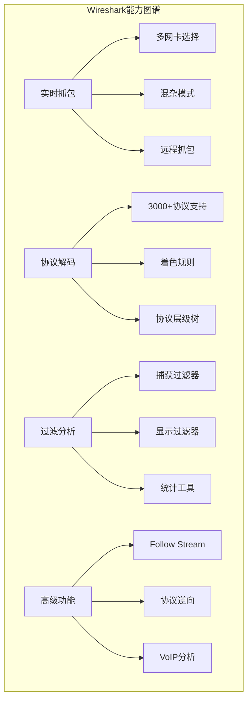

**核心定位：**

| 角色 | 用途 |
|------|------|
| 开发者 | 调试网络通信、分析协议行为、定位接口问题 |
| 运维工程师 | 排查网络故障、分析流量异常、监控服务质量 |
| 安全工程师 | 入侵检测、恶意流量分析、协议逆向 |
| 学生/研究者 | 学习网络协议、验证理论知识、研究新型协议 |

### 1.2 Wireshark vs 其他抓包工具

很多人会问：有了 tcpdump、Fiddler、Charles，为什么还要学 Wireshark？

| 特性 | Wireshark | tcpdump | Fiddler/Charles |
|------|-----------|---------|-----------------|
| 图形界面 | GUI（强大） | 仅命令行 | GUI |
| 协议覆盖 | 3000+（全栈） | 有限解码 | 主要 HTTP/HTTPS |
| 过滤语法 | 最强大 | BPF 语法 | 简单过滤 |
| 实时分析 | 支持 | 有限 | 支持 |
| 离线分析 | 支持 | 需配合 Wireshark | 支持 |
| 跨平台 | Windows/Mac/Linux | Linux/Mac | Windows/Mac |
| 学习曲线 | 中等 | 低 | 低 |

### 1.3 安装与首次启动

**各平台安装方式：**

```bash
# macOS
brew install --cask wireshark

# Ubuntu/Debian
sudo apt install wireshark
sudo usermod -aG wireshark $USER  # 非root抓包权限

# Windows
# 从 https://www.wireshark.org 下载安装包，安装时勾选 Npcap
```

> **重要提示：** Windows 必须安装 Npcap（Wireshark 自带安装选项），macOS 需要安装 ChmodBPF 权限组件。首次启动时 Wireshark 会提示安装，务必同意。

启动后的主界面如下：

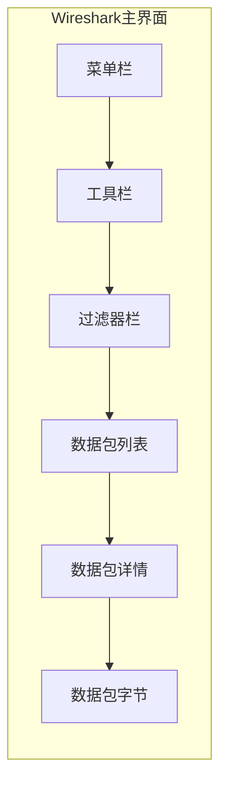

**界面三大区域详解：**

| 区域 | 作用 | 关键操作 |
|------|------|----------|
| 数据包列表（Packet List） | 显示每个包的一行摘要 | 单击选中，双击展开详情 |
| 数据包详情（Packet Details） | 以协议树形式展开包内容 | 展开/折叠各层协议 |
| 数据包字节（Packet Bytes） | 显示原始十六进制数据 | 选中详情中的字段，对应字节高亮 |

---

## 第二篇：抓包基础——从第一个包开始

### 2.1 选择抓包接口

打开 Wireshark 后，首先看到的是网络接口列表。每个接口旁有折线图显示实时流量。

**如何选择正确的接口？**

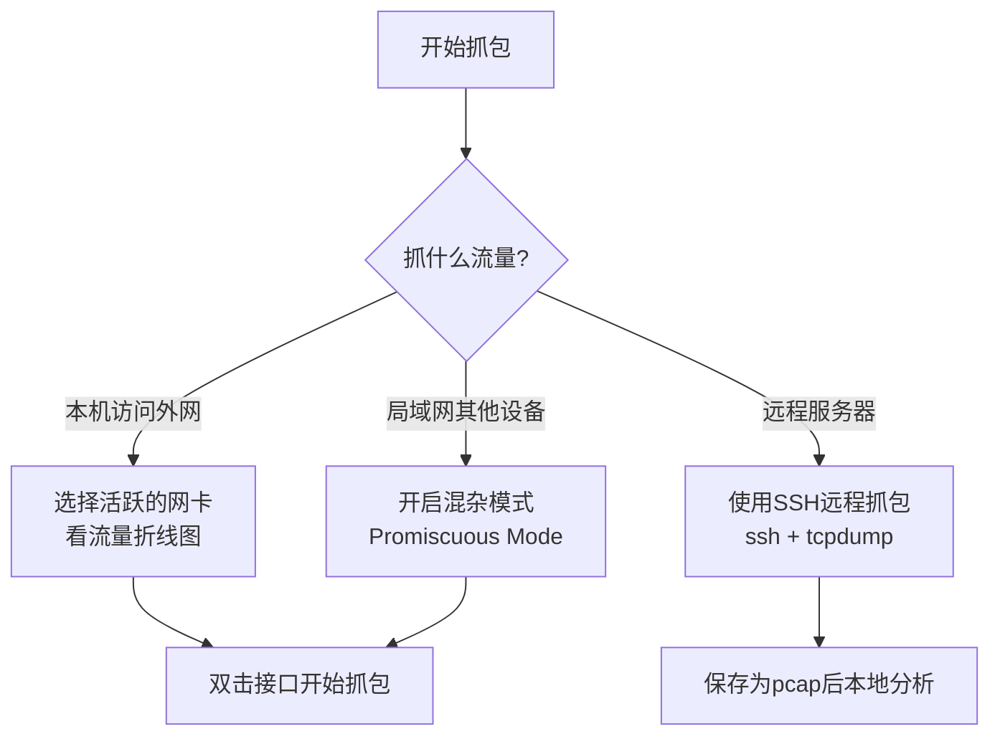

**混杂模式（Promiscuous Mode）：** 默认情况下，网卡只接收目标 MAC 地址为自己的帧。开启混杂模式后，网卡会接收同一局域网内所有帧。要抓取其他设备的流量，必须开启。

设置方式：Capture → Options → 勾选接口的 "Promiscuous" 选项。

### 2.2 第一次抓包实战

让我们抓一个最简单的场景——用浏览器访问一个网站。

**步骤：**

1. 选择活跃的网络接口，双击开始抓包
2. 打开浏览器，访问 `http://example.com`（注意用 HTTP 而非 HTTPS，方便观察明文）
3. 回到 Wireshark，点击停止按钮（红色方块）
4. 在过滤栏输入 `http`，按回车

你会看到类似这样的数据包列表：

```
No.  Time      Source          Destination     Protocol  Length  Info
1    0.000     192.168.1.100  93.184.216.34   DNS       75      Standard query A example.com
2    0.023     93.184.216.34  192.168.1.100   DNS       91      Standard query response A 93.184.216.34
3    0.025     192.168.1.100  93.184.216.34   TCP       66      54321 → 80 [SYN]
4    0.052     93.184.216.34  192.168.1.100   TCP       66      80 → 54321 [SYN, ACK]
5    0.052     192.168.1.100  93.184.216.34   TCP       66      54321 → 80 [ACK]
6    0.053     192.168.1.100  93.184.216.34   HTTP      412     GET / HTTP/1.1
7    0.080     93.184.216.34  192.168.1.100   TCP       66      80 → 54321 [ACK]
8    0.095     93.184.216.34  192.168.1.100   HTTP      1448    HTTP/1.1 200 OK
```

这就是一次完整的 HTTP 访问过程：DNS 查询 → TCP 三次握手 → HTTP 请求/响应。

### 2.3 保存与打开抓包文件

**保存格式：**

| 格式 | 说明 | 使用场景 |
|------|------|----------|
| `.pcapng` | Wireshark 默认格式，支持注释 | 日常使用 |
| `.pcap` | 经典格式，兼容性最好 | 与其他工具交换 |
| `.cap` | 同 pcap | 同上 |

**快捷操作：**
- 保存：`Ctrl/Cmd + S`
- 另存为：`Shift + Ctrl/Cmd + S`
- 导出特定包：`File → Export Specified Packets`

> **实战建议：** 养成保存抓包文件的习惯。很多问题需要反复分析，离线分析比实时抓包效率更高。

---

## 第三篇：过滤——Wireshark 的灵魂

不会过滤，就等于不会用 Wireshark。Wireshark 提供两套过滤体系：捕获过滤器和显示过滤器。二者语法不同，用途不同，必须区分清楚。

### 3.1 两套过滤体系对比

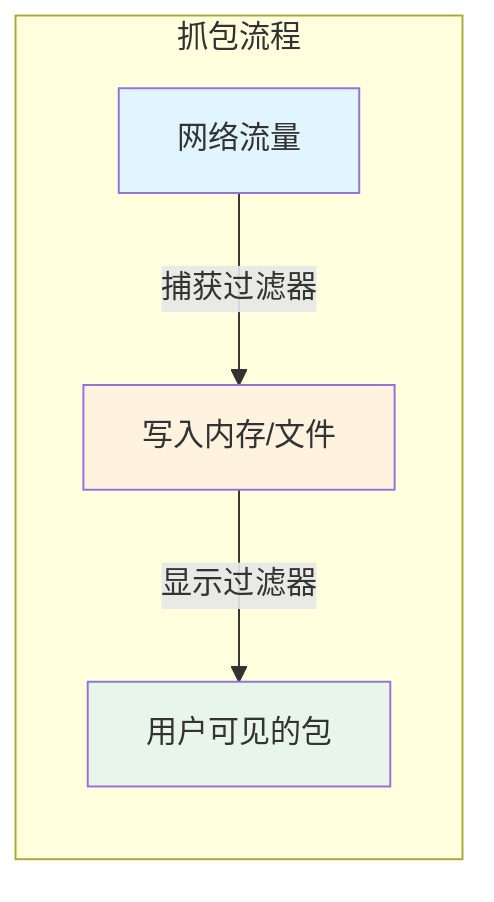

| 维度 | 捕获过滤器（Capture Filter） | 显示过滤器（Display Filter） |
|------|------|------|
| 语法体系 | BPF（Berkeley Packet Filter） | Wireshark 自有语法 |
| 生效时机 | 抓包时，不符合条件的包直接丢弃 | 抓包后，仅控制显示，包仍在文件中 |
| 功能强弱 | 较弱，只能按简单条件过滤 | 极强，可按任意协议字段过滤 |
| 性能影响 | 减少抓包量，节省内存 | 不影响抓包性能 |
| 使用场景 | 流量极大时先筛一波 | 精确分析特定包 |

### 3.2 捕获过滤器语法（BPF）

BPF 语法来源于 libpcap，与 tcpdump 一致。

**基本语法：**

```
[方向] [协议] [主机/端口] [逻辑运算]
```

**常用示例：**

```bash
# 只抓特定主机的流量
host 192.168.1.100

# 只抓特定端口的流量
port 80

# 只抓来自特定IP的流量
src host 10.0.0.1

# 只抓TCP流量
tcp

# 组合：抓来自10.0.0.1且目标是80端口的TCP包
tcp src host 10.0.0.1 and dst port 80

# 排除SSH流量（不抓22端口）
not port 22

# 抓两个主机之间的流量
host 192.168.1.1 and host 192.168.1.2

# 抓特定网段的流量
net 192.168.1.0/24

# 抓特定MAC地址的流量
ether host aa:bb:cc:dd:ee:ff
```

> **注意：** 捕获过滤器一旦设置，未匹配的包将永久丢失，无法找回。如果不确定过滤条件，宁可多抓后用显示过滤器筛选。

### 3.3 显示过滤器语法——Wireshark 的核心能力

显示过滤器是 Wireshark 最强大的功能，语法灵活，几乎可以按任何协议字段过滤。

**基本比较运算符：**

| 运算符 | 含义 | 示例 |
|--------|------|------|
| `==` | 等于 | `ip.addr == 192.168.1.1` |
| `!=` | 不等于 | `ip.addr != 192.168.1.1` |
| `>` | 大于 | `tcp.port > 1024` |
| `<` | 小于 | `frame.len < 100` |
| `>=` | 大于等于 | `tcp.window_size >= 8192` |
| `<=` | 小于等于 | `ip.ttl <= 64` |
| `contains` | 包含字符串 | `http contains "password"` |
| `matches` | 正则匹配 | `http matches "user=.*admin"` |

**逻辑运算符：**

| 运算符 | 含义 | 示例 |
|--------|------|------|
| `and` / `&&` | 与 | `ip.src==10.0.0.1 && tcp.port==80` |
| `or` / `||` | 或 | `tcp.port==80 || tcp.port==443` |
| `not` / `!` | 非 | `not arp && not dns` |

**按协议过滤：**

```bash
http                    # 只看HTTP包
tcp                     # 只看TCP包
dns                     # 只看DNS包
arp                     # 只看ARP包
icmp                    # 只看ICMP包（ping）
tls                     # 只看TLS包
quic                    # 只看QUIC包
```

**按IP过滤：**

```bash
ip.addr == 192.168.1.1          # 源或目标是该IP
ip.src == 192.168.1.1           # 仅源IP
ip.dst == 192.168.1.1           # 仅目标IP
ip.src == 10.0.0.0/8            # 支持CIDR
```

**按端口过滤：**

```bash
tcp.port == 80                  # 源或目标端口
tcp.srcport == 8080             # 仅源端口
tcp.dstport == 443              # 仅目标端口
udp.port == 53                  # UDP端口
```

**按协议字段过滤（核心能力）：**

这是 Wireshark 的杀手级功能。你可以在数据包详情中右键任意字段 → "Apply as Filter"，自动生成过滤表达式。

```bash
# TCP标志位
tcp.flags.syn == 1              # SYN包
tcp.flags.reset == 1            # RST包
tcp.flags.fin == 1              # FIN包

# HTTP特定内容
http.request.method == "POST"   # POST请求
http.response.code == 404       # 404响应
http.host contains "google"     # Host头包含google

# DNS查询
dns.qry.name contains "baidu"   # 查询域名包含baidu

# TLS特定字段
tls.handshake.type == 1         # Client Hello
tls.handshake.type == 2         # Server Hello

# 帧属性
frame.len > 1000                # 帧长度大于1000字节
frame.time_delta > 1            # 与上一帧间隔超过1秒
```

### 3.4 过滤器实战场景

**场景1：排查"接口偶发超时"**

```bash
# 第一步：找出目标服务器的慢响应
ip.addr == 10.0.0.5 && tcp.time_delta > 0.5

# 第二步：找出重传的包（可能是丢包导致超时）
tcp.analysis.retransmission && ip.addr == 10.0.0.5

# 第三步：看TCP窗口大小（可能是接收方处理不过来）
ip.addr == 10.0.0.5 && tcp.window_size < 1024
```

**场景2：排查"DNS解析失败"**

```bash
# 查看DNS服务器返回的错误响应
dns.flags.rcode != 0

# 查看特定域名的解析
dns.qry.name == "api.example.com"

# 查看DNS响应为NXDOMAIN（域名不存在）
dns.flags.rcode == 3
```

**场景3：分析HTTPS握手失败**

```bash
# 只看TLS握手包
tls.handshake.type > 0

# 只看Client Hello
tls.handshake.type == 1

# 看TLS告警（通常是握手失败的原因）
tls.alert
```

### 3.5 过滤器速查表

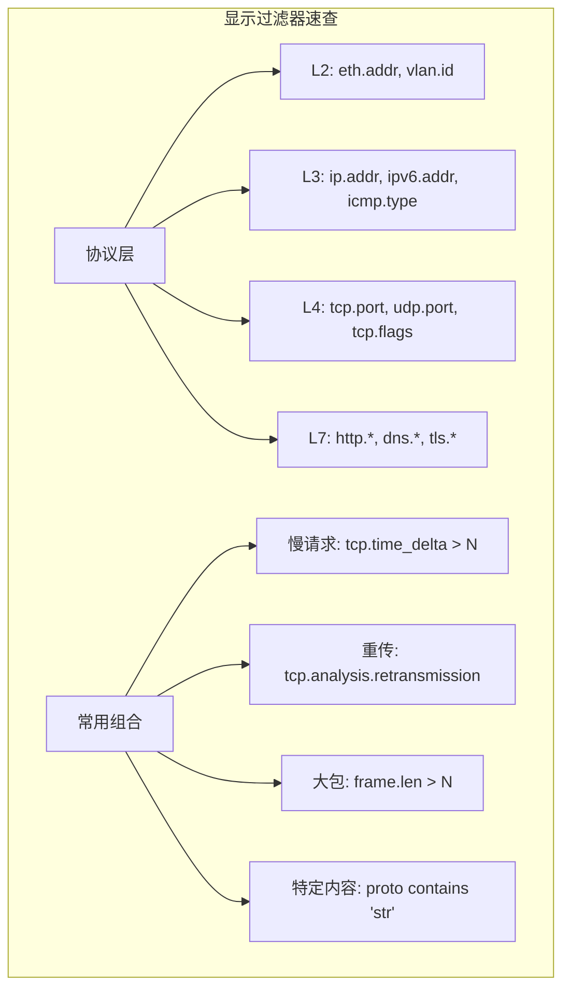

---

## 第四篇：协议解码——看懂每一个字节

### 4.1 网络协议分层模型

要理解 Wireshark 的解码结果，必须先理解协议分层。Wireshark 的数据包详情面板就是按照协议栈从底到顶展示的。

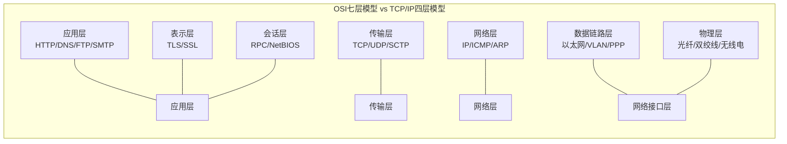

在 Wireshark 中，一个 HTTP 数据包的详情展开后如下：

```
Frame 6: 412 bytes on wire                 ← 物理帧信息
Ethernet II: Src=aa:bb:cc:dd:ee:ff         ← 数据链路层
Internet Protocol v4: Src=192.168.1.100    ← 网络层
Transmission Control Protocol: Src Port=54321, Dst Port=80  ← 传输层
Hypertext Transfer Protocol: GET / HTTP/1.1 ← 应用层
```

### 4.2 以太网帧（Ethernet II）详解

以太网帧是 Wireshark 抓到的最底层（不考虑物理层），结构非常简单：

```
 0                   1                   2                   3
 0 1 2 3 4 5 6 7 8 9 0 1 2 3 4 5 6 7 8 9 0 1 2 3 4 5 6 7 8 9 0 1
+-+-+-+-+-+-+-+-+-+-+-+-+-+-+-+-+-+-+-+-+-+-+-+-+-+-+-+-+-+-+-+-+
|                     目标MAC地址（6字节）                        |
+-+-+-+-+-+-+-+-+-+-+-+-+-+-+-+-+-+-+-+-+-+-+-+-+-+-+-+-+-+-+-+-+
|                     源MAC地址（6字节）                          |
+-+-+-+-+-+-+-+-+-+-+-+-+-+-+-+-+-+-+-+-+-+-+-+-+-+-+-+-+-+-+-+-+
|           类型（2字节）        |          数据（46-1500字节）    |
+-+-+-+-+-+-+-+-+-+-+-+-+-+-+-+-+-+-+-+-+-+-+-+-+-+-+-+-+-+-+-+-+
|                      FCS（4字节）                              |
+-+-+-+-+-+-+-+-+-+-+-+-+-+-+-+-+-+-+-+-+-+-+-+-+-+-+-+-+-+-+-+-+
```

**关键字段：**

| 字段 | 长度 | 说明 | 常见值 |
|------|------|------|--------|
| 目标MAC | 6字节 | 接收方MAC地址 | ff:ff:ff:ff:ff:ff（广播） |
| 源MAC | 6字节 | 发送方MAC地址 | — |
| 类型 | 2字节 | 上层协议类型 | 0x0800(IPv4), 0x0806(ARP), 0x86DD(IPv6) |
| FCS | 4字节 | 帧校验序列 | Wireshark通常不显示 |

> **Wireshark过滤技巧：** `eth.addr == ff:ff:ff:ff:ff:ff` 查看所有广播帧；`eth.type == 0x0806` 只看ARP帧。

### 4.3 IP 协议详解

IPv4 头部是网络层最核心的结构：

```
 0                   1                   2                   3
 0 1 2 3 4 5 6 7 8 9 0 1 2 3 4 5 6 7 8 9 0 1 2 3 4 5 6 7 8 9 0 1
+-+-+-+-+-+-+-+-+-+-+-+-+-+-+-+-+-+-+-+-+-+-+-+-+-+-+-+-+-+-+-+-+
|Version|  IHL  |Type of Service|          Total Length         |
+-+-+-+-+-+-+-+-+-+-+-+-+-+-+-+-+-+-+-+-+-+-+-+-+-+-+-+-+-+-+-+-+
|         Identification        |Flags|    Fragment Offset      |
+-+-+-+-+-+-+-+-+-+-+-+-+-+-+-+-+-+-+-+-+-+-+-+-+-+-+-+-+-+-+-+-+
|  Time to Live |    Protocol   |       Header Checksum         |
+-+-+-+-+-+-+-+-+-+-+-+-+-+-+-+-+-+-+-+-+-+-+-+-+-+-+-+-+-+-+-+-+
|                       Source Address                          |
+-+-+-+-+-+-+-+-+-+-+-+-+-+-+-+-+-+-+-+-+-+-+-+-+-+-+-+-+-+-+-+-+
|                    Destination Address                        |
+-+-+-+-+-+-+-+-+-+-+-+-+-+-+-+-+-+-+-+-+-+-+-+-+-+-+-+-+-+-+-+-+
```

**关键字段与过滤：**

| 字段 | 说明 | 过滤表达式 | 典型用途 |
|------|------|------------|----------|
| Version | IP版本(4/6) | `ip.version == 4` | 区分IPv4/IPv6 |
| TTL | 生存时间 | `ip.ttl < 10` | 检测路由环路 |
| Protocol | 上层协议 | `ip.proto == 6` | 6=TCP, 17=UDP, 1=ICMP |
| Identification | 分片标识 | `ip.id == 0x1234` | 跟踪分片重组 |
| Flags | 分片标志 | `ip.flags.mf == 1` | 检测分片 |
| Fragment Offset | 分片偏移 | `ip.frag_offset > 0` | 分析分片问题 |

**TTL 的实战价值：** 不同操作系统的默认 TTL 值不同（Linux 64，Windows 128，某些网络设备 255），通过 TTL 可以初步判断对端操作系统类型。

```bash
# 发现TTL异常小的包（可能经过了很多跳，或者被篡改）
ip.ttl < 10

# 发现TTL为128的包（大概率是Windows）
ip.ttl == 128
```

### 4.4 TCP 协议深度解析

TCP 是 Wireshark 分析中最常打交道的协议，也是最容易出问题的地方。

**TCP 头部结构：**

```
 0                   1                   2                   3
 0 1 2 3 4 5 6 7 8 9 0 1 2 3 4 5 6 7 8 9 0 1 2 3 4 5 6 7 8 9 0 1
+-+-+-+-+-+-+-+-+-+-+-+-+-+-+-+-+-+-+-+-+-+-+-+-+-+-+-+-+-+-+-+-+
|          Source Port          |       Destination Port        |
+-+-+-+-+-+-+-+-+-+-+-+-+-+-+-+-+-+-+-+-+-+-+-+-+-+-+-+-+-+-+-+-+
|                        Sequence Number                        |
+-+-+-+-+-+-+-+-+-+-+-+-+-+-+-+-+-+-+-+-+-+-+-+-+-+-+-+-+-+-+-+-+
|                    Acknowledgment Number                      |
+-+-+-+-+-+-+-+-+-+-+-+-+-+-+-+-+-+-+-+-+-+-+-+-+-+-+-+-+-+-+-+-+
|Offset|  Res  | Flags |     Window Size                       |
+-+-+-+-+-+-+-+-+-+-+-+-+-+-+-+-+-+-+-+-+-+-+-+-+-+-+-+-+-+-+-+-+
|         Checksum              |     Urgent Pointer            |
+-+-+-+-+-+-+-+-+-+-+-+-+-+-+-+-+-+-+-+-+-+-+-+-+-+-+-+-+-+-+-+-+
|                    Options (variable length)                  |
+-+-+-+-+-+-+-+-+-+-+-+-+-+-+-+-+-+-+-+-+-+-+-+-+-+-+-+-+-+-+-+-+
```

**TCP Flags 详解——理解连接状态的关键：**

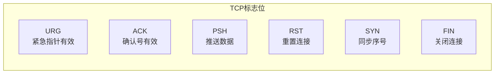

| Flag | 值 | 含义 | 过滤 |
|------|-----|------|------|
| SYN | 0x002 | 建立连接 | `tcp.flags.syn == 1` |
| ACK | 0x010 | 确认收到 | `tcp.flags.ack == 1` |
| FIN | 0x001 | 关闭连接 | `tcp.flags.fin == 1` |
| RST | 0x004 | 异常断开 | `tcp.flags.reset == 1` |
| PSH | 0x008 | 立即推送 | `tcp.flags.push == 1` |
| URG | 0x020 | 紧急数据 | `tcp.flags.urg == 1` |

**TCP 三次握手与四次挥手：**

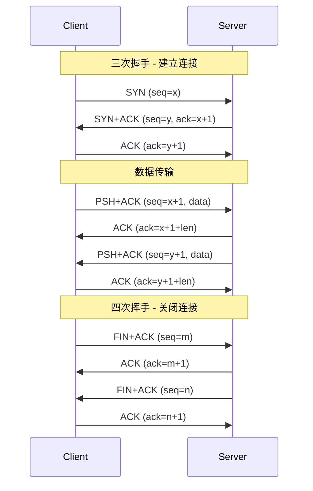

**TCP 连接在 Wireshark 中的识别：**

```bash
# 只看连接建立（SYN包，不含ACK）
tcp.flags.syn == 1 && tcp.flags.ack == 0

# 只看连接关闭
tcp.flags.fin == 1

# 只看连接异常断开
tcp.flags.reset == 1

# 查看特定TCP流
tcp.stream == 5
```

**TCP 选项（Options）——性能调优的关键：**

| 选项 | 说明 | 实战意义 |
|------|------|----------|
| MSS | 最大段大小 | 决定TCP单次最大传输数据量 |
| Window Scale | 窗口缩放因子 | 允许窗口超过65535字节 |
| SACK Permitted | 选择性确认 | 丢失重传效率大幅提升 |
| Timestamps | 时间戳 | RTT测量、PAWS防回绕 |

```bash
# 查看MSS协商
tcp.options.mss_val > 0

# 查看是否支持SACK
tcp.options.sack_perm == 1

# 查看窗口缩放因子
tcp.options.wscale_shift > 0
```

### 4.5 UDP 协议

UDP 比 TCP 简单得多，头部只有 8 字节：

```
 0                   1                   2                   3
 0 1 2 3 4 5 6 7 8 9 0 1 2 3 4 5 6 7 8 9 0 1 2 3 4 5 6 7 8 9 0 1
+-+-+-+-+-+-+-+-+-+-+-+-+-+-+-+-+-+-+-+-+-+-+-+-+-+-+-+-+-+-+-+-+
|          Source Port          |       Destination Port        |
+-+-+-+-+-+-+-+-+-+-+-+-+-+-+-+-+-+-+-+-+-+-+-+-+-+-+-+-+-+-+-+-+
|            Length             |          Checksum             |
+-+-+-+-+-+-+-+-+-+-+-+-+-+-+-+-+-+-+-+-+-+-+-+-+-+-+-+-+-+-+-+-+
```

**基于 UDP 的常见协议：**

| 协议 | 端口 | 用途 |
|------|------|------|
| DNS | 53 | 域名解析 |
| DHCP | 67/68 | IP地址分配 |
| NTP | 123 | 时间同步 |
| SNMP | 161/162 | 网络管理 |
| QUIC | 443 | HTTP/3底层协议 |
| STUN | 3478 | NAT穿透 |

### 4.6 DNS 协议解析

DNS 是互联网的"电话簿"，也是排障中最常检查的协议之一。

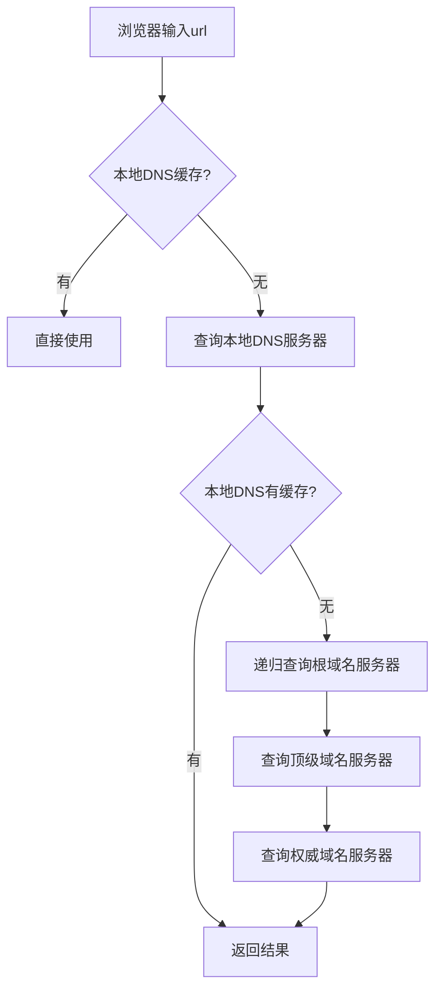

**DNS 报文结构关键字段：**

```bash
# DNS查询类型
dns.qry.type == 1     # A记录（IPv4地址）
dns.qry.type == 28    # AAAA记录（IPv6地址）
dns.qry.type == 5     # CNAME记录（别名）
dns.qry.type == 15    # MX记录（邮件交换）
dns.qry.type == 16    # TXT记录

# DNS响应码
dns.flags.rcode == 0  # No Error（成功）
dns.flags.rcode == 3  # NXDomain（域名不存在）
dns.flags.rcode == 2  # Server Failure（服务器失败）

# 查看特定域名的完整解析过程
dns.qry.name contains "example.com"
```

### 4.7 HTTP 协议解析

虽然 HTTPS 已经是主流，但理解明文 HTTP 对于学习协议分析和排查 HTTPS 握手前的问题仍然重要。

**HTTP 请求：**

```bash
# 按方法过滤
http.request.method == "GET"
http.request.method == "POST"
http.request.method == "PUT"

# 按URL过滤
http.request.uri contains "/api/login"
http.request.full_uri contains "example.com"

# 按响应码过滤
http.response.code == 200
http.response.code == 301
http.response.code == 404
http.response.code == 500

# 按Content-Type过滤
http.content_type contains "json"
http.content_type contains "html"

# 按请求头过滤
http.user_agent contains "Chrome"
http.authorization contains "Bearer"
```

**Follow HTTP Stream：** 右键一个 HTTP 包 → Follow → HTTP Stream，可以看到完整的请求-响应对话，非常适合调试 REST API。

---

## 第五篇：TLS/HTTPS 分析——加密不等于无法分析

### 5.1 TLS 握手过程

现代 Web 流量几乎全是 TLS 加密的，虽然看不到明文内容，但握手过程是可见的，其中蕴含了大量信息。

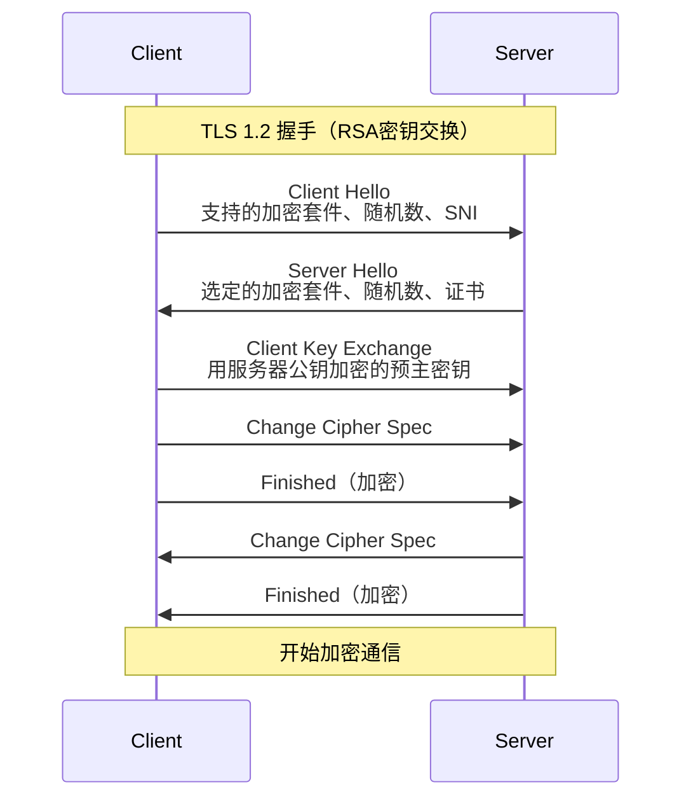

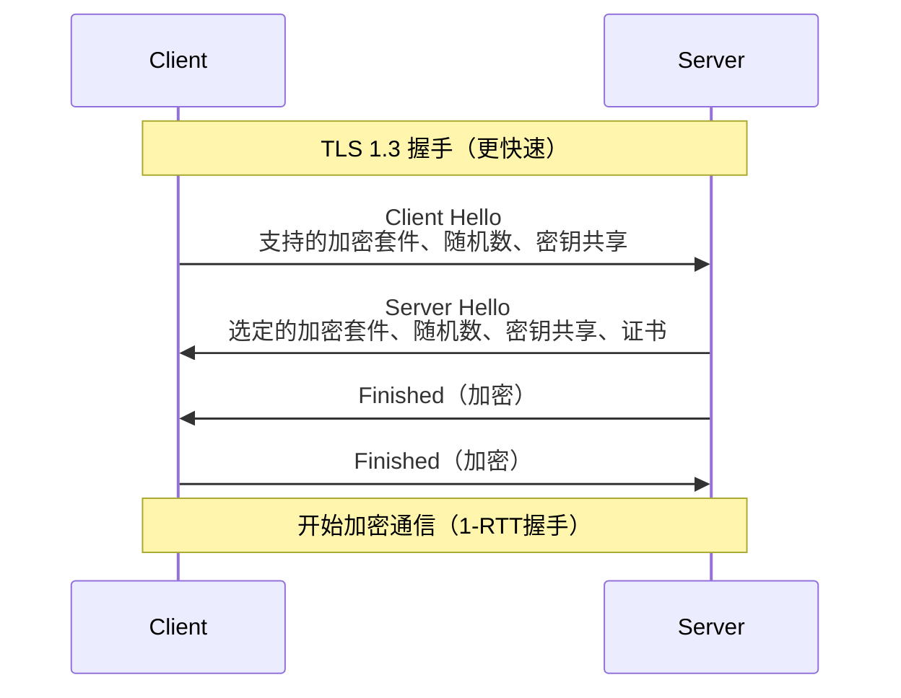

### 5.2 从 TLS 握手中能获取什么？

虽然加密后看不到明文，但握手阶段仍然暴露大量信息：

**SNI（Server Name Indication）：** Client Hello 中以明文发送目标域名，这是 HTTPS 流量中最重要的明文信息。

```bash
# 查看TLS握手的目标域名
tls.handshake.extensions_server_name contains "example.com"

# 查看所有访问的域名（SNI）
tls.handshake.type == 1
```

**JA3/JA3S 指纹：** 通过 Client Hello 中的加密套件、扩展等信息，可以生成客户端指纹，用于识别客户端类型（浏览器、curl、恶意软件）。

```bash
# 查看TLS版本
tls.record.version == 0x0303  # TLS 1.2
tls.record.version == 0x0304  # TLS 1.3

# 查看加密套件
tls.handshake.ciphersuite
```

**证书信息：** 服务器证书是明文传输的（TLS 1.2），包含域名、颁发者、有效期等信息。

### 5.3 解密 HTTPS 流量

有时候我们需要看到 HTTPS 的明文内容，有三种方法：

**方法一：浏览器导出密钥（最常用）**

```bash
# 1. 设置环境变量，让浏览器导出TLS密钥
export SSLKEYLOGFILE=/tmp/sslkeys.log

# 2. 从命令行启动浏览器
# macOS
/Applications/Google\ Chrome.app/Contents/MacOS/Google\ Chrome
# Linux
google-chrome
# Windows
chrome.exe

# 3. 在Wireshark中导入密钥
# Preferences → Protocols → TLS → (Pre)-Master-Secret log filename
# 选择 /tmp/sslkeys.log
```

导入后，Wireshark 就能解密对应的 HTTPS 流量，HTTP 明文一览无余。

**方法二：使用 mitmproxy 做中间人代理**

```bash
# 安装
pip install mitmproxy

# 启动代理
mitmproxy -p 8080

# 配置浏览器或系统代理为 127.0.0.1:8080
# 安装mitmproxy的CA证书后，HTTPS流量即可被解密
```

**方法三：服务端配置密钥日志**

如果是你自己的服务，可以在服务端配置导出 TLS 密钥，然后用 Wireshark 解密。

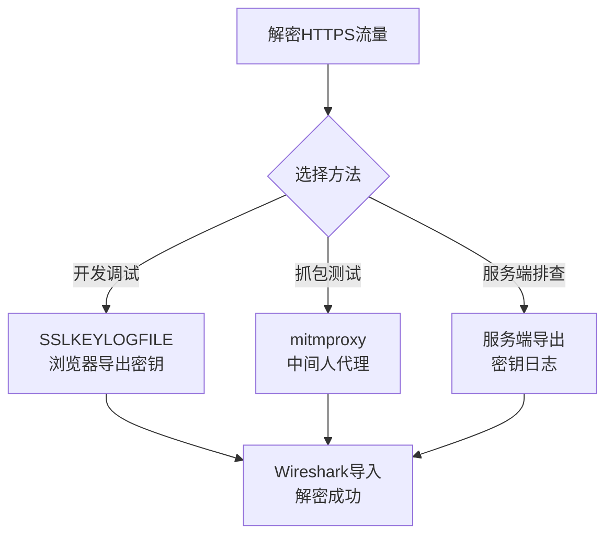

---

## 第六篇：TCP 问题深度分析

### 6.1 Wireshark 的 TCP 分析专家

Wireshark 内置了 TCP 分析功能，会自动标记各种异常情况。这些标记在数据包列表中以不同颜色显示，在详情中展开 TCP 层可以看到 `[Expert Info]` 。

**Wireshark 自动检测的 TCP 问题：**

| 标记 | 含义 | 颜色 | 过滤表达式 |
|------|------|------|------------|
| Retransmission | 重传 | 深红 | `tcp.analysis.retransmission` |
| Duplicate ACK | 重复确认 | 深蓝 | `tcp.analysis.duplicate_ack` |
| Out-of-Order | 乱序 | 橙色 | `tcp.analysis.out_of_order` |
| Fast Retransmission | 快速重传 | 深红 | `tcp.analysis.fast_retransmission` |
| Zero Window | 零窗口 | 蓝色 | `tcp.analysis.zero_window` |
| Window Update | 窗口更新 | 蓝色 | `tcp.analysis.window_update` |
| Keep-Alive | 保活 | 绿色 | `tcp.analysis.keep_alive` |
| ACKed unseen segment | 确认了未见到的段 | 黄色 | `tcp.analysis.ack_lost_segment` |

### 6.2 重传问题分析

重传是网络问题最常见的表现。Wireshark 判定重传的规则是：收到了与之前相同序号的 TCP 段。

**重传分析步骤：**

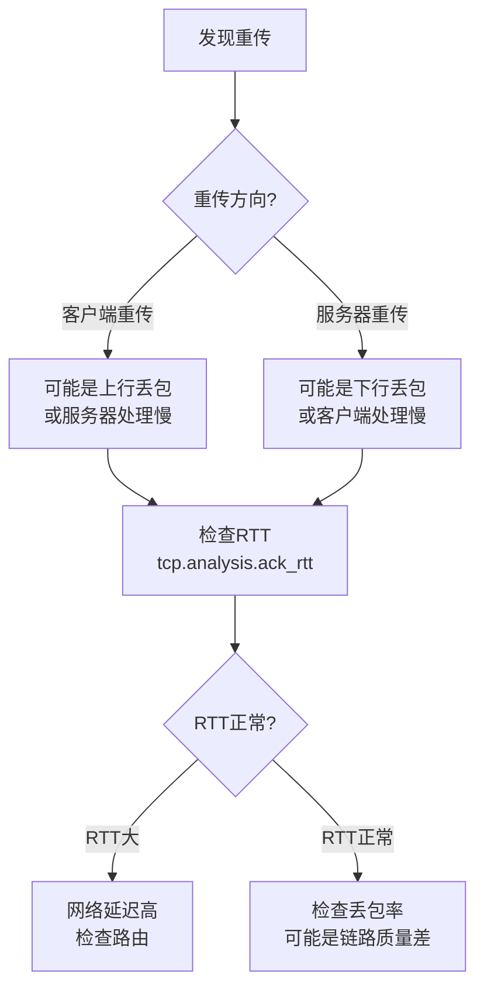

**实战：分析重传根因**

```bash
# 1. 统计重传数量
tcp.analysis.retransmission

# 2. 查看特定连接的重传
tcp.analysis.retransmission && tcp.stream == 3

# 3. 查看RTT（往返时延）
tcp.analysis.ack_rtt > 0.1   # RTT超过100ms

# 4. 查看是否有零窗口（可能导致重传假象）
tcp.analysis.zero_window

# 5. 综合分析：重传+零窗口
tcp.analysis.retransmission || tcp.analysis.zero_window
```

### 6.3 零窗口问题分析

TCP 窗口用于流量控制。当接收方处理不过来时，会通告零窗口（Window=0），告诉发送方暂停发送。

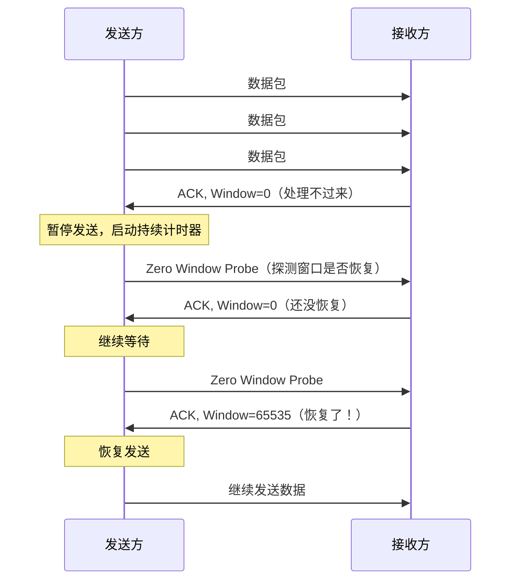

```bash
# 查看零窗口事件
tcp.analysis.zero_window

# 查看窗口更新（窗口从零恢复）
tcp.analysis.window_update && tcp.window_size > 0

# 结合分析：零窗口导致的重传
tcp.analysis.zero_window || tcp.analysis.retransmission
```

### 6.4 TCP 流追踪

右键一个 TCP 包 → Follow → TCP Stream，可以查看完整的 TCP 对话内容。这是排查通信问题时最常用的功能之一。

**流追踪显示模式：**

| 模式 | 说明 | 使用场景 |
|------|------|----------|
| ASCII | 显示可打印字符 | HTTP等文本协议 |
| C Arrays | C语言数组格式 | 编程引用 |
| UTF-8 | UTF-8编码显示 | 含中文内容 |
| YAML | YAML格式 | 结构化查看 |
| Raw | 原始数据 | 二进制协议分析 |
| Hex Dump | 十六进制转储 | 底层分析 |

---

## 第七篇：高级分析技巧

### 7.1 统计工具

Wireshark 内置了丰富的统计工具，在 `Statistics` 菜单下。

**Capture File Properties：** 查看抓包文件的整体信息，包括时间范围、包数量、平均速率等。

**Protocol Hierarchy：** 查看各协议的流量占比，快速了解流量构成。

```
Protocol Hierarchy Statistics:
  eth              100.00%
    ipv4            95.32%
      tcp           88.76%
        http        42.15%
        tls         35.67%
        ssh          8.32%
      udp            6.56%
        dns          3.21%
        quic         2.89%
    arp             4.68%
```

**Conversations：** 查看所有通信端点之间的对话，包括包数、字节数、持续时间等。支持按 Ethernet、IPv4、IPv6、TCP、UDP 分类。

**Endpoints：** 查看所有通信端点的统计信息。

**IO Graphs：** 以时间轴图表显示流量变化，是分析流量模式的神器。

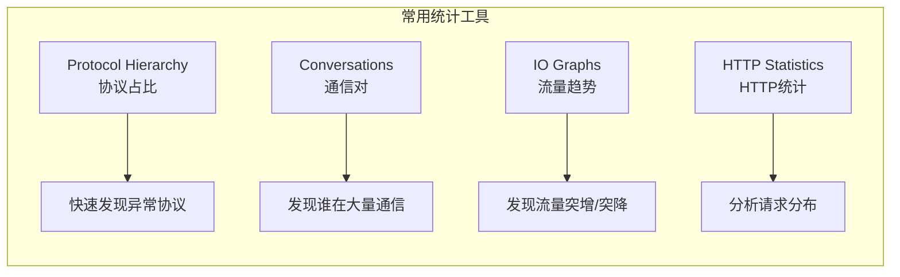

**IO Graphs 高级用法：**

IO Graphs 支持自定义过滤表达式，可以同时绘制多条曲线进行对比。

| 配置项 | 示例 | 说明 |
|--------|------|------|
| Filter | `ip.addr==10.0.0.1` | 只看特定IP的流量 |
| Style | Line/Impulse/FBar | 图表样式 |
| Y Axis | Packets/Bytes/Bits | 纵轴单位 |
| Interval | 1 sec / 1 min | 时间粒度 |
| SMA | 5 / 10 / 20 | 移动平均平滑 |

### 7.2 着色规则

Wireshark 默认的着色规则能帮你快速识别包类型，但你也可以自定义。

**默认着色规则（部分）：**

| 颜色 | 含义 |
|------|------|
| 浅紫 | TCP |
| 浅蓝 | UDP |
| 黑色背景 | 含错误的包 |
| 红色背景 |RST包 |
| 灰色 | ACK包 |
| 绿色 | HTTP包 |
| 深蓝 | DNS包 |

**自定义着色规则：** View → Coloring Rules，可以添加自定义规则。例如：

```
# 高亮所有POST请求
http.request.method == "POST"

# 高亮大包（可能是文件传输）
frame.len > 1400

# 高亮TLS 1.3握手
tls.record.version == 0x0304 && tls.handshake.type == 1
```

### 7.3 时间显示格式

Wireshark 支持多种时间显示格式，在 View → Time Display Format 中切换。

| 格式 | 说明 | 使用场景 |
|------|------|----------|
| Absolute | 绝对时间（年月日时分秒） | 确定事件发生时间 |
| Relative | 相对于第一个包的时间 | 查看整体时间线 |
| Delta | 与上一个包的时间差 | 分析响应延迟 |
| Delta Displayed | 与上一个显示包的时间差 | 过滤后分析延迟 |

```bash
# 对应的过滤表达式
frame.time_delta > 1           # 与上一帧间隔>1秒
frame.time_delta_displayed > 1 # 与上一显示帧间隔>1秒
tcp.time_delta > 0.5           # TCP流内间隔>0.5秒
```

> **实战技巧：** 排查延迟问题时，把时间格式切换为 Delta，配合过滤 `tcp.time_delta > 0.1`，可以快速定位慢响应。

### 7.4 数据重组与 Follow Stream

TCP 将数据分割成多个段发送，Wireshark 可以将它们重组为完整的上层数据。

**Follow Stream 的变体：**

| 类型 | 说明 | 使用场景 |
|------|------|----------|
| TCP Stream | 重组TCP流 | HTTP、自定义TCP协议 |
| UDP Stream | UDP数据流 | DNS、QUIC等 |
| TLS Stream | 解密后的TLS流 | HTTPS明文（需密钥） |
| HTTP Stream | HTTP请求响应对 | REST API调试 |
| HTTP/2 Stream | HTTP/2流 | 多路复用分析 |

### 7.5 导出对象

Wireshark 可以从抓包文件中提取各种对象：

- **File → Export Objects → HTTP：** 提取HTTP响应中的文件（图片、JS、CSS、下载文件等）
- **File → Export Objects → SMB：** 提取SMB传输的文件
- **File → Export Objects → FTP-DATA：** 提取FTP传输的文件

这在安全分析中非常有用——从流量中还原传输的文件。

### 7.6 流量解码指定

有时候 Wireshark 会误判协议（比如非标准端口的HTTP流量被识别为TCP），你可以手动指定解码方式。

右键一个包 → Decode As → 选择正确的协议。

**常见场景：**
- 自定义端口的HTTP（如8080端口被识别为HTTP-proxy）
- 非标准端口的SSL/TLS
- 自定义RPC协议被误识别

---

## 第八篇：实战场景——用 Wireshark 解决真实问题

### 8.1 场景一：线上接口偶发超时

**现象：** 生产环境某接口偶发超时，日志显示耗时 3-5 秒，但大部分请求正常。

**分析步骤：**

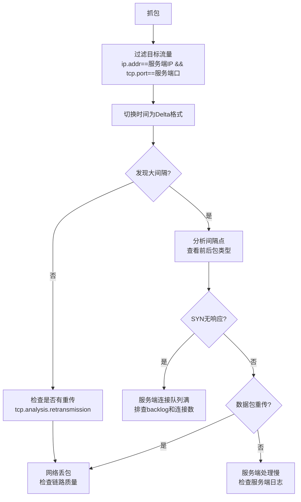

**关键过滤表达式：**

```bash
# 找出所有超过200ms的间隔
tcp.time_delta > 0.2 && ip.addr == 10.0.0.5

# 找出重传
tcp.analysis.retransmission && ip.addr == 10.0.0.5

# 找出零窗口
tcp.analysis.zero_window

# 找出连接重置
tcp.flags.reset == 1 && ip.addr == 10.0.0.5
```

### 8.2 场景二：DNS 劫持检测

**现象：** 访问某网站被跳转到广告页面，怀疑 DNS 被劫持。

**分析步骤：**

```bash
# 1. 抓取DNS流量
dns

# 2. 查看特定域名的解析结果
dns.qry.name == "target-site.com"

# 3. 对比解析结果
# 正常：解析到预期IP（如 93.184.216.34）
# 劫持：解析到异常IP（如 10.10.10.10 或广告IP）

# 4. 检查DNS响应来源
# 正常：来自配置的DNS服务器
# 劫持：可能来自异常IP，或者DNS响应先于正常响应到达

# 5. 检查是否存在多个DNS响应
dns.flags.rcode == 0 && dns.qry.name == "target-site.com"
```

**DNS劫持的特征：**

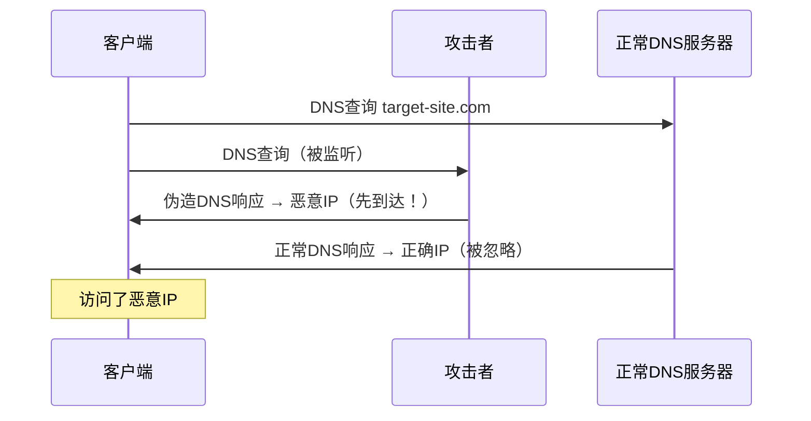

### 8.3 场景三：HTTPS 握手失败排查

**现象：** 客户端连接服务器时 TLS 握手失败，浏览器提示"连接不安全"。

**分析步骤：**

```bash
# 1. 过滤TLS握手
tls.handshake.type > 0

# 2. 查看Client Hello
tls.handshake.type == 1
# 检查：SNI是否正确、支持的加密套件列表

# 3. 查看Server Hello
tls.handshake.type == 2
# 检查：是否返回了Server Hello？

# 4. 查看TLS告警（失败原因）
tls.alert
# 检查：告警类型
#   - handshake_failure (40): 加密套件不匹配
#   - certificate_unknown (46): 证书不可信
#   - bad_certificate (42): 证书格式错误
#   - decrypt_error (51): 密钥交换失败

# 5. 常见原因
# - 客户端和服务器没有共同支持的加密套件
# - 证书过期或不被信任
# - TLS版本不兼容
# - SNI缺失导致服务器返回默认证书
```

**TLS告警级别与类型：**

| 告警 | 值 | 含义 |
|------|-----|------|
| close_notify | 0 | 正常关闭 |
| unexpected_message | 10 | 意外消息 |
| handshake_failure | 40 | 握手失败 |
| bad_certificate | 42 | 证书错误 |
| certificate_expired | 45 | 证书过期 |
| certificate_unknown | 46 | 证书未知 |
| decrypt_error | 51 | 解密错误 |
| protocol_version | 70 | 版本不支持 |

### 8.4 场景四：网络环路检测

**现象：** 网络严重卡顿，交换机指示灯狂闪。

**分析步骤：**

```bash
# 1. 查看ARP风暴
arp
# 如果同一秒内出现大量ARP请求，可能是ARP风暴

# 2. 查看重复的包
# 如果看到完全相同的数据包反复出现，可能是环路

# 3. 检查TTL递减
ip.ttl < 5
# 环路中包的TTL会逐渐递减到0

# 4. 检查广播风暴
eth.addr == ff:ff:ff:ff:ff:ff
# 异常大量的广播帧
```

### 8.5 场景五：WebSocket 调试

**现象：** WebSocket 连接建立后偶尔断开，需要分析断开原因。

**分析步骤：**

```bash
# 1. 过滤WebSocket流量
websocket

# 2. 追踪WebSocket升级过程
http.request.method == "GET" && http.upgrade contains "websocket"

# 3. 查看WebSocket关闭帧
websocket.opcode == 0x8  # Close帧

# 4. 查看WebSocket Ping/Pong
websocket.opcode == 0x9  # Ping
websocket.opcode == 0xA  # Pong

# 5. 追踪完整流
# Follow → TCP Stream 或 WebSocket Stream
```

---

## 第九篇：协议逆向——破解未知协议

### 9.1 什么是协议逆向？

当你遇到一个使用私有/未公开协议的设备或软件（如 IoT 设备、游戏服务器、工业控制系统），需要理解其通信内容时，就需要进行协议逆向。

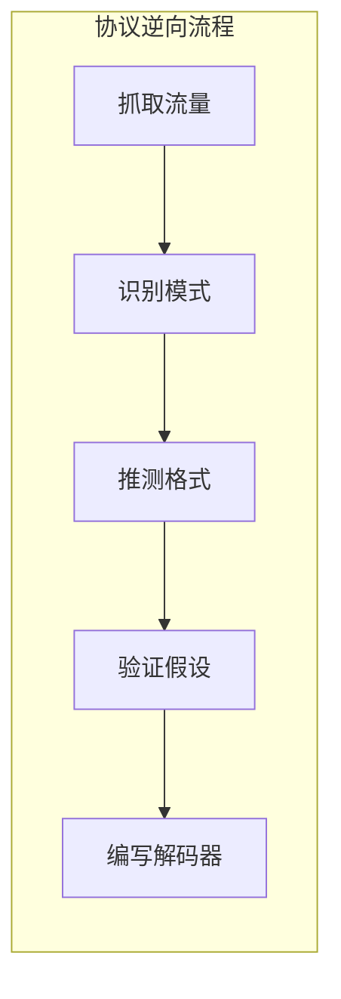

### 9.2 逆向步骤详解

**第一步：大量抓包，触发各种操作**

对目标设备执行所有可能的操作，每种操作多次重复，抓取足够多的样本。

**第二步：对比分析，找出固定与变化**

```bash
# 标记不同的包
# 方法：在包列表中右键 → Set/Unset Time Reference

# 导出包的字节数据进行对比
# File → Export Packet Dissections → As JSON
```

**第三步：从已知的协议字段入手**

即使未知协议，某些字段也可以推测：
- 包头通常包含长度字段
- 命令类型字段通常在前几个字节
- 状态码通常用一个或两个字节
- 字符串通常有长度前缀

**第四步：使用 Wireshark 的字节高亮**

在数据包详情中选中某个字段时，底部的字节视图会高亮对应的字节，这是理解协议格式的最佳方式。

**第五步：编写自定义协议解码器**

Wireshark 支持用 Lua 编写自定义协议解码器（Dissector），可以将你逆向出的协议格式固化下来。

### 9.3 Lua 自定义解码器示例

下面是一个简单的自定义协议解码器，假设我们逆向出了一个名为 "MYPROTO" 的协议：

```lua
-- myproto.lua
-- 自定义协议解码器示例

-- 创建协议对象
local myproto = Proto("myproto", "My Custom Protocol")

-- 定义字段
local f_magic    = ProtoField.string("myproto.magic", "Magic", base.ASCII)
local f_version  = ProtoField.uint8("myproto.version", "Version", base.DEC)
local f_msgtype  = ProtoField.uint8("myproto.msgtype", "Message Type", base.HEX,
    {[0x01]="Login", [0x02]="Logout", [0x03]="Data", [0x04]="Ack"})
local f_length   = ProtoField.uint16("myproto.length", "Length", base.DEC)
local f_payload  = ProtoField.bytes("myproto.payload", "Payload")

myproto.fields = { f_magic, f_version, f_msgtype, f_length, f_payload }

-- 解码函数
function myproto.dissector(buffer, pinfo, tree)
    local buf_len = buffer:len()
    if buf_len < 6 then return end  -- 最小包长度

    local subtree = tree:add(myproto, buffer(), "My Custom Protocol Data")

    -- 解析各字段
    local offset = 0

    -- Magic: 2字节
    subtree:add(f_magic, buffer(offset, 2))
    offset = offset + 2

    -- Version: 1字节
    subtree:add(f_version, buffer(offset, 1))
    offset = offset + 1

    -- Message Type: 1字节
    subtree:add(f_msgtype, buffer(offset, 1))
    offset = offset + 1

    -- Length: 2字节
    local length = buffer(offset, 2):uint()
    subtree:add(f_length, buffer(offset, 2))
    offset = offset + 2

    -- Payload: 剩余字节
    if offset < buf_len then
        subtree:add(f_payload, buffer(offset, buf_len - offset))
    end

    -- 设置Info列显示
    local msgtype = buffer(3, 1):uint()
    local msgtype_names = {[1]="Login",[2]="Logout",[3]="Data",[4]="Ack"}
    pinfo.cols.protocol = "MYPROTO"
    pinfo.cols.info = msgtype_names[msgtype] or "Unknown"
end

-- 注册解码器到TCP端口9999
local tcp_table = DissectorTable.get("tcp.port")
tcp_table:add(9999, myproto)
```

**使用方式：** 将 Lua 文件放入 Wireshark 的插件目录，或在 `init.lua` 中加载。

- macOS: `~/.local/lib/wireshark/plugins/`
- Linux: `~/.local/lib/wireshark/plugins/`
- Windows: `%APPDATA%\Wireshark\plugins\`

---

## 第十篇：tshark——命令行中的 Wireshark

### 10.1 为什么需要 tshark？

不是所有场景都有 GUI。远程服务器排障、自动化脚本、CI/CD 集成，都需要命令行工具。tshark 就是 Wireshark 的命令行版本，功能几乎与 GUI 版本一样强大。

### 10.2 tshark 常用命令

**基本抓包：**

```bash
# 抓取所有流量
tshark

# 抓取特定接口的流量
tshark -i eth0

# 抓取并保存到文件
tshark -i eth0 -w capture.pcapng

# 使用捕获过滤器
tshark -i eth0 -f "tcp port 80" -w http.pcapng

# 限制抓包数量
tshark -i eth0 -c 1000  # 只抓1000个包

# 限时抓包
tshark -i eth0 -a duration:60  # 抓60秒
```

**读取与分析：**

```bash
# 读取pcap文件
tshark -r capture.pcapng

# 使用显示过滤器
tshark -r capture.pcapng -Y "http.request"

# 只显示特定字段
tshark -r capture.pcapng -Y "dns" -T fields -e dns.qry.name -e dns.a

# 输出为JSON
tshark -r capture.pcapng -T json

# 输出为PDML（详细XML）
tshark -r capture.pcapng -T pdml
```

**统计与分析：**

```bash
# 统计各协议包数
tshark -r capture.pcapng -q -z io,phs

# 统计HTTP请求
tshark -r capture.pcapng -Y "http.request" -T fields -e http.request.method -e http.host -e http.request.uri | sort | uniq -c | sort -rn

# 统计各IP的流量
tshark -r capture.pcapng -q -z conv,ip

# 统计端点
tshark -r capture.pcapng -q -z endpoints,ip

# HTTP请求响应时间
tshark -r capture.pcapng -Y "http.request or http.response" -T fields -e frame.time_relative -e http.request.method -e http.response.code -e http.time
```

### 10.3 tshark 实战脚本

**统计访问最多的域名：**

```bash
tshark -r capture.pcapng \
  -Y "tls.handshake.type == 1" \
  -T fields -e tls.handshake.extensions_server_name 2>/dev/null \
  | sort | uniq -c | sort -rn | head -20
```

**提取HTTP响应码分布：**

```bash
tshark -r capture.pcapng \
  -Y "http.response" \
  -T fields -e http.response.code \
  | sort | uniq -c | sort -rn
```

**监控实时TCP重传：**

```bash
tshark -i eth0 -Y "tcp.analysis.retransmission" \
  -T fields -e ip.src -e ip.dst -e tcp.srcport -e tcp.dstport
```

**提取DNS查询日志：**

```bash
tshark -i eth0 -Y "dns.qry.name" \
  -T fields -e frame.time -e ip.src -e dns.qry.name -e dns.a \
  2>/dev/null
```

### 10.4 tshark + SSLKEYLOGFILE 解密HTTPS

```bash
# 1. 设置密钥日志
export SSLKEYLOGFILE=/tmp/sslkeys.log

# 2. 用tshark解密并分析HTTPS
tshark -r encrypted.pcapng \
  -o "tls.keylog_file:/tmp/sslkeys.log" \
  -Y "http" \
  -T fields -e http.request.method -e http.host -e http.request.uri -e http.response.code
```

---

## 第十一篇：性能与最佳实践

### 11.1 大流量场景下的抓包策略

当网络流量很大时（如核心交换机镜像端口），直接用 Wireshark 抓包可能会丢包或卡顿。

**策略一：使用捕获过滤器预筛**

```bash
# 只抓特定网段的流量
tshark -i eth0 -f "net 10.0.0.0/24" -w filtered.pcapng

# 只抓特定端口的流量
tshark -i eth0 -f "tcp port 80 or tcp port 443" -w web.pcapng
```

**策略二：环形缓冲区（Ring Buffer）**

Wireshark 支持环形缓冲区模式，按文件大小或时间自动切换文件，防止单个文件过大。

设置方式：Capture → Options → 输出选项卡 → 勾选 "Create a new file automatically"。

**策略三：远程抓包**

在远程服务器上用 tcpdump 抓包，下载到本地用 Wireshark 分析。

```bash
# 远程服务器上抓包
ssh server "tcpdump -i eth0 -w - not port 22" > remote.pcap

# 或者直接用Wireshark的远程接口功能
# Capture → Options → Manage Interfaces → Remote Interfaces
```

### 11.2 抓包文件管理

| 实践 | 说明 |
|------|------|
| 命名规范 | `日期_场景_描述.pcapng`，如 `20260418_prod_api_timeout.pcapng` |
| 文件切分 | 单个文件不超过 500MB |
| 添加注释 | pcapng 格式支持包注释，`Ctrl/Cmd + Alt/Cmd + D` |
| 及时归档 | 排查完毕的抓包文件及时归档或删除，避免磁盘占满 |

### 11.3 常见陷阱

| 陷阱 | 说明 | 解决方案 |
|------|------|----------|
| 混杂模式未开启 | 看不到其他设备的流量 | 检查混杂模式设置 |
| 交换机隔离 | 交换机不转发其他端口的帧 | 配置端口镜像（SPAN） |
| 网卡校验和卸载 | 网卡硬件计算校验和，抓到的包校验和错误 | 关闭校验和卸载或在Wireshark中关闭校验和验证 |
| 抓包丢包 | 磁盘写入速度跟不上 | 使用捕获过滤器、tshark写入文件 |
| 时间不准 | 系统时间偏差导致分析错误 | 先同步NTP，或使用相对时间 |
| 本地回环 | 默认不抓127.0.0.1的流量 | 用特殊接口抓取（lo0 / Loopback） |

**关闭校验和验证：** Preferences → Protocols → 取消对应协议的 "Validate the checksum if possible" 选项。

---

## 第十二篇：Wireshark 生态与进阶方向

### 12.1 Wireshark 生态工具

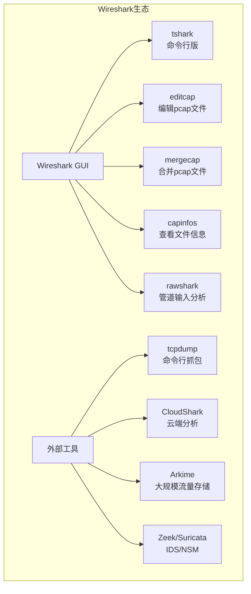

**辅助命令行工具：**

```bash
# editcap：编辑pcap文件
editcap -r input.pcap output.pcap 1-100  # 只保留1-100号包
editcap -c 1000 input.pcap output.pcap   # 每1000个包切一个文件
editcap -A "2026-04-18 10:00:00" -B "2026-04-18 11:00:00" input.pcap output.pcap  # 按时间截取

# mergecap：合并pcap文件
mergecap -w merged.pcap file1.pcap file2.pcap

# capinfos：查看文件信息
capinfos capture.pcapng

# reordercap：按时间排序
reordercap input.pcap output.pcap
```

### 12.2 进阶方向

**方向一：安全分析**

- 使用 Wireshark 分析恶意流量（C2通信、数据外泄、漏洞利用）
- 结合威胁情报（Suricata 规则、YARA 规则）
- 学习 JA3/JA4 指纹识别技术

**方向二：网络性能分析**

- 深入理解 TCP 拥塞控制（拥塞窗口、慢启动、拥塞避免）
- 分析 QUIC/HTTP3 协议
- QoS 和流量整形分析

**方向三：协议开发与测试**

- 使用 Lua 编写自定义解码器
- 自动化测试中的流量验证
- Fuzzing 与协议模糊测试

**方向四：自动化与编排**

- tshark + 脚本实现自动化分析
- 集成到 CI/CD 流水线
- 结合 ELK/Splunk 进行大规模流量分析

---

## 附录：速查手册

### A. 显示过滤器速查

```bash
# === 按协议 ===
eth / ip / ipv6 / tcp / udp / icmp / arp / dns / http / tls / quic / websocket

# === 按地址 ===
ip.addr == X.X.X.X          # 源或目的
ip.src == X.X.X.X           # 仅源
ip.dst == X.X.X.X           # 仅目的
eth.addr == XX:XX:XX:XX:XX:XX  # MAC地址

# === 按端口 ===
tcp.port == 80              # 源或目的
tcp.srcport == 8080         # 仅源
tcp.dstport == 443          # 仅目的
udp.port == 53              # UDP端口

# === TCP分析 ===
tcp.flags.syn == 1          # SYN
tcp.flags.reset == 1        # RST
tcp.flags.fin == 1          # FIN
tcp.analysis.retransmission # 重传
tcp.analysis.zero_window    # 零窗口
tcp.analysis.duplicate_ack  # 重复ACK
tcp.stream == N             # 特定TCP流

# === HTTP ===
http.request.method == "POST"
http.response.code == 200
http.host contains "example"
http.content_type contains "json"

# === DNS ===
dns.qry.name contains "baidu"
dns.flags.rcode == 3        # NXDOMAIN
dns.qry.type == 1           # A记录

# === TLS ===
tls.handshake.type == 1     # Client Hello
tls.handshake.extensions_server_name contains "google"
tls.alert                   # TLS告警

# === 帧属性 ===
frame.len > 1000            # 大包
frame.time_delta > 1        # 间隔大于1秒
frame.contains "password"   # 包含特定字符串
```

### B. 捕获过滤器速查

```bash
host X.X.X.X                # 特定主机
src host X.X.X.X            # 源主机
dst host X.X.X.X            # 目的主机
port 80                     # 特定端口
src port 8080               # 源端口
tcp / udp / icmp            # 协议
net 192.168.1.0/24          # 网段
ether host XX:XX:XX:XX:XX:XX # MAC地址
not port 22                 # 排除SSH
```

### C. 快捷键速查

| 快捷键 | 功能 |
|--------|------|
| `Ctrl/Cmd + E` | 开始/停止抓包 |
| `Ctrl/Cmd + F` | 在包列表中查找 |
| `Ctrl/Cmd + /` | 添加包注释 |
| `Ctrl/Cmd + G` | 跳转到指定包号 |
| `Ctrl/Cmd + M` | 标记/取消标记包 |
| `Ctrl/Cmd + .` | 设置时间参考点 |
| `Ctrl/Cmd + 1/2/3` | 切换主界面面板 |
| `Shift + Ctrl/Cmd + H` | 自动滚动到最新包 |
| `Alt/Cmd + →/←` | 下一个/上一个标记的包 |
| `Tab` | 切换焦点到过滤器栏 |

### D. 推荐资源

| 资源 | 说明 |
|------|------|
| Wireshark 官方文档 | https://www.wireshark.org/docs/ |
| Wireshark Wiki | https://wiki.wireshark.org/ |
| Display Filter Reference | 各协议的完整字段参考 |
| 《Wireshark网络分析就这么简单》 | 中文入门经典 |
| 《Practical Packet Analysis》 | 英文实战经典 |
| PacketLife.net | 网络协议速查表 |

---