# Jenkins入门：从零开始的持续集成之旅

---

## 写在前面

你是否经历过这样的噩梦——

> "我本地明明跑得好好的啊！"

每次上线都是一场惊心动魄的冒险：手动打包、手动上传、手动重启……任何一个环节出错，就是一次生产事故。

**Jenkins** 就是来拯救你的。它就像一个不知疲倦的助手，你只管提交代码，剩下的编译、测试、部署，它全帮你搞定。

今天这篇文章，我会带你从零开始，一步一步搭建属于自己的Jenkins流水线。不用担心，我会把每一步都讲清楚。

---

## 一、Jenkins是什么？

### 一句话解释

Jenkins是一个**开源的自动化服务器**，用来实现**持续集成（CI）**和**持续交付（CD）**。

### 生活化类比

想象你开了一家奶茶店：


没有Jenkins的时候，你就是那个店员，每一步都得手动来。而有了Jenkins，它就是你的**自动奶茶机**——下单后自动制作、自动质检、自动出杯。

### CI/CD到底在说什么？

这两个术语经常出现，我来拆解一下：

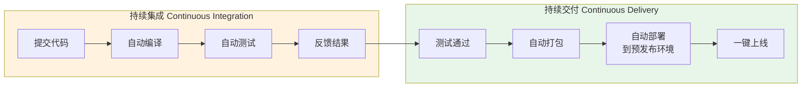

- **CI（持续集成）**：开发者频繁提交代码，自动编译+测试，尽早发现问题
- **CD（持续交付）**：测试通过的代码自动部署，随时可以发布上线

### Jenkins能做什么？

| 场景 | 没有Jenkins | 有Jenkins |
|------|------------|----------|
| 代码提交后 | 手动编译打包 | 自动触发构建 |
| 运行测试 | 手动执行测试脚本 | 自动运行并报告结果 |
| 部署上线 | SSH登录服务器操作 | 一键或自动部署 |
| 构建失败 | 可能很久才发现 | 即时通知（邮件/钉钉/飞书） |
| 多人协作 | "我本地可以啊" | 统一环境，问题无处遁形 |

---

## 二、安装Jenkins

Jenkins是Java写的，所以需要JDK环境。别慌，我一步步来。

### 环境准备

| 组件 | 要求 | 说明 |
|------|------|------|
| JDK | 11或17 | Jenkins 2.400+需要JDK 11+ |
| 内存 | 至少512MB | 推荐1GB+ |
| 磁盘 | 至少1GB | 推荐10GB+（插件和构建记录会占空间） |

### 方式一：Docker安装（推荐新手！）

最简单的方式，一条命令搞定：

```bash
# 拉取Jenkins镜像
docker pull jenkins/jenkins:lts

# 启动Jenkins容器
docker run -d \
  --name jenkins \
  -p 8080:8080 \
  -p 50000:50000 \
  -v jenkins_home:/var/jenkins_home \
  jenkins/jenkins:lts
```

参数解释：

```mermaid
graph TD
    A["docker run -d"] -->|后台运行| B["--name jenkins"]
    B -->|容器命名| C["-p 8080:8080"]
    C -->|端口映射: Web界面| D["-p 50000:50000"]
    D -->|端口映射: Agent通信| E["-v jenkins_home:/var/jenkins_home"]
    E -->|数据持久化| F["jenkins/jenkins:lts"]
    F -->|使用LTS稳定版镜像|
```

### 方式二：直接安装（Ubuntu/Debian）

```bash
# 第1步：安装JDK
sudo apt update
sudo apt install openjdk-17-jdk -y

# 第2步：添加Jenkins仓库
curl -fsSL https://pkg.jenkins.io/debian-stable/jenkins.io-2023.key | \
  sudo tee /usr/share/keyrings/jenkins-keyring.asc > /dev/null

echo deb [signed-by=/usr/share/keyrings/jenkins-keyring.asc] \
  https://pkg.jenkins.io/debian-stable binary/ | \
  sudo tee /etc/apt/sources.list.d/jenkins.list > /dev/null

# 第3步：安装Jenkins
sudo apt update
sudo apt install jenkins -y

# 第4步：启动Jenkins
sudo systemctl start jenkins
sudo systemctl enable jenkins  # 开机自启
```

### 方式三：macOS

```bash
# 用Homebrew安装
brew install jenkins-lts

# 启动服务
brew services start jenkins-lts
```

### 方式四：Windows

1. 下载安装包：访问 https://www.jenkins.io/download/
2. 双击安装，一路Next
3. 安装完成后自动启动服务

### 验证安装

```bash
# 检查Jenkins是否在运行
curl -s http://localhost:8080/cli/version

# 应该返回类似：
# Jenkins 2.426.3
```

浏览器访问 `http://localhost:8080`，看到Jenkins的解锁页面就说明成功了！

---

## 三、首次启动配置

### 3.1 解锁Jenkins

首次访问会看到这个页面：

```
=========================================
Jenkins Unlock
=========================================
```

它要求你输入管理员密码。密码在哪？看页面上写的路径：

```bash
# Docker安装的
docker exec jenkins cat /var/jenkins_home/secrets/initialAdminPassword

# 直接安装的（Ubuntu）
sudo cat /var/lib/jenkins/secrets/initialAdminPassword

# macOS
cat ~/.jenkins/secrets/initialAdminPassword
```

复制那串字符，粘贴到页面上，点继续。

### 3.2 安装插件

Jenkins会让你选择插件安装方式：

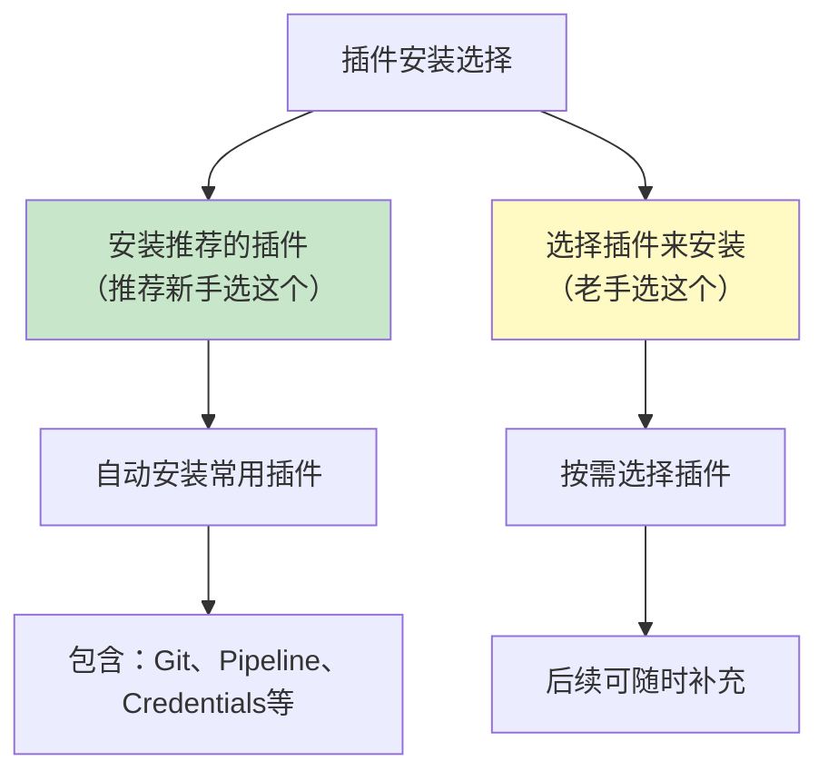

**强烈建议新手选"安装推荐的插件"**。它会自动安装以下核心插件：

| 插件 | 作用 |
|------|------|
| Git Plugin | 从Git仓库拉取代码 |
| Pipeline | 支持流水线即代码 |
| Credentials Binding | 安全管理密码和密钥 |
| Docker Pipeline | 支持Docker操作 |
| JUnit Plugin | 展示测试报告 |

安装过程需要几分钟，耐心等待。如果个别插件安装失败，不用紧张，后面可以重试。

### 3.3 创建管理员账户

插件安装完成后，创建你的管理员账户：

```
用户名：admin
密码：    ******（设个自己记得住的）
全名：    管理员
邮箱：    admin@example.com
```

### 3.4 配置Jenkins URL

一般默认 `http://localhost:8080` 就行。如果是远程服务器，改成实际地址。

**点"保存并完成"，Jenkins就配置好了！**

---

## 四、认识Jenkins界面

进入Jenkins主页，你会看到：

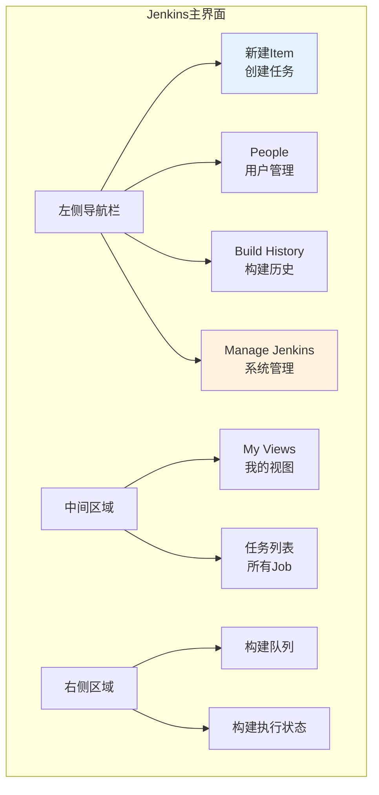

### 几个核心概念

在动手之前，先搞清楚Jenkins的几个核心术语：

| 术语 | 解释 | 类比 |
|------|------|------|
| **Item/Job** | 一个任务/项目 | 一个奶茶配方 |
| **Build** | 一次构建执行 | 按配方做了一杯奶茶 |
| **Pipeline** | 流水线（用代码定义构建流程） | 全自动奶茶生产线 |
| **Stage** | 流水线中的一个阶段 | 制作奶茶的一个步骤 |
| **Step** | 阶段中的一个具体操作 | 具体动作（加糖、加冰） |
| **Workspace** | 构建时的工作目录 | 制作台 |
| **Artifact** | 构建产物 | 做好的那杯奶茶 |

---

## 五、创建第一个Job：自由风格项目

先从最简单的开始——**自由风格项目（Freestyle Project）**。

### 5.1 创建任务

1. 点击"新建Item"
2. 输入任务名称：`my-first-job`
3. 选择"Freestyle project"
4. 点击"确定"

### 5.2 配置源码管理

找到"源码管理"（Source Code Management）部分：

**如果你用的是Git：**

```
Repository URL:  https://github.com/你的用户名/你的仓库.git
Branch:          */main
```

**如果是私有仓库**，还需要添加凭证（Credentials）：

1. 点击"添加" -> "Jenkins"
2. 选择"Username with password"
3. 填入Git用户名和密码（或Personal Access Token）
4. 点"添加"

**如果暂时没有Git仓库**，可以先选"None"，我们后面用Pipeline来演示。

### 5.3 配置构建步骤

找到"构建"（Build Steps）部分：

1. 点击"增加构建步骤"
2. 选择"执行shell"（Linux/Mac）或"执行Windows批处理命令"
3. 输入：

```bash
echo "========== 开始构建 =========="
echo "当前目录: $(pwd)"
echo "当前时间: $(date)"
echo "========== 构建完成 =========="
```

### 5.4 保存并运行

1. 点击"保存"
2. 回到任务页面
3. 点击左侧"立即构建"（Build Now）

### 5.5 查看构建结果

构建开始后：

1. 左下角"Build History"会出现 `#1`
2. 点击 `#1`
3. 点击"控制台输出"（Console Output）

你会看到：

```
========== 开始构建 ==========
当前目录: /var/jenkins_home/workspace/my-first-job
当前时间: 2024-01-15 10:30:00
========== 构建完成 ==========
Finished: SUCCESS
```

恭喜！你的第一个Jenkins构建成功了！

---

## 六、Pipeline：流水线才是正道

自由风格项目虽然简单，但不够灵活。**Pipeline（流水线）** 才是Jenkins的精髓。

### 6.1 为什么要用Pipeline？

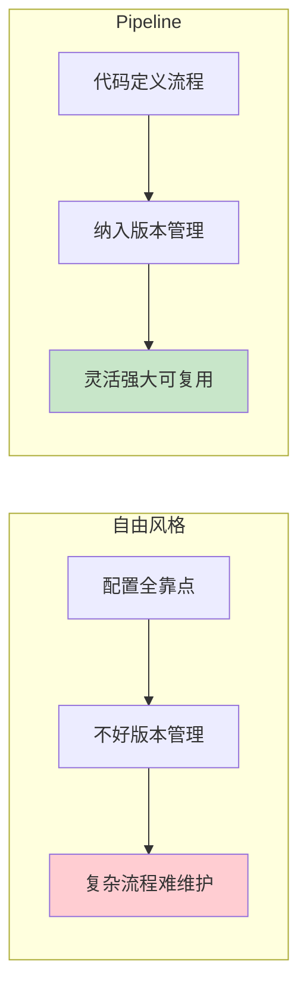

**Pipeline的核心优势：**
- 代码即配置，跟项目一起管理
- 支持复杂的条件判断、循环、并行
- 可以暂停、等待人工确认
- 可视化显示构建阶段

### 6.2 创建Pipeline项目

1. 点击"新建Item"
2. 输入名称：`my-pipeline`
3. 选择"Pipeline"
4. 点击"确定"

### 6.3 第一个Pipeline脚本

在"Pipeline"部分，选择"Pipeline script"，输入：

```groovy
pipeline {
    agent any
    
    stages {
        stage('准备') {
            steps {
                echo '你好，Jenkins Pipeline！'
            }
        }
        
        stage('编译') {
            steps {
                echo '正在编译项目...'
            }
        }
        
        stage('测试') {
            steps {
                echo '正在运行测试...'
            }
        }
        
        stage('部署') {
            steps {
                echo '正在部署到服务器...'
            }
        }
    }
}
```

保存并运行，你会看到阶段视图（Stage View）：

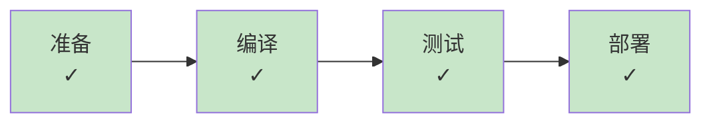

每个阶段都变成绿色了，太棒了！

### 6.4 Pipeline语法详解

来逐行理解这个脚本：

```groovy
pipeline {                    // ① 声明式Pipeline的固定写法
    agent any                 // ② 在任意可用节点上运行
    
    stages {                  // ③ 所有阶段的容器
        stage('准备') {       // ④ 定义一个阶段
            steps {           // ⑤ 阶段内的步骤
                echo '...'    // ⑥ 具体操作
            }
        }
    }
}
```

**完整的声明式Pipeline结构：**

```groovy
pipeline {
    agent any                    // 在哪个节点运行
    
    environment {                // 环境变量
        PROJECT = 'my-app'
    }
    
    stages {                     // 构建阶段
        stage('准备') { ... }
        stage('编译') { ... }
        stage('测试') { ... }
        stage('部署') { ... }
    }
    
    post {                       // 构建后的动作
        always { ... }           // 无论成功失败都执行
        success { ... }          // 成功时执行
        failure { ... }          // 失败时执行
    }
}
```

---

## 七、实战：Java项目完整流水线

现在来做一个真正能用的Pipeline——构建一个Java Maven项目。

### 7.1 准备工作

确保Jenkins安装了以下插件：
- **Maven Integration Plugin**
- **Git Plugin**（通常已安装）

在"Manage Jenkins" -> "全局工具配置"中配置：

```
Maven:
  名称: Maven
  自动安装: 勾选

JDK:
  名称: JDK17
  自动安装: 勾选
```

### 7.2 完整Pipeline脚本

```groovy
pipeline {
    agent any
    
    // 定义工具版本
    tools {
        maven 'Maven'
        jdk 'JDK17'
    }
    
    // 环境变量
    environment {
        PROJECT_NAME = 'my-java-app'
        DEPLOY_SERVER = 'user@192.168.1.100'
        JAR_NAME     = "${PROJECT_NAME}.jar"
    }
    
    stages {
        // 阶段1：拉取代码
        stage('拉取代码') {
            steps {
                git branch: 'main',
                    url: 'https://github.com/yourname/my-java-app.git'
                echo "代码拉取成功，当前分支: main"
            }
        }
        
        // 阶段2：编译打包
        stage('编译打包') {
            steps {
                sh 'mvn clean package -DskipTests'
            }
        }
        
        // 阶段3：运行单元测试
        stage('单元测试') {
            steps {
                sh 'mvn test'
            }
            post {
                always {
                    // 展示测试报告
                    junit 'target/surefire-reports/*.xml'
                }
            }
        }
        
        // 阶段4：代码质量检查
        stage('代码检查') {
            steps {
                sh 'mvn checkstyle:check'
            }
        }
        
        // 阶段5：部署到服务器
        stage('部署') {
            steps {
                // 停止旧服务
                sh "ssh ${DEPLOY_SERVER} 'kill -9 \\$(pgrep -f ${JAR_NAME}) || true'"
                
                // 上传新版本
                sh "scp target/${JAR_NAME} ${DEPLOY_SERVER}:/opt/app/"
                
                // 启动新服务
                sh "ssh ${DEPLOY_SERVER} 'nohup java -jar /opt/app/${JAR_NAME} > /dev/null 2>&1 &'"
            }
        }
    }
    
    // 构建后处理
    post {
        success {
            echo '部署成功！'
            // 可以发通知：邮件、钉钉、飞书等
        }
        failure {
            echo '部署失败，请检查日志！'
        }
        always {
            // 清理工作空间
            cleanWs()
        }
    }
}
```

### 7.3 流水线全流程图

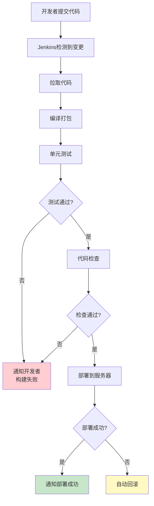

---

## 八、实战：前端项目流水线

前端项目的流水线有所不同，核心区别在于构建工具和部署方式。

### 8.1 Node.js前端项目Pipeline

```groovy
pipeline {
    agent any
    
    tools {
        nodejs 'NodeJS18'
    }
    
    environment {
        DEPLOY_PATH = '/var/www/my-frontend'
    }
    
    stages {
        stage('拉取代码') {
            steps {
                git branch: 'main',
                    url: 'https://github.com/yourname/my-frontend.git'
            }
        }
        
        stage('安装依赖') {
            steps {
                sh 'npm install'
            }
        }
        
        stage('代码检查') {
            steps {
                sh 'npm run lint'
            }
        }
        
        stage('构建') {
            steps {
                sh 'npm run build'
            }
        }
        
        stage('部署') {
            steps {
                // 将构建产物复制到Nginx目录
                sh "rm -rf ${DEPLOY_PATH}/*"
                sh "cp -r dist/* ${DEPLOY_PATH}/"
                
                // 重启Nginx
                sh 'sudo systemctl reload nginx'
            }
        }
    }
    
    post {
        success {
            echo '前端项目部署成功！'
        }
        failure {
            echo '构建失败，请检查控制台输出！'
        }
    }
}
```

### 8.2 前后端流水线对比

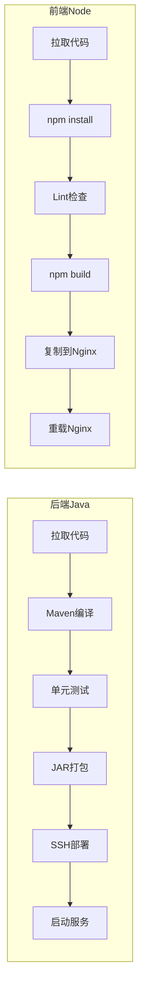

---

## 九、Pipeline从代码仓库加载（Jenkinsfile）

到目前为止，Pipeline脚本都是写在Jenkins页面里的。更好的做法是**把脚本放在项目根目录**，文件名叫 `Jenkinsfile`。

### 9.1 为什么用Jenkinsfile？

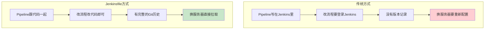

### 9.2 如何配置

1. 在项目根目录创建 `Jenkinsfile` 文件
2. 提交到Git仓库
3. 在Jenkins任务配置中，Pipeline选择"Pipeline script from SCM"

```
SCM:          Git
Repository:   你的仓库地址
分支:         */main
脚本路径:     Jenkinsfile
```

### 9.3 Jenkinsfile最佳实践

```groovy
// Jenkinsfile - 放在项目根目录

pipeline {
    agent any
    
    // 使用参数让流水线更灵活
    parameters {
        choice(name: 'ENV', choices: ['dev', 'staging', 'prod'], 
               description: '部署环境')
        booleanParam(name: 'RUN_TESTS', defaultValue: true, 
                     description: '是否运行测试')
        string(name: 'VERSION', defaultValue: '', 
               description: '指定版本号（留空则自动）')
    }
    
    environment {
        // 根据参数决定配置
        APP_NAME = 'my-app'
        DOCKER_REGISTRY = 'registry.example.com'
    }
    
    stages {
        stage('准备') {
            steps {
                echo "部署环境: ${params.ENV}"
                echo "是否测试: ${params.RUN_TESTS}"
            }
        }
        
        stage('构建') {
            steps {
                sh 'make build'
            }
        }
        
        stage('测试') {
            when {
                expression { params.RUN_TESTS }
            }
            steps {
                sh 'make test'
            }
        }
        
        stage('部署') {
            steps {
                echo "部署到 ${params.ENV} 环境"
                sh "make deploy ENV=${params.ENV}"
            }
        }
    }
}
```

---

## 十、构建通知：别再盯着屏幕等了

构建完成后的通知，是Jenkins的"最后一公里"。

### 10.1 邮件通知

**第一步：配置SMTP**

进入 "Manage Jenkins" -> "系统配置"：

```
SMTP服务器:        smtp.gmail.com
SMTP端口:          465
使用SSL:           勾选
发件人邮箱:        your-email@gmail.com
用户名/密码:       你的邮箱和应用专用密码
```

**第二步：Pipeline中使用**

```groovy
post {
    failure {
        mail to: 'team@example.com',
             subject: "构建失败: ${env.JOB_NAME} #${env.BUILD_NUMBER}",
             body: """
             构建失败！
             
             项目: ${env.JOB_NAME}
             编号: ${env.BUILD_NUMBER}
             地址: ${env.BUILD_URL}
             
             请尽快处理！
             """
    }
}
```

### 10.2 钉钉/飞书通知

安装对应插件后，在Pipeline中使用：

```groovy
post {
    success {
        dingtalk(
            robot: 'my-robot',
            type: 'MARKDOWN',
            title: '构建成功',
            text: [
                "## 构建成功 ✅",
                "- 项目: ${env.JOB_NAME}",
                "- 编号: #${env.BUILD_NUMBER}",
                "- 耗时: ${currentBuild.durationString}"
            ]
        )
    }
}
```

### 10.3 通知方式对比

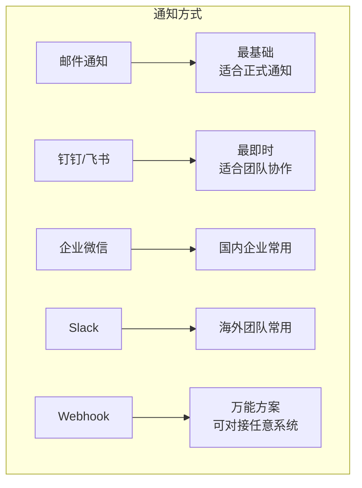

---

## 十一、常见问题排查

### 问题1：构建卡住不动

**症状**：点"立即构建"后一直转圈

**排查步骤**：

```bash
# 1. 检查Jenkins是否在运行
docker ps | grep jenkins

# 2. 查看Jenkins日志
docker logs jenkins --tail 100

# 3. 检查磁盘空间
df -h

# 4. 检查是否有僵死的构建进程
# 在Jenkins管理页面 -> 管理Jenkins -> 安全地终止构建
```

### 问题2：Git拉取代码失败

**症状**：`Failed to connect to repository`

**排查步骤**：

```bash
# 1. 测试网络连通性
ping github.com

# 2. 测试Git访问
git ls-remote https://github.com/yourname/your-repo.git

# 3. 检查凭证配置
# Manage Jenkins -> Credentials -> 查看是否有正确的凭证

# 4. 如果是SSH方式，检查密钥配置
ssh -T git@github.com
```

### 问题3：权限不足

**症状**：`Permission denied`

```bash
# Jenkins用户权限问题
sudo chown -R jenkins:jenkins /var/lib/jenkins/workspace/

# Docker权限问题（把jenkins用户加入docker组）
sudo usermod -aG docker jenkins
sudo systemctl restart jenkins
```

### 问题4：磁盘空间不足

**症状**：构建莫名失败，日志显示"No space left on device"

```bash
# 查看Jenkins占用的磁盘
du -sh /var/lib/jenkins/

# 清理旧的构建记录
# 在任务配置中 -> 丢弃旧的构建 -> 勾选
# 设置保持构建的天数: 30
# 设置保持构建的最大个数: 10

# 手动清理工作空间
# Manage Jenkins -> 系统信息 -> 工作空间清理
```

### 问题排查万能流程

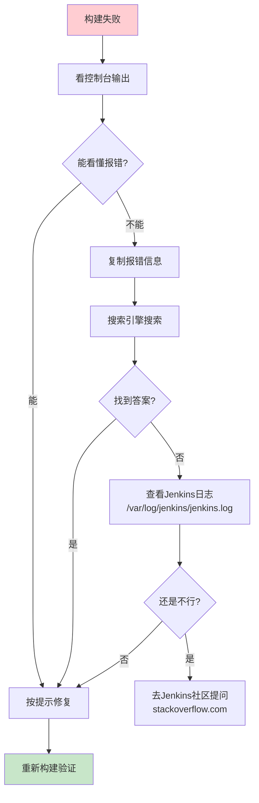

---

## 十二、进阶技巧

### 12.1 并行构建加速

当有多个独立的测试任务时，可以并行执行来节省时间：

```groovy
pipeline {
    agent any
    
    stages {
        stage('并行测试') {
            parallel {
                stage('单元测试') {
                    steps {
                        sh 'mvn test'
                    }
                }
                stage('集成测试') {
                    steps {
                        sh 'mvn verify -DskipUnitTests'
                    }
                }
                stage('UI测试') {
                    steps {
                        sh 'npm run e2e'
                    }
                }
            }
        }
    }
}
```

并行 vs 串行对比：

```mermaid
gantt
    title 构建时间对比
    dateFormat X
    axisFormat %s秒
    
    section 串行执行
    单元测试     :a1, 0, 5
    集成测试     :a2, 5, 10
    UI测试       :a3, 10, 16
    
    section 并行执行
    单元测试     :b1, 0, 5
    集成测试     :b2, 0, 5
    UI测试       :b3, 0, 6
```

### 12.2 人工确认

在部署到生产环境前，加一道人工确认：

```groovy
stage('部署到生产') {
    input {
        message "确认部署到生产环境？"
        ok "确认部署"
        parameters {
            string(name: 'APPROVER', description: '审批人')
        }
    }
    steps {
        echo "由 ${APPROVER} 审批通过，开始部署..."
        sh 'make deploy ENV=prod'
    }
}
```

### 12.3 多分支流水线

Jenkins可以自动发现Git仓库中的所有分支，为每个分支创建Pipeline：

```
Manage Jenkins -> 新建Item -> Multibranch Pipeline
```

配置好后，每次新建分支，Jenkins会自动：
1. 发现新分支
2. 扫描Jenkinsfile
3. 创建对应的Pipeline任务

这对Git Flow工作流特别友好。

---

## 十三、安全加固

Jenkins默认配置比较开放，生产环境务必做好安全加固。

### 13.1 基础安全配置

| 配置项 | 推荐设置 | 路径 |
|-------|---------|------|
| 安全域 | Jenkins专有用户数据库 | Manage Jenkins -> Security |
| 授权策略 | 安全矩阵 | Manage Jenkins -> Security |
| CSRF防护 | 开启 | 默认已开启 |
| 代理认证 | 开启 | 默认已开启 |

### 13.2 安全矩阵配置

进入 "Manage Jenkins" -> "Security" -> "授权策略" 选择"安全矩阵"：

```
Overall/Read:          匿名用户 ❌   登录用户 ✅
Job/Read:              匿名用户 ❌   登录用户 ✅
Job/Build:             匿名用户 ❌   开发者 ✅
Job/Configure:         匿名用户 ❌   管理员 ✅
Job/Create:            匿名用户 ❌   管理员 ✅
Run/Update:            匿名用户 ❌   开发者 ✅
SCM/Tag:               匿名用户 ❌   开发者 ✅
```

### 13.3 凭证管理

**永远不要在Pipeline里硬编码密码！**

```groovy
// ❌ 错误做法
sh 'mysql -u root -p123456 mydb < data.sql'

// ✅ 正确做法：用Credentials
withCredentials([usernamePassword(
    credentialsId: 'mysql-creds',
    usernameVariable: 'DB_USER',
    passwordVariable: 'DB_PASS'
)]) {
    sh 'mysql -u ${DB_USER} -p${DB_PASS} mydb < data.sql'
}
```

### 13.4 安全体系全景

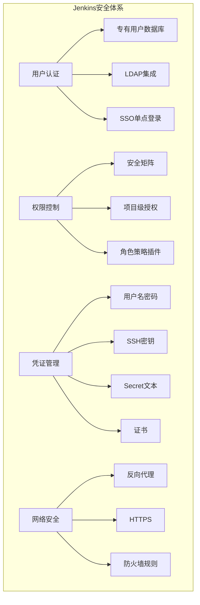

---

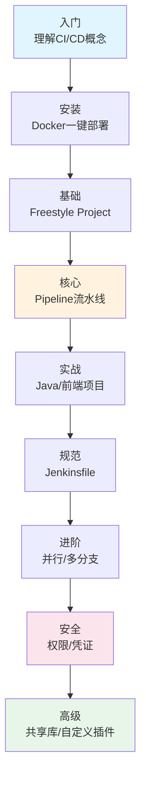

### 一张表回顾全文

| 章节 | 你学到了什么 |
|------|------------|
| 一、Jenkins是什么 | CI/CD概念，Jenkins定位 |
| 二、安装 | Docker/原生安装方法 |
| 三、首次配置 | 解锁、插件、管理员账户 |
| 四、认识界面 | 核心术语和界面布局 |
| 五、自由风格项目 | 第一个Job的创建和运行 |
| 六、Pipeline基础 | 声明式Pipeline语法 |
| 七、Java流水线 | 后端项目完整实战 |
| 八、前端流水线 | Node.js项目实战 |
| 九、Jenkinsfile | 代码化Pipeline |
| 十、构建通知 | 邮件/钉钉/飞书通知 |
| 十一、问题排查 | 常见问题解决方案 |
| 十二、进阶技巧 | 并行/确认/多分支 |
| 十三、安全加固 | 权限/凭证/网络安全 |

---