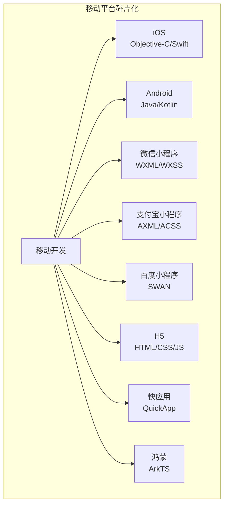
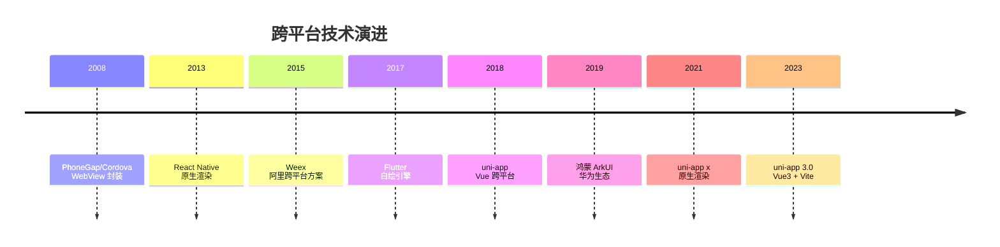
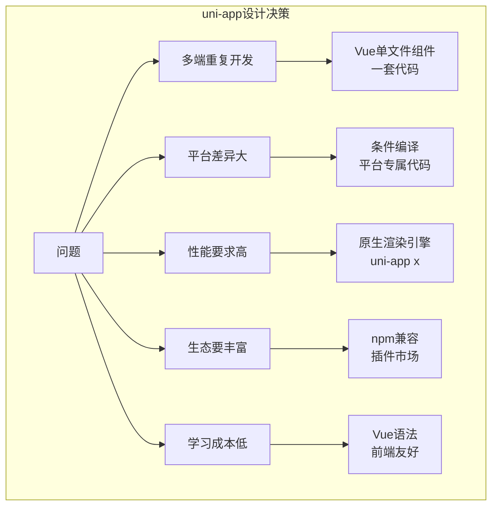
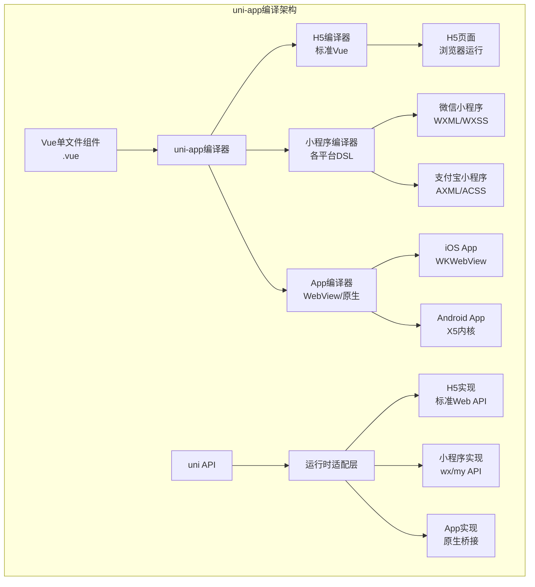
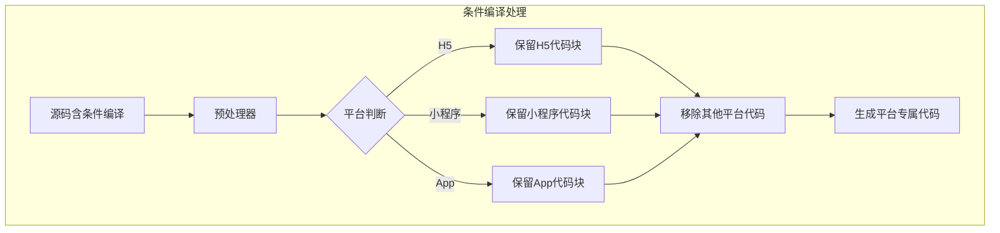
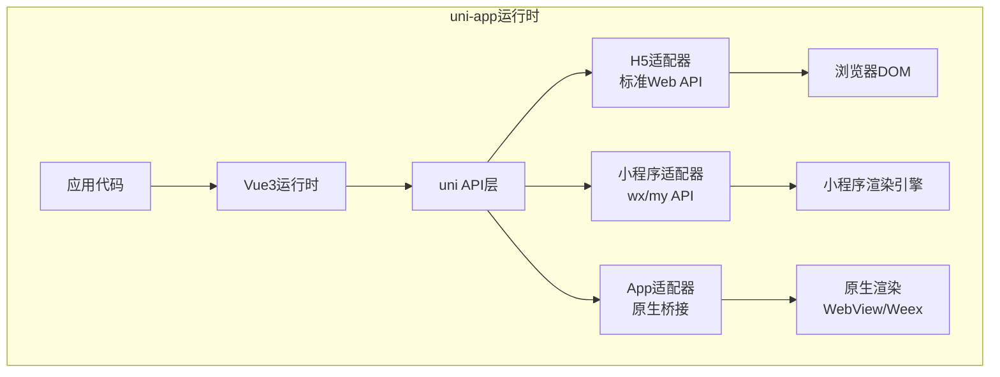
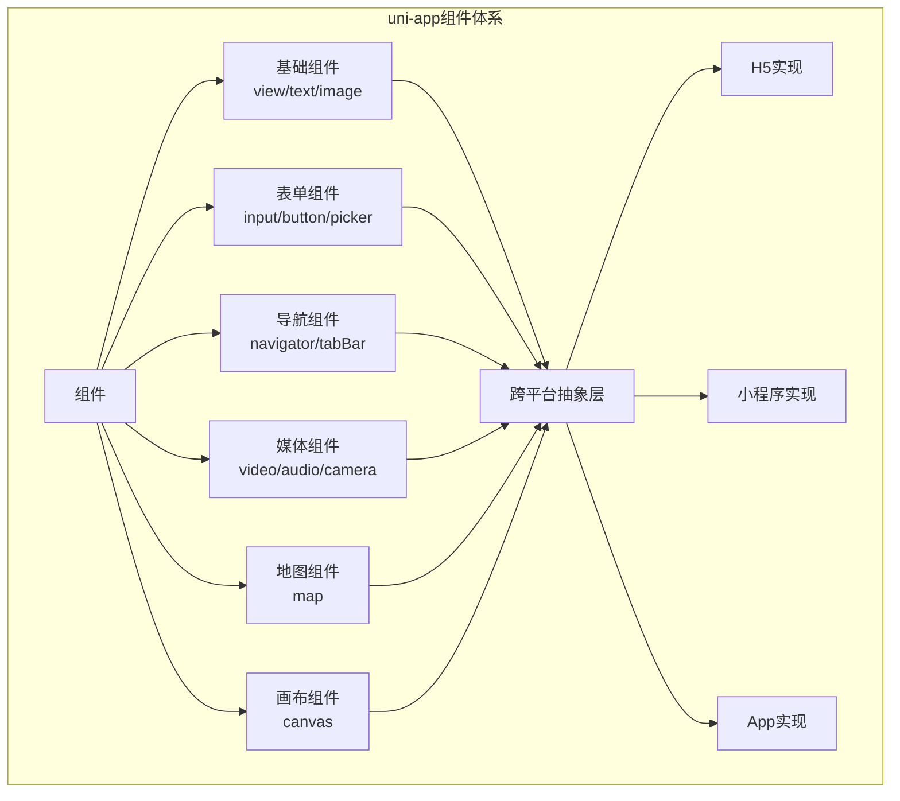
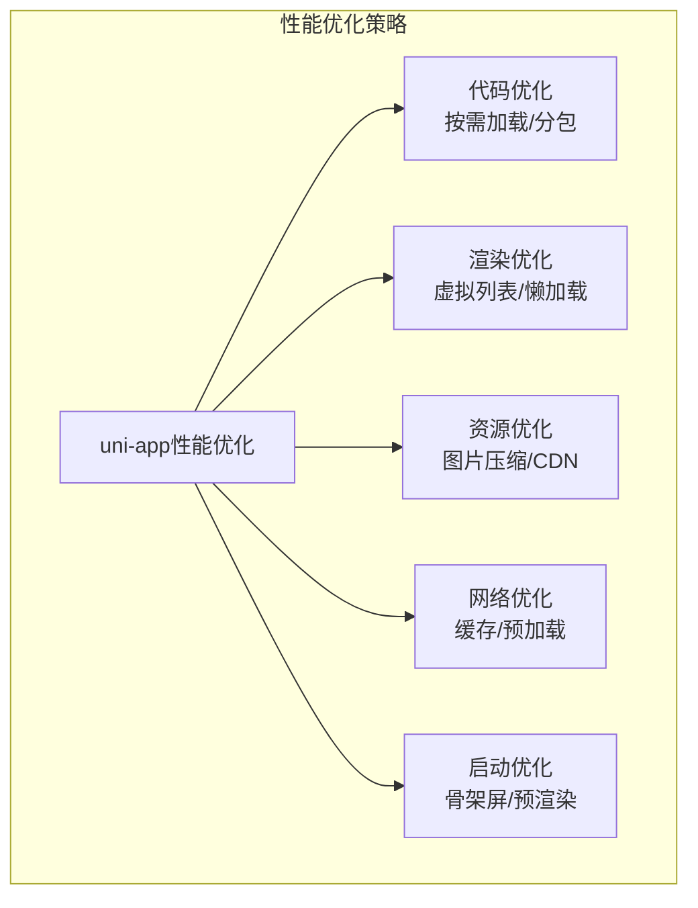
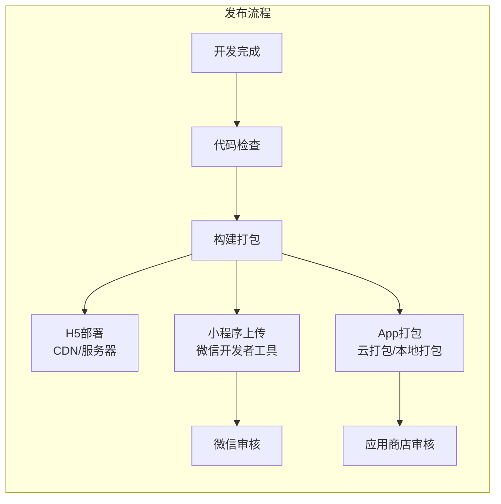

# uni-app 跨平台开发完全指南：从编译原理到企业级架构的深度解析

> 一套代码，多端运行，uni-app 如何实现这个看似不可能的任务？

---

## 写在前面

如果你是一名前端开发者，当老板要求同时开发 iOS、Android、小程序和 H5 应用时，你会怎么做？如果你是一名创业者，当预算有限但需要覆盖所有平台时，你如何选择技术栈？如果你是一名技术负责人，当团队规模有限但需要快速迭代多端产品时，你如何决策？

答案很可能指向同一个框架——**uni-app**。

这是 DCloud 推出的一款跨平台开发框架，基于 Vue.js，可以一套代码编译到 iOS、Android、H5、以及各种小程序平台。截至 2024 年，uni-app 已成为国内跨平台开发的事实标准，支撑着数十万款应用。

本文将从零开始，带你由浅入深地掌握 uni-app 的方方面面：从跨平台技术的演进历史，到编译原理的深度解析，再到企业级架构的实战设计。读完这篇文章，你将理解为什么 uni-app 能在跨平台领域脱颖而出，以及如何用它构建高质量的多端应用。

---

## 第一篇：跨平台开发的演进——为什么需要 uni-app？

### 1.1 移动开发的困境

移动互联网时代，开发者面临一个残酷的现实：平台碎片化。



**平台碎片化带来的问题：**

| 问题 | 说明 | 后果 |
|------|------|------|
| **重复开发** | 每个平台需要独立开发 | 人力成本倍增 |
| **技术栈分散** | 各平台语言/框架不同 | 团队学习成本高 |
| **维护困难** | 多份代码需要同步更新 | 版本不一致、Bug 难修复 |
| **迭代缓慢** | 新功能需要多端实现 | 市场响应慢 |
| **测试复杂** | 需要在多设备上测试 | 质量保证困难 |

### 1.2 跨平台技术演进史



**各代技术对比：**

| 技术 | 原理 | 优点 | 缺点 | 代表 |
|------|------|------|------|------|
| **WebView 方案** | HTML 渲染在 WebView | 开发快、生态丰富 | 性能差、体验不原生 | Cordova |
| **原生渲染** | JS 驱动原生组件 | 性能接近原生 | 平台差异大、包体积大 | React Native |
| **自绘引擎** | Skia 自绘 UI | 跨平台一致、性能高 | 包体积大、生态需重建 | Flutter |
| **编译转换** | 编译到各平台 DSL | 平台适配好、性能可优化 | 需要抽象层 | uni-app |

### 1.3 uni-app 的设计哲学



**uni-app 的核心设计决策：**

| 决策 | 原因 | 带来的好处 |
|------|------|------------|
| **基于 Vue.js** | 国内最流行的前端框架 | 学习成本低、人才易找 |
| **编译时转换** | 运行时性能损耗大 | 生成平台最优代码 |
| **条件编译** | 平台间有不可避免的差异 | 优雅处理平台差异 |
| **插件生态** | 复用社区成果 | 快速集成第三方能力 |
| **云开发** | 降低后端门槛 | 全栈开发体验 |

### 1.4 uni-app 支持的端

| 端 | 技术栈 | 编译目标 | 特点 |
|-----|--------|----------|------|
| **H5** | HTML5 | 标准 Web | 浏览器直接运行 |
| **小程序** | 各平台 DSL | 微信/支付宝/百度等 | 编译为平台特定语法 |
| **App** | Native | iOS/Android 原生 | 使用 WebView 或原生渲染 |
| **快应用** | QuickApp | 手机厂商联盟 | 免安装、即点即用 |
| **鸿蒙** | ArkTS | HarmonyOS | 华为生态 |

---

## 第二篇：快速上手——第一个 uni-app 应用

### 2.1 环境搭建

```bash
# 安装 HBuilderX（官方推荐 IDE）
# 下载地址: https://www.dcloud.io/hbuilderx.html

# 或使用 CLI 方式
npm install -g @dcloudio/uni-app-cli

# 创建项目
npx degit dcloudio/uni-preset-vue#vite my-project
cd my-project
npm install

# 运行到 H5
npm run dev:h5

# 运行到微信小程序
npm run dev:mp-weixin

# 运行到 App
npm run dev:app
```

### 2.2 项目结构

```
my-project/
├── src/
│   ├── components/          # 公共组件
│   ├── pages/               # 页面
│   │   ├── index/
│   │   │   ├── index.vue    # 页面
│   │   │   └── index.scss   # 样式
│   │   └── about/
│   ├── static/              # 静态资源
│   ├── App.vue              # 应用入口
│   ├── main.js              # 主入口
│   ├── manifest.json        # 应用配置
│   ├── pages.json           # 页面配置
│   └── uni.scss             # 全局样式
├── index.html
├── vite.config.js
├── package.json
└── tsconfig.json
```

### 2.3 第一个页面

```vue
<!-- src/pages/index/index.vue -->
<template>
  <view class="container">
    <text class="title">{{ title }}</text>
    <button @click="handleClick">点击我</button>
    
    <!-- 条件编译：只在微信小程序显示 -->
    <!-- #ifdef MP-WEIXIN -->
    <button open-type="share">分享</button>
    <!-- #endif -->
    
    <!-- 条件编译：只在 App 显示 -->
    <!-- #ifdef APP-PLUS -->
    <button @click="scanCode">扫码</button>
    <!-- #endif -->
  </view>
</template>

<script>
export default {
  data() {
    return {
      title: 'Hello uni-app!'
    }
  },
  methods: {
    handleClick() {
      uni.showToast({
        title: '点击了按钮',
        icon: 'none'
      })
    },
    
    // #ifdef APP-PLUS
    scanCode() {
      uni.scanCode({
        success: (res) => {
          console.log('扫码结果：', res.result)
        }
      })
    }
    // #endif
  }
}
</script>

<style lang="scss">
.container {
  padding: 20px;
  
  .title {
    font-size: 20px;
    color: #333;
    margin-bottom: 20px;
  }
}
</style>
```

### 2.4 页面配置

```json
// src/pages.json
{
  "pages": [
    {
      "path": "pages/index/index",
      "style": {
        "navigationBarTitleText": "首页"
      }
    },
    {
      "path": "pages/about/about",
      "style": {
        "navigationBarTitleText": "关于"
      }
    }
  ],
  "globalStyle": {
    "navigationBarTextStyle": "black",
    "navigationBarBackgroundColor": "#F8F8F8"
  },
  "tabBar": {
    "list": [
      {
        "pagePath": "pages/index/index",
        "text": "首页"
      },
      {
        "pagePath": "pages/about/about",
        "text": "关于"
      }
    ]
  }
}
```

---

## 第三篇：编译原理——uni-app 是如何工作的？

### 3.1 整体架构



### 3.2 编译流程详解

```mermaid
graph LR
    subgraph 编译流程
        A[源码.vue] --> B[解析<br>@vue/compiler-sfc]
        B --> C[模板编译<br>template → render函数]
        B --> D[Script处理<br>JS/TS转换]
        B --> E[样式处理<br>SCSS/Less编译]
        
        C --> F[平台特定转换]
        D --> F
        E --> F
        
        F --> G1[H5: 标准Vue3]
        F --> G2[小程序: 编译为WXML]
        F --> G3[App: 生成原生代码]
    end
```

**编译阶段详解：**

| 阶段 | 输入 | 输出 | 说明 |
|------|------|------|------|
| **解析** | .vue 文件 | SFC 描述对象 | 使用 Vue 官方编译器 |
| **模板编译** | template | render 函数/WXML | 平台特定转换 |
| **Script 处理** | JS/TS | 转换后的 JS | Babel/TypeScript 编译 |
| **样式处理** | SCSS/Less | CSS | 预处理器编译 |
| **平台转换** | 中间代码 | 平台特定代码 | uni-app 核心逻辑 |

### 3.3 模板编译原理

uni-app 的核心魔法在于将 Vue 模板编译为各平台的原生语法。

**Vue 模板：**

```vue
<template>
  <view class="container">
    <text v-if="showTitle">{{ title }}</text>
    <view v-for="(item, index) in list" :key="index">
      {{ item.name }}
    </view>
  </view>
</template>
```

**编译到微信小程序：**

```xml
<!-- 生成的 WXML -->
<view class="container">
  <text wx:if="{{showTitle}}">{{title}}</text>
  <view wx:for="{{list}}" wx:for-item="item" wx:for-index="index" wx:key="index">
    {{item.name}}
  </view>
</view>
```

**编译到 H5：**

```javascript
// 生成的 render 函数（简化）
function render(_ctx, _cache) {
  return (_openBlock(), _createElementBlock("div", { class: "container" }, [
    _ctx.showTitle 
      ? (_openBlock(), _createElementBlock("span", { key: 0 }, _toDisplayString(_ctx.title), 1))
      : _createCommentVNode("", true),
    (_openBlock(true), _createElementBlock(_Fragment, null, 
      _renderList(_ctx.list, (item, index) => {
        return (_openBlock(), _createElementBlock("div", { key: index }, 
          _toDisplayString(item.name), 1))
      }), 128))
  ]))
}
```

**编译器核心代码（简化）：**

```javascript
// 模板编译器伪代码
function compileTemplate(template, platform) {
  // 1. 解析 Vue 模板为 AST
  const ast = parse(template)
  
  // 2. 遍历 AST，转换节点
  traverse(ast, {
    Element(node) {
      // 标签名映射
      node.tag = mapTagName(node.tag, platform)
      
      // 指令转换
      if (node.hasDirective('v-if')) {
        convertVIf(node, platform)
      }
      if (node.hasDirective('v-for')) {
        convertVFor(node, platform)
      }
      if (node.hasDirective('@click')) {
        convertEvent(node, platform)
      }
    }
  })
  
  // 3. 生成目标平台代码
  return generate(ast, platform)
}

// 标签映射表
const tagMap = {
  'view': {
    'h5': 'div',
    'mp-weixin': 'view',
    'app-plus': 'div'
  },
  'text': {
    'h5': 'span',
    'mp-weixin': 'text',
    'app-plus': 'span'
  },
  'image': {
    'h5': 'img',
    'mp-weixin': 'image',
    'app-plus': 'img'
  }
}
```

### 3.4 条件编译原理

条件编译是 uni-app 处理平台差异的核心机制。



**条件编译语法：**

```javascript
// #ifdef H5
// 只在 H5 平台编译的代码
console.log('这是 H5 平台')
// #endif

// #ifndef MP-WEIXIN
// 除了微信小程序，其他平台都编译
// #endif

// #ifdef APP-PLUS || APP-PLUS-NVUE
// 在 App 平台编译（包括 nvue）
// #endif
```

**预处理器实现：**

```javascript
function preprocessConditional(source, platform) {
  const lines = source.split('\n')
  const result = []
  let keep = true
  let stack = []
  
  for (const line of lines) {
    const trimmed = line.trim()
    
    // #ifdef PLATFORM
    if (trimmed.startsWith('// #ifdef ')) {
      const target = trimmed.replace('// #ifdef ', '').trim()
      stack.push(keep)
      keep = keep && matchPlatform(target, platform)
      continue
    }
    
    // #ifndef PLATFORM
    if (trimmed.startsWith('// #ifndef ')) {
      const target = trimmed.replace('// #ifndef ', '').trim()
      stack.push(keep)
      keep = keep && !matchPlatform(target, platform)
      continue
    }
    
    // #endif
    if (trimmed === '// #endif') {
      keep = stack.pop()
      continue
    }
    
    if (keep) {
      result.push(line)
    }
  }
  
  return result.join('\n')
}
```

### 3.5 运行时架构



**uni API 统一层：**

```javascript
// uni.request 在各平台的实现

// H5 平台
function requestH5(options) {
  return fetch(options.url, {
    method: options.method,
    headers: options.header,
    body: options.data
  }).then(res => res.json())
}

// 微信小程序
function requestMP(options) {
  return new Promise((resolve, reject) => {
    wx.request({
      url: options.url,
      method: options.method,
      header: options.header,
      data: options.data,
      success: resolve,
      fail: reject
    })
  })
}

// App 平台
function requestApp(options) {
  // 调用原生网络模块
  return plus.runtime.request(options)
}

// 统一导出
export const request = 
  // #ifdef H5
  requestH5
  // #endif
  // #ifdef MP-WEIXIN
  requestMP
  // #endif
  // #ifdef APP-PLUS
  requestApp
  // #endif
```

---

## 第四篇：核心特性深度解析

### 4.1 组件系统

uni-app 提供了丰富的跨平台组件。



**常用组件示例：**

```vue
<template>
  <view>
    <!-- 基础组件 -->
    <view class="card">
      <image class="avatar" :src="user.avatar" mode="aspectFill" />
      <text class="name">{{ user.name }}</text>
    </view>
    
    <!-- 表单组件 -->
    <form @submit="handleSubmit">
      <input 
        v-model="form.name" 
        placeholder="请输入姓名"
        maxlength="20"
      />
      <picker mode="date" @change="onDateChange">
        <view>选择日期: {{ form.date }}</view>
      </picker>
      <button form-type="submit">提交</button>
    </form>
    
    <!-- 列表组件 -->
    <scroll-view scroll-y class="list" @scrolltolower="loadMore">
      <view v-for="item in list" :key="item.id" class="item">
        {{ item.title }}
      </view>
    </scroll-view>
    
    <!-- 条件编译：平台特定组件 -->
    <!-- #ifdef MP-WEIXIN -->
    <official-account></official-account>
    <!-- #endif -->
    
    <!-- #ifdef APP-PLUS -->
    <web-view :src="webUrl"></web-view>
    <!-- #endif -->
  </view>
</template>
```

### 4.2 状态管理

uni-app 支持多种状态管理方案。

**选项式 API：**

```vue
<script>
export default {
  data() {
    return {
      count: 0,
      user: null
    }
  },
  computed: {
    doubleCount() {
      return this.count * 2
    }
  },
  methods: {
    increment() {
      this.count++
    }
  },
  onLoad() {
    // 页面加载
    this.loadUser()
  }
}
</script>
```

**组合式 API（推荐）：**

```vue
<script setup>
import { ref, computed, onLoad } from '@dcloudio/uni-app'

const count = ref(0)
const user = ref(null)

const doubleCount = computed(() => count.value * 2)

const increment = () => {
  count.value++
}

onLoad(() => {
  loadUser()
})

async function loadUser() {
  const res = await uni.request({
    url: 'https://api.example.com/user'
  })
  user.value = res.data
}
</script>
```

**Pinia 状态管理：**

```javascript
// stores/user.js
import { defineStore } from 'pinia'
import { ref, computed } from 'vue'

export const useUserStore = defineStore('user', () => {
  // State
  const userInfo = ref(null)
  const token = ref(uni.getStorageSync('token'))
  
  // Getters
  const isLogin = computed(() => !!token.value)
  const userName = computed(() => userInfo.value?.name || '游客')
  
  // Actions
  async function login(credentials) {
    const res = await uni.request({
      url: 'https://api.example.com/login',
      method: 'POST',
      data: credentials
    })
    
    token.value = res.data.token
    userInfo.value = res.data.user
    uni.setStorageSync('token', token.value)
  }
  
  function logout() {
    token.value = null
    userInfo.value = null
    uni.removeStorageSync('token')
  }
  
  return {
    userInfo,
    token,
    isLogin,
    userName,
    login,
    logout
  }
})
```

### 4.3 路由与导航

```javascript
// 编程式导航
// 保留当前页面，跳转到新页面
uni.navigateTo({
  url: '/pages/detail/detail?id=123'
})

// 关闭当前页面，跳转到新页面
uni.redirectTo({
  url: '/pages/home/home'
})

// 跳转到 tabBar 页面
uni.switchTab({
  url: '/pages/index/index'
})

// 关闭所有页面，打开新页面
uni.reLaunch({
  url: '/pages/start/start'
})

// 返回上一页
uni.navigateBack({
  delta: 1
})
```

**路由传参与接收：**

```vue
<!-- 页面 A -->
<script setup>
const goToDetail = (id) => {
  uni.navigateTo({
    url: `/pages/detail/detail?id=${id}&type=article`
  })
}
</script>

<!-- 页面 B -->
<script setup>
import { onLoad } from '@dcloudio/uni-app'

onLoad((options) => {
  console.log(options.id)    // 123
  console.log(options.type)  // article
})
</script>
```

### 4.4 网络请求封装

```javascript
// utils/request.js
const BASE_URL = 'https://api.example.com'

const request = (options) => {
  return new Promise((resolve, reject) => {
    uni.request({
      url: BASE_URL + options.url,
      method: options.method || 'GET',
      data: options.data,
      header: {
        'Content-Type': 'application/json',
        'Authorization': `Bearer ${uni.getStorageSync('token')}`,
        ...options.header
      },
      success: (res) => {
        if (res.statusCode === 200) {
          resolve(res.data)
        } else if (res.statusCode === 401) {
          // Token 过期，跳转到登录
          uni.navigateTo({ url: '/pages/login/login' })
          reject(new Error('Unauthorized'))
        } else {
          uni.showToast({ title: res.data.message || '请求失败', icon: 'none' })
          reject(res.data)
        }
      },
      fail: (err) => {
        uni.showToast({ title: '网络错误', icon: 'none' })
        reject(err)
      }
    })
  })
}

// 封装常用方法
export const http = {
  get: (url, params) => request({ url, method: 'GET', data: params }),
  post: (url, data) => request({ url, method: 'POST', data }),
  put: (url, data) => request({ url, method: 'PUT', data }),
  delete: (url) => request({ url, method: 'DELETE' }),
}

// 使用
import { http } from '@/utils/request.js'

const fetchUser = async () => {
  const user = await http.get('/user/info')
  console.log(user)
}
```

---

## 第五篇：原生能力调用

### 5.1 系统能力

```javascript
// 获取系统信息
const systemInfo = uni.getSystemInfoSync()
console.log(systemInfo.platform)  // ios/android/windows
console.log(systemInfo.windowWidth)
console.log(systemInfo.windowHeight)

// 存储
uni.setStorageSync('key', 'value')
const value = uni.getStorageSync('key')
uni.removeStorageSync('key')

// 剪贴板
uni.setClipboardData({
  data: '复制的内容',
  success: () => {
    uni.showToast({ title: '复制成功' })
  }
})

// 扫码
uni.scanCode({
  success: (res) => {
    console.log('条码类型：' + res.scanType)
    console.log('条码内容：' + res.result)
  }
})

// 位置
uni.getLocation({
  type: 'gcj02',
  success: (res) => {
    console.log('纬度：' + res.latitude)
    console.log('经度：' + res.longitude)
  }
})
```

### 5.2 媒体能力

```javascript
// 选择图片
uni.chooseImage({
  count: 9,
  sizeType: ['original', 'compressed'],
  sourceType: ['album', 'camera'],
  success: (res) => {
    const tempFilePaths = res.tempFilePaths
    // 上传图片
    uploadImages(tempFilePaths)
  }
})

// 上传文件
const uploadImages = (filePaths) => {
  filePaths.forEach(filePath => {
    uni.uploadFile({
      url: 'https://api.example.com/upload',
      filePath: filePath,
      name: 'file',
      success: (res) => {
        console.log('上传成功', res)
      }
    })
  })
}

// 录音
const recorderManager = uni.getRecorderManager()

recorderManager.onStart(() => {
  console.log('录音开始')
})

recorderManager.onStop((res) => {
  console.log('录音结束', res.tempFilePath)
})

// 开始录音
recorderManager.start({
  duration: 60000,
  sampleRate: 44100,
  numberOfChannels: 1,
  encodeBitRate: 192000,
  format: 'mp3'
})
```

### 5.3 自定义原生插件

```java
// Android 原生插件示例
package com.example.uniplugin;

import io.dcloud.feature.uniapp.annotation.UniJSMethod;
import io.dcloud.feature.uniapp.bridge.UniJSCallback;
import io.dcloud.feature.uniapp.common.UniModule;

public class TestModule extends UniModule {
    
    @UniJSMethod(uiThread = true)
    public void testAsyncFunc(String name, UniJSCallback callback) {
        if (callback != null) {
            JSONObject data = new JSONObject();
            data.put("code", "success");
            data.put("message", "Hello " + name);
            callback.invoke(data);
        }
    }
    
    @UniJSMethod(uiThread = false)
    public JSONObject testSyncFunc() {
        JSONObject data = new JSONObject();
        data.put("code", "success");
        data.put("message", "Sync method called");
        return data;
    }
}
```

```javascript
// 在 uni-app 中调用原生插件
const testModule = uni.requireNativePlugin('TestModule')

// 异步调用
testModule.testAsyncFunc('uni-app', (result) => {
  console.log(result.message)  // Hello uni-app
})

// 同步调用
const result = testModule.testSyncFunc()
console.log(result.message)
```

---

## 第六篇：企业级架构设计

### 6.1 项目架构设计

```
src/
├── api/                    # API 接口管理
│   ├── modules/
│   │   ├── user.js
│   │   ├── order.js
│   │   └── product.js
│   └── index.js
├── components/             # 公共组件
│   ├── common/            # 通用组件
│   ├── business/          # 业务组件
│   └── layout/            # 布局组件
├── composables/           # 组合式函数
│   ├── useUser.js
│   ├── usePermission.js
│   └── useLoading.js
├── config/                # 配置文件
│   ├── index.js
│   ├── api.config.js
│   └── platform.config.js
├── pages/                 # 页面
│   ├── index/
│   ├── category/
│   ├── cart/
│   ├── user/
│   └── ...
├── static/                # 静态资源
├── stores/                # Pinia 状态管理
│   ├── modules/
│   │   ├── user.js
│   │   ├── cart.js
│   │   └── app.js
│   └── index.js
├── styles/                # 全局样式
│   ├── variables.scss
│   ├── mixins.scss
│   └── global.scss
├── utils/                 # 工具函数
│   ├── request.js
│   ├── cache.js
│   ├── validate.js
│   └── platform.js
├── App.vue
├── main.js
├── manifest.json
└── pages.json
```

### 6.2 请求拦截与错误处理

```javascript
// utils/request.js
class Request {
  constructor() {
    this.baseURL = process.env.VUE_APP_BASE_URL
    this.timeout = 10000
    this.queue = {}
    
    this.interceptors = {
      request: (options) => {
        // 添加 token
        const token = uni.getStorageSync('token')
        if (token) {
          options.header = {
            ...options.header,
            'Authorization': `Bearer ${token}`
          }
        }
        
        // 显示 loading
        if (!options.hideLoading) {
          this.showLoading(options.url)
        }
        
        return options
      },
      response: (response) => {
        // 隐藏 loading
        this.hideLoading(response.config.url)
        
        // 统一错误处理
        if (response.statusCode !== 200) {
          this.handleError(response)
          return Promise.reject(response)
        }
        
        if (response.data.code !== 200) {
          uni.showToast({
            title: response.data.message || '请求失败',
            icon: 'none'
          })
          return Promise.reject(response.data)
        }
        
        return response.data
      }
    }
  }
  
  request(options) {
    options = this.interceptors.request(options)
    
    return new Promise((resolve, reject) => {
      uni.request({
        ...options,
        success: (res) => {
          this.interceptors.response(res).then(resolve).catch(reject)
        },
        fail: reject
      })
    })
  }
  
  showLoading(url) {
    this.queue[url] = true
    uni.showLoading({ title: '加载中...' })
  }
  
  hideLoading(url) {
    delete this.queue[url]
    if (Object.keys(this.queue).length === 0) {
      uni.hideLoading()
    }
  }
  
  handleError(response) {
    switch (response.statusCode) {
      case 401:
        uni.navigateTo({ url: '/pages/login/login' })
        break
      case 403:
        uni.showToast({ title: '没有权限', icon: 'none' })
        break
      case 500:
        uni.showToast({ title: '服务器错误', icon: 'none' })
        break
      default:
        uni.showToast({ title: '网络错误', icon: 'none' })
    }
  }
}

export default new Request()
```

### 6.3 性能优化



**分包加载：**

```json
// pages.json
{
  "pages": [
    {
      "path": "pages/index/index",
      "style": { "navigationBarTitleText": "首页" }
    }
  ],
  "subPackages": [
    {
      "root": "packageA",
      "pages": [
        { "path": "pages/goods/list" },
        { "path": "pages/goods/detail" }
      ]
    },
    {
      "root": "packageB",
      "pages": [
        { "path": "pages/order/list" },
        { "path": "pages/order/detail" }
      ]
    }
  ],
  "preloadRule": {
    "pages/index/index": {
      "network": "all",
      "packages": ["packageA"]
    }
  }
}
```

**虚拟列表：**

```vue
<template>
  <recycle-list class="list" :list-data="list" @loadmore="loadMore">
    <cell-slot v-for="(item, index) in list" :key="index">
      <view class="item">
        <image :src="item.image" mode="aspectFill" />
        <text>{{ item.title }}</text>
      </view>
    </cell-slot>
  </recycle-list>
</template>
```

**图片优化：**

```vue
<template>
  <image
    :src="imageUrl"
    mode="aspectFill"
    lazy-load
    webp
    @load="onImageLoad"
  />
</template>

<script setup>
// 使用 CDN 图片处理
const getOptimizedImage = (url, width) => {
  return `${url}?x-oss-process=image/resize,w_${width},q_80,format_webp`
}
</script>
```

### 6.4 多端适配策略

```scss
/* 平台特定样式 */
/* #ifdef H5 */
.h5-only {
  // H5 特定样式
}
/* #endif */

/* #ifdef MP-WEIXIN */
.wechat-only {
  // 微信小程序特定样式
}
/* #endif */

/* #ifdef APP-PLUS */
.app-only {
  // App 特定样式
}
/* #endif */

/* 响应式适配 */
@mixin responsive($breakpoint) {
  @if $breakpoint == 'phone' {
    @media (max-width: 768px) { @content; }
  }
  @if $breakpoint == 'tablet' {
    @media (min-width: 769px) and (max-width: 1024px) { @content; }
  }
  @if $breakpoint == 'desktop' {
    @media (min-width: 1025px) { @content; }
  }
}

.container {
  padding: 20rpx;
  
  @include responsive('tablet') {
    padding: 40rpx;
  }
  
  @include responsive('desktop') {
    padding: 60rpx;
    max-width: 1200px;
    margin: 0 auto;
  }
}
```

---

## 第七篇：发布与运维

### 7.1 各平台发布流程



**H5 部署：**

```bash
# 构建 H5
npm run build:h5

# 部署到服务器
cp -r dist/build/h5/* /var/www/html/
```

**小程序发布：**

```bash
# 构建微信小程序
npm run build:mp-weixin

# 使用微信开发者工具上传
# 或使用 miniprogram-ci
npx miniprogram-ci upload \
  --pp ./dist/build/mp-weixin \
  --pkp ./private.key \
  --appid wx123456789 \
  --uv 1.0.0 \
  --desc "版本描述"
```

**App 打包：**

```bash
# 使用 DCloud 云打包
# 在 HBuilderX 中选择：发行 -> 原生 App-云打包

# 或使用 CLI
npx @dcloudio/uni-app-cli build:app
```

### 7.2 热更新方案

```javascript
// 检查更新
const checkUpdate = async () => {
  // #ifdef APP-PLUS
  plus.runtime.getProperty(plus.runtime.appid, (widgetInfo) => {
    uni.request({
      url: 'https://api.example.com/update',
      data: {
        version: widgetInfo.version,
        name: widgetInfo.name
      },
      success: (res) => {
        if (res.data.update && res.data.version > widgetInfo.version) {
          downloadUpdate(res.data.url)
        }
      }
    })
  })
  // #endif
}

// 下载更新
const downloadUpdate = (url) => {
  uni.showModal({
    title: '发现新版本',
    content: '是否立即更新？',
    success: (res) => {
      if (res.confirm) {
        uni.showLoading({ title: '下载中...' })
        
        const downloadTask = uni.downloadFile({
          url: url,
          success: (downloadResult) => {
            if (downloadResult.statusCode === 200) {
              plus.runtime.install(
                downloadResult.tempFilePath,
                { force: false },
                () => {
                  uni.showModal({
                    title: '更新完成',
                    content: '应用将重启',
                    showCancel: false,
                    success: () => {
                      plus.runtime.restart()
                    }
                  })
                },
                (e) => {
                  uni.showToast({ title: '安装失败', icon: 'none' })
                }
              )
            }
          }
        })
        
        downloadTask.onProgressUpdate((res) => {
          uni.showLoading({ title: `下载中 ${res.progress}%` })
        })
      }
    }
  })
}
```

### 7.3 监控与埋点

```javascript
// utils/logger.js
class Logger {
  constructor() {
    this.queue = []
    this.flushInterval = 5000
    this.startFlush()
  }
  
  log(event, data = {}) {
    const logEntry = {
      event,
      data,
      timestamp: Date.now(),
      platform: uni.getSystemInfoSync().platform,
      version: uni.getAppVersionSync(),
      userId: uni.getStorageSync('userId')
    }
    
    this.queue.push(logEntry)
    
    // 错误立即上报
    if (event === 'error') {
      this.flush()
    }
  }
  
  startFlush() {
    setInterval(() => {
      if (this.queue.length > 0) {
        this.flush()
      }
    }, this.flushInterval)
  }
  
  async flush() {
    if (this.queue.length === 0) return
    
    const logs = [...this.queue]
    this.queue = []
    
    try {
      await uni.request({
        url: 'https://analytics.example.com/log',
        method: 'POST',
        data: { logs }
      })
    } catch (e) {
      // 上报失败，重新入队
      this.queue.unshift(...logs)
    }
  }
}

export const logger = new Logger()

// 使用
logger.log('page_view', { page: 'home' })
logger.log('button_click', { button: 'buy', product: '123' })
logger.log('error', { message: err.message, stack: err.stack })
```

---

## 附录：速查手册

### A. 生命周期对照

| Vue 生命周期 | uni-app 页面生命周期 | 说明 |
|-------------|---------------------|------|
| beforeCreate | - | - |
| created | - | - |
| beforeMount | onLoad | 页面加载 |
| mounted | onReady | 页面初次渲染完成 |
| beforeUpdate | - | - |
| updated | - | - |
| beforeUnmount | onUnload | 页面卸载 |

### B. 常用 API 速查

| 功能 | API | 平台差异 |
|------|-----|----------|
| 网络请求 | uni.request | 各平台统一 |
| 上传文件 | uni.uploadFile | 各平台统一 |
| 下载文件 | uni.downloadFile | 各平台统一 |
| 本地存储 | uni.setStorageSync | 各平台统一 |
| 获取位置 | uni.getLocation | App 需权限 |
| 扫码 | uni.scanCode | 小程序需配置 |
| 分享 | uni.share | 各平台差异大 |
| 支付 | uni.requestPayment | 各平台差异大 |

### C. 条件编译常量

| 值 | 说明 |
|-----|------|
| VUE3 | Vue3 版本 |
| VUE2 | Vue2 版本 |
| H5 | H5 平台 |
| MP-WEIXIN | 微信小程序 |
| MP-ALIPAY | 支付宝小程序 |
| MP-BAIDU | 百度小程序 |
| MP-TOUTIAO | 字节跳动小程序 |
| APP-PLUS | App 平台 |
| APP-PLUS-NVUE | App nvue 页面 |