# uniapp新手避坑指南：15个常见错误及解决办法，看完这篇你就入门了

> 写在前面：uniapp可以说是国内最受欢迎的跨端开发框架了，一套代码同时跑在iOS、Android、H5、小程序、甚至App端，堪称"一次开发，多端运行"的典范。但对于刚入门的小伙伴来说，uniapp也有不少容易踩坑的地方。今天这篇文章，我把自己踩过的坑、以及带新人时他们常问的问题，都整理出来了。建议先收藏再看，别等写代码的时候找不到。

---

## 一、uniapp到底是个啥？

在开始讲坑之前，先简单说说uniapp是啥，省得有的同学还没搞清楚就上手了。

uniapp是DCloud（就是做HBuilder X的那个公司）推出的跨端开发框架。它的核心卖点是：**用Vue.js的语法，写一次代码，就能跑在多个平台**。

支持的平台包括：

- **iOS** —— 原生App
- **Android** —— 原生App
- **H5** —— 浏览器网页
- **微信小程序** —— 微信里跑的程序
- **支付宝小程序** —— 支付宝里跑的程序
- **字节跳动小程序** —— 今日头条/抖音小程序
- **QQ小程序** —— QQ里跑的程序

你说香不香？以前要开发一个小程序，得学微信那套语法；现在一套Vue代码搞定所有。

> "老板，我们要做微信小程序、支付宝小程序、H5，还有App！"  
> "好，我用uniapp一套代码给你写。"

但是！uniapp虽然入门简单，里面门道也挺多的。咱们接下来一个一个说。

---

## 二、新手坑一：开发环境配置总是报错

### 2.1 问题表现

很多同学第一次装uniapp的开发环境，会遇到各种奇葩报错：

- "npm安装依赖失败"
- "HBuilder X启动不了"
- "运行到模拟器提示找不到xxx"

### 2.2 正确的安装姿势

**第一步：安装HBuilder X**

去DCloud官网下载HBuilder X，这是uniapp的官方IDE。注意区分：

- **正式版** —— 稳定，**推荐用这个**
- **Alpha版** —— 开发版，新功能多但不稳定
- **Beta版** —— 测试版

下载后直接解压安装就行，别装到中文目录！

**第二步：检查Node.js**

```bash
# 打开命令行，输入：
node -v
npm -v
```

如果显示版本号，说明OK。如果没有，去Node.js官网下载安装。

> 划重点：Node.js版本不要太新！建议用**14.x或16.x**，最新的18.x、20.x可能和某些插件不兼容。

**第三步：配置国内npm镜像（加速）**

```bash
# 换成淘宝镜像，速度快很多
npm config set registry https://registry.npmmirror.com

# 检查配置是否生效
npm config get registry
```

**第四步：安装vue-devtools（可选，用于调试）**

```bash
npm install -g vue-devtools
```

### 2.3 安装问题自检清单

| 报错信息 | 可能原因 | 解决办法 |
|---------|---------|---------|
| npm ERR! network proxy | 网络问题 | 配置代理或换镜像 |
| EACCES permission denied | 权限不足 | sudo或管理员运行 |
| node-gyp rebuild failed | Python版本问题 | 检查Python |
| ENOENT no such file | 路径有中文 | 换个英文路径 |

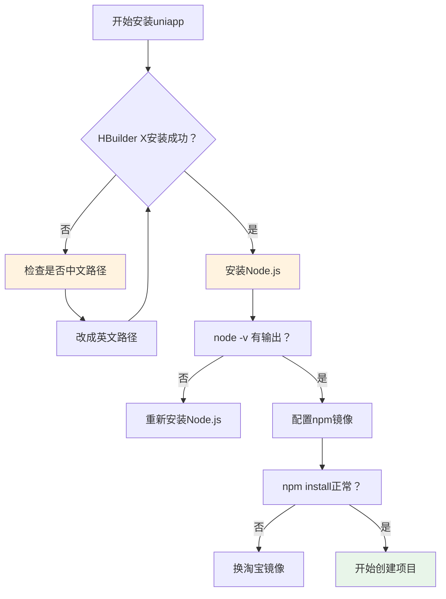

---

## 三、新手坑二：页面跳转总是不对

### 3.1 问题表现

"我从A页面跳到B页面，为什么点返回还是在当前页面？"

"跳转后数据没了？"

"用navigateTo、redirectTo、switchTab给我整晕了，到底用哪个？"

### 3.2 uniapp的页面跳转方式

uniapp的页面跳转有好几种方式，适用场景不同：

| API | 作用 | 特点 |
|-----|------|------|
| `navigateTo` | 保留当前页，跳转新页面 | 最常用，有返回按钮 |
| `redirectTo` | 关闭当前页，跳转新页面 | 不能返回 |
| `switchTab` | 跳转到tabBar页面 | 只能用于tab页 |
| `reLaunch` | 关闭所有页，打开新页面 | 类似重启 |
| `navigateBack` | 返回上一页 | 类似返回按钮 |

### 3.3 正确写法

**普通页面跳转（保留当前页）**

```javascript
// A页面
uni.navigateTo({
    url: '/pages/detail/detail?id=1&name=tom'
})

// B页面（接收参数）
export default {
    onLoad(options) {
        console.log(options.id)  // 1
        console.log(options.name)  // tom
    }
}
```

**跳转到TabBar页面（必须用switchTab）**

```javascript
// 错误 ❌
uni.navigateTo({
    url: '/pages/index/index'  // 这是tab页
})

// 正确 ✅
uni.switchTab({
    url: '/pages/index/index'
})
```

**关闭当前页并跳转（不保留历史）**

```javascript
uni.redirectTo({
    url: '/pages/detail/detail?id=1'
})
```

**返回上一页**

```javascript
// 方法一：自动返回（有返回按钮时）
// 点击左上角返回按钮即可

// 方法二：手动返回
uni.navigateBack({
    delta: 1  // 返回1页
})
```

### 3.4 路径的那些坑

**坑点一：路径写错了**

```javascript
// 错误 ❌ —— 少了pages前的斜杠
uni.navigateTo({
    url: 'pages/detail/detail'  // 找不到！
})

// 正确 ✅ —— 路径要以/开头
uni.navigateTo({
    url: '/pages/detail/detail'
})
```

**坑点二：tabBar页面不能用navigateTo**

如果你配置的页面是tabBar，那么只能用`switchTab`，`navigateTo`会失效或者报错。

**坑点三：绝对路径vs相对路径**

在pages.json里配置路径是绝对路径，在js代码里也是绝对路径，但组件里引用组件可以用相对路径。

```javascript
// pages.json（绝对路径）
{
    "path": "pages/index/index",
    "style": { ... }
}

// components引入（相对路径）
import MyButton from './components/MyButton.vue'
```

### 3.5 页面跳转流程图

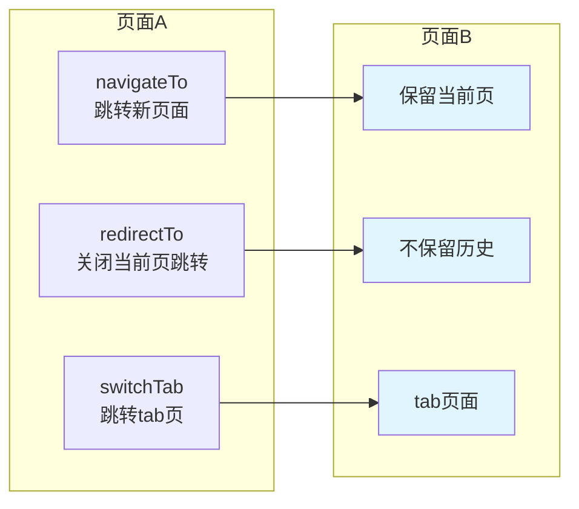

---

## 四、新手坑三：样式总是被覆盖

### 4.1 问题表现

"我写的样式怎么不生效？"

"别人的样式好像覆盖了我的？"

"在小程序上样式乱套了？"

### 4.2 样式生效规则

uniapp的样式遵循Vue的样式隔离原则，但有一些要注意的点：

**App.vue里的样式是全局的**

```vue
<!-- App.vue -->
<style>
/* 这里写的是全局样式，会影响所有页面 */
.text {
    color: red;
}
</style>
```

**page目录下的是页面级样式**

```vue
<!-- pages/index/index.vue -->
<style scoped>
/* scoped表示只在当前页面生效，不会影响其他页面 */
.text {
    color: blue;
}
</style>
```

### 4.3 样式覆盖问题

**问题：第三方组件样式覆盖不了？**

```vue
<template>
    <!-- 第三方组件 -->
    <m-date-picker class="my-picker" />
</template>

<style>
/* 因为第三方组件用了scoped，我们需要用深度选择器 */
/deep/ .m-date-picker {
    background: red;
}

/* 或者用 ::v-deep */
::v-deep .m-date-picker {
    background: red;
}
</style>
```

### 4.4 各平台样式差异

uniapp的样式在各平台可能有差异，主要注意：

| 平台 | 注意事项 |
|------|---------|
| H5 | 基本和Web一致 |
| 小程序 | 有些CSS属性不支持 |
| App | 和Web基本一致 |
| nvue | 只能用flex和特定的样式 |

**小程序不支持的CSS：**

```css
/* ❌ 这些在小程序里不生效 */
.class {
    position: fixed;  /* App和H5可以，微信小程序部分支持 */
    bottom: 20px;     /* 可以用但要注意兼容 */
    filter: blur(10px); /* 部分支持 */
    calc(100% - 20px); /* 不支持 */
}
```

### 4.5 正确使用flex布局

```css
.container {
    display: flex;
    flex-direction: column;  /* 垂直排列 */
    justify-content: center;  /* 垂直居中 */
    align-items: center;        /* 水平居中 */
}
```

> 小技巧：uniapp推荐使用flex布局，兼容性最好。

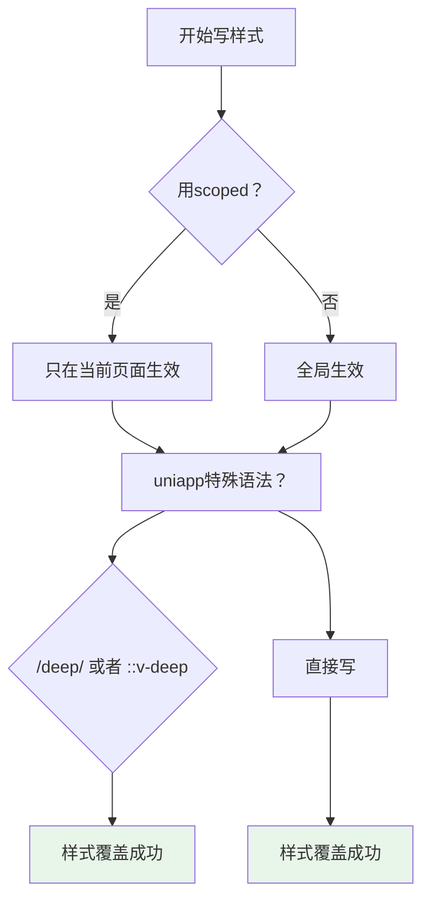

---

## 五、新手坑四：数据绑定不生效

### 5.1 问题表现

"我明明改了数据，为什么页面没更新？"

"console.log打印出来了，但页面上没有？"

"V-model好像没效果？"

### 5.2 data初始化问题

**问题：data里没定义，直接用会报错**

```javascript
export default {
    data() {
        return {
            // ✅ 正确：先在data里定义
            message: 'Hello',
            count: 0,
            list: []
        }
    },
    methods: {
        updateMessage() {
            // 这个可以
            this.message = 'World'
            
            // 这个也可以
            this.count++
            
            // 这个可以
            this.list.push({id: 1})
        }
    }
}
```

### 5.3 数组和对象的数据响应

**问题：修改数组的某个元素，页面不更新**

```javascript
export default {
    data() {
        return {
            users: [
                {name: 'Tom', age: 20},
                {name: 'Jane', age: 18}
            ]
        }
    },
    methods: {
        // ❌ 错误：这样改不会触发响应
        updateUser() {
            this.users[0].name = 'Mike'
        }
    }
}
```

**正确做法**

```javascript
// 方法一：使用Vue.set
Vue.set(this.users, 0, {name: 'Mike', age: 20})

// 方法二：使用this.$set
this.$set(this.users, 0, {name: 'Mike', age: 20})

// 方法三：重新赋值整个数组（最简单）
this.users[0] = {...this.users[0], name: 'Mike'}
this.users = [...this.users]

// 方法四：使用splice
this.users.splice(0, 1, {name: 'Mike', age: 20})
```

### 5.4 对象的数据响应

同样的问题也存在于对象：

```javascript
export default {
    data() {
        return {
            user: {
                name: 'Tom',
                age: 20
            }
        }
    },
    methods: {
        // ❌ 错误：不触发响应
        updateUser() {
            this.user.job = 'Engineer'
        }
    }
}
```

**正确做法**

```javascript
// 方法一：重新赋值
this.user = {...this.user, job: 'Engineer'}

// 方法二：使用set
this.$set(this.user, 'job', 'Engineer')
```

### 5.5 computed属性使用

```javascript
export default {
    data() {
        return {
            firstName: 'John',
            lastName: 'Doe'
        }
    },
    computed: {
        // ✅ computed会自动响应
        fullName() {
            return this.firstName + ' ' + this.lastName
        }
    }
}
```

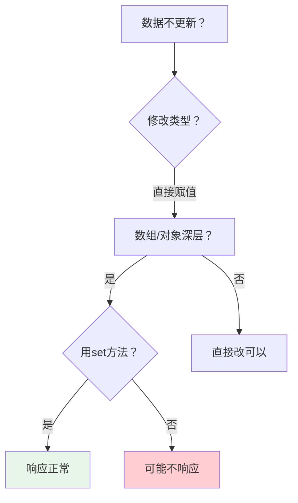

---

## 六、新手坑五：生命周期搞不清楚

### 6.1 问题表现

"onLoad和onShow区别是啥？"

"onShow和onReady谁先执行？"

"为什么我 onLoad 里请求的数据到了 onShow 就没了？"

### 6.2 uniapp页面生命周期

uniapp的页面有自己的一套生命周期，和Vue不太一样：

| 生命周期 | 调用时机 | 常用场景 |
|---------|---------|---------|
| onInit | 页面初始化 | 参数初始化 |
| onLoad | 页面加载 | 加载数据、网络请求 |
| onShow | 页面显示 | 每次进入都执行、刷新数据 |
| onReady | 页面渲染完成 | 获取DOM信息 |
| onHide | 页面隐藏 | 暂停计时器等 |
| onUnload | 页面卸载 | 清理工作 |

### 6.3 执行顺序

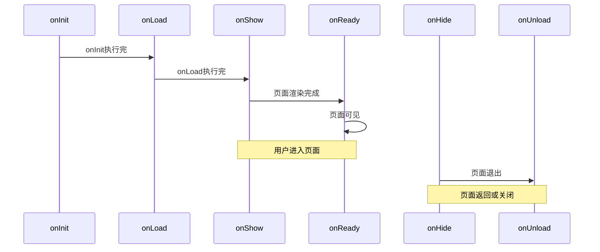

### 6.4 各个生命周期的坑

**坑点一：onShow里重复请求**

```javascript
export default {
    data() {
        return {
            list: []
        }
    },
    onLoad() {
        // ✅ 只在第一次加载时请求
        this.getList()
    },
    onShow() {
        // ⚠️ 每次显示都执行，可能导致重复请求
        // 如果需要刷新数据，用这个
        // this.getList()
    },
    methods: {
        getList() {
            uni.request({
                url: '/api/list',
                success: (res) => {
                    this.list = res.data
                }
            })
        }
    }
}
```

**坑点二：在onReady里获取元素高度**

```javascript
export default {
    onReady() {
        // ✅ 页面渲染完成，可以获取元素信息
        const query = uni.createSelectorQuery()
        query.select('#box').boundingClientRect(data => {
            console.log(data.width, data.height)
        }).exec()
    }
}
```

### 6.5 应用生命周期（App.vue）

| 生命周期 | 说明 |
|---------|------|
| onLaunch | App启动 |
| onShow | App显示到前台 |
| onHide | App隐藏到后台 |

```javascript
export default {
    onLaunch() {
        console.log('App Launch')
        // 初始化工作
    },
    onShow() {
        console.log('App Show')
    },
    onHide() {
        console.log('App Hide')
    }
}
```

---

## 七、新手坑六：组件通信好头痛

### 7.1 问题表现

"父组件怎么传数据给子组件？"

"子组件怎么通知父组件？"

"兄弟组件之间怎么通信？"

### 7.2 父传子：props

**父组件**

```vue
<template>
    <!-- 给子组件传值 -->
    <ChildComponent 
        :title="message" 
        :count="num"
    />
</template>

<script>
import ChildComponent from './components/ChildComponent.vue'

export default {
    components: {
        ChildComponent
    },
    data() {
        return {
            message: 'Hello',
            num: 10
        }
    }
}
</script>
```

**子组件**

```vue
<template>
    <view>{{ title }} - {{ count }}</view>
</template>

<script>
export default {
    // 接收父组件的数据
    props: {
        title: {
            type: String,
            default: ''
        },
        count: {
            type: Number,
            default: 0
        }
    },
    methods: {
        // 使用
        useData() {
            console.log(this.title)  // Hello
            console.log(this.count)  // 10
        }
    }
}
</script>
```

### 7.3 子传父：$emit

**子组件**

```vue
<template>
    <button @click="sendToParent">发送给父组件</button>
</template>

<script>
export default {
    methods: {
        sendToParent() {
            // 触发父组件的事件
            this.$emit('childEvent', '数据')
        }
    }
}
</script>
```

**父组件**

```vue
<template>
    <ChildComponent @childEvent="handleEvent" />
</template>

<script>
import ChildComponent from './components/ChildComponent.vue'

export default {
    components: {
        ChildComponent
    },
    methods: {
        handleEvent(data) {
            console.log('收到:', data)  // 收到: 数据
        }
    }
}
</script>
```

### 7.4 兄弟组件通信

**方法一：父组件中转**

```vue
<!-- 父组件 -->
<template>
    <ChildA @event="handleA" />
    <ChildB :data="data" />
</template>

<script>
export default {
    data() {
        return {
            data: ''
        }
    },
    methods: {
        handleA(val) {
            this.data = val
        }
    }
}
</script>
```

**方法二：EventBus（事件总线）**

```javascript
// 创建一个EventBus.js
import Vue from 'vue'
export default new Vue()
```

```vue
<!-- ChildA -->
<script>
import EventBus from '@/EventBus.js'

export default {
    methods: {
        send() {
            EventBus.$emit('event', 'hello')
        }
    }
}
</script>
```

```vue
<!-- ChildB -->
<script>
import EventBus from '@/EventBus.js'

export default {
    mounted() {
        EventBus.$on('event', (data) => {
            console.log(data)  // hello
        })
    },
    beforeDestroy() {
        // ⚠️ 记得销毁监听
        EventBus.$off('event')
    }
}
</script>
```

### 7.5 vuex（状态管理）

如果项目比较复杂，用vuex更方便：

```javascript
// store/index.js
import Vue from 'vue'
import Vuex from 'vuex'

Vue.use(Vuex)

export default new Vuex.Store({
    state: {
        count: 0
    },
    mutations: {
        increment(state) {
            state.count++
        }
    },
    actions: {
        increment({commit}) {
            commit('increment')
        }
    }
})
```

```vue
<!-- 使用 -->
<script>
import store from '@/store'

export default {
    computed: {
        count() {
            return store.state.count
        }
    },
    methods: {
        add() {
            store.commit('increment')
        }
    }
}
</script>
```

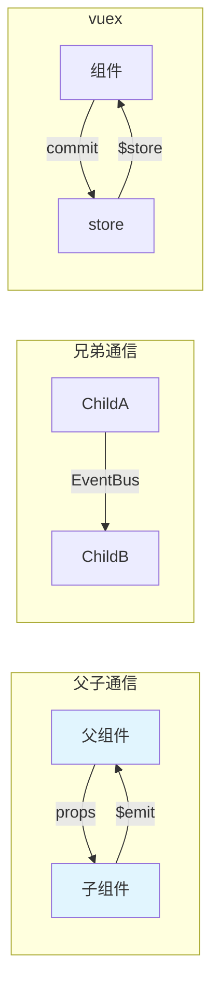

---

## 八、新手坑七：条件编译搞不懂

### 8.1 问题表现

"为什么有些代码只在微信小程序里有效？"

"App端和小程序端逻辑不同怎么办？"

" uni.getSystemInfo 和 uni.getSystemInfoSync 用哪个？"

### 8.2 条件编译语法

uniapp最强大的功能之一就是条件编译，一套代码适配多端：

**#ifdef —— 如果定义了某个平台**

```javascript
// 只有微信小程序才执行的代码
// #ifdef MP-WEIXIN
console.log('这是微信小程序')
// #endif

// 只有App才执行的代码
// #ifdef APP-PLUS
console.log('这是App')
// #endif
```

**#ifndef —— 如果没有定义某个平台**

```javascript
// 除了微信小程序，其他都执行
// #ifndef MP-WEIXIN
console.log('非微信小程序')
// #endif
```

### 8.3 在js中使用条件编译

```javascript
export default {
    methods: {
        getSystemInfo() {
            // #ifdef MP-WEIXIN
            const info = uni.getSystemInfoSync()
            // #endif
            
            // #ifdef APP-PLUS
            const info = plus.device.info
            // #endif
            
            console.log(info)
        }
    }
}
```

### 8.4 在css中使用条件编译

```css
/* 在微信小程序里用rpx，其他用px */
.container {
    /* #ifdef MP-WEIXIN */
    width: 750rpx;
    /* #endif */
    
    /* #ifndef MP-WEIXIN */
    width: 750px;
    /* #endif */
}
```

### 8.5 pages.json中的条件编译

```json
{
    "pages": [
        {
            "path": "pages/index/index",
            "style": {
                // #ifdef MP-WEIXIN
                "navigationBarTitleText": "微信小程序标题"
                // #endif
                
                // #ifdef APP-PLUS
                "navigationBarTitleText": "App标题"
                // #endif
            }
        }
    ]
}
```

### 8.6 平台判断变量

| 变量 | 平台 |
|------|------|
| `MP-WEIXIN` | 微信小程序 |
| `MP-ALIPAY` | 支付宝小程�� |
| `MP-TOUTIAO` | 字节跳动小程序 |
| `APP-PLUS` | App（iOS/Android） |
| `H5` | H5 |

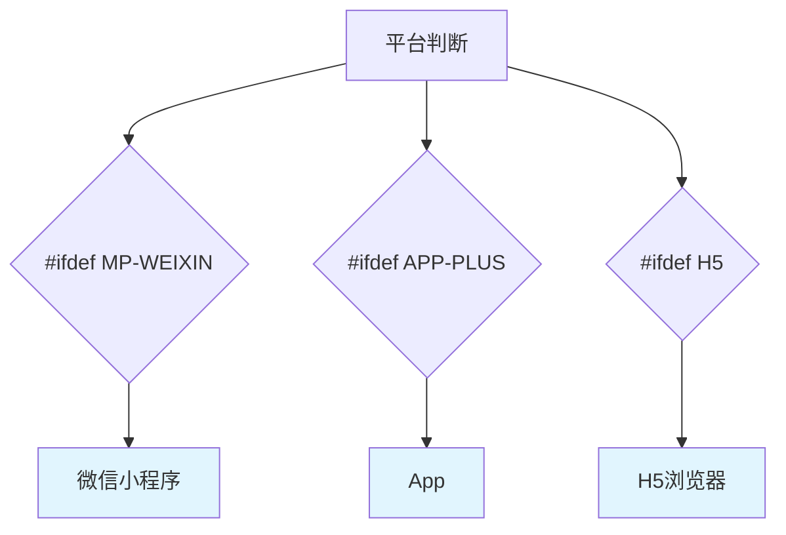

---

## 九、新手坑八：网络请求总是失败

### 9.1 问题表现

"request请求失败了？"

"后端返回JSON解析错误？"

"跨域问题怎么解决？"

### 9.2 request基本用法

```javascript
uni.request({
    url: 'https://example.com/api/user',  // 接口地址
    method: 'GET',  // 请求方法：GET、POST、PUT、DELETE
    data: {  // 请求参数
        id: 1
    },
    header: {  // 请求头
        'Content-Type': 'application/json'
    },
    success: (res) => {
        console.log(res.data)
    },
    fail: (err) => {
        console.error(err)
    }
})
```

### 9.3 封装request拦截器

```javascript
// request.js
const request = (options) => {
    return new Promise((resolve, reject) => {
        uni.request({
            url: 'https://example.com' + options.url,
            method: options.method || 'GET',
            data: options.data || {},
            header: {
                'Content-Type': 'application/json',
                'Authorization': 'Bearer ' + uni.getStorageSync('token'),
                ...options.header
            },
            success: (res) => {
                if (res.statusCode === 200) {
                    resolve(res.data)
                } else {
                    reject(res)
                }
            },
            fail: (err) => {
                reject(err)
            }
        })
    })
}

export default request
```

### 9.4 常用请求方法封装

```javascript
// api.js
import request from './request'

export const getUser = (id) => request({
    url: '/api/user/' + id,
    method: 'GET'
})

export const login = (data) => request({
    url: '/api/login',
    method: 'POST',
    data
})

export const updateUser = (id, data) => request({
    url: '/api/user/' + id,
    method: 'PUT',
    data
})
```

### 9.5 调用方式

```javascript
import { getUser, login } from '@/api'

export default {
    async onLoad() {
        try {
            const user = await getUser(1)
            console.log(user)
        } catch (err) {
            console.error('请求失败', err)
        }
    }
}
```

### 9.6 常见问题解决

| 问题 | 原因 | 解决办法 |
|------|------|---------|
| request:fail | 网络不通 | 检查域名、HTTPS |
| 域名不匹配 | 未在manifest配置 | 配置合法域名 |
| 跨域问题 | 浏览器限制 | H5使用代理 |

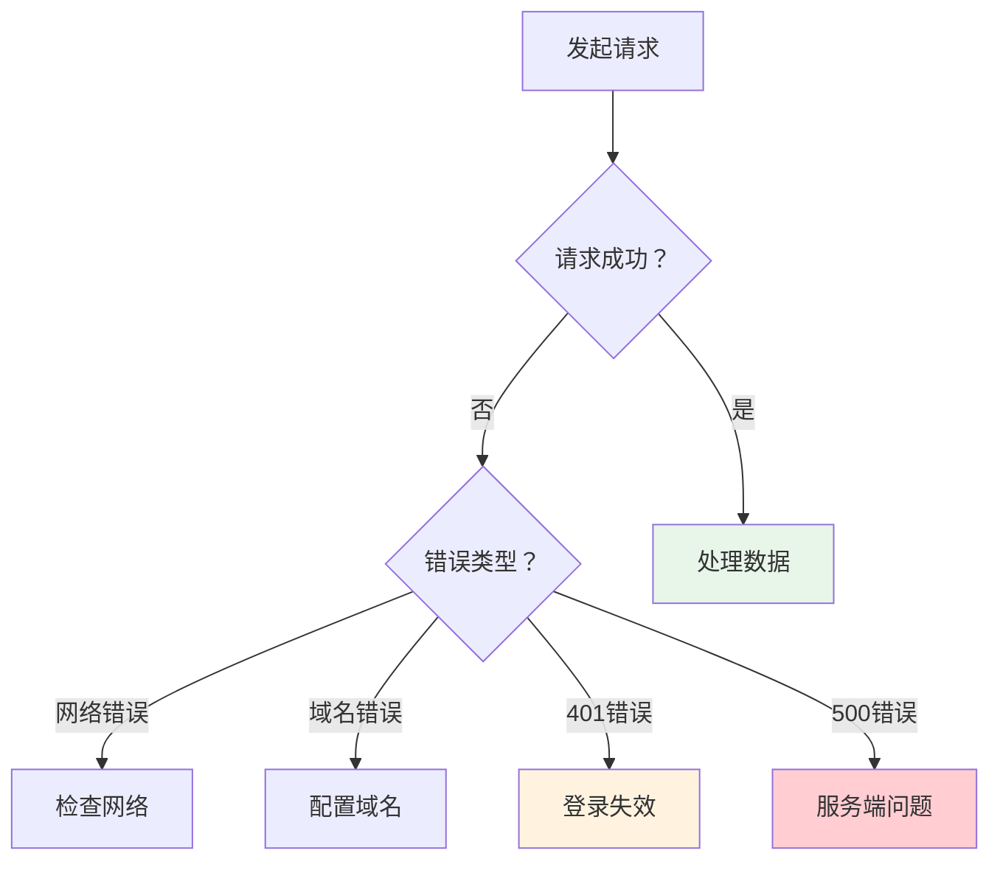

---

## 十、新手坑九：样式在不同端显示不一样

### 10.1 问题表现

"在H5上正常的样式，到小程序上就乱了？"

"App上的布局和其他端不一样？"

"单位用px还是rpx？"

### 10.2 尺寸单位

uniapp支持的尺寸单位：

| 单位 | 说明 | 适用场景 |
|------|------|---------|
| px | 物理像素 | 所有平台 |
| rpx | 响应式像素 | 推荐小程序使用 |
| upx | uniapp像素 | App推荐使用 |

> 小技巧：微信小程序建议用rpx，App建议用upx或px，H5用px。

### 10.3 safe-area（安全区域）

iPhone X等有刘海的机型，需要注意安全区域：

```css
/* #ifdef APP-PLUS */
.container {
    padding-top: var(--status-bar-height);
    padding-bottom: env(safe-area-inset-bottom);
}
/* #endif */
```

### 10.4 各平台样式差异表

| CSS属性 | H5 | 微信小程序 | App |
|--------|-----|-----------|-----|
| 123calc() | 支持 | 不支持 | 支持 |
| position:fixed | 支持 | 部分支持 | 支持 |
| filter | 支持 | 部分支持 | 支持 |
| flex-basis | 支持 | 支持 | 支持 |
| 媒体查询 | 支持 | 部分支持 | 支持 |

### 10.5 通用布局方案

```css
.container {
    /* 使用flex布局 */
    display: flex;
    flex-direction: column;
}

/* #ifdef APP-PLUS */
.container {
    /* App特殊处理 */
    padding-bottom: 20px;
}
/* #endif */
```

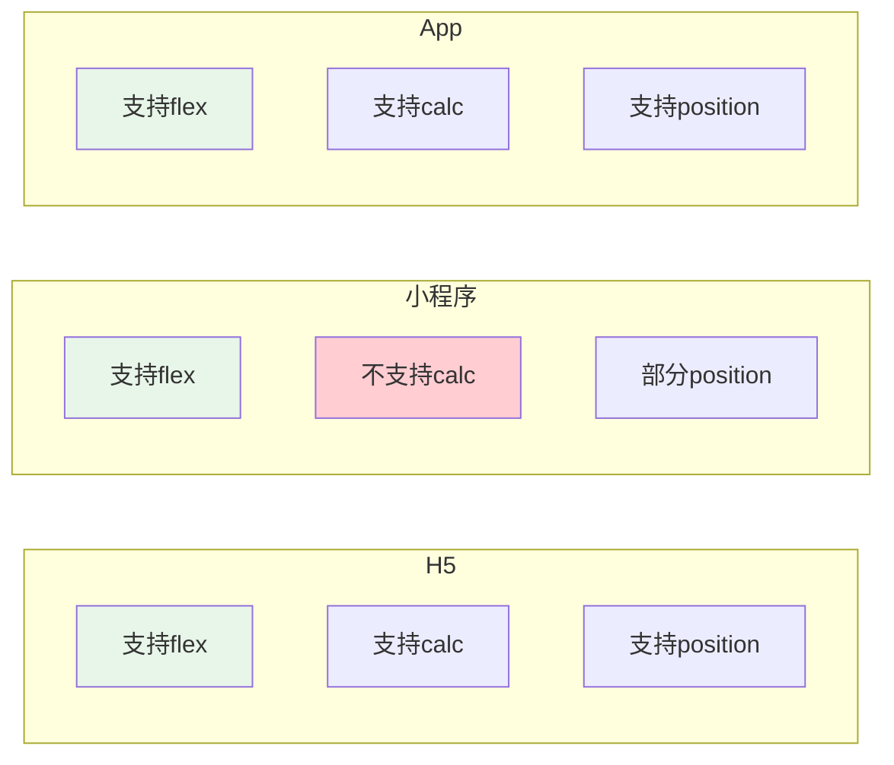

---

## 十一、新手坑十：图片加载不出来

### 11.1 问题表现

"本地图片怎么显示不出来？"

"网络图片不显示？"

"动态图片路径不对？"

### 11.2 本地图片

**静态资源放在static目录**

```
项目根目录/
├── pages/
├── static/
│   ├── logo.png
│   └── icon/
│       └── home.png
└── App.vue
```

**引用方式**

```vue
<!-- 绝对路径 -->
<image src="/static/logo.png" />

<!-- 相对路径 -->
<image src="../../static/logo.png" />

<!-- data数据绑定 -->
<image :src="imgUrl" />

<script>
export default {
    data() {
        return {
            imgUrl: '/static/logo.png'
        }
    }
}
</script>
```

### 11.3 网络图片

```vue
<image 
    src="https://example.com/image.jpg" 
    mode="aspectFit"
/>
```

> 注意：网络图片需要在manifest配置合法域名！

### 11.4 图片mode属性

| mode | 说明 |
|------|------|
| scaleToFill | 拉伸（可能变形） |
| aspectFit | 适应（完整显示） |
| aspectFill | 覆盖（可能裁剪） |
| widthFix | 宽度固定 |
| heightFix | 高度固定 |

### 11.5 图片加载失败处理

```vue
<template>
    <image 
        :src="imgUrl" 
        @error="handleError"
        @load="handleLoad"
    />
</template>

<script>
export default {
    data() {
        return {
            imgUrl: '/static/placeholder.png'
        }
    },
    methods: {
        handleError() {
            // 加载失败显示占位图
            this.imgUrl = '/static/placeholder.png'
        },
        handleLoad() {
            console.log('加载成功')
        }
    }
}
</script>
```

---

## 十二、新手坑十一：调试程序不会用

### 12.1 问题表现

"console.log在哪看？"

"怎么打断点调试？"

"手机真机怎么调试？"

### 12.2 console调试

```javascript
console.log('info')    // 一般信息
console.warn('warn')   // 警告
console.error('error') // 错误
```

在H5控制台查看，小程序在开发者工具的控制台查看。

### 12.3 真机调试

**方法一：USB连接调试**

1. 手机开启开发者选项和USB调试
2. 用数据线连接电脑
3. HBuilder X点击"运行->运行到手机"

**方法二：局域网调试**

1. 确保手机和电脑在同一WiFi
2. HBuilder X点击"运行->运行到手机"
3. 选择"局域网"

**方法三：调试基座**

1. HBuilder X点击"运行->运行到App调试基座"
2. 安装App到手机
3. 在App里操作可以看到日志

### 12.4 vconsole移动端调试

```javascript
// 在App.vue的onLaunch里
// #ifdef H5
import VConsole from 'vconsole'
new VConsole()
// #endif
```

安装：

```bash
npm install vconsole
```

---

## 十三、新手坑十二：打包发布不会弄

### 13.1 问题表现

"怎么打包成App？"

"打包后怎么安装？"

"小程序怎么发布？"

### 13.2 打包为H5

1. 打开`manifest.json`
2. 选择"发行"->"H5发行"
3. 点击"打包"
4. 在`/unpackage/dist/build/h5`目录找到文件

### 13.3 打包为微信小程序

1. 打开`manifest.json`
2. 选择"微信小程序配置"
3. 填写AppID
4. 点击"发行"->"微信小程序"
5. 在微信开发者工具导入

### 13.4 打包为App（iOS/Android）

**Android打包：**

1. 打开`manifest.json`
2. 选择"App常用其它设置"
3. 配置应用名称、图标等
4. 点击"发行"->"打包App（native）"
5. 选择Android打包

**iOS打包：**

1. 需要Mac电脑
2. 安装HBuilderX
3. 打包时选择"iOS打包"
4. 导出.xcarchive文件

### 13.5 版本号配置

在`manifest.json`中配置：

```json
{
    "versionName": "1.0.0",
    "versionCode": "100"
}
```

> 提示：versionCode必须是整数，每次发布要比上次大。

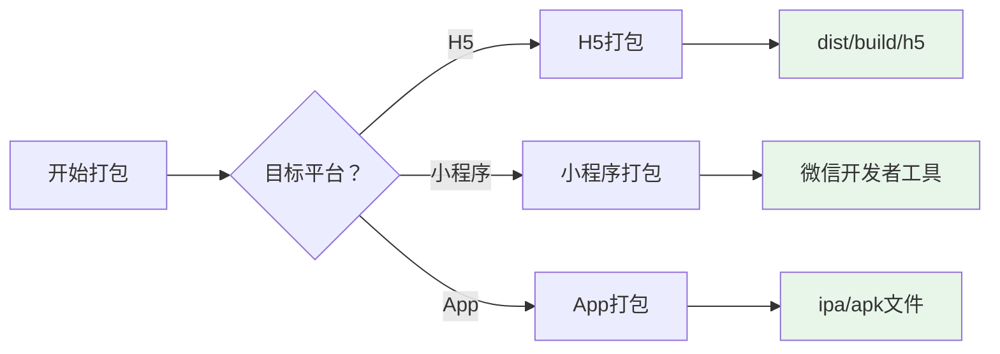

---

## 十四、新手坑十三：scroll-view不滚动

### 14.1 问题表现

"scroll-view不滚动？"

"设置了高度但不能滚动？"

"sticky吸顶无效？"

### 14.2 scroll-view正确用法

scroll-view需要设置固定高度：

```vue
<template>
    <scroll-view 
        class="scroll-view" 
        scroll-y 
        @scrolltoupper="onUpper"
        @scrolltolower="onLower"
    >
        <view class="item" v-for="i in 20" :key="i">
            {{i}}
        </view>
    </scroll-view>
</template>

<style>
.scroll-view {
    height: 500px;  /* ⚠️ 必须设置高度 */
}
.item {
    height: 100px;
    line-height: 100px;
}
</style>
```

### 14.3 下拉刷新和上拉加载

```vue
<template>
    <scroll-view 
        scroll-y 
        :refresher-enabled="true"
        : refresher-triggered="refreshing"
        @refresherrefresh="onRefresh"
        @scrolltolower="onLoadMore"
        :lower-threshold="100"
    >
        <view v-for="i in list" :key="i">{{i}}</view>
    </scroll-view>
</template>

<script>
export default {
    data() {
        return {
            list: [1,2,3,4,5],
            refreshing: false
        }
    },
    methods: {
        onRefresh() {
            this.refreshing = true
            setTimeout(() => {
                this.list = [1,2,3,4,5]
                this.refreshing = false
            }, 1000)
        },
        onLoadMore() {
            // 加载更多数据
            this.list.push(999)
        }
    }
}
</script>
```

---

## 十五、新手坑十四：tabBar配置总是不对

### 15.1 问题表现

"tabBar图标不显示？"

"tabBar点击没反应？"

"tabBar文字不显示？"

### 15.2 pages.json配置

```json
{
    "pages": [
        {
            "path": "pages/index/index",
            "style": {
                "navigationBarTitleText": "首页"
            }
        },
        {
            "path": "pages/user/user",
            "style": {
                "navigationBarTitleText": "我的"
            }
        }
    ],
    "tabBar": {
        "color": "#7A7E83",
        "selectedColor": "#3cc51f",
        "borderStyle": "black",
        "backgroundColor": "#ffffff",
        "list": [
            {
                "pagePath": "pages/index/index",
                "text": "首页",
                "iconPath": "static/tabbar/home.png",
                "selectedIconPath": "static/tabbar/home-active.png"
            },
            {
                "pagePath": "pages/user/user",
                "text": "我的",
                "iconPath": "static/tabbar/user.png",
                "selectedIconPath": "static/tabbar/user-active.png"
            }
        ]
    }
}
```

### 15.3 注意事项

1. **图标必须是本地文件**，网络URL不行
2. **图标大小有限制**：建议81x81像素
3. **tabBar页面必须在pages里先定义**
4. **不要用navigateTo跳转tabBar页面**，要用switchTab

### 15.4 tabBar跳转逻辑

```javascript
// ❌ 错误
uni.navigateTo({
    url: '/pages/user/user'
})

// ✅ 正确
uni.switchTab({
    url: '/pages/user/user'
})
```

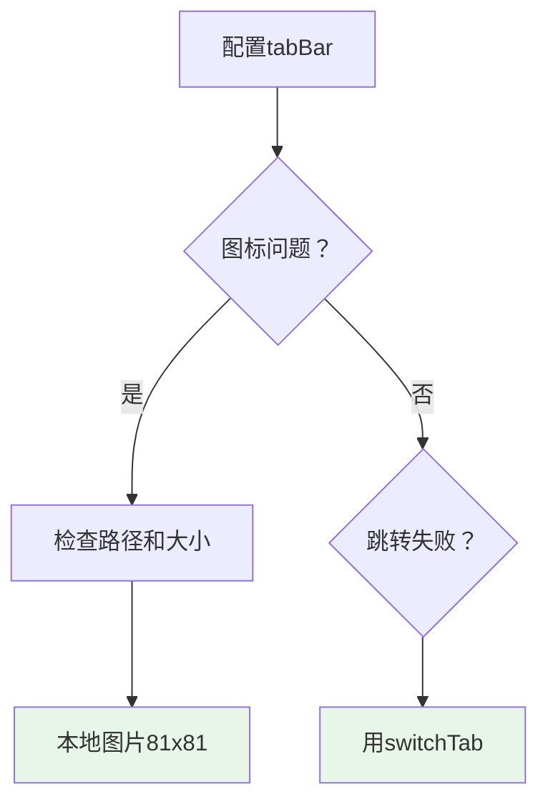

---

## 十六、新手坑十五：运行到模拟器失败

### 16.1 问题表现

"找不到模拟器？"

"运行到模拟器一直超时？"

"ADB连接失败？"

### 16.2 Android模拟器设置

**夜神模拟器：**

1. 打开夜神模拟器
2. 设置 -> 关于平板电脑 -> 版本号（点击7次打开开发者模式）
3. 设置 -> 开发者选项 -> USB调试打开
4. 在夜神安装目录下运行：

```bash
adb connect 127.0.0.1:62001
```

**蓝叠模拟器：**

```bash
adb connect 127.0.0.1:5555
```

### 16.3 HBuilder X配置

1. 工具 -> 选项 -> 运行配置 -> Android模拟器
2. 选择对应的模拟器
3. 点击"运行"->"运行到Android模拟器"

### 16.4 常见问题

| 问题 | 原因 | 解决 |
|------|------|------|
| 找不到模拟器 | 模拟器未启动 | 启动模拟器 |
| ADB失败 | 端口被占用 | 重启ADB服务 |
| 超时 | 模拟器太卡 | 换真机调试 |

---

| 序号 | 坑名 | 解决办法 |
|------|------|---------|
| 1 | 环境配置 | 用正式版HBuilder X，Node.js用14/16.x |
| 2 | 页面跳转 | 记住navigateTo、redirectTo、switchTab区别 |
| 3 | 样式覆盖 | 用/deep/或::v-deep |
| 4 | 数据响应 | 对象数组用this.$set修改 |
| 5 | 生命周期 | onLoad只执行一次，onShow每次显示执行 |
| 6 | 组件通信 | props向下，$emit向上，EventBus兄弟 |
| 7 | 条件编译 | #ifdef判断平台 |
| 8 | 网络请求 | 封装request拦截器 |
| 9 | 平台差异 | 用flex布局，单位用rpx/upx |
| 10 | 图片加载 | 放static目录，配置合法域名 |
| 11 | 打包发布 | manifest配置版本号 |
| 12 | scroll-view | 必须设置固定高度 |
| 13 | tabBar配置 | 用本地图片，switchTab跳转 |
| 14 | 模拟器运行 | 先启动模拟器，连接ADB |
| 15 | 数据绑定 | Vue.set修改深层对象 |

---