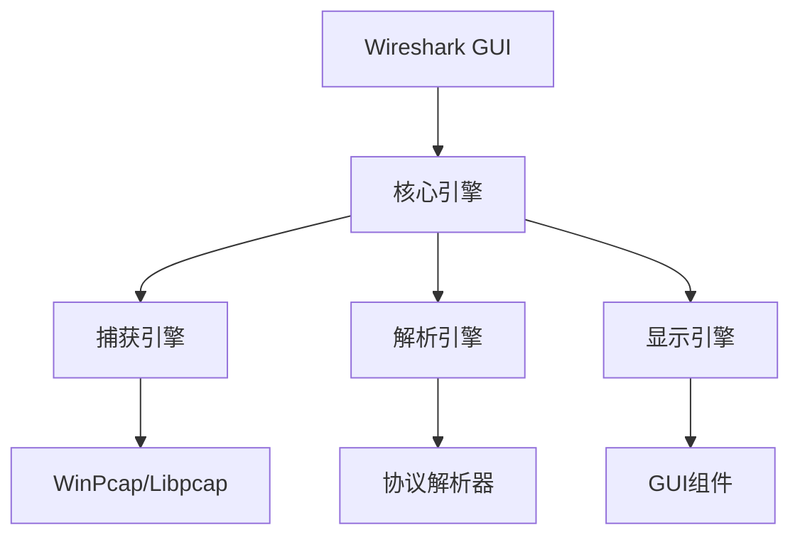
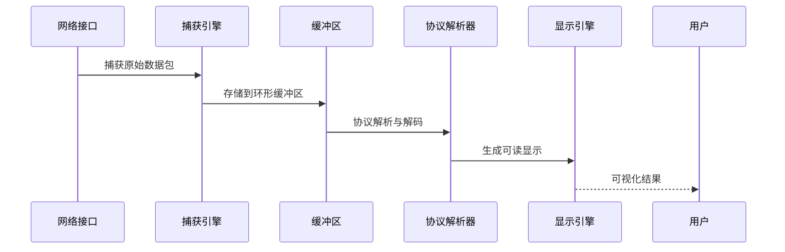
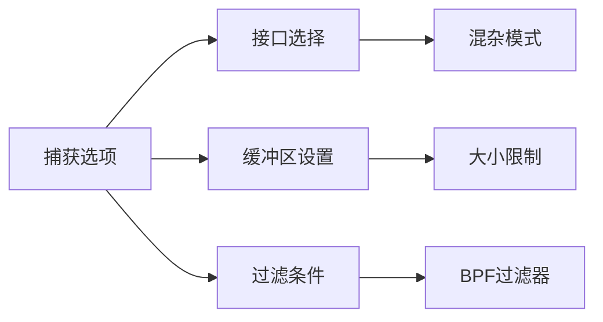
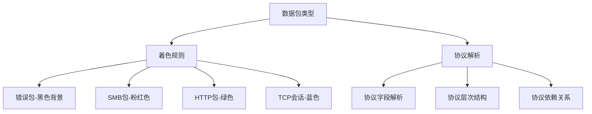
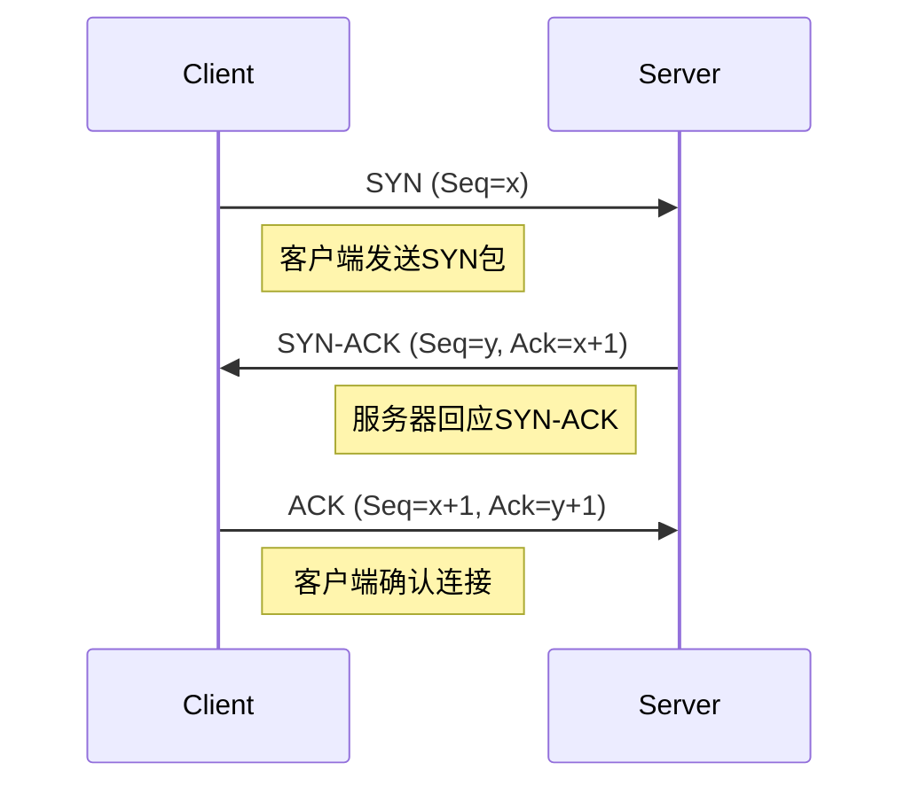
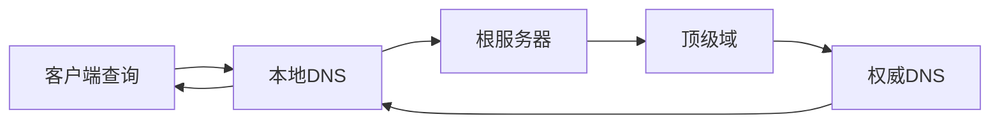
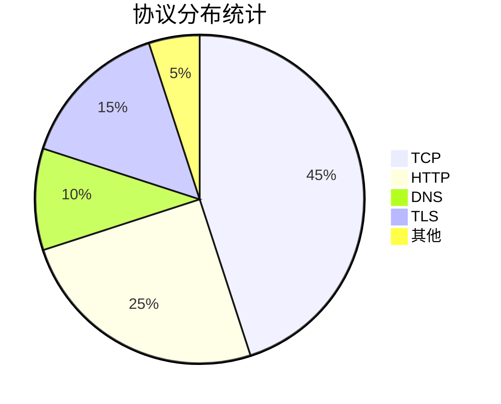
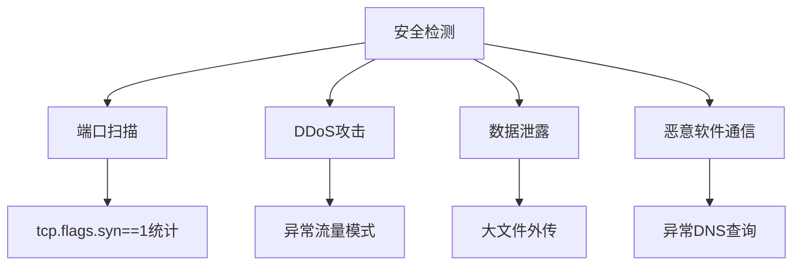
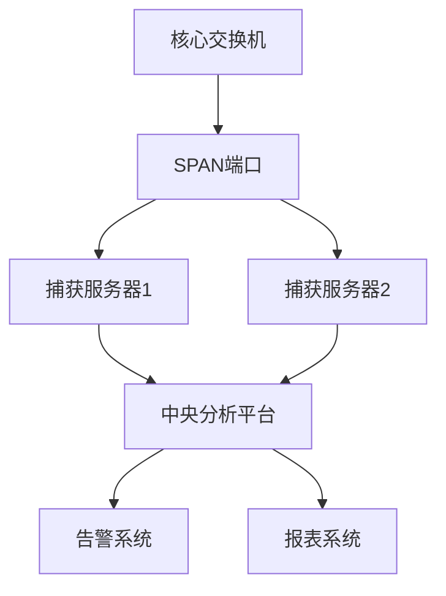

# Wireshark完全指南：从网络抓包入门到安全分析实战

> 深度解析全球最强大的网络协议分析工具，掌握企业级网络故障排查与安全审计技能

## 一、引言：为什么需要Wireshark？

在当今数字化的世界中，网络已成为企业和个人生活的命脉。无论是云服务的稳定性、微服务间的通信，还是安全威胁的检测，网络数据包分析能力都成为技术人员的核心竞争力。Wireshark作为全球最流行的网络协议分析工具，不仅能帮助我们诊断网络故障，更是网络安全分析、协议研究和教育培训的利器。

## 二、Wireshark基础概念与架构解析

### 2.1 Wireshark的核心组件

Wireshark的成功离不开其模块化架构设计，主要包含以下核心组件：



**捕获引擎**：基于WinPcap（Windows）或Libpcap（Linux/macOS），负责从网络接口捕获原始数据包。

**解析引擎**：包含1000+种协议的解析器，能够将二进制数据转换为可读的协议信息。

**显示引擎**：提供过滤、着色、统计等可视化功能。

### 2.2 数据包的生命周期

理解数据包在Wireshark中的处理流程至关重要：



## 三、Wireshark安装与配置详解

### 3.1 跨平台安装指南

**Windows平台**：
- 下载官方安装包，注意勾选"Install WinPcap"或"Install Npcap"
- Npcap相比WinPcap提供了更好的性能和NDIS 6.x支持
- 安装后可能需要重启系统

**macOS平台**：
```bash
# 使用Homebrew安装
brew install --cask wireshark

# 配置抓包权限
sudo chown $(whoami) /dev/bpf*
```

**Linux平台**：
```bash
# Ubuntu/Debian
sudo apt update
sudo apt install wireshark

# 解决权限问题
sudo usermod -a -G wireshark $USER
```

### 3.2 关键配置优化

为了提高分析效率，建议进行以下配置：

**1. 界面配置**：
- 启用"Packet List"中的时间格式为相对时间
- 设置适合的列显示（协议、长度、信息等）
- 配置自动滚屏选项

**2. 捕获配置**：


**3. 性能优化**：
- 调整捕获缓冲区大小（默认2MB，建议4-8MB）
- 启用多线程捕获（现代版本默认支持）
- 配置合适的显示过滤器缓存

## 四、Wireshark核心功能深度解析

### 4.1 捕获过滤器（BPF语法）

捕获过滤器在数据包进入Wireshark之前进行筛选，能显著减少内存占用和提高性能。

**基本语法规则**：
```
[协议] [方向] [主机] [逻辑操作符] [值]
```

**常用捕获过滤器示例**：
```bash
# 只捕获HTTP流量
port 80 or port 443

# 捕获特定主机的流量
host 192.168.1.100

# 排除广播和多播流量
not broadcast and not multicast

# 捕获特定协议的流量
udp port 53          # DNS
tcp port 25          # SMTP
tcp portrange 8000-8080  # 自定义端口范围
```

### 4.2 显示过滤器（Wireshark专用语法）

显示过滤器对已捕获的数据包进行筛选，语法更丰富灵活。

**常用显示过滤器**：
```bash
# IP地址过滤
ip.addr == 192.168.1.1
ip.src == 192.168.1.100
ip.dst == 8.8.8.8

# 协议过滤
tcp
udp
http
dns

# 端口过滤
tcp.port == 80
udp.port == 53

# 组合过滤
http and ip.addr == 192.168.1.100
tcp.flags.syn == 1 and tcp.flags.ack == 0  # SYN包
```

### 4.3 着色规则与协议解析

Wireshark的着色功能能快速识别异常流量：



## 五、网络协议深度分析实战

### 5.1 TCP三次握手与四次挥手分析

**TCP连接建立过程**：


在Wireshark中观察TCP握手：
- 使用过滤器：`tcp.flags.syn == 1` 或 `tcp.flags.fin == 1`
- 关注Seq和Ack序列号的变化
- 检查窗口大小和MSS值

### 5.2 HTTP/HTTPS协议分析

**HTTP请求响应分析**：
```
Frame 1234: 74 bytes on wire, 74 bytes captured
Ethernet II, Src: aa:bb:cc:dd:ee:ff, Dst: 11:22:33:44:55:66
Internet Protocol Version 4, Src: 192.168.1.100, Dst: 93.184.216.34
Transmission Control Protocol, Src Port: 54321, Dst Port: 80, Seq: 1, Ack: 1
Hypertext Transfer Protocol
    GET /index.html HTTP/1.1\r\n
    Host: example.com\r\n
    User-Agent: curl/7.68.0\r\n
    Accept: */*\r\n
```

**HTTPS流量分析技巧**：
- 配置SSLKEYLOGFILE环境变量
- 在Wireshark中导入TLS会话密钥
- 分析TLS握手过程和加密套件协商

### 5.3 DNS协议解析

DNS查询过程在Wireshark中的表现：



关键分析点：
- 查询类型（A、AAAA、CNAME、MX等）
- 响应码（NOERROR、NXDOMAIN、SERVFAIL）
- TTL值和权威回答标志

## 六、高级功能与实用技巧

### 6.1 流量统计与图表分析

Wireshark提供了丰富的统计功能：

**1. 会话统计**：统计→会话
- 查看TCP/UDP会话详情
- 分析流量分布和持续时间
- 识别异常会话模式

**2. 协议分层统计**：统计→协议分层


**3. IO图表**：统计→IO图表
- 实时流量监控
- 自定义过滤器的流量对比
- 识别流量峰值和异常模式

### 6.2 专家信息与错误检测

Wireshark的专家系统能自动识别常见问题：

- **错误**：协议解析错误、校验和错误
- **警告**：TCP重传、乱序数据包
- **注意**：TCP窗口大小变化、DNS响应延迟
- **聊天**：正常的协议通信信息

### 6.3 数据流跟踪与重组

**TCP流跟踪**：
- 右键数据包→跟踪流→TCP流
- 查看完整的应用层对话
- 导出HTTP对象、文件传输内容

**HTTP流重组**：
- 文件→导出对象→HTTP
- 提取传输的文件和资源
- 分析HTTP传输效率

## 七、企业级应用场景

### 7.1 网络故障排查实战

**场景：网页加载缓慢**

排查步骤：
1. 捕获目标主机的所有流量
2. 过滤HTTP/HTTPS流量：`http or ssl`
3. 分析DNS解析时间
4. 检查TCP连接建立时间
5. 查看HTTP请求响应时间
6. 识别慢速资源加载

**关键指标**：
- DNS查询时间 > 100ms？
- TCP握手时间 > 200ms？
- HTTP响应时间 > 1s？
- 是否存在TCP重传？

### 7.2 安全威胁检测

**检测异常流量的Wireshark技巧**：



**具体检测方法**：

1. **端口扫描检测**：
```bash
# 检测SYN扫描
tcp.flags.syn==1 and tcp.flags.ack==0 | 统计源IP

# 检测UDP扫描
udp and (udp.length < 100) | 统计目的端口
```

2. **DDoS攻击检测**：
- 统计→会话，查看异常连接数
- IO图表观察流量突增
- 检查是否存在Syn Flood攻击

3. **数据泄露检测**：
- 监控出站大文件传输
- 检查异常协议使用（DNS隧道等）
- 分析加密流量的模式和频率

### 7.3 性能优化分析

**网络性能瓶颈识别**：

1. **带宽利用率分析**：
- 统计→IO图表查看实时带宽
- 识别峰值流量时段
- 分析流量构成比例

2. **应用响应时间分析**：
- 使用`http.time`过滤器
- 分析数据库查询响应时间
- 识别慢速API调用

3. **TCP性能优化**：
- 检查窗口大小缩放
- 分析重传率和乱序包
- 优化MSS和缓冲区设置

## 八、Wireshark与其他工具集成

### 8.1 命令行工具tshark

tshark是Wireshark的命令行版本，适合自动化分析：

```bash
# 基本捕获
tshark -i eth0 -f "host 192.168.1.1" -w capture.pcap

# 实时统计
tshark -i eth0 -q -z io,stat,1

# 导出特定字段
tshark -r capture.pcap -T fields -e ip.src -e ip.dst -e tcp.port

# 高级过滤输出
tshark -r capture.pcap -Y "http" -V | grep -i "user-agent"
```

### 8.2 与Python集成自动化分析

```python
import pyshark
import pandas as pd

# 实时捕获分析
cap = pyshark.LiveCapture(interface='eth0')
cap.sniff(timeout=10)

# 分析HTTP流量
http_packets = []
for pkt in cap:
    if hasattr(pkt, 'http'):
        http_packets.append({
            'src_ip': pkt.ip.src,
            'dst_ip': pkt.ip.dst,
            'method': pkt.http.request_method,
            'uri': pkt.http.request_uri
        })

# 转换为DataFrame分析
df = pd.DataFrame(http_packets)
print(df['method'].value_counts())
```

### 8.3 与ELK栈集成

将Wireshark数据导入Elasticsearch进行大数据分析：


## 九、最佳实践与常见问题解决

### 9.1 捕获优化技巧

**内存管理**：
- 设置适当的捕获缓冲区大小
- 使用循环缓冲区避免内存耗尽
- 定期保存捕获文件

**性能调优**：
- 在高速网络中使用硬件时间戳
- 启用多核处理支持
- 使用SSD存储捕获文件

### 9.2 常见问题解决方案

**问题1：无法捕获所有数据包**
- 解决方案：检查网卡是否支持混杂模式，使用管理员权限运行

**问题2：Wireshark运行缓慢**
- 解决方案：优化显示过滤器，减少实时更新频率，增加内存

**问题3：协议解析错误**
- 解决方案：更新Wireshark版本，检查自定义协议解析器

### 9.3 企业部署建议

**分布式捕获架构**：


**安全考虑**：
- 捕获服务器单独网络隔离
- 严格访问控制策略
- 定期审计和日志记录

Wireshark作为网络分析领域的"瑞士军刀"，其强大的功能需要持续学习和实践才能完全掌握。建议的学习路径：

### 10.1 技能进阶路线

1. **初级阶段**：掌握基本捕获、过滤、协议解析
2. **中级阶段**：深入TCP/IP协议分析、故障排查
3. **高级阶段**：安全威胁检测、性能优化、自动化分析
4. **专家阶段**：协议开发、插件编写、企业级部署

### 10.2 认证与资源

- **WCNA认证**：Wireshark认证网络分析师
- **官方文档**：https://www.wireshark.org/docs/
- **社区资源**：Wireshark大学、邮件列表、GitHub仓库

### 10.3 实战项目建议

1. 搭建家庭实验室网络环境
2. 分析常见应用协议（HTTP、DNS、SMTP等）
3. 模拟网络故障进行排错练习
4. 参与CTF比赛中的网络分析题目
5. 为企业网络设计监控方案

## 结语

Wireshark不仅是一个工具，更是一种思维方式。通过深入理解网络协议的工作原理和数据包的生命周期，我们能够更好地设计、优化和保护网络系统。在云原生、微服务、物联网的时代，网络分析能力的重要性只会越来越突出。

掌握Wireshark，就是掌握了洞察数字世界底层通信的"火眼金睛"。从今天开始，让每一次网络故障都成为你技术成长的机会，让每一个数据包都讲述它背后的故事。

---