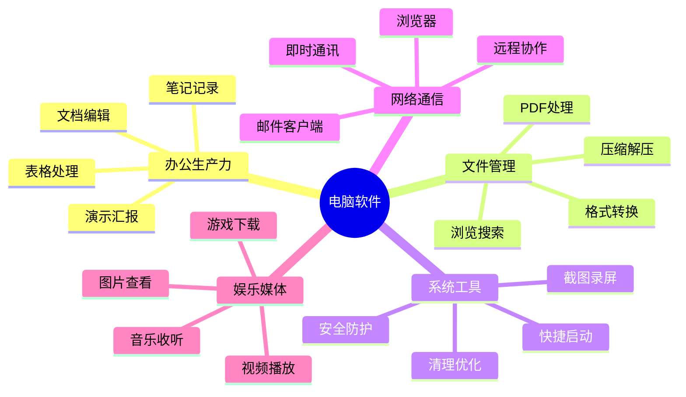
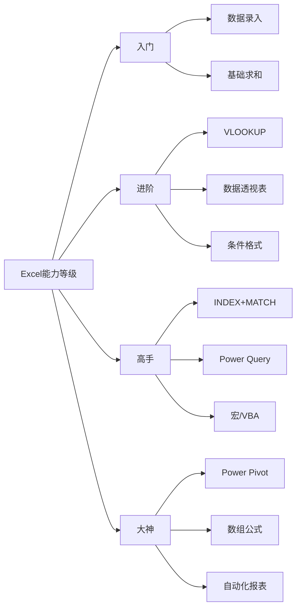
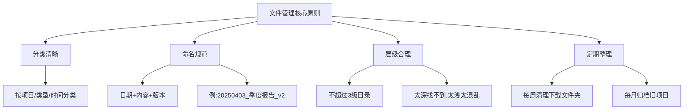
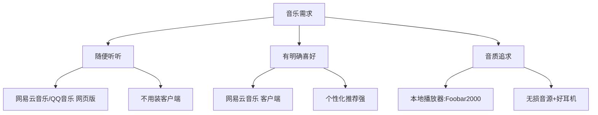
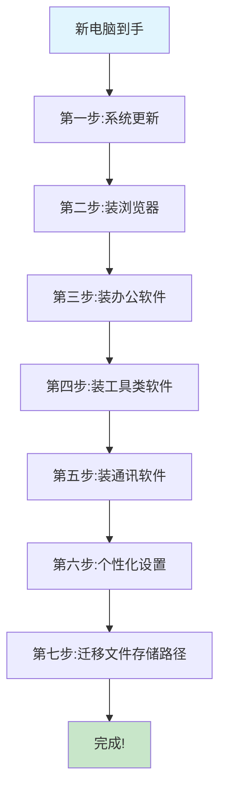

# 电脑软件装太多?看完这篇,你的电脑只会留下这20个

> 新电脑到手,第一件事就是装软件。装着装着,电脑卡了、桌面满了、C盘红了……问题出在哪?不是电脑不行,是你不知道"真正需要装什么"。

---

## 引子:你的电脑,是不是也这样?

- 下载了一堆"装机必备",结果90%再也没打开过
- 浏览器书签收藏了几百个网站,找东西还是靠搜
- 想截个图,打开微信→截图→保存→找文件夹,三分钟过去了
- 电脑越用越卡,开机要一分钟,开个文档要等半天

**如果你中了以上任何一条,这篇文章就是为你写的。**

今天,我们不罗列"100款必装软件"那种看完就忘的清单。

我们要做的是:**从底层逻辑出发,帮你建立一套"软件选择思维",让你以后面对任何软件,都知道该不该装、装哪个、怎么用。**

文章很长,但看完之后,你的电脑会焕然一新。

---

## 第一章 入门篇:先搞懂,电脑到底需要哪些软件?

### 1.1 一个核心原则:软件是为场景服务的

很多人装软件的逻辑是:"这个好像有用,先装上。"

**正确的逻辑应该是:"我有什么需求?哪个软件能最好地满足它?"**

前者叫"囤积",后者叫"选择"。

### 1.2 电脑软件的"五大刚需场景"



**这五大场景,覆盖了你99%的使用需求。**

接下来,我们一个一个拆解。

---

## 第二章 办公生产力篇:让你的时间"值钱"起来

### 2.1 文档处理:Office vs WPS,到底选谁?

这是被问了无数遍的问题。直接给结论:

| 维度 | Microsoft Office | WPS Office |
|-----|------------------|-----------|
| 兼容性 | 行业标准,格式最稳定 | 基本兼容,复杂排版偶有错位 |
| 功能深度 | Excel函数、PPT动画等专业功能更强 | 日常够用,高级功能偏弱 |
| 价格 | 订阅制(约398元/年) | 免费版可用,会员更便宜(约89元/年) |
| 广告 | 无 | 免费版有弹窗广告 |
| 云同步 | OneDrive(国外速度快) | WPS云(国内速度快) |
| 适合人群 | 重度办公用户、外企、学术科研 | 轻度办公、学生、体制内 |

**我的建议:**

- **主力用Office**,尤其是Excel重度用户(数据透视表、VBA宏)
- **备用装WPS**,用来打开一些Office打不开的老旧格式
- 如果预算有限,**WPS会员性价比更高**

### 2.2 三大件的核心使用场景

**Word — 不只是打字工具**

大多数人只用了Word 10%的功能。这些功能你应该知道:

- **样式功能**:一键统一全文格式,再也不用逐段调字体
- **邮件合并**:批量生成邀请函、工资条,100份文档1分钟搞定
- **修订模式**:团队协作改稿,谁改了什么一目了然
- **导航窗格**:长文档(论文、报告)快速跳转,再也不用滚轮滚到手酸

**Excel — 职场人的"超能力"**



**如果你只会求和,那你每天至少浪费了1小时在重复劳动上。**

**必学函数TOP5:**
1. `VLOOKUP` / `XLOOKUP` — 数据查找匹配
2. `SUMIFS` / `COUNTIFS` — 多条件统计
3. `IF` + `AND` / `OR` — 逻辑判断
4. `TEXT` / `DATE` — 日期文本处理
5. `数据透视表` — 不是函数,但比函数强大100倍

**PPT — 汇报的"脸面"**

- 别再用花哨模板了,**简洁+数据可视化**才是王道
- 学会用"幻灯片母版",改一次全局生效
- 图表优先用:柱状图(对比)、折线图(趋势)、饼图(占比)
- 记住一个原则:**一页只讲一件事**

### 2.3 笔记软件:你的"第二大脑"

| 软件 | 特点 | 适合人群 | 价格 |
|-----|------|---------|------|
| **Notion** | 全能型,数据库+文档+任务管理 | 知识工作者、团队 | 免费够用 |
| **Obsidian** | 本地优先,双向链接,知识图谱 | 研究者、写作者 | 免费 |
| **语雀** | 国产,文档+知识库,团队协作好 | 国内团队、技术文档 | 免费+付费 |
| **印象笔记/有道云** | 老牌,剪藏功能强 | 信息收集型用户 | 免费+付费 |
| **Typora** | 极简Markdown编辑器,写作体验极佳 | 程序员、写作者 | 付费(89元) |

**选择建议:**

- **个人知识管理** → Obsidian(本地安全)或Notion(功能全面)
- **团队协作文档** → 语雀或飞书文档
- **纯写作场景** → Typora

---

## 第三章 文件管理篇:告别"找不到文件"的焦虑

### 3.1 文件管理的"第一性原理"

**文件找不到,不是记忆力问题,是组织方式问题。**



### 3.2 必备工具清单

**① 文件搜索:Everything — 秒搜全电脑文件**

- Windows自带搜索:等30秒,结果还不准
- Everything:**0.5秒**,精准定位
- 体积仅2MB,免费,无广告
- **这是装完Windows后第一个应该装的软件**

**② 压缩解压:7-Zip — 开源免费的王者**

- 支持ZIP、RAR、7Z等所有主流格式
- 压缩率比WinRAR更高
- 完全免费,无广告,开源
- **别再用那些带弹窗广告的压缩软件了**

**③ PDF处理:PDF补丁丁(PDFPatcher) — 国产良心**

功能一览:
- 合并/拆分PDF
- 编辑书签目录
- 旋转/裁剪页面
- 提取PDF中的图片
- 解除PDF的打印/复制限制
- 压缩PDF体积

**完全免费,无广告,功能秒杀一堆收费软件。**

**④ 格式转换:FileConverter — 右键一键转换**

- 集成到右键菜单,选中文件→右键→选择格式→完成
- 支持图片、音频、视频、文档格式互转
- 批量转换,免费开源

### 3.3 文件管理的"断舍离"

**下载文件夹,是电脑里最混乱的地方。**

建议操作:
1. 打开你的"下载"文件夹
2. 按"修改日期"排序
3. **超过3个月没打开过的文件,全部删除或归档**
4. 以后下载的文件,**24小时内处理完毕并移动到对应项目文件夹**

**记住:下载文件夹不是仓库,是中转站。**

---

## 第四章 系统工具篇:让电脑"好用十倍"的秘密

### 4.1 安全防护:到底需不需要装杀毒软件?

**2025年的答案:对于大多数用户,Windows自带的Defender已经够用。**

```mermaid
graph LR
    A[安全需求分级] --> B[轻度:普通上网]
    A --> C[中度:网银/购物]
    A --> D[重度:企业/敏感数据]
    
    B --> B1[Windows Defender即可]
    B --> B2[良好上网习惯]
    
    C --> C1[Defender + 浏览器防护]
    C --> C2[定期全盘扫描]
    
    D --> D1[专业杀毒(卡巴斯基/火绒)]
    D --> D2[防火墙+行为监控]
    D --> D3[数据加密]
```

**如果你一定要装第三方杀毒,推荐:**

| 软件 | 优势 | 劣势 |
|-----|------|------|
| **火绒安全** | 国产,轻量,无弹窗广告,弹窗拦截功能好用 | 病毒库相对较小 |
| **卡巴斯基免费版** | 国际顶级,查杀率高 | 占用资源稍大 |
| **Windows Defender** | 系统自带,无需安装,与系统兼容性最好 | 高级功能需手动配置 |

**坚决不装的类型:**
- ❌ 某数字卫士
- ❌ 某毒霸
- ❌ 任何会给你弹"电脑得分"的"安全软件"

**它们不是保护你,它们是在制造焦虑让你装更多它们的产品。**

### 4.2 截图录屏:ShareX — 截图工具的终极形态

**你可能不知道,截图也能做出花来。**

ShareX功能一览:
- 区域截图、窗口截图、滚动截图(长网页)
- GIF录屏、视频录屏
- 截图后自动添加水印、标注、马赛克
- 自动上传到图床/网盘/服务器
- OCR文字识别(截图直接提取文字)
- 完全免费,开源,无广告

**对比微信截图:**
- 微信截图:只能截,标注功能弱,保存麻烦
- ShareX:截完自动保存+自动命名+一键分享+OCR提取

**效率差距至少5倍。**

### 4.3 快捷启动:告别"桌面图标排排坐"

**你的桌面是不是这样?**

```
┌─────────────────────────────────────┐
│ 📁 📁 📁 📁 📁 📁 📁 📁 📁 📁 📁  │
│ 📁 📁 📁 📁 📁 📁 📁 📁 📁 📁 📁  │
│ 💻 💻 💻 💻 💻 💻 💻 💻 💻 💻 💻  │
│ 🔗 🔗 🔗 🔗 🔗 🔗 🔗 🔗 🔗 🔗 🔗  │
│                                     │
│        (任务栏被占满了)              │
│  [▂▂▂▂▂▂▂▂▂▂▂▂▂▂▂▂▂▂▂▂▂▂▂▂▂▂▂▂▂] │
└─────────────────────────────────────┘
```

**解决方案:启动器软件**

| 软件 | 特点 |
|-----|------|
| **Flow Launcher** | 开源免费,插件丰富,类似Mac的Spotlight |
| **PowerToys Run** | 微软官方出品,集成在PowerToys中 |
| **Listary** | 轻量,与资源管理器深度集成 |

**使用效果:**
- 按快捷键(如Alt+Space)→弹出搜索框→输入软件名→回车打开
- **再也不用在桌面/开始菜单里翻来翻去**
- 还能搜索文件、计算、查天气、翻译……

### 4.4 系统增强:Microsoft PowerToys — 微软官方的"外挂"

这是微软官方出品的系统增强工具集,**每个Windows用户都应该知道**。

核心功能:

| 功能 | 作用 |
|-----|------|
| **FancyZones** | 自定义窗口布局,多屏/超宽屏用户必备 |
| **PowerToys Run** | 快速启动器(上面提到过) |
| **颜色选择器** | 屏幕上任意位置取色,设计师必备 |
| **图像大小调整器** | 右键一键调整图片尺寸 |
| **键盘管理器** | 自定义快捷键,改键位 |
| **文本提取器** | 屏幕OCR,复制图片中的文字 |
| **鼠标实用工具** | 高亮鼠标指针、查找鼠标位置 |

**免费、官方、无广告、持续更新。**

### 4.5 清理优化:你的电脑不需要"电脑管家"

**C盘红了怎么办?**

**错误做法:** 装一个"电脑管家",点"一键清理",然后它告诉你"建议购买VIP"。

**正确做法:**

**① Windows自带清理工具**
- 设置→存储→清理建议
- 可以清理临时文件、回收站、旧Windows更新文件
- 安全,不会误删重要文件

**② WizTree — 可视化磁盘占用**
- 3秒扫描完整个磁盘
- 用色块直观显示哪些文件/文件夹占空间
- 免费,比TreeSize更快

**③ 手动清理这几个地方:**
```
C:\Users\你的用户名\Downloads        → 下载文件夹
C:\Users\你的用户名\Desktop          → 桌面文件
C:\Users\你的用户名\AppData\Local\Temp → 临时文件
微信/QQ的文件存储目录                 → 默认在C盘,改到D盘
```

**④ 一劳永逸的设置:**
- 微信:设置→文件管理→更改文件存储位置→选D盘
- QQ:设置→文件管理→同样改到非C盘
- 浏览器下载路径:改为D盘\Downloads

**做完这几步,C盘至少能腾出10-30GB。**

---

## 第五章 网络通信篇:连接世界的正确姿势

### 5.1 浏览器:Chrome依然是王,但Edge正在追赶

| 维度 | Chrome | Edge | Firefox |
|-----|--------|------|---------|
| 内核 | Chromium | Chromium | Gecko |
| 速度 | 快 | 快(与Chrome相当) | 稍慢 |
| 内存占用 | 高 | 中等(优化更好) | 低 |
| 扩展生态 | 最丰富 | 兼容Chrome扩展 | 独立生态,较小 |
| 特色功能 | Google账号同步 | 垂直标签、分屏、Copilot AI | 隐私保护强 |
| 适合人群 | 重度Google用户 | Windows用户、追求性价比 | 隐私敏感用户 |

**2025年的建议:**

- **Edge已经足够好用**,而且更省内存,与Windows集成更好
- 如果你深度依赖Google服务(Gmail、Drive),选Chrome
- **浏览器装一个就够了**,装多了只会拖慢电脑

**必装浏览器扩展:**
- **AdGuard** — 广告拦截(比AdBlock Plus更干净)
- **Bitwarden** — 免费开源密码管理器
- **简悦(SimpRead)** — 沉浸式阅读模式,网页变干净文档
- **Tampermonkey(油猴)** — 脚本管理器,解锁网页隐藏功能
- **Immersive Translate** — 双语翻译,看外文网站必备

### 5.2 即时通讯:微信+钉钉/飞书,国内职场标配

**微信电脑版:**
- 必装,但注意设置文件存储路径(默认C盘)
- 定期清理聊天文件,特别是群里的视频和图片

**钉钉/飞书/企业微信:**
- 根据公司要求选择
- **飞书文档**的协作体验目前最佳
- 如果公司没用,个人没必要装

### 5.3 远程办公:TeamViewer的免费替代品

| 软件 | 特点 | 适合场景 |
|-----|------|---------|
| **ToDesk** | 国产,免费版够用,速度快 | 远程协助家人 |
| **RayLink** | 国产,低延迟,适合设计类 | 远程办公 |
| **RustDesk** | 开源,可自建服务器,数据安全 | 企业/技术用户 |
| **Windows远程桌面(RDP)** | 系统自带,局域网内体验最佳 | 同网络环境 |

---

## 第六章 娱乐媒体篇:放松也要有品质

### 6.1 视频播放:PotPlayer — Windows上的播放器之王

**为什么不用系统自带的?**

- 自带播放器:格式支持少,字幕支持弱,无法精细调节
- PotPlayer:**几乎支持所有视频/音频格式**

核心优势:
- 硬件加速,4K视频流畅播放
- 强大的字幕功能(搜索、同步、调节)
- 画面调节(亮度、对比度、色彩)
- 截图、录屏、倍速播放
- 完全免费,无广告(官网版)

### 6.2 音乐收听:看你的需求层级



**建议:能用网页版就别装客户端。**

音乐客户端普遍存在:
- 后台占用高
- 自动启动
- 弹窗推荐
- 捆绑直播/社交等非核心功能

**网页版+浏览器标签,体验更干净。**

### 6.3 图片查看:放弃系统自带的

**Windows照片查看器的问题:**
- 打开速度慢(尤其是大图)
- 不支持常见格式(WebP、SVG等)
- 功能单一

**推荐:Honeyview(现已升级为Bandiview)**
- 秒开图片,无论多大
- 支持几乎所有图片格式
- 压缩包(CBZ/CBR)直接当漫画看
- 免费,轻量

---

## 第七章 进阶篇:效率进阶者的"武器库"

### 7.1 自动化:让电脑替你干活

**如果你每天在做重复的电脑操作,你应该了解这些:**

| 工具 | 类型 | 适合人群 |
|-----|------|---------|
| **Power Automate** | 微软官方,低代码,与Office深度集成 | Office重度用户 |
| **AutoHotkey** | 脚本语言,自定义快捷键和自动化 | 有一定编程基础 |
| **Quicker** | 国产,可视化动作面板,一键触发复杂操作 | 所有用户 |

**举个例子:**

每天要把Excel数据导出为PDF,然后发邮件给老板。

**手动操作:** 打开Excel→调整格式→导出PDF→打开邮箱→写邮件→添加附件→发送 (5分钟)

**自动化后:** 点一个按钮,全部完成 (5秒)

**每天省4分55秒,一年就是30小时。**

### 7.2 开发者工具(非程序员也值得知道)

| 工具 | 用途 | 说明 |
|-----|------|------|
| **VS Code** | 代码编辑器 | 不只是写代码,写Markdown、JSON、配置文件都好用 |
| **Notepad++** | 轻量文本编辑器 | 打开大文件(几百MB的日志)不卡,支持正则替换 |
| **Git** | 版本控制 | 管理文档版本,比"文件名_v1_v2_最终版_真的最终版"强100倍 |

### 7.3 密码管理:别再"一个密码走天下"

**你的密码是不是这样?**

- 所有网站用同一个密码
- 密码记在手机上/便签纸上
- 想改密码时点"忘记密码",因为根本不记得原密码

**正确做法:使用密码管理器**

```mermaid
graph LR
    A[密码管理方案] --> B[Bitwarden]
    A --> C[1Password]
    A --> D[浏览器自带]
    
    B --> B1[免费开源]
    B --> B2[跨平台同步]
    B --> B3[自动生成强密码]
    
    C --> C1[体验最佳]
    C --> C2[付费(约200元/年)]
    C --> C3[家庭共享]
    
    D --> D1[方便]
    D --> D2[仅限当前浏览器]
    D --> D3[换设备麻烦]
```

**强烈建议:至少用Bitwarden免费版。**

- 你只需要记住**一个主密码**
- 其他所有密码由软件生成和填充
- 每个网站密码不同,**一个泄露不影响其他**
- 自动填充,再也不用手动输入

---

## 第八章 终极指南:一份清单,装完就走

### 8.1 新手装机必备(15个够用)

| 类别 | 软件 | 必装指数 |
|-----|------|---------|
| 办公 | WPS Office / Microsoft Office | ⭐⭐⭐⭐⭐ |
| 浏览器 | Edge / Chrome | ⭐⭐⭐⭐⭐ |
| 通讯 | 微信电脑版 | ⭐⭐⭐⭐⭐ |
| 搜索 | Everything | ⭐⭐⭐⭐⭐ |
| 压缩 | 7-Zip | ⭐⭐⭐⭐⭐ |
| 截图 | ShareX | ⭐⭐⭐⭐⭐ |
| 视频 | PotPlayer | ⭐⭐⭐⭐ |
| 图片 | Honeyview/Bandiview | ⭐⭐⭐⭐ |
| 笔记 | 语雀/Notion/Obsidian(三选一) | ⭐⭐⭐⭐ |
| PDF | PDF补丁丁 | ⭐⭐⭐⭐ |
| 安全 | 火绒安全(可选) | ⭐⭐⭐ |
| 清理 | WizTree | ⭐⭐⭐⭐ |
| 启动器 | Flow Launcher | ⭐⭐⭐⭐ |
| 系统增强 | PowerToys | ⭐⭐⭐⭐ |
| 密码 | Bitwarden | ⭐⭐⭐⭐⭐ |

### 8.2 安装顺序建议



### 8.3 坚决不装的软件类型

| 类型 | 典型代表 | 为什么不装 |
|-----|---------|-----------|
| "电脑管家"类 | 某数字卫士、某毒霸 | 制造焦虑、捆绑安装、弹窗广告 |
| "驱动大师"类 | 某精灵、某大师 | Windows已自动安装驱动,多此一举 |
| "一键优化"类 | 各种系统优化大师 | 可能误删系统文件,导致不稳定 |
| 带"加速球"的软件 | 多数国产软件的附加功能 | 实际没用,反而占用资源 |
| 非官网下载的破解软件 | 各种"绿色版""破解版" | 大概率带木马/挖矿程序 |

### 8.4 软件安装的"黄金法则"

**① 官网下载,永远是最安全的**

**② 安装时看清每一步,取消勾选"推荐软件"**

**③ 能装绿色版/便携版,就不装安装版**

**④ 定期审视:超过一个月没打开的软件,卸载**

**⑤ C盘只装系统和软件,文件全部存D盘**

---

## 第九章 认知升级:软件思维的五个层次

### 9.1 从"装得多"到"用得精"


**第一层:什么都装**
- 看到推荐就装,电脑装了几十个软件
- 大部分再也没打开过

**第二层:跟风装**
- 看别人推荐什么装什么
- 不考虑自己是否真的需要

**第三层:按需装**
- 有需求才装,装之前先想清楚场景
- 开始做减法,卸载不用的

**第四层:深度用**
- 每个软件都用到80%以上的功能
- 掌握快捷键、快捷操作,效率翻倍

**第五层:自动化**
- 把重复操作变成自动化流程
- 软件为你服务,而不是你伺候软件

**你现在在哪一层?**

### 9.2 最好的软件,是"不需要装"的软件

**云端化趋势:**

- 在线文档(飞书文档、腾讯文档)→ 不用装Office也能协作
- 网页版微信 → 不用装客户端也能收发消息
- 在线设计(Figma、即时设计) → 不用装PS也能做图
- 云盘(坚果云、OneDrive) → 不用装同步软件

**能不用本地软件就尽量不用,这是2025年的新趋势。**

### 9.3 软件只是工具,思维才是核心

**最后,记住这三句话:**

1. **不要为了用软件而找需求,要带着需求去选软件**
2. **一个软件用到极致,胜过十个软件浅尝辄止**
3. **最好的工具不是软件,是你自己的习惯和方法论**

---
