# 摄像头百年进化史：从暗箱到智能视觉的完整技术演进

> 你手机里的摄像头比哈勃望远镜还清晰？自动驾驶汽车为什么需要十几个摄像头？监控摄像头是怎么认出你的人脸的？

> 本文将带你从19世纪的暗箱开始，一步步了解摄像头技术的百年演进，深入理解CCD与CMOS的世纪之争、手机摄像头的逆袭之路、AI如何重塑摄像头，以及未来计算摄影的无限可能。

---

## 一、摄像头是什么？

### 1.1 最基础的定义

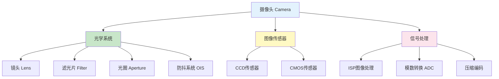

**简单来说：**

```
摄像头 = 眼睛 + 大脑

眼睛部分：
  镜头 = 晶状体（聚焦光线）
  光圈 = 瞳孔（控制进光量）
  传感器 = 视网膜（感知光线）

大脑部分：
  ISP（图像信号处理器）= 视觉皮层
  处理颜色、对比度、降噪等
  最终输出我们看到的照片/视频

核心原理：
  光（光子）→ 电信号（电子）→ 数字信号（0和1）→ 图像
```

### 1.2 摄像头的分类

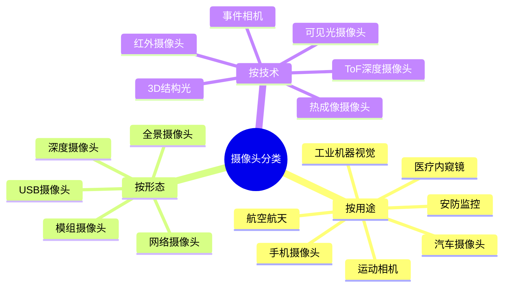

```
常见摄像头类型详解：

1. 手机摄像头
   - 特点：体积小、像素高、算法强
   - 主流：5000万像素-2亿像素
   - 趋势：多摄系统、计算摄影

2. 安防监控摄像头
   - 特点：24小时工作、夜视、智能分析
   - 主流：200-800万像素
   - 趋势：AI识别、边缘计算

3. 汽车摄像头
   - 特点：宽动态、耐高温、高可靠
   - 单车用量：10-15个
   - 趋势：800万像素成为主流

4. 工业机器视觉摄像头
   - 特点：高精度、高帧率、低延迟
   - 应用：质检、定位、测量
   - 趋势：AI+3D视觉

5. 深度摄像头
   - 原理：测量物体距离
   - 技术：结构光、ToF、双目视觉
   - 应用：人脸识别、AR、机器人
```

---

## 二、前传：照相机的百年积淀

### 2.1 摄像头的前世

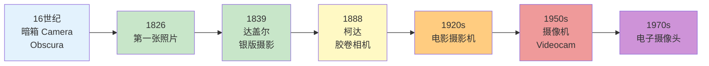

**关键历史节点：**

```
第一阶段：光学成像（16-19世纪）

1550年代：暗箱（Camera Obscura）
  → 小孔成像原理
  → 光线通过小孔在暗室中成像
  → 画家用它来辅助绘画
  
  这就是"Camera"一词的来源：
  拉丁语"Camera Obscura" = 暗室

1826年：世界上第一张照片
  → 法国人约瑟夫·尼塞福尔·涅普斯
  → 用沥青涂在锡镴合金上
  → 曝光8小时
  → 拍下了窗外的屋顶

1839年：达盖尔银版摄影法
  → 曝光时间缩短到15-30分钟
  → 摄影术正式诞生

1888年：柯达相机
  → "你按快门，剩下的交给我们"
  → 胶卷相机普及
  → 摄影从专业走向民间

第二阶段：动态影像（20世纪上半叶）

1895年：卢米埃尔兄弟发明电影摄影机
  → 可以拍摄连续的画面
  → 电影诞生

1920年代：电视的雏形
  → 机械扫描系统
  → 保罗·尼普科夫的扫描盘
  → 分辨率极低（30线左右）

1930年代：电子扫描
  → 弗拉基米尔·佐利金发明光电摄像管
  → 从机械扫描进化到电子扫描
  → 为电视广播奠定基础

第三阶段：电子摄像（20世纪中叶）

1950年代：摄像机（Videocamera）
  → 使用真空管技术
  → 体积庞大、笨重
  → 主要用于广播电视

1960年代：便携式摄像机
  → 索尼等日本公司开始发力
  → 体积缩小
  → 新闻采访开始使用

1970年代：CCD的诞生
  → 贝尔实验室的重大发明
  → 电子摄像的革命性突破
  → 传统胶片vs电子传感器的世纪之争开始
```

### 2.2 从胶片到电子的必然性

```
为什么要从胶片转向电子？

胶片的局限性：
  ✗ 无法即时查看（需要冲洗）
  ✗ 存储介质有限（一卷只能拍几十张）
  ✗ 无法实时传输
  ✗ 成本高（胶卷+冲洗费用）
  ✗ 不利于数字化处理

电子传感器的优势：
  ✓ 即时查看（拍完就看）
  ✓ 无限"胶卷"（只换存储卡）
  ✓ 可以实时传输（视频通话、直播）
  ✓ 成本低（一次性投入）
  ✓ 数字化处理（编辑、分享、AI分析）

根本驱动力：
  → 半导体技术的发展
  → 数字信号处理能力提升
  → 存储成本急剧下降
  → 互联网和移动通信的需求
```

---

## 三、电子摄像头的诞生：从真空管到CCD

### 3.1 CCD的发明

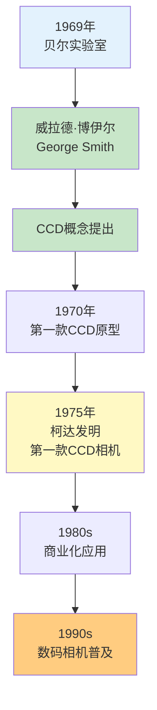

**CCD发明的故事：**

```
1969年，美国贝尔实验室

两位科学家：
  - 威拉德·博伊尔（Willard Boyle）
  - 乔治·史密斯（George E. Smith）

原本的目标：
  → 设计一种新型半导体存储器
  → 用于电话网络的信号缓冲

意外的发现：
  → 这种器件对光敏感
  → 可以将光信号转换为电信号
  → 可以用于图像采集

CCD的原理（简化版）：
  1. 光子打到硅片上
  2. 产生电子（光电效应）
  3. 电子被收集在"势阱"中
  4. 通过时钟控制，逐个转移电子
  5. 最终转换为电压信号
  6. 数字化后成为图像

2009年，两人因发明CCD获得诺贝尔物理学奖
  → 从发明到诺奖：40年
  → 评价："数字时代的眼睛"
```

### 3.2 CCD的工作原理详解


**CCD工作流程详细拆解：**

```
第一步：光电转换

  当光线照射到CCD表面时：
    光子（光的基本单位）穿透硅片
    如果光子能量足够，会将硅原子中的电子"打"出来
    这就是"光电效应"（爱因斯坦因此获诺奖）
  
  产生的电子数量与光强度成正比：
    光越强 → 电子越多
    光越弱 → 电子越少

第二步：电荷积累

  每个像素就是一个"小桶"（势阱）
  电子被收集在这个桶里
  
  曝光时间越长，桶里的电子越多
  这就是"曝光"的本质

第三步：电荷转移（CCD的核心创新）

  CCD = Charge-Coupled Device（电荷耦合器件）
  "Coupled"的意思就是"耦合转移"
  
  转移过程（类似桶接力）：
    
    行1: [电子][电子][电子][电子] → 转移到输出端
    行2: [电子][电子][电子][电子] → 移到行1位置
    行3: [电子][电子][电子][电子] → 移到行2位置
    ...
  
  通过精确控制电压：
    逐个像素、逐行地将电子"推"到输出端
    就像传送带上的包裹

第四步：信号读出

  电子到达输出端后：
    转换为电压信号
    经过放大器放大
    通过ADC（模数转换器）转换为数字
  
  最终得到：
    每个像素的亮度值（0-255或更高）
    组合起来就是一张完整的图像

CCD的关键优势：
  ✓ 电荷转移效率高，噪声低
  ✓ 像素一致性好
  ✓ 灵敏度高（弱光表现好）
  ✓ 动态范围大

CCD的关键劣势：
  ✗ 制造工艺复杂
  ✗ 功耗大（需要多个电压驱动）
  ✗ 读取速度慢（逐个转移）
  ✗ 成本高
  ✗ 集成度低（不能集成其他电路）
```

---

## 四、CCD与CMOS的世纪之争

这是摄像头历史上最精彩的技术对决！

### 4.1 CMOS的崛起

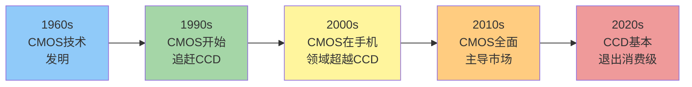

**CMOS的故事：**

```
CMOS = Complementary Metal-Oxide-Semiconductor
     = 互补金属氧化物半导体

CMOS和CCD用的是同一种基础材料：硅
但结构设计完全不同

CMOS的核心创新：
  → 每个像素都有自己的放大器
  → 可以随机访问任意像素
  → 就像内存一样

对比CCD的"桶接力"：
  CCD：必须逐个转移，不能跳跃
  CMOS：可以直接读取任意位置

CMOS的发展历程：

1960年代：CMOS技术被发明
  → 最初用于数字电路
  → 没人想到可以用来做图像传感器

1990年代：NASA推动CMOS发展
  → 需要低功耗的图像传感器用于太空
  → CCD功耗太高
  → 投入资源研发CMOS图像传感器

1995年：第一款CMOS图像传感器
  → 由美国喷气推进实验室（JPL）开发
  → 分辨率很低（352×288）
  → 但证明了可行性

2000年代初：手机摄像头采用CMOS
  → 手机需要：小体积、低功耗、低成本
  → CCD太耗电、太贵
  → CMOS成为唯一选择
  → 倒逼CMOS技术快速进步

2005-2010年：CMOS画质追上CCD
  → 背照式（BSI）技术突破
  → 噪点控制大幅提升
  → 手机摄像头开始挑战卡片机

2010年代：CMOS全面超越CCD
  → 读取速度更快（支持高速连拍、4K视频）
  → 集成度更高（可以集成ADC、ISP等）
  → 成本更低（标准CMOS工艺）
  → 功耗更低
  
  CCD节节败退...

2017年：索尼宣布逐步停产CCD
  → 一个时代结束
  → CMOS完胜

2020年代：CCD基本退出历史舞台
  → 仅在少数科学仪器中使用
  → 消费级市场完全被CMOS主导
```

### 4.2 CCD vs CMOS 详细对比

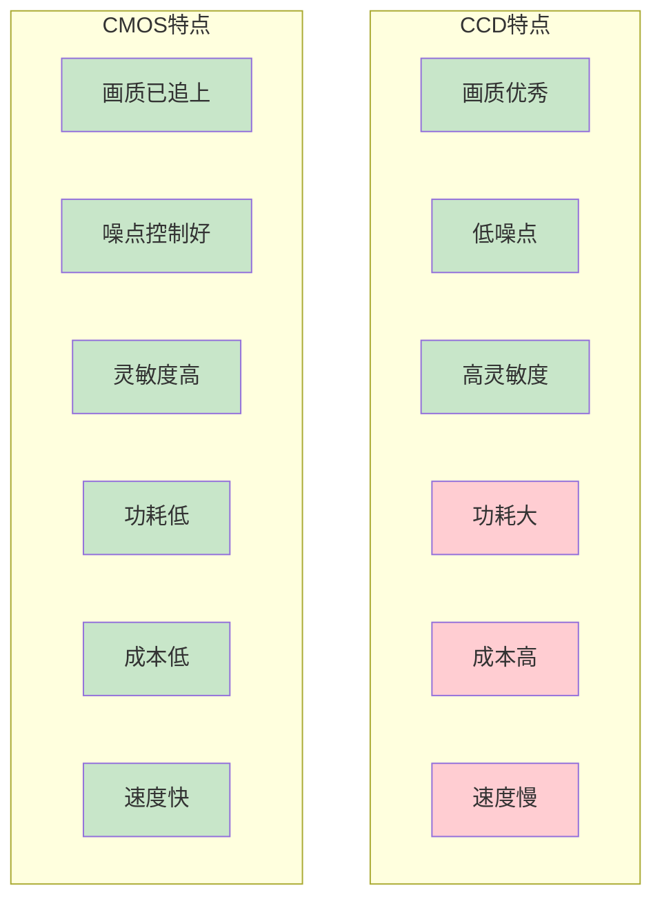

**技术对比表：**

| 对比维度 | CCD | CMOS | 说明 |
|---------|-----|------|------|
| **画质** | 优秀 | 优秀（已追上） | 早期CCD领先，现在差距极小 |
| **噪声** | 低 | 低 | CMOS进步巨大，已无明显差距 |
| **灵敏度** | 高 | 高 | BSI技术让CMOS灵敏度大幅提升 |
| **功耗** | 高（10-100x） | 低 | CMOS功耗仅CCD的1/10到1/100 |
| **速度** | 慢（逐行转移） | 快（随机读取） | CMOS支持高速连拍、高帧率视频 |
| **集成度** | 低 | 高 | CMOS可集成ADC、ISP、AI等 |
| **成本** | 高 | 低 | CMOS使用标准半导体工艺 |
| **体积** | 大 | 小 | 手机只能用CMOS |
| **应用** | 科学仪器 | 消费级/工业/汽车 | CMOS几乎覆盖所有领域 |

### 4.3 CMOS胜出的根本原因

```
CMOS为什么能打败CCD？

根本原因一：摩尔定律

  CMOS受益于半导体行业的摩尔定律：
    → 晶体管越做越小
    → 集成度越来越高
    → 成本越来越低
    → 性能越来越强
  
  CCD是特殊工艺，无法享受摩尔定律红利

根本原因二：手机市场的推动

  2000年代，手机开始普及摄像头
  手机的要求：
    ✓ 体积小
    ✓ 功耗低
    ✓ 成本低
    ✓ 集成度高
  
  CCD一个都满足不了
  CMOS全部满足
  
  手机市场的海量需求（每年十几亿颗）
  倒逼CMOS技术飞速进步

根本原因三：架构优势

  CMOS的随机访问架构：
    → 可以只读取部分像素（电子变焦）
    → 可以高速读取（高帧率视频）
    → 可以在芯片上集成处理电路
  
  CCD的串行转移架构：
    → 必须读取全部像素
    → 速度受限
    → 无法集成

根本原因四：技术突破

  1990年代末-2000年代初的关键突破：
  
  a)  pinned photodiode（PPD）技术
      → 降低噪声
      → 提高灵敏度
  
  b) 背照式（BSI, Back-Side Illumination）
      → 2008年索尼率先量产
      → 将线路层移到感光层后面
      → 进光量大幅提升
      → 解决了CMOS灵敏度低的老大难问题
  
  c) 堆叠式（Stacked）传感器
      → 将感光层和处理层分开
      → 再堆叠在一起
      → 兼顾高画质和高集成度
  
  这些突破让CMOS画质追上了CCD

启示：
  → 技术上"更好"的不一定赢
  → 更适合市场需求才能赢
  → 生态系统和产业链很重要
  → CCD输给了"生态系统"而非"技术"
```

---

## 五、摄像头是如何成像的？

### 5.1 从光到数字图像的完整链路


**详细拆解每个环节：**

```
第一步：光线通过镜头

  镜头的作用：
    → 将光线聚焦到传感器上
    → 类似放大镜的逆过程
  
  关键参数：
    - 焦距：决定视角（广角/长焦）
      焦距短 = 广角（拍得宽）
      焦距长 = 长焦（拍得远）
    
    - 光圈：决定进光量
      f/1.8 比 f/2.4 进光量多
      光圈越大，夜拍越好
    
    - 镜片数量：
      手机镜头通常5-7片
      越多矫正像差越好
      但也越厚

第二步：红外截止滤光片（IR Cut Filter）

  作用：滤除红外光和紫外光
  只允许可见光通过（400-700nm）
  
  为什么要滤除红外光？
    → 传感器对红外光也敏感
    → 但人眼看不到红外光
    → 如果不滤除，颜色会失真
  
  夜视摄像头会去掉这个滤光片
    → 可以感应红外光
    → 配合红外LED，实现夜视

第三步：彩色滤光片阵列（CFA）

  传感器本身只能感知"光的强度"
  不能感知"颜色"
  
  如何获得彩色图像？
    → 在每个像素上加一个滤光片
    → 只让特定颜色的光通过
  
  最常用的是拜耳阵列（Bayer Pattern）：
    
    R G R G R G
    G B G B G B
    R G R G R G
    G B G B G B
    
    R = 红色滤光片（25%）
    G = 绿色滤光片（50%）
    B = 蓝色滤光片（25%）
    
    为什么绿色多？
      → 人眼对绿色最敏感
      → 绿色携带最多的亮度信息
  
  每个像素只能看到一种颜色
  其他颜色需要通过"去马赛克"算法插值

第四步：光电转换

  光线到达光电二极管（Photodiode）
  
  光电效应：
    → 光子撞击硅原子
    → 释放出电子
    → 电子数量与光强度成正比
  
  每个像素就是一个"电子收集桶"
  桶越大，能收集的电子越多
  这就是"像素尺寸"的概念：
    → 1.0μm、1.4μm、2.0μm等
    → 像素越大，单个像素的灵敏度越高

第五步：信号放大

  电子信号非常微弱
  需要放大器放大
  
  CCD：全局放大器（在芯片边缘）
  CMOS：每个像素都有自己的放大器（后来改进）

第六步：模数转换（ADC）

  将模拟电压信号转换为数字值
  
  例如：
    电压0V → 数字值0
    电压1V → 数字值4095（12bit）
  
  Bit数越高，精度越高：
    8bit = 256级
    10bit = 1024级
    12bit = 4096级
    14bit = 16384级

第七步：ISP（图像信号处理器）

  这是摄像头最重要的"大脑"！
  
  ISP处理步骤：
  
  1. 黑电平校正
     → 扣除传感器的基础噪声
  
  2. 镜头阴影校正
     → 修正边缘亮度下降（暗角）
  
  3. 白平衡
     → 调整色温，让白色看起来是白色
     → 不同光源下（日光/白炽灯/荧光灯）颜色不同
  
  4. 去马赛克（Demosaicing）
     → 从拜耳阵列插值出完整的RGB
     → 每个像素最终都有R、G、B三个值
  
  5. 色彩校正
     → 调整色彩准确度
  
  6. 伽马校正
     → 调整亮度曲线，符合人眼感知
  
  7. 降噪
     → 去除图像中的噪点
     → 空间降噪 + 时间降噪（视频）
  
  8. 锐化
     → 增强边缘，提高清晰度
  
  9. HDR合成（部分ISP）
     → 多帧曝光合成
     → 保留高光和暗部细节
  
  10. 压缩编码
      → JPEG压缩（照片）
      → H.264/H.265压缩（视频）

第八步：输出最终图像

  经过以上所有步骤
  一张完整的数字图像诞生了！
  
  分辨率示例：
    1200万像素 = 4000 × 3000 像素
    每个像素 = RGB三个值（各8-14bit）
    一张照片大小 = 几MB到几十MB
```

### 5.2 传感器尺寸的重要性

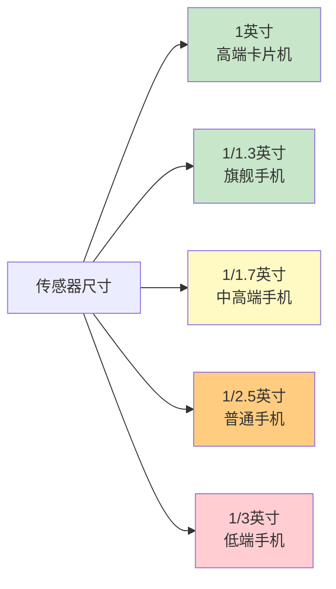

**传感器尺寸详解：**

```
传感器尺寸是摄像头最重要的参数之一

常见传感器尺寸（从大到小）：

全画幅（36×24mm）
  → 专业单反/微单
  → 面积极大，画质优秀

APS-C（约24×16mm）
  → 中端微单
  → 画质与便携的平衡

M4/3（17.3×13mm）
  → 松下、奥林巴斯微单
  → 体积小，画质尚可

1英寸（13.2×8.8mm）
  → 高端卡片机（索尼黑卡）
  → 部分旗舰手机（小米12S Ultra等）

1/1.3英寸（约10×7.5mm）
  → 主流旗舰手机
  → 华为、苹果、三星旗舰

1/1.7英寸（约7.6×5.7mm）
  → 中高端手机
  → 性价比较高的选择

1/2.5英寸（约5.7×4.3mm）
  → 普通手机
  → 入门级

1/3英寸（约4.8×3.6mm）
  → 低端手机
  → 早期智能手机

为什么传感器尺寸重要？

核心公式：
  进光量 ∝ 传感器面积

传感器越大：
  → 单个像素可以做得更大
  → 收集的光子更多
  → 噪点更少
  → 动态范围更大
  → 虚化效果更好

举例对比：
  1英寸传感器面积 ≈ 116 mm²
  1/3英寸传感器面积 ≈ 17 mm²
  
  相差约7倍！
  
  这意味着同样条件下
  1英寸传感器的进光量是1/3英寸的7倍
  夜拍效果天壤之别

手机传感器的困境：

  手机厚度有限（通常<9mm）
  → 传感器不能太大
  → 镜头焦距不能太长
  → 物理限制导致画质天花板低
  
  解决方案：
    → 计算摄影（算法弥补硬件不足）
    → 多帧合成（用时间换画质）
    → AI降噪、AI超分
    → 折叠屏可能带来改变
```

---

## 六、手机摄像头的逆袭之路

### 6.1 手机摄像头的发展史

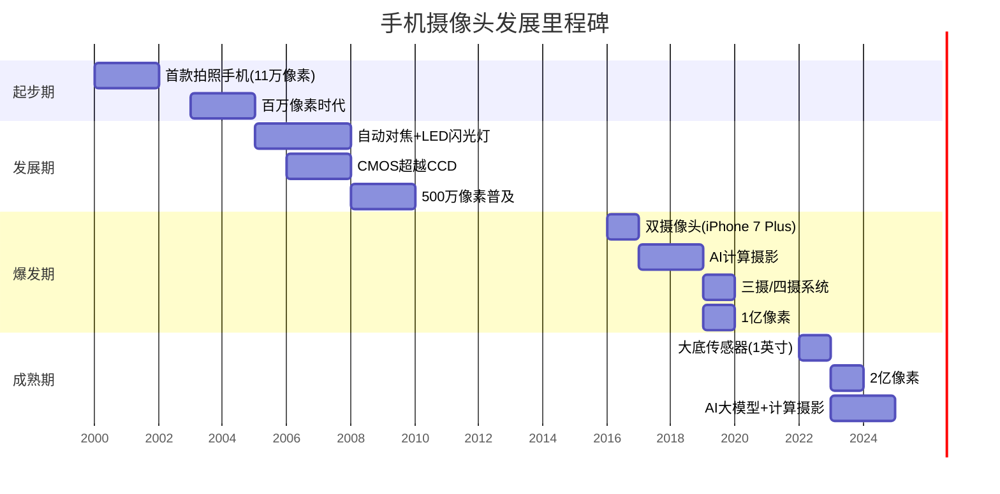

**详细发展史：**

```
第一阶段：萌芽期（2000-2005）

2000年：首款拍照手机
  → 夏普J-SH04（日本）
  → 11万像素
  → 不能存储照片，只能发彩信
  
2002年：诺基亚7650
  → 中国大陆首款拍照手机
  → 30万像素（VGA）
  → 塞班系统
  
2003年：百万像素时代
  → 夏普V602SH
  → 100万像素
  → 可以拍出勉强能看的照片

这一时期的特点：
  → 像素极低
  → 传感器用CMOS（CCD太贵太耗电）
  → 没有自动对焦
  → 照片质量很差
  → 更多是噱头而非实用

第二阶段：成长期（2005-2010）

2005年：自动对焦出现
  → 诺基亚N90
  → 卡尔蔡司镜头
  → 200万像素
  
2007年：iPhone一代
  → 200万像素
  → 没有自动对焦！
  → 但软件体验好
  
2008年：诺基亚N86
  → 800万像素
  → 机械光圈
  → 当时最接近相机的手机

2010年：iPhone 4
  → 500万像素
  → 背照式传感器（BSI）
  → 720p视频录制
  → "拍得清楚"的时代开始

这一时期的特点：
  → 像素快速提升
  → 自动对焦普及
  → 背照式传感器出现（夜拍改善）
  → 视频录制功能加入

第三阶段：爆发期（2010-2016）

2011年：诺基亚N8
  → 1200万像素
  → 卡尔蔡司镜头
  → 氙气闪光灯
  → 当时拍照最好的手机之一
  
2012年：诺基亚808 PureView
  → 4100万像素！
  → 超大1/1.2英寸传感器
  → 超前时代的设计
  → 但塞班系统拖了后腿
  
2013年：HTC One (M7)
  → 反其道而行，用400万像素
  → "UltraPixel"大像素策略
  → 夜拍好，但白天解析力不足
  → 证明像素不是唯一
  
2014年：三星Galaxy S5
  → 1600万像素
  → 相位对焦（PDAF）
  → 对焦速度大幅提升

2016年：iPhone 7 Plus
  → 双摄系统（广角+长焦）
  → 光学变焦
  → 人像模式（背景虚化）
  → 手机摄影新纪元

这一时期的特点：
  → 像素竞赛（800万→1600万→2000万）
  → 对焦技术提升（PDAF、激光对焦）
  → OIS光学防抖加入
  → 双摄系统出现
  → 计算摄影萌芽

第四阶段：多摄时代（2016-2020）

2017年：iPhone X
  → 双摄
  → 人像模式改进
  → 4K 60fps视频
  
2018年：华为P20 Pro
  → 三摄系统（彩色+黑白+长焦）
  → 徕卡认证
  → 手持夜景模式（AI多帧合成）
  → 夜拍超越相机！
  
2019年：三星Galaxy S20 Ultra
  → 1亿像素！
  → 1/1.33英寸大底
  → 100倍"太空变焦"
  → 像素竞赛的顶峰
  
2019年：iPhone 11 Pro
  → 三摄（超广角+广角+长焦）
  → Deep Fusion深度学习多帧合成
  → 计算摄影的标杆

2020年：华为P40 Pro+
  → 五摄系统
  → 10倍光学变焦
  → 手机能拍月亮了！

这一时期的特点：
  → 多摄系统成为旗舰标配
  → AI计算摄影成熟
  → 夜拍能力超越卡片机
  → 视频能力大幅提升（4K、8K）
  → 像素竞赛白热化

第五阶段：大底+计算摄影（2020至今）

2022年：小米12S Ultra
  → 1英寸传感器！
  → 徕卡联名
  → 手机用上相机级硬件
  
2022年：vivo X90 Pro+
  → 1英寸传感器
  → 自研V2芯片
  → 计算摄影+大底

2023年：小米13 Ultra
  → 1英寸传感器
  → 徕卡Summicron镜头
  → 可变光圈
  
2023年：三星Galaxy S23 Ultra
  → 2亿像素！
  → 再次刷新像素纪录

2024年：AI大模型+计算摄影
  → 生成式AI消除路人
  → AI扩图
  → 最佳拍（自动选最佳表情）
  → 计算摄影进入AI时代

这一时期的特点：
  → 大底传感器（1英寸）成为旗舰标志
  → 计算摄影+AI深度融合
  → 影像联名（徕卡、蔡司、哈苏）
  → 专业级功能（RAW、Log视频）
```

### 6.2 手机摄像头的技术演进

```mermaid
graph TB
    subgraph 手机摄像头技术演进
        A[传感器技术]
        B[镜头技术]
        C[防抖技术]
        D[对焦技术]
        E[计算摄影]
    end
    
    A --> A1[前照式FSI]
    A --> A2[背照式BSI]
    A --> A3[堆叠式Stacked]
    A --> A4[大底1英寸]
    
    B --> B1[塑料镜头]
    B --> B2[玻塑混合]
    B --> B3[玻璃镜头]
    B --> B4[可变光圈]
    
    C --> C1[电子防抖EIS]
    C --> C2[光学防抖OIS]
    C --> C3[传感器位移防抖]
    
    D --> D1[对比度检测]
    D --> D2[相位检测PDAF]
    D --> D3[激光对焦]
    D --> D4[全像素全向对焦]
    
    E --> E1[HDR]
    E --> E2[多帧降噪]
    E --> E3[AI场景识别]
    E --> E4[计算虚化]
    E --> E5[AI生成/消除]
    
    style A fill:#e3f2fd
    style B fill:#c8e6c9
    style C fill:#fff9c4
    style D fill:#ffcc80
    style E fill:#ce93d8
```

**多摄系统详解：**

```
为什么手机需要多个摄像头？

因为手机太薄了！

相机的解决方案：
  → 变焦镜头（复杂的光学结构）
  → 可以伸缩
  → 实现广角到长焦的连续变焦

手机的困境：
  → 厚度只有7-9mm
  → 无法容纳伸缩镜头
  → 只能用固定焦距的镜头
  
解决方案：多摄系统
  → 广角摄像头（26mm等效焦距）
  → 超广角摄像头（13mm等效焦距）
  → 长焦摄像头（50-120mm等效焦距）
  → 切换摄像头 = 切换焦段

典型三摄系统：

主摄（广角）：
  → 24-26mm等效焦距
  → 最大传感器（画质最好）
  → 最大光圈（f/1.6-f/1.8）
  → 日常使用的主力镜头

超广角：
  → 13-16mm等效焦距
  → 120°-130°视角
  → 拍大场景、建筑、合影
  → 传感器较小，画质稍逊

长焦：
  → 50-120mm等效焦距
  → 拍远处的物体
  → 人像（背景压缩感好）
  → 通常有OIS防抖

四摄系统（额外加一个）：

可能组合：
  → 主摄 + 超广角 + 长焦 + 微距
  → 主摄 + 超广角 + 长焦 + ToF深度
  → 主摄 + 超广角 + 2个长焦（双长焦）

微距镜头：
  → 专门拍近距离小物体
  → 其实广角镜头也能微距
  → 有些是"凑数"镜头

ToF深度镜头：
  → 测量深度信息
  → 辅助人像虚化
  → AR应用

潜望式长焦：

问题：长焦镜头需要长焦距
  → 镜头模组会突出

解决方案：潜望式结构
  → 棱镜折射光路90度
  → 横向布置镜头
  → 利用手机的宽度而非厚度
  → 可以实现5x、10x光学变焦

结构示意：
  光线 → 棱镜（折射90度）→ 横向镜头组 → 传感器
  
  类似潜水艇的潜望镜
  所以叫"潜望式"
```

### 6.3 计算摄影：手机逆袭相机的秘诀

```
什么是计算摄影？

定义：通过算法和多帧合成
弥补手机硬件的不足
实现甚至超越相机的效果

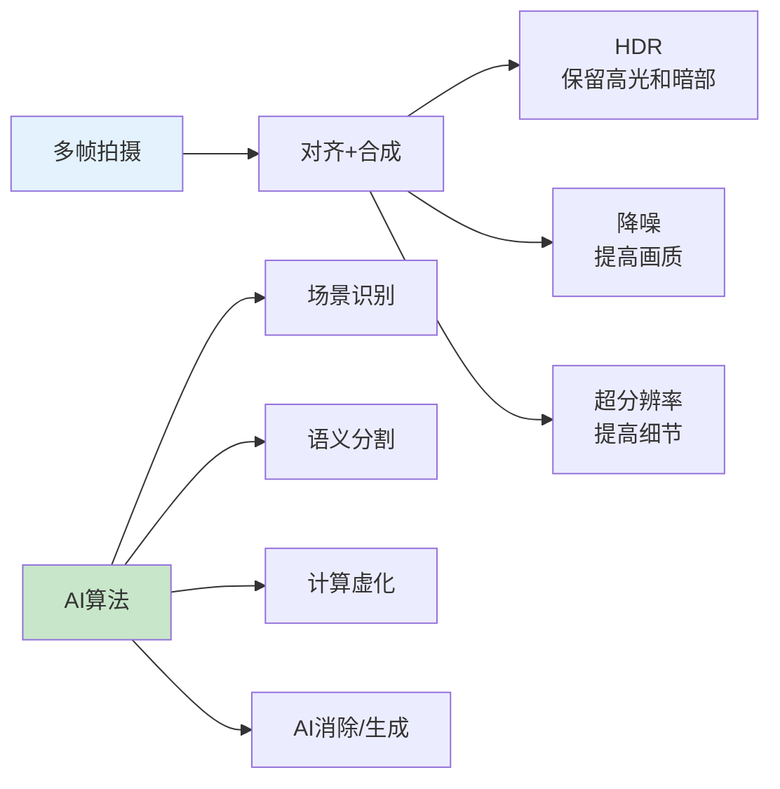

```

```
计算摄影的核心技术：

技术一：多帧合成（Multi-Frame Processing）

  原理：
    → 按下快门的一瞬间
    → 手机其实拍了10-30张
    → 然后合成一张
  
  合成的好处：
    
    1. HDR（高动态范围）
       场景：逆光拍照
       问题：天空过曝或地面欠曝
       解决：
         → 拍不同曝光度的多张
         → 高光用欠曝的那张
         → 暗部用过曝的那张
         → 合成后，高光和暗部都有细节
    
    2. 降噪
       场景：夜拍
       问题：噪点多
       解决：
         → 拍多张
         → 信号（真实的图像）是稳定的
         → 噪声是随机的
         → 平均后，噪声被消除
    
    3. 超分辨率
       原理：
         → 手会有微抖
         → 每张照片的像素有微小偏移
         → 利用这些偏移
         → 重建更高分辨率的图像
       效果：
         → 5000万像素输出1亿像素的效果

技术二：语义分割（Semantic Segmentation）

  原理：
    → AI识别图像中的每个区域
    → 这是天空、这是人脸、这是草地...
  
  应用：
    → 对不同区域用不同的处理参数
    → 天空：提高饱和度
    → 人脸：美肤
    → 草地：增强绿色
    → 食物：增强暖色调
  
  这就是为什么：
    手机拍出来颜色好看
    相机拍出来反而"平淡"

技术三：计算虚化（Portrait Mode）

  相机的虚化：
    → 光学虚化
    → 大光圈 + 大传感器
    → 自然的浅景深
  
  手机的虚化：
    → 手机传感器小，光圈小
    → 物理上虚化不明显
    → 用算法"算"出虚化！
  
  实现方式：
    
    方式1：双摄测深度
      → 两个摄像头从不同角度看
      → 类似人的双眼
      → 计算每个像素的深度
      → 近处清晰，远处模糊
    
    方式2：ToF深度传感器
      → 主动发射红外光
      → 测量反射时间
      → 精确获得深度图
    
    方式3：单摄AI估算
      → 用AI模型估算深度
      → 识别人脸/人体的轮廓
      → 只对背景做模糊
  
  效果：
    → 早期很假（边缘识别不准）
    → 现在几乎以假乱真

技术四：AI增强

  生成式AI消除：
    → 圈出画面中的路人
    → AI自动消除并填补背景
    → 类似Photoshop的"内容识别填充"
  
  AI扩图：
    → 拍了一张竖构图
    → AI自动扩展成横构图
    → 生成原本不存在的画面
  
  AI最佳表情：
    → 连拍多张
    → AI选出每个人表情都好的
    → 甚至可以"换脸"（把闭眼的换成睁眼的）

计算摄影的本质：
  用算法和算力弥补硬件不足
  
  手机传感器小？
    → 多帧合成提高画质
  
  手机光圈小？
    → 计算虚化模拟大光圈
  
  手机不能光学变焦？
    → 多摄+AI超分模拟变焦
  
  手机动态范围小？
    → HDR合成
  
  结果：
    手机拍出的照片
    观感上可能比相机还好！
  
  但本质不同：
    相机：光学素质好，后期空间大
    手机：算法帮你"P好了"
```

---

## 七、安防监控摄像头的智能化

### 7.1 监控摄像头的发展历程

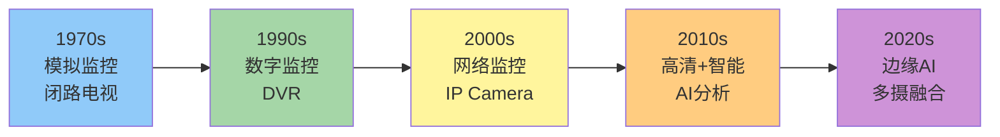

**详细发展史：**

```
第一代：模拟监控（1970s-1990s）

  技术：
    → CCTV（闭路电视）
    → 模拟信号传输
    → 磁带录制
  
  特点：
    → 画质差（分辨率低）
    → 需要专人盯屏幕
    → 只能事后查看
    → 存储成本高（磁带）
  
  应用：
    → 银行、商场、交通
    → 威慑作用大于实际作用

第二代：数字监控（1990s-2000s）

  技术：
    → DVR（数字视频录像机）
    → 模拟摄像头 + 数字录制
    → 硬盘存储
  
  改进：
    → 画质提升
    → 可以回放、检索
    → 存储成本降低
  
  问题：
    → 仍然是"被动监控"
    → 出了事才能查录像

第三代：网络监控（2000s-2010s）

  技术：
    → IPC（网络摄像头）
    → 数字信号 + 网络传输
    → NVR（网络视频录像机）
  
  改进：
    → 高清化（720p、1080p）
    → 远程查看（手机APP）
    → 集中管理
  
  问题：
    → 数据量暴增
    → 带宽和存储压力大
    → 仍然依赖人工查看

第四代：智能监控（2010s-至今）

  技术：
    → AI + 计算机视觉
    → 深度学习算法
    → 边缘计算（摄像头端侧AI）
  
  能力：
    ✓ 人脸检测与识别
    ✓ 人体检测
    ✓ 车辆检测与车牌识别
    ✓ 行为分析（徘徊、聚集、跌倒）
    ✓ 目标跟踪
    ✓ 异常事件自动报警
  
  意义：
    → 从"被动监控"变为"主动预警"
    → 从事后追溯变为实时响应

第五代：边缘AI + 多摄融合（现在-未来）

  趋势：
    → 摄像头内置AI芯片
    → 端侧处理，只上传结果
    → 多摄像头协同
    → 3D感知（深度信息）
    → 隐私保护（数据脱敏）
  
  技术：
    → 端侧大模型
    → 多模态融合（视觉 + 音频 + 红外）
    → 事件相机（Event Camera）
```

### 7.2 AI如何改变监控摄像头

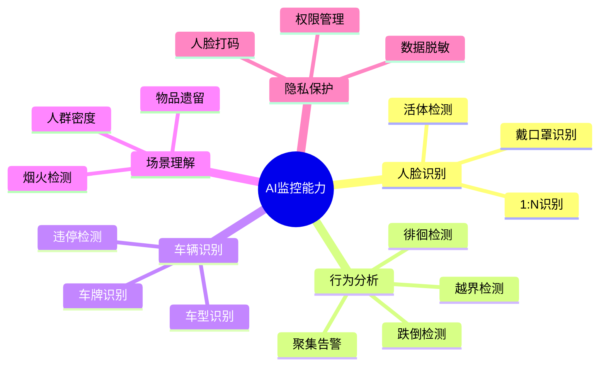

**AI视觉算法详解：**

```
核心技术一：目标检测

  任务：在图像中找到并识别物体
  
  算法演进：
    2012年：AlexNet（深度学习起步）
    2014年：R-CNN（区域卷积神经网络）
    2016年：YOLO v1（你只看一次）
    2020年：YOLO v4/v5
    2023年：YOLO v8/v9
    2024年：RT-DETR（实时检测Transformer）
  
  检测精度：
    2012年：mAP约40%
    2024年：mAP超过80%
  
  速度：
    从每秒几帧到每秒上百帧
    摄像头可以实时处理

核心技术二：人脸识别

  流程：
    1. 人脸检测（找到脸在哪）
    2. 关键点定位（眼睛、鼻子、嘴巴）
    3. 对齐和归一化
    4. 特征提取（深度学习）
    5. 特征比对（和数据库匹配）
  
  识别率：
    LFW数据集：超过99.8%
    已经超过人眼识别能力
  
  挑战：
    → 戴口罩、墨镜
    → 侧脸、低头
    → 光线变化
    → 年龄变化
    → 活体检测（防照片/视频攻击）

核心技术三：行为分析

  可以检测的行为：
    
    安防场景：
      - 越界检测：有人进入禁区
      - 徘徊检测：某人在某处反复出现
      - 遗留物检测：有可疑物品
      - 人群聚集：异常聚集告警
    
    养老场景：
      - 跌倒检测：老人摔倒自动报警
      - 长时间不动：可能昏迷
    
    零售场景：
      - 客流统计
      - 热力图（哪些区域人多）
      - 停留时长分析

边缘计算 vs 云端计算

  边缘计算（在摄像头端处理）：
    ✓ 延迟低（实时响应）
    ✓ 不占用网络带宽
    ✓ 隐私性好（数据不上传）
    ✗ 算力有限
    ✗ 模型更新困难
  
  云端计算（传到服务器处理）：
    ✓ 算力无限
    ✓ 模型可以随时更新
    ✗ 延迟高
    ✗ 带宽成本高
    ✗ 隐私风险
  
  趋势：
    → 端侧小模型做初步筛选
    → 云端大模型做精细分析
    → 端云协同
```

---

## 八、自动驾驶与机器视觉

### 8.1 汽车摄像头概览

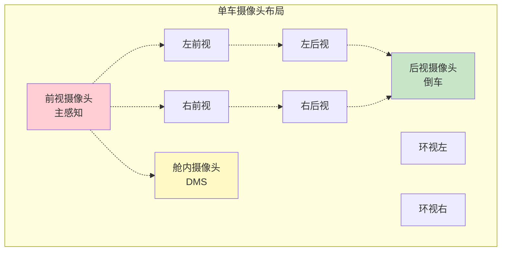

**汽车摄像头的分类：**

```
按功能分类：

1. 前视摄像头（最重要的）
   位置：挡风玻璃上方
   功能：
     - 车道线检测
     - 前方车辆检测
     - 行人检测
     - 交通标志识别
     - 自适应巡航（ACC）
   要求：最远探测距离200-250米
   像素：800万成为趋势

2. 环视摄像头（AVM）
   位置：前、后、左、右各一个
   功能：
     - 360度全景影像
     - 泊车辅助
     - 窄路通行
   要求：广角（190°+）
   像素：200-300万

3. 后视摄像头
   位置：车尾
   功能：
     - 倒车影像
     - 后方障碍预警
   标配：现在几乎是标配

4. 舱内摄像头（DMS/OMS）
   DMS（驾驶员监控）：
     - 疲劳检测（闭眼、打哈欠）
     - 分心检测（看手机）
     - 身份识别
   OMS（乘员监控）：
     - 后排儿童遗留检测
     - 安全带检测
     - 手势识别

5. 侧视摄像头
   位置：左右后视镜
   功能：
     - 盲区检测
     - 变道辅助
     - 侧向碰撞预警
```

### 8.2 摄像头 vs 激光雷达 vs 毫米波雷达

```
自动驾驶的三大感知传感器：

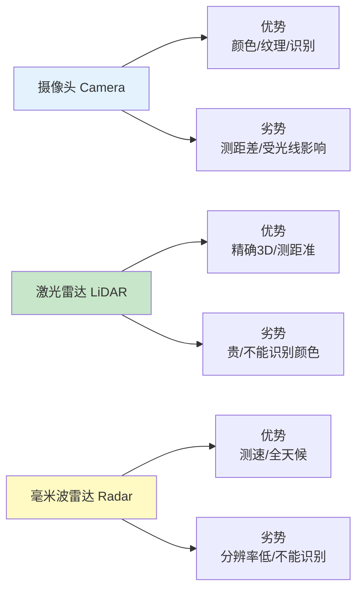

```

**详细对比：**

| 对比维度 | 摄像头 | 激光雷达 | 毫米波雷达 |
|---------|--------|---------|-----------|
| **测距精度** | 差（单目估算） | 极高（±2cm） | 中（±10cm） |
| **3D感知** | 弱（需多摄/算法） | 强（原生3D点云） | 弱（点云稀疏） |
| **目标识别** | 强（能识别是什么） | 弱（只有形状） | 极弱（只有距离/速度） |
| **颜色感知** | 有 | 无 | 无 |
| **夜间能力** | 差 | 好（主动发光） | 好 |
| **恶劣天气** | 差（雨雾雪） | 中（大雨影响） | 好（穿透力强） |
| **成本** | 低（几百元） | 高（几千-上万元） | 中（几百-千元） |
| **读取速度** | 快（60fps+） | 中（10-20Hz） | 快 |

**两大技术路线：**

```
路线一：纯视觉方案（Tesla为代表）

  核心思想：
    → 只用摄像头
    → 通过强大的AI算法
    → 实现距离估算和3D理解
  
  优势：
    ✓ 成本低
    ✓ 信息丰富（颜色、纹理）
    ✓ 规模效应（数据越多算法越强）
  
  挑战：
    ✗ 深度估算不准
    ✗ 恶劣天气失效
    ✗ 对算法要求极高
  
  Tesla的做法：
    → 8个摄像头环绕车身
    → 占用网络（Occupancy Network）
    → BEV（鸟瞰图）+ Transformer
    → 端到端神经网络

路线二：多传感器融合（大多数厂商）

  核心思想：
    → 摄像头 + 激光雷达 + 毫米波雷达
    → 取长补短
    → 冗余备份
  
  优势：
    ✓ 全天候全场景覆盖
    ✓ 安全性更高（冗余）
    ✓ 测距精确
  
  挑战：
    ✗ 成本高
    ✗ 融合算法复杂
    ✗ 标定困难
  
  代表：
    → Waymo、百度Apollo、小鹏、蔚来

趋势：
  → 摄像头数量在增加（10-15个）
  → 像素在提升（800万成为主流）
  → 激光雷达成本在下降
  → 纯视觉vs融合的争论还会继续
```

---

## 九、摄像头的核心产业链

### 9.1 产业链全景图

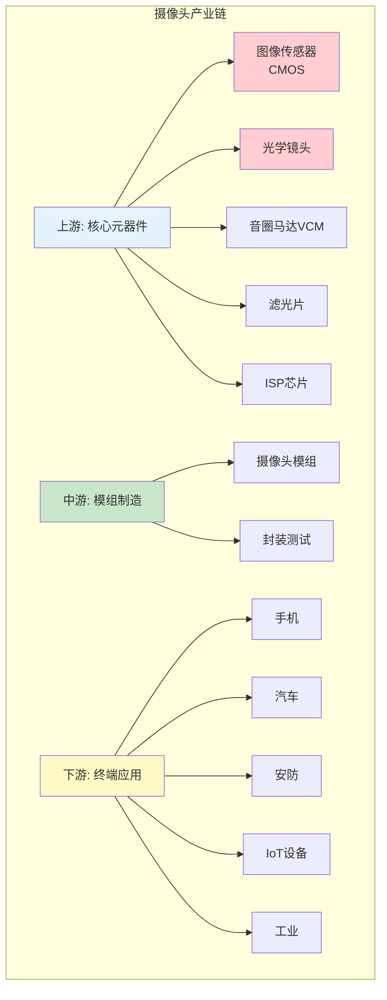

### 9.2 核心环节详解

```
上游：技术壁垒最高

1. 图像传感器（CMOS）
   
   全球市场格局：
   
   索尼（日本）：
     → 市场份额约50%
     → 技术领先（堆叠式、双层晶体管）
     → 苹果、三星、小米旗舰都用
   
   三星（韩国）：
     → 市场份额约20%
     → 高像素领先（1亿、2亿像素）
     → 自研自用于三星手机
   
   豪威科技OmniVision（中国/美国）：
     → 市场份额约10%
     → 被中国财团收购
     → 中高端市场
     → 广泛应用于安卓手机
   
   格科微（中国）：
     → 市场份额约8%
     → 低端市场（200-800万像素）
     → 价格优势
   
   安森美（美国）：
     → 汽车CMOS领先
     → 工业应用
   
   思特威（中国）：
     → 安防监控领域
     → 夜视能力强

2. 光学镜头
   
   全球市场格局：
   
   大立光（台湾）：
     → 手机镜头龙头
     → 苹果主要供应商
     → 技术领先
   
   舜宇光学（中国）：
     → 手机镜头全球第二
     → 车载镜头全球第一
     → 华为、小米供应商
   
   玉晶光（台湾）：
     → 苹果供应商
     → 中高端镜头
   
   欧菲光（中国）：
     → 中低端镜头
     → 模组制造

3. 音圈马达（VCM）
   
   功能：
     → 推动镜头前后移动
     → 实现自动对焦
   
   主要厂商：
     → 新思考（中国）
     → 中蓝电子（中国）
     → 阿尔卑斯（日本）

4. 滤光片
   
   功能：
     → 红外截止（IR Cut）
     → 滤除不需要的波长
   
   主要厂商：
     → 水晶光电（中国）
     → 五方光电（中国）

中游：模组制造

  功能：
    → 将传感器、镜头、马达等组装在一起
    → 调校和测试
    → 交付给终端厂商
  
  主要厂商：
    
    三星电机（韩国）：
      → 自研自产
      → 供三星手机
    
    LG Innotek（韩国）：
      → 苹果主要供应商
      → 技术实力强
    
    舜宇光学（中国）：
      → 模组出货量全球前列
      → 安卓阵营主力供应商
    
    丘钛科技（中国）：
      → 中端模组
      → 国内手机品牌供应商
    
    欧菲光（中国）：
      → 曾是苹果供应商
      → 后被制裁
      → 转向安卓和汽车

下游：终端应用

  手机：最大的市场（每年约40亿颗）
  汽车：增长最快（单车10-15颗）
  安防：稳定增长（AI带动）
  IoT：智能家居、扫地机器人等
  工业：机器视觉、质检
```

### 9.3 全球市场规模

```
全球摄像头模组市场：

2020年：约300亿美元
2023年：约400亿美元
2028年（预测）：约550亿美元
年复合增长率：约6-8%

各应用市场占比：

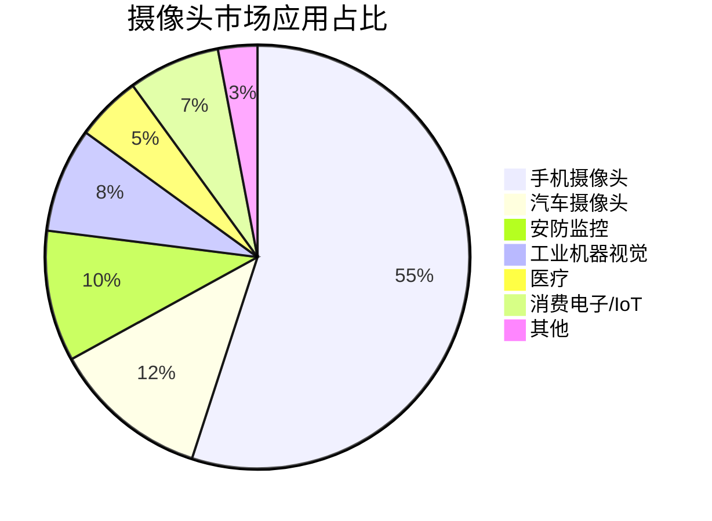

```

```
CMOS图像传感器市场：

2023年：约220亿美元
预计2030年：约350亿美元
年复合增长率：约7%

手机用CMOS：约60%
汽车用CMOS：约10%（增速最快）
安防用CMOS：约8%
其他：约22%

中国市场的特殊性：
  → 全球最大的手机市场
  → 全球最大的安防市场（海康、大华）
  → 快速增长的汽车市场
  → 国产替代加速
```

---

## 十、AI如何重塑摄像头

### 10.1 摄像头+AI的融合

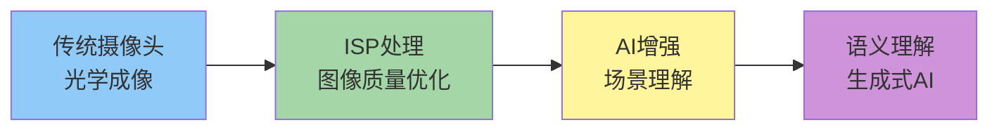

**AI赋能摄像头的层次：**

```
第一层：图像质量增强

  AI降噪：
    → 传统降噪：模糊细节
    → AI降噪：学习大量图像
    → 区分噪声和细节
    → 只去除噪声，保留细节
  
  AI超分辨率：
    → 将低分辨率图像升级为高分辨率
    → AI"猜"出缺失的细节
    → 效果远超传统插值算法
  
  AI HDR：
    → 智能识别过曝/欠曝区域
    → 自动调整色调映射

第二层：场景理解

  目标检测：
    → 识别图像中的每个物体
    → 人、车、动物、植物...
  
  语义分割：
    → 每个像素属于什么类别
    → 天空、草地、建筑、人脸...
  
  深度估计：
    → 从单张图像估算深度
    → AI学习透视规律

第三层：生成与编辑

  AI消除：
    → 圈出不想要的元素
    → AI自动填补背景
    → 类似Photoshop但更智能
  
  AI扩图：
    → 将图像扩展到原始画幅之外
    → 生成式AI"想象"之外的内容
  
  AI换天：
    → 识别天空区域
    → 替换为不同的天空
    → 自动调整整体色调

第四层：语义理解

  图像描述：
    → AI用文字描述图像内容
    → "一个穿着红色衣服的女孩在草地上奔跑"
  
  视觉问答：
    → 提问："图中有几个人？"
    → AI回答："3个人"
  
  情感分析：
    → 识别人脸表情
    → 判断场景氛围
```

### 10.2 AI摄像头的未来形态

```
端侧大模型 + 摄像头 = 全新体验

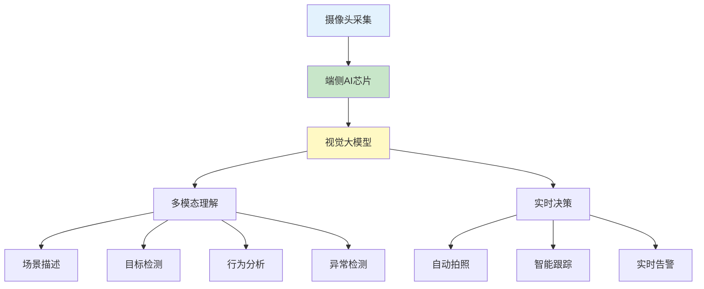

```

```
未来AI摄像头能力：

1. 全自动拍摄
   → 你不需要按快门
   → AI知道什么时候该拍
   → 自动选择最佳角度和时机
   → "拍了100张，选出最好的1张"

2. 实时视频理解
   → 摄像头持续观看
   → 实时理解画面内容
   → "妈妈抱着宝宝走进了房间"
   → 可以做笔记、搜索、告警

3. 个性化摄影风格
   → 学习你的审美偏好
   → 自动应用你喜欢的色调
   → 比你还懂你想要什么

4. 智能视频编辑
   → 拍完视频后
   → AI自动剪辑、配乐、加字幕
   → 一键生成vlog

5. 空间视频
   → 记录3D场景
   → 可以在VR/AR中回看
   → 如同回到拍摄现场
```

---

## 十一、摄像头技术的未来趋势

### 11.1 传感器技术趋势

```mermaid
graph TB
    subgraph 传感器未来趋势
        A[双层晶体管像素]
        B[全局快门]
        C[事件相机]
        D[量子点传感器]
        E[曲面传感器]
    end
    
    A --> A1[索尼2024年量产]
    A --> A2[进光量提升2x]
    A --> A3[动态范围提升4x]
    
    B --> B1[无果冻效应]
    B --> B2[适合高速拍摄]
    
    C --> C1[微秒级响应]
    C --> C2[极低功耗]
    C --> C3[只记录变化]
    
    D --> D1[色彩更准]
    D --> D2[灵敏度更高]
    
    E --> E1[匹配人眼曲面]
    E --> E2[镜头更简单]
    
    style A fill:#ffcdd2
    style B fill:#c8e6c9
    style C fill:#fff9c4
    style D fill:#ffcc80
    style E fill:#e1bee7
```

**未来传感器详解：**

```
趋势一：双层晶体管像素技术

  传统像素结构：
    光电二极管 + 晶体管共用一层
    两者竞争空间
    光电二极管面积受限
  
  双层结构：
    上层：光电二极管（专门感光）
    下层：晶体管（专门处理信号）
    互不干扰，各自最大化
  
  效果：
    → 饱和信号量提升约2倍
    → 动态范围提升约4倍
    → 噪声降低
  
  索尼2024年宣布量产
  将用于旗舰手机

趋势二：全局快门（Global Shutter）

  问题：卷帘快门（Rolling Shutter）
    → 逐行扫描曝光
    → 快速运动的物体会变形
    → 果冻效应
  
  解决方案：全局快门
    → 所有像素同时曝光
    → 无果冻效应
    → 适合拍摄高速运动物体
  
  索尼2023年推出
  IMX490：汽车用全局快门传感器

趋势三：事件相机（Event Camera）

  完全不同的成像理念！
  
  传统相机：
    → 按固定帧率拍摄（如30fps）
    → 不管画面有没有变化
    → 大量冗余数据
  
  事件相机：
    → 只记录"变化"的像素
    → 某个像素的亮度变了，才记录
    → 时间精度达微秒级
  
  优势：
    → 极低功耗（没有变化就不工作）
    → 极高时间分辨率
    → 高动态范围（>120dB）
    → 低延迟
  
  应用：
    → 机器人避障
    → 自动驾驶
    → 手势识别
    → AR/VR跟踪
  
  代表厂商：
    → Prophesee（法国）
    → iniVation（瑞士）

趋势四：量子点传感器

  量子点（Quantum Dot）：
    → 纳米级别的半导体颗粒
    → 对不同波长敏感
  
  优势：
    → 光谱响应更精确
    → 色彩还原更真实
    → 灵敏度更高
  
  三星在研发中

趋势五：曲面传感器

  灵感来源：人眼的视网膜是曲面的
  
  平面传感器的问题：
    → 镜头需要将平面成像到平面
    → 需要多片镜片矫正像差
    → 边缘画质下降
  
  曲面传感器：
    → 匹配镜头的自然焦面
    → 减少镜片数量
    → 边缘画质提升
    → 模组可以更薄
  
  挑战：
    → 制造工艺复杂
    → 良率低
    → 成本高
```

### 11.2 计算摄影的未来

```
计算摄影的下一步：

```mermaid
graph LR
    A[多帧合成] --> B[AI语义处理]
    B --> C[生成式AI]
    C --> D[神经渲染]
    D --> E[全息记录]
    
    style A fill:#e3f2fd
    style B fill:#c8e6c9
    style C fill:#fff9c4
    style D fill:#ffcc80
    style E fill:#ce93d8
```

```

```
未来计算摄影能力：

1. 神经渲染（Neural Rendering）
   
   传统渲染：
     → 基于物理规则
     → 光线追踪
   
   神经渲染：
     → 用神经网络学习渲染
     → 速度更快
     → 效果更真实
   
   应用：
     → 实时照片级渲染
     → 虚拟场景以假乱真

2. 神经辐射场（NeRF）
   
   原理：
     → 从多张2D照片
     → 学习出3D场景的隐式表示
     → 可以从任意角度"看"这个场景
   
   应用：
     → 手机拍几张照片
     → 生成可360度观看的3D模型
     → VR/AR中回看

3. 生成式摄影
   
   未来的"拍照"可能是：
     → 摄像头采集光线信息
     → AI生成最终照片
     → 你可以选择不同风格
     → 甚至可以"重拍"（改变光照、角度）
   
   争议：
     → 这还是"照片"吗？
     → 和"画图"有什么区别？
     → 真实性如何保证？

4. 计算光学
   
   传统：光学硬件决定画质上限
   
   计算光学：
     → 故意设计"不完美"的光学系统
     → 用算法后期矫正
     → 可以做得更薄更轻
   
   示例：
     → 超表面镜头（Metalens）
     → 平面镜头替代曲面镜头
     → 厚度只有几百微米
```

### 11.3 摄像头在各行业的未来

```mermaid
mindmap
  root((摄像头未来应用))
    手机
      2亿像素普及
      AI计算摄影
      全息记录
      可变形镜头
    汽车
      L3+自动驾驶
      舱内交互
      电子后视镜
      V2X协同
    安防
      全场景智能
      隐私计算
      多模态感知
    医疗
      胶囊内窥镜
      手术机器人
      AI辅助诊断
    工业
      3D检测
      缺陷检测
      数字孪生
    太空
      深空探测
      太空望远镜
      行星探测
```

```
各行业的趋势：

手机：
  → 2亿像素成为旗舰标配
  → AI计算摄影持续进化
  → 可能出现可变形镜头
  → 全息记录/空间视频

汽车：
  → 单车摄像头数量继续增加
  → 800万像素成为主流
  → 电子外后视镜普及
  → 舱内交互（手势、视线追踪）

安防：
  → 从"看得见"到"看得懂"
  → 多模态融合（视觉+音频+红外）
  → 隐私计算（数据脱敏）
  → 端侧AI成为标配

医疗：
  → 胶囊内窥镜（吞一颗"相机"）
  → 手术机器人（3D视觉）
  → AI辅助诊断（阅片、病理）
  → 纳米级成像（细胞级别）

工业：
  → 3D视觉检测
  → 缺陷检测（AI+高精度）
  → 数字孪生（实时监控）
  → 协作机器人视觉

太空：
  → 韦伯太空望远镜（红外观测）
  → 行星探测车
  → 深空成像
  → 引力波探测
```

---

## 十二、常见问题解答

### 12.1 像素越高画质越好吗？

```
误区：像素越高 = 画质越好

真相：像素数量只是因素之一

```mermaid
graph TB
    A[画质] --> B[传感器尺寸]
    A --> C[像素尺寸]
    A --> D[镜头质量]
    A --> E[ISP算法]
    A --> F[像素数量]
    
    style B fill:#ffcdd2
    style C fill:#ffcdd2
    style D fill:#ffcdd2
    style E fill:#ffcdd2
    style F fill:#fff9c4
```

```

```
关键因素排序：

1. 传感器尺寸（最重要！）
   → 面积越大，进光量越多
   → 1英寸 >> 1/3英寸

2. 单个像素尺寸
   → 像素越大，感光能力越强
   → 2.0μm >> 0.6μm

3. 镜头质量
   → 镜片数量和材质
   → 解析力、畸变控制

4. ISP算法
   → 降噪、HDR、色彩

5. 像素数量
   → 影响最大可输出尺寸
   → 对画质影响相对较小

举例：
  1200万像素 + 1英寸传感器
  画质可能比
  1亿像素 + 1/2英寸传感器
  更好！

高像素的真正价值：
  → 放大裁切（相当于数码变焦）
  → 打印大幅照片
  → 后期裁剪空间
  → 但日常使用（发朋友圈、看手机）
  → 1200万像素已经完全够用
```

### 12.2 光学变焦 vs 数码变焦 vs AI变焦

```
三种变焦的区别：

光学变焦（真正的变焦）
  → 通过移动镜片改变焦距
  → 无损画质
  → 相机和高端手机有
  
  优点：画质无损
  缺点：需要复杂的光学结构

数码变焦（裁剪放大）
  → 裁剪画面中间部分
  → 然后放大到原始分辨率
  → 本质是"裁剪"
  
  优点：简单
  缺点：画质下降明显

AI超分变焦（计算变焦）
  → 裁剪后用AI"猜"出细节
  → 超分辨率重建
  → 比数码变焦好，不如光学变焦
  
  优点：平衡画质和便利性
  缺点：AI"猜"的细节可能不准确

```mermaid
graph LR
    A[100%画面] --> B[光学变焦<br/>无损]
    A --> C[数码变焦<br/>有损]
    A --> D[AI超分<br/>较好]
    
    style B fill:#c8e6c9
    style C fill:#ffcdd2
    style D fill:#fff9c4
```

```

### 12.3 OIS和EIS防抖的区别

```
OIS（光学防抖）
  → 通过移动镜头或传感器
  → 补偿手的抖动
  → 物理防抖
  
  优点：任何情况都有效
  缺点：增加厚度和成本

EIS（电子防抖）
  → 通过裁剪和算法补偿
  → 裁掉边缘作为缓冲
  → 纯软件方案
  
  优点：不增加厚度
  缺点：画质有损失，极端抖动无效

最佳方案：OIS + EIS 结合
  → OIS做粗调
  → EIS做精调
  → 效果最好
```

### 12.4 为什么手机拍照比相机好看？

```
这其实是个"美丽的误会"

手机照片好看的原因：
  → AI场景识别
  → 自动美化（色彩、对比度）
  → 多帧合成降噪
  → HDR保留细节
  → 算法帮你"修好了"

相机照片"不好看"的原因：
  → 默认设置偏保守
  → 保留更多原始信息
  → 给后期留空间
  → 直出可能比较"平"

本质区别：
  手机：帮你做完所有处理
        直出就好看
        但后期空间小
  
  相机：给你原始素材
        直出可能一般
        但后期空间大

类比：
  手机 = 预制菜（开袋即食）
  相机 = 原材料（需要自己烹饪）

专业摄影师为什么用相机？
  → 需要后期控制权
  → 需要RAW格式
  → 需要高动态范围
  → 需要浅景深
  → 手机给的"太满了"
```

---

### 摄像头百年进化的关键节点

```mermaid
graph LR
    A[1826<br/>第一张照片] --> B[1969<br/>CCD发明]
    B --> C[1990s<br/>CMOS崛起]
    C --> D[2000s<br/>手机摄像头]
    D --> E[2010s<br/>多摄+计算摄影]
    E --> F[2020s<br/>AI摄像头]
    F --> G[未来<br/>神经渲染<br/>全息记录]
    
    style A fill:#e3f2fd
    style B fill:#c8e6c9
    style C fill:#fff9c4
    style D fill:#ffcc80
    style E fill:#ef9a9a
    style F fill:#ce93d8
    style G fill:#b2dfdb
```

### 理解摄像头的十个关键认知

```
1. 摄像头不只是"镜头"
   它是光学、半导体、算法的结合体

2. CCD和CMOS之争
   赢的不一定是技术更好的
   而是更适合生态系统的

3. 传感器尺寸比像素数量重要
   大底才是画质的基础

4. 手机逆袭相机的秘诀
   不是硬件超越
   而是计算摄影

5. 多摄系统是手机的无奈之举
   因为太薄，无法做光学变焦
   只能用多个定焦镜头模拟

6. AI正在重塑摄像头
   从"记录光线"到"理解场景"

7. 摄像头已经无处不在
   手机、汽车、监控、IoT、工业
   我们生活在一个被"观看"的世界

8. 自动驾驶的感知之争
   纯视觉vs多传感器融合
   没有标准答案

9. 未来摄像头会更"聪明"
   端侧AI + 大模型
   摄像头能"看懂"世界

10. 隐私和伦理问题
    摄像头普及带来便利
    也带来隐私侵犯的风险
    如何在便利和隐私间平衡？
```

### 摄像头的下一个十年

```
2025-2035，摄像头技术可能的演进：

传感器：
  → 双层晶体管普及
  → 事件相机进入消费级
  → 量子点、曲面传感器量产

计算摄影：
  → 端侧大模型
  → 生成式AI深度融入
  → 神经渲染和NeRF成为日常

手机：
  → 计算摄影进入AI 2.0时代
  → 空间视频/全息记录
  → 可变形镜头可能量产

汽车：
  → 单车15-20个摄像头
  → 纯视觉方案持续进化
  → 800万像素普及

安防：
  → 全场景智能理解
  → 端侧大模型部署
  → 隐私计算成为标配

新兴领域：
  → 机器人视觉
  → AR/VR摄像头
  → 医疗成像突破
  → 太空深空探测

不变的是：
  → 人们对"看得更清楚"的追求
  → 技术永远在突破极限

摄像头，这双人类的"电子眼"
还将继续进化
帮我们看见更多、看清更远

---