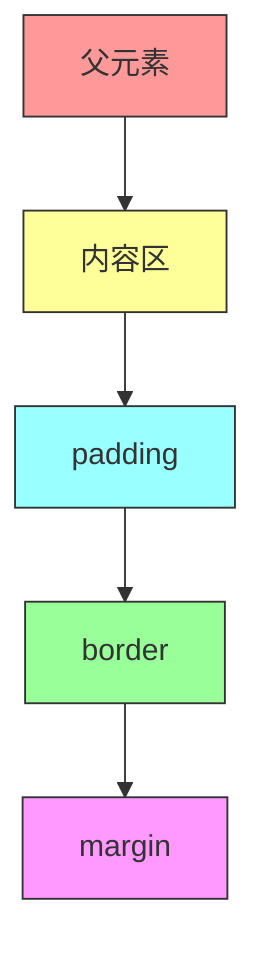

# 浏览器布局（Layout/Reflow）过程详解

## 一、布局（Layout/Reflow）核心定义

浏览器在生成渲染树后，会从根节点（通常为`<html>`/`<body>`）开始递归计算每个节点在屏幕上的几何信息，最终输出每个节点的**盒模型矩形**（x, y, width, height），这个过程就是布局（也叫重排 Reflow）。

## 二、布局过程拆解

### 1. 第一步：定「画布大小」—— 计算视口（Viewport）

核心逻辑：浏览器先确定可绘制的屏幕空间尺寸，是所有元素布局的基础。

| 端 | 视口宽度 | 视口高度 |
|----|----------|----------|
| 桌面端 | 浏览器窗口宽度（减滚动条） | 浏览器窗口高度 |
| 移动端 | 由`<meta name="viewport">`控制 | - |

### 2. 第二步：自上而下划地盘 —— 计算块级元素的盒模型

核心规则：从根元素开始，父元素先为子元素分配可用空间，子元素再计算自身尺寸和位置。



**计算示例**（视口宽度1000px）：

```
<html>：内容宽度 = 1000px，坐标 (x=0, y=0)

<body style="padding:20px">：
内容宽度 = 1000 - 20×2 = 960px

<div style="width:300px; padding:10px; border:5px; margin:15px">：
实际总宽度（含padding/border）= 300 + 10×2 + 5×2 = 330px
x坐标 = 20 + 15 = 35px
y坐标 = 20 + 15 = 35px
```

### 3. 第三步：见缝插针摆内容 —— 计算行内元素的排列

核心规则：行内元素不独占一行，按以下规则排列：

- 从左到右排列
- 行宽不足时自动换行
- 垂直位置受vertical-align影响

### 4. 第四步：自下而上微调

- 子元素高度超出预期时，父元素高度会被「撑开」
- 子元素为浮动元素时，父元素高度会「塌陷」

### 5. 最终输出

每个节点都会得到精确的盒模型矩形：

| 属性 | 说明 |
|------|------|
| x | 元素在视口中的水平坐标（左边缘） |
| y | 元素在视口中的垂直坐标（上边缘） |
| width | 元素实际宽度（content + padding + border） |
| height | 元素实际高度（content + padding + border） |

## 三、补充：未重置默认样式的计算差异

浏览器默认给`<body>`加`margin: 8px`：

```
<body> 内容宽度 = 1000 - 8×2 - 20×2 = 944px
<div> x坐标 = 8 + 20 + 15 = 43px
```

1. 布局的核心逻辑是「先算父元素可用空间，再递归计算子元素尺寸和位置」
2. 块级元素默认独占一行，行内元素从左到右排列
3. 布局最终输出每个节点的精确坐标和尺寸，为后续绘制（Paint）提供基础
