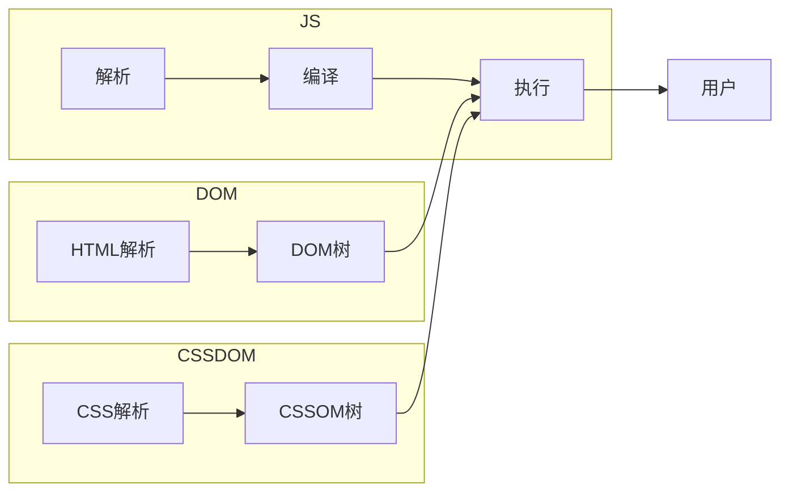
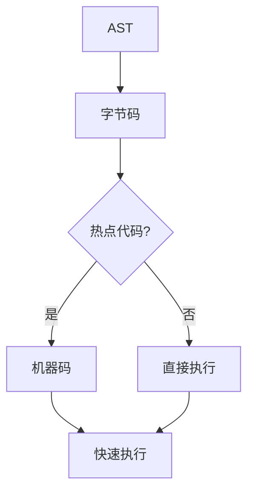
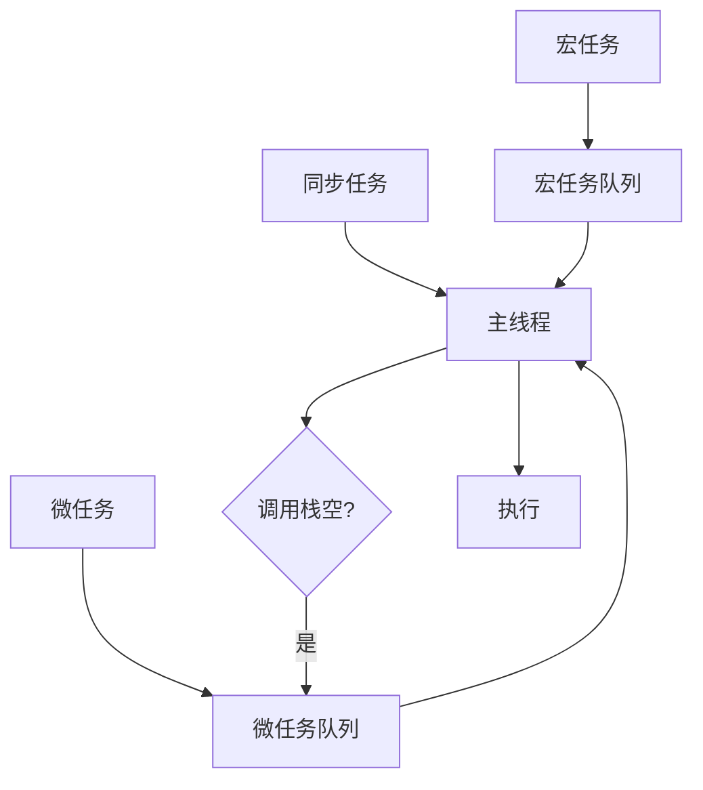

# 浏览器执行JavaScript的完整过程

浏览器执行JavaScript的核心是「解析→编译→执行」的流水线操作，依赖JavaScript引擎完成，同时需要配合DOM、CSSDOM协同工作。

## 一、核心前提：引擎、线程模型与交互三大核心

### 1. JavaScript引擎

专门负责处理JavaScript代码的程序，将JS代码转化为机器码。最常用的是Chrome的V8引擎，特点是执行速度快，采用「即时编译（JIT）」优化。

### 2. 单线程模型

JavaScript是单线程语言，即浏览器同一时间只能执行一段JS代码。但浏览器本身是多线程（渲染线程、JS引擎线程、事件触发线程等），各线程协同工作。

### 3. 浏览器交互三大核心



- **DOM**：将HTML文档解析为树形结构
- **CSSDOM**：将CSS样式解析为树形结构
- **JavaScript**：操作DOM修改页面结构、操作CSSDOM修改页面样式

## 二、浏览器执行JavaScript的5个核心步骤

### 步骤1：加载JavaScript代码

浏览器加载HTML页面时，遇到`<script>`标签会暂停HTML解析，优先加载并执行JS代码。

```html
<!-- 内联JS -->
<script>console.log("hello")</script>

<!-- 外部JS -->
<script src="app.js"></script>

<!-- 异步加载 -->
<script async src="app.js"></script>
<script defer src="app.js"></script>
```

### 步骤2：解析（Parsing）—— 生成AST

JS引擎对代码进行解析，将字符串形式的JS代码，转化为抽象语法树（AST）。

```
词法分析（分词）：var a = 10;  → var, a, =, 10
语法分析（解析）：→ 生成AST
```

### 步骤3：编译（Compilation）—— 生成字节码/机器码



### 步骤4：执行（Execution）—— 执行代码

编译完成后，JS引擎进入执行阶段，管理「执行上下文」和「调用栈」。

**执行上下文**：包含变量对象、作用域链、this指向

**变量提升**：

```js
console.log(a); // undefined（var提升）
var a = 10;

// let/const不会提升，会报错
console.log(b); // ReferenceError
let b = 20;
```

### 步骤5：处理异步任务（Event Loop）



**执行顺序**：同步任务 → 微任务 → 宏任务

| 类型 | 示例 |
|------|------|
| 宏任务 | setTimeout, setInterval, DOM事件, AJAX |
| 微任务 | Promise.then, async/await, queueMicrotask |

## 三、常见注意事项

1. **JS执行顺序**：同步任务 → 微任务 → 宏任务
2. **script标签的async/defer**：async加载完成后立即执行；defer等待HTML解析完成后再执行
3. **语法错误 vs 运行时错误**：语法错误在解析阶段抛出；运行时错误在执行阶段抛出

```
加载JS代码 → 解析生成AST → 编译生成字节码/机器码 → 执行代码 → 事件循环处理异步任务
```