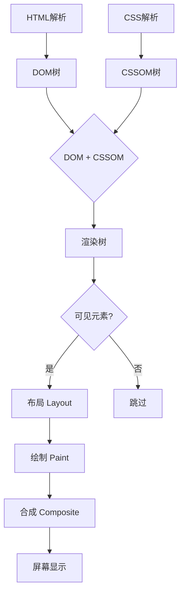

# 浏览器的渲染过程：聚焦可见内容

浏览器的渲染过程是「完整解析DOM树，但有选择地渲染可见内容」，核心逻辑是：先构建完整的DOM结构（为了JS操作和后续动态变化），再基于「可见性」筛选出需要渲染的元素，生成渲染树（Render Tree）进行布局和绘制。

## 一、先明确两个核心概念：DOM树 vs 渲染树

### 1. DOM树（Document Object Model）：完整解析，一个都不能少

**生成方式**：浏览器从服务器获取HTML后，会完整解析所有HTML标签（包括`<script>`、`<link>`、display: none的元素、注释等），生成一棵完整的DOM树。

**为什么要完整？**

- DOM树是JS操作页面的基础（比如你可以用JS把display: none的元素改成display: block）
- 即使元素暂时不可见，也可能通过CSS动画、用户交互等动态显示

### 2. 渲染树（Render Tree）：有选择地构建，只留「可见元素」

**生成方式**：DOM树生成后，浏览器会结合CSSOM树，筛选出需要在页面上显示的元素，生成渲染树。

**哪些元素会被排除？**

- **display: none的元素**：完全从渲染树中移除
- **非视觉元素**：如`<script>`、`<link>`、`<meta>`、注释等

## 二、渲染流程中的「选择性」



### 1. 布局阶段（Layout/Reflow）

- 只对渲染树中的元素进行布局
- 现代浏览器优化：增量布局、视口外延迟布局

### 2. 绘制阶段（Paint/Repaint）

- 只绘制渲染树中且在视口内的元素
- 现代浏览器优化：分层绘制、增量绘制

### 3. 合成阶段（Composite）

- 把多个层合成到屏幕上
- 现代浏览器优化：GPU加速合成

## 三、举例说明

```html
<div id="container">
    <div id="visible">可见内容</div>
    <div id="hidden" style="display:none">不可见</div>
    <script>console.log("脚本")</script>
</div>
```

- **DOM树**：包含container、visible、hidden、script所有元素
- **渲染树**：只包含container、visible（hidden和script被排除）
- **布局**：计算container、visible的位置和大小
- **绘制**：只绘制visible

| 概念 | 特点 |
|------|------|
| DOM树 | 完整解析所有HTML元素，一个都不能少 |
| 渲染树 | 有选择地构建，只包含可见元素 |
