# 深度链接（Deep Link）完全指南：从原理到实战，一文打通App跳转的任督二脉

> **导语**：你点击一条微信分享的商品链接，直接打开了淘宝App的对应商品页；你在短信里收到一条银行账单通知，点击后直接跳转到银行App的账单详情页。这一切丝滑体验的背后，都有一个核心技术在支撑——**深度链接（Deep Link）**。本文将从最基础的概念开始，带你全面看懂深度链接的技术原理、实现方案与最佳实践。

---

## 一、什么是深度链接？为什么我们需要它？

### 1.1 一个日常场景

假设你在微信里看到朋友分享的一条京东商品链接：

**没有深度链接的体验**：
```
点击链接 → 打开手机浏览器 → 显示网页版商品 → 
提示"在App中打开" → 下载/打开京东App → 
跳转到京东首页 → 手动搜索商品 → 终于看到了
```
**操作步骤：5-7步，体验极差，流失率超过60%**

**有深度链接的体验**：
```
点击链接 → 直接打开京东App → 
直接展示商品详情页 → 完成购买
```
**操作步骤：1-2步，体验丝滑，转化率提升3-5倍**

这就是深度链接的价值：**让用户从外部入口，一键直达App内部的指定页面。**

### 1.2 深度链接的定义

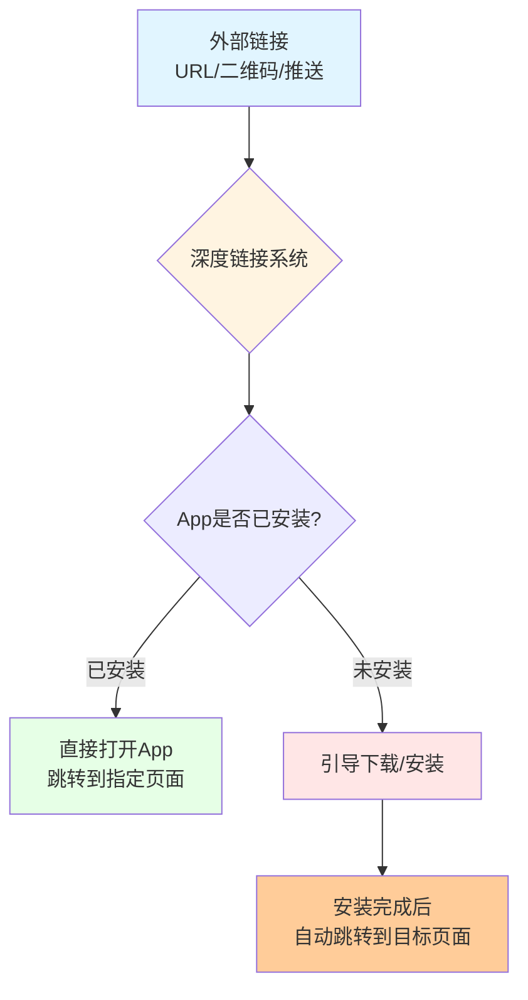

**深度链接（Deep Link）**，是一种特殊的URL，它不仅能打开一个App，还能**直接导航到App内部的特定内容或页面**。

与传统链接的区别：

| 类型 | 示例 | 打开效果 | 技术实现 |
|------|------|---------|---------|
| **普通链接** | `https://example.com` | 打开浏览器或App首页 | HTTP/HTTPS |
| **深度链接** | `myapp://product/12345` | 打开App并跳转到商品页 | URL Scheme / Universal Links |
| **延迟深度链接** | `https://example.com/deferred` | 未安装时引导下载，安装后直达目标页 | 指纹匹配 / 剪贴板 / 账号匹配 |

### 1.3 深度链接的核心价值

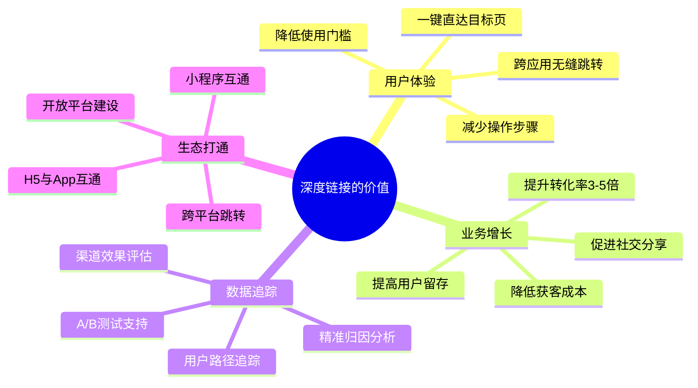

**一组真实数据**：
- Branch Metrics统计：使用深度链接的分享，点击转化率比传统链接**高3-5倍**
- 某电商平台：接入深度链接后，从社交渠道到下单的转化率**提升47%**
- 某金融产品：推送通知中使用深度链接，用户打开率**提升2.3倍**

---

## 二、深度链接的技术演进：从蛮荒到规范

### 2.1 发展时间线

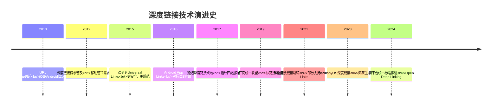

### 2.2 三代技术对比

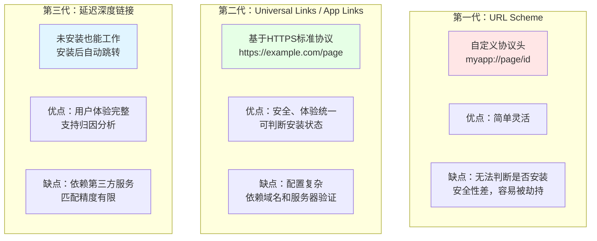

---

## 三、第一代技术：URL Scheme详解

### 3.1 URL Scheme是什么？

URL Scheme是我们最熟悉的深度链接实现方式，本质上是**自定义协议头**。

就像：
- `http://` 表示用HTTP协议打开网页
- `mailto:` 表示打开邮件客户端
- `tel:` 表示拨打电话

App可以注册自己的协议头，比如：
- `taobao://` 打开淘宝
- `weixin://` 打开微信
- `myapp://product/12345` 打开我的App的商品页

### 3.2 URL的结构

```mermaid
graph LR
    A[完整URL] --> B[scheme://]
    A --> C[host]
    A --> D[:port]
    A --> E[/path]
    A --> F[?query]
    A --> G[#fragment]
    
    B --> B1[协议头<br/>必填]
    C --> C1[主机名<br/>必填]
    D --> D1[端口号<br/>选填]
    E --> E1[路径<br/>选填]
    F --> F1[查询参数<br/>选填]
    G --> G1[锚点<br/>选填]
    
    style A fill:#ffcc00
    style B1 fill:#e1f5ff
    style C1 fill:#e1f5ff
```

**示例解析**：

```
myapp://product/detail?id=12345&source=wechat#comments

scheme:   myapp
host:     product
path:     /detail
query:    id=12345&source=wechat
fragment: comments
```

### 3.3 iOS端实现URL Scheme

#### 步骤1：在Info.plist中注册Scheme

```xml
<!-- Info.plist -->
<key>CFBundleURLTypes</key>
<array>
    <dict>
        <key>CFBundleURLName</key>
        <string>com.mycompany.myapp</string>
        <key>CFBundleURLSchemes</key>
        <array>
            <string>myapp</string>
        </array>
    </dict>
</array>
```

#### 步骤2：处理URL回调

**iOS 13+（SceneDelegate）**：

```swift
func scene(_ scene: UIScene, openURLContexts URLContexts: Set<UIOpenURLContext>) {
    guard let url = URLContexts.first?.url else { return }
    handleDeepLink(url)
}

func handleDeepLink(_ url: URL) {
    // myapp://product/detail?id=12345
    if url.host == "product" {
        let components = URLComponents(url: url, resolvingAgainstBaseURL: false)
        let queryItems = components?.queryItems
        let productId = queryItems?.first(where: { $0.name == "id" })?.value
        
        // 跳转到商品详情页
        navigateToProductDetail(productId: productId)
    } else if url.host == "user" {
        // 处理用户主页
        navigateToUserProfile(url.lastPathComponent)
    }
}
```

**iOS 13以下（AppDelegate）**：

```swift
func application(_ app: UIApplication, open url: URL, 
                 options: [UIApplication.OpenURLOptionsKey : Any] = [:]) -> Bool {
    handleDeepLink(url)
    return true
}
```

#### 步骤3：测试URL Scheme

**方法1：Safari浏览器地址栏输入**
```
myapp://product/detail?id=12345
```

**方法2：终端命令**
```bash
xcrun simctl openurl booted "myapp://product/detail?id=12345"
```

**方法3：其他App调用**
```swift
if let url = URL(string: "myapp://product/detail?id=12345") {
    if UIApplication.shared.canOpenURL(url) {
        UIApplication.shared.open(url, options: [:], completionHandler: nil)
    } else {
        // App未安装，跳转到App Store或H5页面
        openAppStoreOrWebFallback()
    }
}
```

### 3.4 Android端实现URL Scheme

#### 步骤1：在AndroidManifest.xml中注册Intent Filter

```xml
<activity android:name=".ProductDetailActivity">
    <intent-filter>
        <action android:name="android.intent.action.VIEW" />
        <category android:name="android.intent.category.DEFAULT" />
        <category android:name="android.intent.category.BROWSABLE" />
        
        <data
            android:scheme="myapp"
            android:host="product"
            android:pathPrefix="/detail" />
    </intent-filter>
</activity>
```

**关键字段说明**：
- `action.VIEW`：表示这个Activity可以响应查看操作
- `category.DEFAULT`：允许隐式Intent启动
- `category.BROWSABLE`：**关键！**允许从浏览器启动
- `scheme`：协议头，必填
- `host`：主机名，可选
- `pathPrefix`：路径前缀，可选

#### 步骤2：处理Intent数据

```kotlin
class ProductDetailActivity : AppCompatActivity() {
    override fun onCreate(savedInstanceState: Bundle?) {
        super.onCreate(savedInstanceState)
        
        val intent = intent
        val data: Uri? = intent.data
        
        if (data != null) {
            // myapp://product/detail?id=12345&source=wechat
            val productId = data.getQueryParameter("id")
            val source = data.getQueryParameter("source")
            
            // 加载商品详情
            loadProduct(productId, source)
        }
    }
}
```

#### 步骤3：测试URL Scheme

**方法1：ADB命令**
```bash
adb shell am start -W -a android.intent.action.VIEW -d "myapp://product/detail?id=12345"
```

**方法2：HTML页面测试**
```html
<a href="myapp://product/detail?id=12345">打开App查看商品</a>
```

### 3.5 URL Scheme的致命缺陷

虽然URL Scheme简单易用，但它有几个**无法解决的缺陷**：

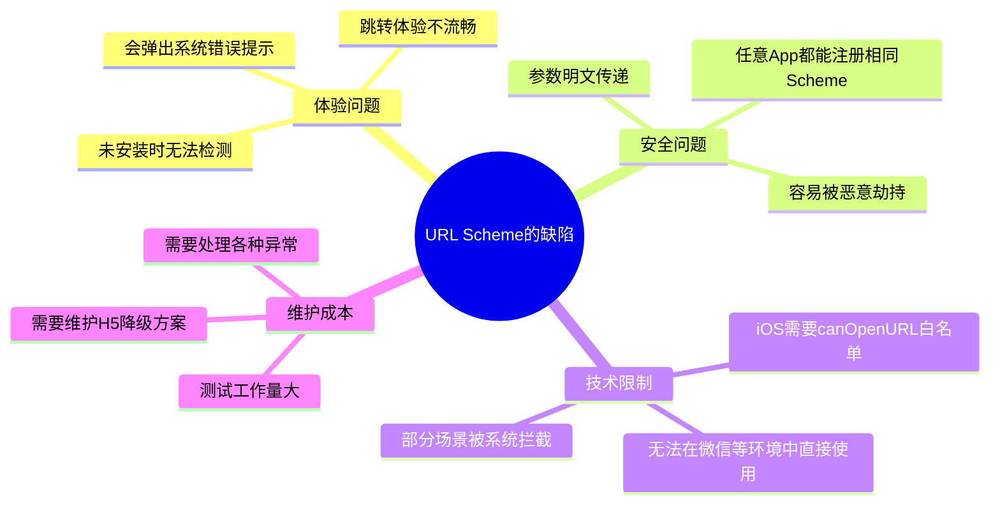

**缺陷详解**：

#### 1. 无法判断App是否安装

```swift
// iOS中canOpenURL有严格限制
// iOS 9以后，最多只能检测100个Scheme
if UIApplication.shared.canOpenURL(url) {
    // 如果返回false，你不知道是因为：
    // 1. App没安装
    // 2. 超过100个白名单限制
    // 3. 没在Info.plist中声明
}
```

#### 2. 未安装时的糟糕体验

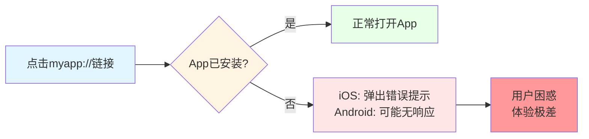

#### 3. 安全劫持风险

**场景还原**：

```
用户手机装了2个App：
- 正规银行App（scheme: bankapp://）
- 恶意钓鱼App（也注册了scheme: bankapp://）

用户点击 bankapp://transfer?to=123&amount=1000
系统可能会打开钓鱼App！
用户完全无法区分
```

**由于URL Scheme没有所有权验证机制**，任何App都可以注册相同的Scheme，导致严重的安全隐患。

### 3.6 URL Scheme的最佳实践

尽管有缺陷，URL Scheme在特定场景下依然有价值：

**适用场景**：
- ✅ 自己公司多个App之间跳转
- ✅ 内部测试和调试
- ✅ 不安全的公开场景
- ✅ 作为Universal Links的降级方案

**最佳实践**：

```swift
// 1. 使用独特的Scheme名称，避免冲突
// ❌ 不好：taobao://, weixin:// (容易冲突)
// ✅ 好：mycompany2024app:// (独特)

// 2. 敏感参数加密传递
// ❌ 不好：myapp://transfer?to=123&amount=1000
// ✅ 好：myapp://transfer?token=加密后的字符串

// 3. 做好异常处理
func safeOpenDeepLink(_ url: URL) {
    if UIApplication.shared.canOpenURL(url) {
        UIApplication.shared.open(url) { success in
            if !success {
                // 打开失败，降级到H5
                openWebFallback(url)
            }
        }
    } else {
        // App未安装，降级到H5或App Store
        openWebFallback(url)
    }
}
```

---

## 四、第二代技术：Universal Links / App Links详解

### 4.1 核心设计理念

为了解决URL Scheme的安全问题，Apple和Google分别推出了**基于HTTPS标准协议的深度链接方案**。

**核心思想**：

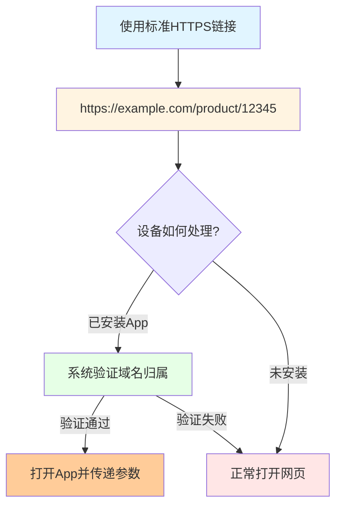

**关键优势**：
- ✅ **唯一所有权**：只有域名持有者才能配置
- ✅ **优雅降级**：未安装时自动打开网页
- ✅ **安全防劫持**：系统级验证机制
- ✅ **体验统一**：用户看到的是标准HTTPS链接

### 4.2 iOS Universal Links完全指南

#### 架构概览

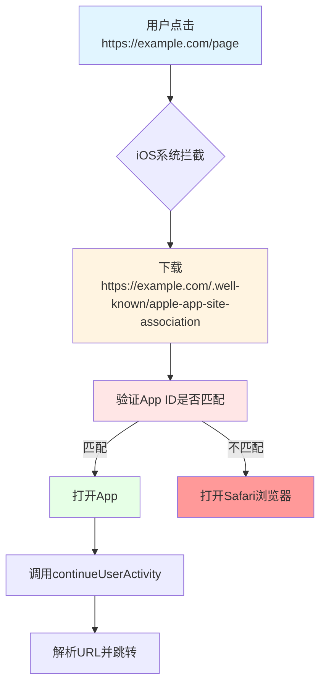

#### 步骤1：准备前提条件

- ✅ 开发者账号（付费）
- ✅ 有效的App ID（支持Associated Domains）
- ✅ 一个HTTPS域名（必须有有效SSL证书）
- ✅ 域名服务器的控制权

#### 步骤2：配置Apple Developer后台

1. 登录 https://developer.apple.com
2. 找到你的App ID
3. 开启 **Associated Domains** 能力
4. 重新生成Provisioning Profile

#### 步骤3：配置AASA文件

在你的域名根目录或`.well-known/`目录下放置`apple-app-site-association`文件（注意：**没有.json后缀**）：

```json
{
  "applinks": {
    "apps": [],
    "details": [
      {
        "appID": "TEAM_ID.com.company.myapp",
        "paths": [
          "/product/*",
          "/user/*",
          "/article/12345",
          "NOT /admin/*"
        ]
      }
    ]
  },
  "appclips": {
    "apps": ["TEAM_ID.com.company.myapp.AppClip"]
  }
}
```

**配置说明**：

| 字段 | 说明 | 示例 |
|------|------|------|
| `appID` | TEAM_ID + Bundle ID | `ABCD1234.com.company.myapp` |
| `paths` | 支持的路径模式 | `/product/*` 表示所有商品页 |
| `*` | 通配符 | 匹配任意路径 |
| `?` | 单字符通配符 | `/user/??` 匹配2个字符 |
| `NOT` | 排除路径 | `NOT /admin/*` 排除后台路径 |

**重要**：
- AASA文件必须可通过HTTPS访问
- Content-Type必须是`application/json`
- 不能使用自签名证书
- 文件更新后，iOS设备可能需要24小时才能同步

#### 步骤4：配置Xcode工程

1. 打开项目 → **Signing & Capabilities**
2. 添加 **Associated Domains** 能力
3. 添加域名：`applinks:example.com`

```
格式：applinks:域名
示例：applinks:example.com
通配符：applinks:*.example.com（支持子域名）
```

#### 步骤5：处理Universal Link回调

```swift
// SceneDelegate（iOS 13+）
func scene(_ scene: UIScene, continue userActivity: NSUserActivity) {
    guard userActivity.activityType == NSUserActivityTypeBrowsingWeb,
          let url = userActivity.webpageURL else {
        return
    }
    handleUniversalLink(url)
}

// AppDelegate（iOS 13以下）
func application(_ application: UIApplication, 
                 continue userActivity: NSUserActivity, 
                 restorationHandler: @escaping ([UIUserActivityRestoring]?) -> Void) -> Bool {
    if userActivity.activityType == NSUserActivityTypeBrowsingWeb,
       let url = userActivity.webpageURL {
        handleUniversalLink(url)
        return true
    }
    return false
}

func handleUniversalLink(_ url: URL) {
    let path = url.path
    // /product/12345
    if path.hasPrefix("/product/") {
        let productId = path.replacingOccurrences(of: "/product/", with: "")
        navigateToProductDetail(productId: productId)
    } else if path.hasPrefix("/user/") {
        let userId = path.replacingOccurrences(of: "/user/", with: "")
        navigateToUserProfile(userId: userId)
    }
}
```

#### 步骤6：测试Universal Links

**方法1：备忘录测试法**
1. 在备忘录中粘贴链接：`https://example.com/product/12345`
2. 长按链接，看是否显示"在xxx中打开"
3. 点击测试

**方法2：Safari测试法**
1. 在Safari地址栏输入完整链接
2. 如果配置正确，会直接打开App
3. 右上角会出现域名+App名称

**方法3：swcutil测试（开发者）**
```bash
# 查看系统缓存的AASA配置
swcutil -d show
```

#### 常见坑与解决方案

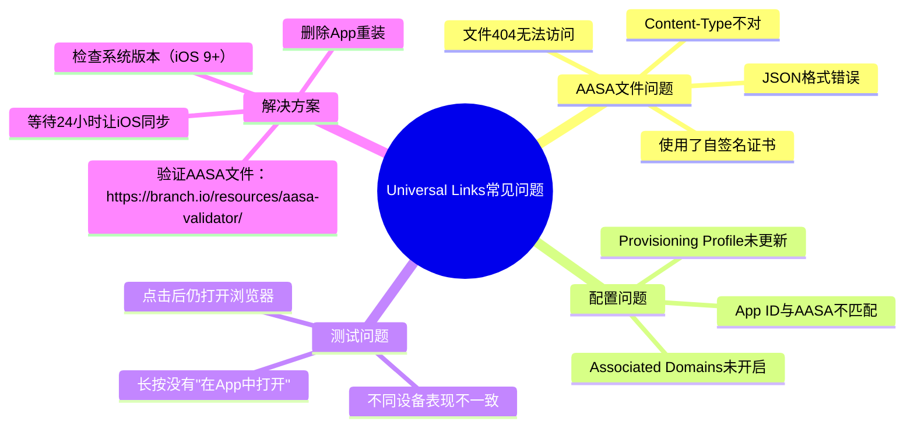

**终极调试技巧**：

```bash
# 1. 在Mac上打开控制台
# 2. 连接iPhone
# 3. 运行：
log stream --predicate 'process == "swcd"' --info

# 4. 触发Universal Link，查看日志输出
# 如果看到"AASA validation successful"，说明配置正确
```

### 4.3 Android App Links完全指南

#### 架构概览

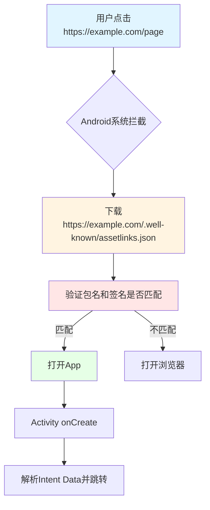

#### 步骤1：生成SHA256证书指纹

```bash
# 使用keytool获取签名SHA256
keytool -list -v -keystore my-release-key.jks -alias my-alias
```

#### 步骤2：配置assetlinks.json

在 `https://example.com/.well-known/assetlinks.json` 放置以下文件：

```json
[
  {
    "relation": ["delegate_permission/common.handle_all_urls"],
    "target": {
      "namespace": "android_app",
      "package_name": "com.company.myapp",
      "sha256_cert_fingerprints": [
        "AB:CD:EF:12:34:56:78:90:AB:CD:EF:12:34:56:78:90:AB:CD:EF:12:34:56:78:90:AB:CD:EF:12:34:56:78:90"
      ]
    }
  }
]
```

**验证工具**：
```bash
# Google官方验证工具
curl "https://digitalassetlinks.googleapis.com/v1/statements:list?source.web.site=https://example.com&relation=delegate_permission/common.handle_all_urls"
```

#### 步骤3：配置AndroidManifest.xml

```xml
<activity android:name=".ProductDetailActivity"
          android:exported="true">
    <intent-filter android:autoVerify="true">
        <action android:name="android.intent.action.VIEW" />
        <category android:name="android.intent.category.DEFAULT" />
        <category android:name="android.intent.category.BROWSABLE" />
        
        <data android:scheme="https"
              android:host="example.com"
              android:pathPrefix="/product" />
    </intent-filter>
</activity>
```

**关键字段**：
- `android:autoVerify="true"`：**关键！**安装时自动验证域名归属
- `android:exported="true"`：Android 12+必须声明
- `scheme="https"`：使用标准HTTPS协议

#### 步骤4：处理Intent

```kotlin
class ProductDetailActivity : AppCompatActivity() {
    override fun onCreate(savedInstanceState: Bundle?) {
        super.onCreate(savedInstanceState)
        
        val intent = intent
        val data: Uri? = intent.data
        
        if (data != null && intent.action == Intent.ACTION_VIEW) {
            // https://example.com/product/12345
            val pathSegments = data.pathSegments
            if (pathSegments.size >= 2 && pathSegments[0] == "product") {
                val productId = pathSegments[1]
                loadProduct(productId)
            }
        }
    }
}
```

#### 步骤5：测试App Links

```bash
# 使用官方工具验证
adb shell am start -a android.intent.action.VIEW \
    -d "https://example.com/product/12345"

# 验证autoVerify状态
adb shell dumpsys package domain-preferred-apps

# 查看验证结果
adb shell pm get-app-links com.company.myapp
```

### 4.4 Universal Links vs App Links对比

| 特性 | iOS Universal Links | Android App Links |
|------|---------------------|-------------------|
| **验证文件** | apple-app-site-association | assetlinks.json |
| **验证时机** | 系统定期拉取 | 安装时自动验证 |
| **失败降级** | 自动打开Safari | 自动打开浏览器 |
| **配置复杂度** | 中等 | 中等 |
| **安全性** | 高（Apple验证） | 高（Google验证） |
| **微信支持** | 部分支持 | 不支持 |
| **最佳实践** | 必须配置 | 必须配置 |

---

## 五、第三代技术：延迟深度链接详解

### 5.1 什么是延迟深度链接？

**核心痛点**：Universal Links和App Links要求App**必须已安装**。如果用户没安装App，会打开网页，但**安装App后无法回到原来的内容页**。

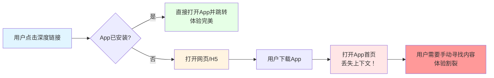

**延迟深度链接（Deferred Deep Linking）**解决的就是这个问题：

> 即使用户没有安装App，在他下载安装并首次打开App时，**依然能跳转到他最初点击的内容页**。

### 5.2 延迟深度链接的核心难题

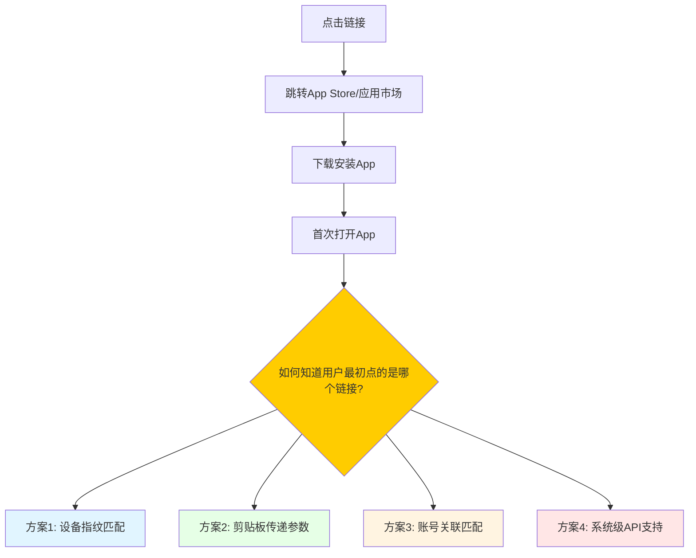

**核心挑战**：
- 从点击链接到打开App，中间可能隔了几分钟到几小时
- 经过App Store/应用市场，**上下文完全丢失**
- 无法通过URL参数直接传递
- 需要一种"跨时空"的匹配机制

### 5.3 方案一：设备指纹匹配（主流方案）

#### 原理

```mermaid
sequenceDiagram
    participant User as 用户
    participant Link as 深度链接
    participant Server as 归因服务器
    participant Store as 应用商店
    participant App as 目标App
    
    User->>Link: 1. 点击深度链接
    Link->>Server: 2. 收集设备指纹信息
    Server->>Server: 3. 记录(IP,UA,设备型号,时间等)
    Server->>User: 4. 重定向到应用商店
    User->>Store: 5. 下载安装App
    User->>App: 6. 首次打开App
    App->>Server: 7. 上报当前设备指纹
    Server->>Server: 8. 匹配最近的点击记录
    Server->>App: 9. 返回匹配的深度链接参数
    App->>User: 10. 跳转到目标页面
```

#### 设备指纹包含的信息

| 信息类型 | iOS | Android | 用途 |
|---------|-----|---------|------|
| IP地址 | ✅ | ✅ | 基础匹配 |
| User Agent | ✅ | ✅ | 浏览器指纹 |
| 设备型号 | ✅ | ✅ | 缩小范围 |
| 系统版本 | ✅ | ✅ | 辅助匹配 |
| 屏幕分辨率 | ✅ | ✅ | 辅助匹配 |
| 时区/语言 | ✅ | ✅ | 辅助匹配 |
| IDFA/OAID | ✅ | ✅ | 精确匹配（需授权） |
| 应用安装列表 | ✅ | ✅ | 辅助匹配 |

#### 匹配逻辑

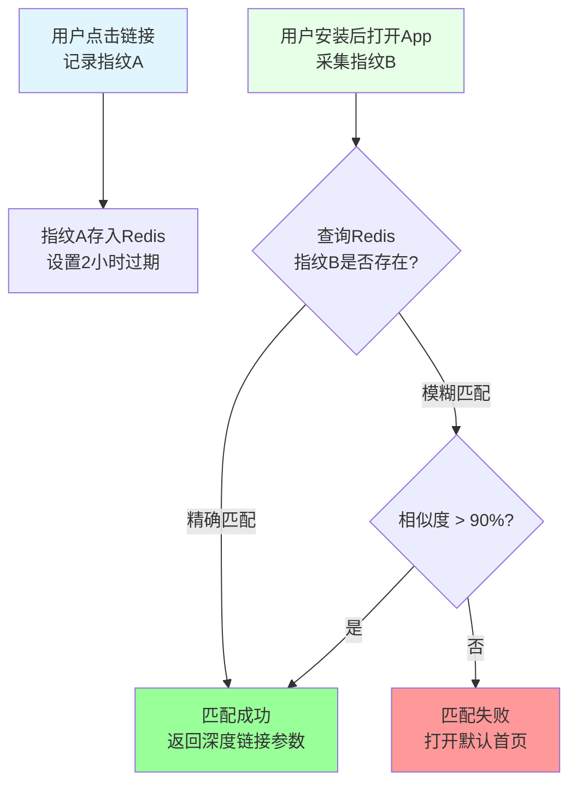

**优点**：
- ✅ 无需用户操作
- ✅ 体验流畅
- ✅ 兼容各种场景

**缺点**：
- ❌ 匹配成功率不是100%（通常70%-90%）
- ❌ 同一网络多人点击可能误匹配
- ❌ 需要依赖第三方归因服务

#### 代码实现（伪代码）

```swift
// App首次启动时
func handleDeferredDeepLink() {
    // 1. 采集设备指纹
    let fingerprint = DeviceFingerprint.collect()
    
    // 2. 请求归因服务器
    AttributionService.match(fingerprint: fingerprint) { result in
        switch result {
        case .success(let params):
            // 3. 匹配成功，跳转到目标页
            self.navigateToTarget(params)
            
        case .failure:
            // 4. 匹配失败，打开首页
            self.navigateToHome()
        }
    }
}
```

### 5.4 方案二：剪贴板传递参数

#### 原理

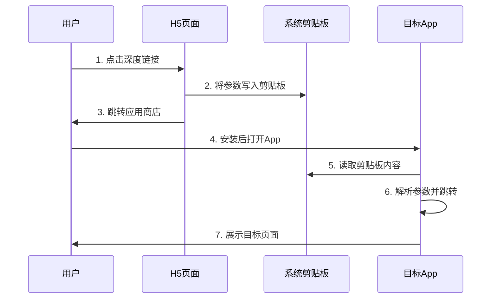

#### H5端代码

```html
<!DOCTYPE html>
<html>
<head>
    <script>
        // 页面加载时写入剪贴板
        function writeToClipboard() {
            const params = {
                productId: '12345',
                source: 'wechat',
                timestamp: Date.now()
            };
            
            // 方案1：使用Clipboard API（现代浏览器）
            if (navigator.clipboard) {
                navigator.clipboard.writeText(JSON.stringify(params));
            }
            
            // 方案2：使用document.execCommand（兼容旧浏览器）
            const input = document.createElement('input');
            input.value = JSON.stringify(params);
            document.body.appendChild(input);
            input.select();
            document.execCommand('copy');
            document.body.removeChild(input);
            
            // 跳转应用商店
            setTimeout(() => {
                window.location.href = 'https://apps.apple.com/app/id123456';
            }, 500);
        }
        
        window.onload = writeToClipboard;
    </script>
</head>
<body>
    <p>正在跳转到应用商店...</p>
</body>
</html>
```

#### App端代码

```swift
// App启动时读取剪贴板
func application(_ application: UIApplication, 
                 didFinishLaunchingWithOptions launchOptions: [UIApplication.LaunchOptionsKey: Any]?) -> Bool {
    
    // 延迟1秒，等系统完全初始化
    DispatchQueue.main.asyncAfter(deadline: .now() + 1.0) {
        self.checkClipboardForDeepLink()
    }
    
    return true
}

func checkClipboardForDeepLink() {
    guard let pasteboardString = UIPasteboard.general.string else { return }
    
    // 尝试解析JSON
    guard let data = pasteboardString.data(using: .utf8),
          let params = try? JSONDecoder().decode([String: String].self, from: data) else {
        return
    }
    
    // 验证时间戳（避免读取到过期的剪贴板）
    guard let timestamp = params["timestamp"],
          let time = Double(timestamp),
          Date().timeIntervalSince1970 - time < 3600 else { // 1小时内有效
        return
    }
    
    // 清空剪贴板（避免重复读取）
    UIPasteboard.general.string = nil
    
    // 处理深度链接
    handleDeepLinkParams(params)
}
```

**优点**：
- ✅ 实现简单
- ✅ 成功率接近100%
- ✅ 不依赖第三方服务

**缺点**：
- ❌ iOS 14+会弹出剪贴板读取提示
- ❌ 用户可能手动复制其他内容导致冲突
- ❌ 隐私合规风险（需明确告知用户）

### 5.5 方案三：账号关联匹配

#### 原理

如果用户在H5页面和App都**登录了同一账号**，可以通过账号关联实现延迟深度链接。

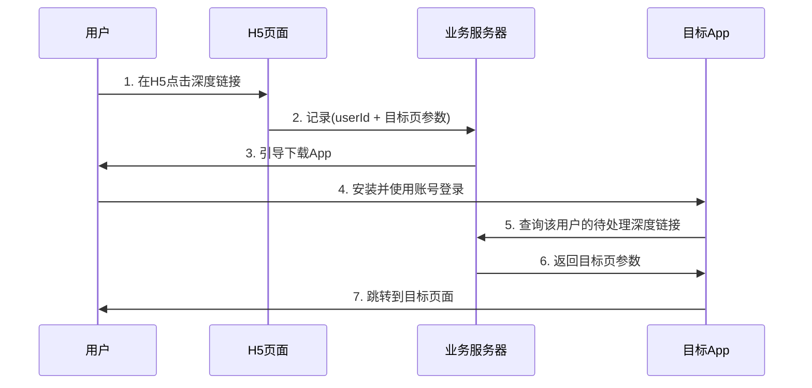

**优点**：
- ✅ 匹配准确率100%
- ✅ 无隐私风险
- ✅ 可支持长时间延迟（用户可能第二天才安装）

**缺点**：
- ❌ 要求用户在H5和App都登录
- ❌ 实现成本较高
- ❌ 未登录用户无法使用

### 5.6 方案四：系统级API支持

#### iOS SKAdNetwork + App Clip

**App Clip（轻App）**是Apple提供的解决方案：

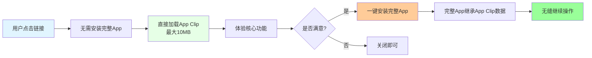

**优点**：
- ✅ 系统级支持，体验丝滑
- ✅ 数据自动迁移
- ✅ 转化率高

**缺点**：
- ❌ 仅限iOS 14+
- ❌ App Clip有10MB大小限制
- ❌ 开发成本高

#### Android Instant Apps

类似iOS的App Clip，Google提供的Instant Apps方案。

### 5.7 主流第三方归因服务

自己实现延迟深度链接成本高、维护难，业界通常使用成熟的第三方服务：

| 服务商 | 特点 | 价格 | 适用场景 |
|-------|------|------|---------|
| **Branch** | 全球最大、功能最全 | 免费版+付费版 | 出海应用 |
| **AppsFlyer** | 归因分析强 | 付费 | 中大型应用 |
| **Adjust** | 欧洲市场占优 | 付费 | 出海应用 |
| **TalkingData** | 国内市场成熟 | 免费版+付费版 | 国内应用 |
| **热云数据** | 国内归因服务 | 付费 | 国内应用 |
| **友盟+** | 阿里生态 | 免费版+付费版 | 国内应用 |

---

## 六、实战场景：深度链接的完整解决方案

### 6.1 场景一：社交分享商品链接

**需求**：用户在App内分享商品到微信，点击链接后打开App商品详情页。

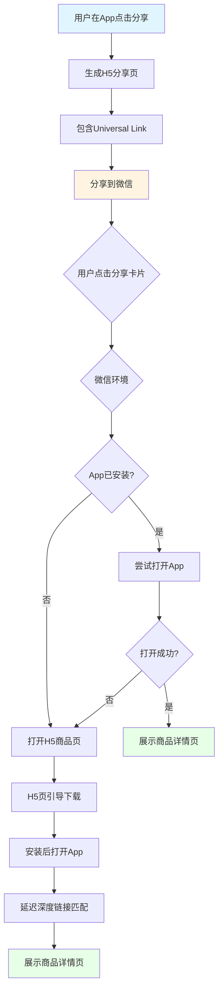

#### 实现步骤

**步骤1：生成分享链接**

```swift
func generateShareLink(productId: String) -> URL {
    // 使用Universal Link
    let urlString = "https://example.com/product/\(productId)"
    return URL(string: urlString)!
}
```

**步骤2：配置H5降级页面**

```html
<!DOCTYPE html>
<html>
<head>
    <meta charset="UTF-8">
    <title>商品详情</title>
    <script>
        // 尝试打开App
        function openApp() {
            const productId = getProductIdFromUrl();
            const appUrl = `myapp://product/detail?id=${productId}`;
            const appStoreUrl = 'https://apps.apple.com/app/id123456';
            
            // 尝试打开App
            const startTime = Date.now();
            window.location.href = appUrl;
            
            // 2秒后如果没打开，说明App未安装
            setTimeout(() => {
                const endTime = Date.now();
                if (endTime - startTime < 2500) {
                    // App未安装，显示H5内容并引导下载
                    showH5Content();
                }
            }, 2000);
        }
        
        // 页面加载时自动尝试
        window.onload = openApp;
    </script>
</head>
<body>
    <div id="h5-content" style="display:none;">
        <!-- H5商品详情 -->
        <h1>商品标题</h1>
        <p>商品价格</p>
        <a href="https://apps.apple.com/app/id123456">下载App查看详情</a>
    </div>
</body>
</html>
```

### 6.2 场景二：推送通知跳转

**需求**：发送推送通知，用户点击后直接打开App的指定页面。

```swift
// 推送Payload格式
{
  "aps": {
    "alert": {
      "title": "您关注的商品降价了",
      "body": "iPhone 15 直降500元，立即查看"
    },
    "sound": "default"
  },
  "deep_link": {
    "type": "product",
    "id": "12345",
    "action": "view"
  }
}

// 处理推送点击
func userNotificationCenter(_ center: UNUserNotificationCenter, 
                           didReceive response: UNNotificationResponse, 
                           withCompletionHandler completionHandler: @escaping () -> Void) {
    let userInfo = response.notification.request.content.userInfo
    
    if let deepLink = userInfo["deep_link"] as? [String: String] {
        handleDeepLinkParams(deepLink)
    }
    
    completionHandler()
}
```

### 6.3 场景三：二维码跳转

**需求**：扫描二维码直接打开App指定页面。

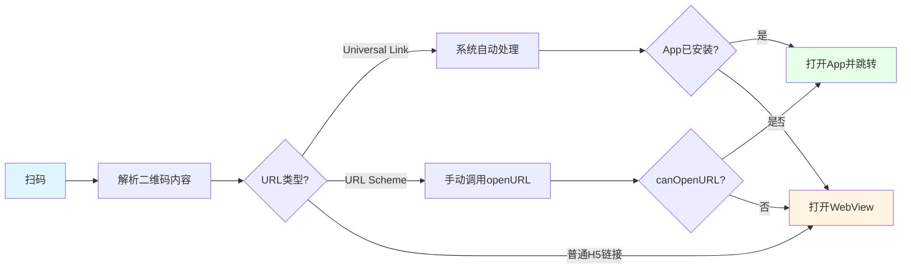

```kotlin
// Android扫码处理
fun handleQRCode(scannedUrl: String) {
    val uri = Uri.parse(scannedUrl)
    
    // 尝试使用Intent打开
    val intent = Intent(Intent.ACTION_VIEW, uri)
    intent.addCategory(Intent.CATEGORY_BROWSABLE)
    
    // 检查是否有App能处理这个Intent
    if (intent.resolveActivity(packageManager) != null) {
        startActivity(intent)
    } else {
        // 使用WebView打开
        openWebView(scannedUrl)
    }
}
```

### 6.4 场景四：短信链接跳转

**需求**：发送短信包含深度链接，用户点击后打开App。

```
短信内容示例：
【XX银行】您的账单已出，本月应还¥5,230.00，点击查看详情：
https://example.com/bill/202403?token=加密字符串

用户点击后：
- 已安装App → 打开银行App → 直接跳转到账单页
- 未安装App → 打开H5账单页 → 引导下载App
```

### 6.5 场景五：搜索引擎直达

**需求**：用户在Google/百度搜索，结果直接打开App内容。

```mermaid
flowchart TB
    A[用户搜索关键词] --> B[搜索引擎返回结果]
    B --> C{Google/百度识别App内容}
    C -->|是| D[显示App专属结果]
    C -->|否| E[显示普通网页结果]
    
    D --> F{用户点击}
    F --> G{App已安装?}
    G -->|是| H[直接打开App内容]
    G -->|否| I[打开网页版内容]
    
    style A fill:#e1f5ff
    style D fill:#fff4e1
    style H fill:#e6ffe6
    style I fill:#ffe6e6
```

**Google App Indexing**：
```xml
<!-- AndroidManifest.xml -->
<intent-filter android:autoVerify="true">
    <action android:name="android.intent.action.VIEW" />
    <category android:name="android.intent.category.DEFAULT" />
    <category android:name="android.intent.category.BROWSABLE" />
    <category android:name="android.intent.category.APP_MAPS" />
    
    <data android:scheme="https"
          android:host="example.com"
          android:pathPrefix="/article" />
</intent-filter>
```

---

## 七、深度链接的安全与合规

### 7.1 安全风险与防护

```mermaid
mindmap
  root((深度链接安全))
    攻击类型
      参数注入攻击
        恶意SQL参数
        XSS脚本注入
      中间人劫持
        URL Scheme劫持
        伪造深度链接
      权限绕过
        绕过登录验证
        访问未授权页面
    防护措施
      参数校验
        白名单验证
        类型检查
        长度限制
      加密签名
        参数签名防篡改
        时间戳防重放
      权限检查
        打开前检查登录态
        验证用户权限
      安全协议
        使用Universal Links
        避免敏感参数明文传递
```

### 7.2 参数安全处理

```swift
func handleDeepLinkSafely(_ url: URL) {
    // 1. 验证URL scheme
    guard url.scheme == "https" else {
        logSecurityEvent("Invalid scheme: \(url.scheme ?? "nil")")
        return
    }
    
    // 2. 验证域名
    guard url.host == "example.com" else {
        logSecurityEvent("Invalid host: \(url.host ?? "nil")")
        return
    }
    
    // 3. 解析参数并校验
    guard let components = URLComponents(url: url, resolvingAgainstBaseURL: false),
          let queryItems = components.queryItems else {
        return
    }
    
    for item in queryItems {
        // 4. 检查参数长度
        guard item.value?.count ?? 0 < 1000 else {
            logSecurityEvent("Parameter too long: \(item.name)")
            return
        }
        
        // 5. 检查XSS注入
        let dangerousPatterns = ["<script", "javascript:", "onerror="]
        for pattern in dangerousPatterns {
            if item.value?.contains(pattern) == true {
                logSecurityEvent("XSS attempt detected")
                return
            }
        }
    }
    
    // 6. 验证签名（如果有）
    if let signature = queryItems.first(where: { $0.name == "sign" })?.value {
        guard verifySignature(url, signature: signature) else {
            logSecurityEvent("Invalid signature")
            return
        }
    }
    
    // 7. 处理跳转
    navigateToTarget(url)
}
```

### 7.3 隐私合规要求

**中国《个人信息保护法》要求**：

| 要求 | 具体措施 |
|------|---------|
| **明示告知** | 收集设备指纹前需告知用户 |
| **最小必要** | 只收集匹配必需的信息 |
| **用户同意** | 首次启动时获取授权同意 |
| **数据安全** | 指纹数据加密存储，定期清理 |
| **提供退出** | 允许用户关闭个性化推荐 |

**iOS隐私要求**：
- 读取剪贴板必须告知用户（iOS 14+会自动提示）
- 获取IDFA必须通过ATT框架授权
- 不能违规收集用户信息

---

## 八、国内特殊生态：微信/小程序深度链接

### 8.1 微信中的深度链接现状

```mermaid
graph TB
    A[微信内点击链接] --> B{链接类型?}
    B -->|微信官方域名| C[直接在微信内打开]
    B -->|外部域名| D[需手动复制链接到浏览器]
    B -->|Universal Link| E{iOS/Android?}
    E -->|iOS| F[部分支持跳转App]
    E -->|Android| G[不支持App Links]
    B -->|URL Scheme| H[被微信屏蔽]
    B -->|小程序链接| I[直接打开小程序]
    
    style A fill:#e1f5ff
    style C fill:#e6ffe6
    style F fill:#fff4e1
    style G fill:#ffe6e6
    style H fill:#ff9999
    style I fill:#99ff99
```

### 8.2 微信开放标签（2020年后）

微信提供了官方跳转方案：

```html
<!-- 微信开放标签：wx-open-launch-app -->
<wx-open-launch-app
    id="launch-btn"
    appid="your-appid"
    extinfo="自定义参数"
>
    <script type="text/wxtag-template">
        <style>.btn { display: block; padding: 12px; background: #07c160; color: #fff; }</style>
        <button class="btn">打开App</button>
    </script>
</wx-open-launch-app>

<script>
    var btn = document.getElementById('launch-btn');
    btn.addEventListener('launch', function (e) {
        console.log('成功打开App');
    });
    btn.addEventListener('error', function (e) {
        console.log('打开App失败', e.detail);
    });
</script>
```

**前提条件**：
- 必须已接入微信开放平台
- 必须在微信开放平台绑定App
- 仅限微信内使用

### 8.3 小程序与App互通

```mermaid
flowchart LR
    A[App] --> B[微信开放平台绑定]
    B --> C[小程序]
    C --> D[App]
    
    A --> E[App分享到小程序]
    C --> F[小程序打开App]
    E --> G[通过OpenTag跳转]
    F --> H[通过URL Scheme/链接]
    
    style A fill:#e6ffe6
    style C fill:#e1f5ff
    style B fill:#fff4e1
```

---

## 九、最佳实践与避坑指南

### 9.1 架构设计最佳实践

```mermaid
flowchart TB
    A[统一深度链接管理中心] --> B[路由分发层]
    B --> C[页面导航模块]
    B --> D[业务处理模块]
    B --> E[降级处理模块]
    
    C --> F[App内部路由]
    D --> G[登录态检查]
    D --> H[权限检查]
    E --> I[H5降级]
    E --> J[错误提示]
    
    style A fill:#ffcc00
    style B fill:#e1f5ff
    style C fill:#e6ffe6
    style D fill:#fff4e1
    style E fill:#ffe6e6
```

**核心原则**：

1. **统一管理入口**
   - 不要在各处散落处理代码
   - 建立统一的DeepLinkManager

2. **路由表配置化**
   - URL路由与业务逻辑解耦
   - 支持动态更新

3. **完善的降级策略**
   - App未安装 → H5页面
   - 页面不存在 → 友好提示
   - 参数错误 → 日志+默认页

### 9.2 代码架构示例

```swift
// 深度链接管理器
class DeepLinkManager {
    static let shared = DeepLinkManager()
    
    // 路由表
    private let router: Router
    
    // 归因服务
    private let attributionService: AttributionService
    
    // 降级处理器
    private let fallbackHandler: FallbackHandler
    
    // 处理所有类型的深度链接
    func handle(_ url: URL, source: DeepLinkSource) {
        logDeepLink(url, source: source)
        
        // 1. 安全检查
        guard securityValidator.validate(url) else {
            fallbackHandler.handle(.securityError)
            return
        }
        
        // 2. 解析路由
        guard let route = router.match(url) else {
            fallbackHandler.handle(.notFound)
            return
        }
        
        // 3. 权限检查
        if route.requiresLogin && !AuthService.shared.isLoggedIn {
            // 引导登录后再继续
            AuthService.shared.loginThen {
                self.executeRoute(route, url: url)
            }
            return
        }
        
        // 4. 执行跳转
        executeRoute(route, url: url)
    }
    
    // 处理延迟深度链接
    func checkDeferredDeepLink() {
        attributionService.fetchPendingDeepLink { params in
            if let params = params {
                self.handleDeferredParams(params)
            }
        }
    }
}

// 路由表
class Router {
    private var routes: [RoutePattern: RouteHandler] = [
        .product: ProductRouter(),
        .user: UserRouter(),
        .article: ArticleRouter(),
        .activity: ActivityRouter()
    ]
    
    func match(_ url: URL) -> Route? {
        for (pattern, handler) in routes {
            if let route = handler.match(url) {
                return route
            }
        }
        return nil
    }
}
```

### 9.3 常见坑与解决方案

| 坑 | 原因 | 解决方案 |
|---|------|---------|
| **iOS点击后仍打开浏览器** | AASA文件未验证或过期 | 检查AASA配置，删除App重装 |
| **Android autoVerify失败** | assetlinks.json配置错误 | 使用官方工具验证SHA256 |
| **微信中无法跳转** | 微信屏蔽URL Scheme | 使用微信开放标签或Universal Links |
| **延迟深度链接匹配失败** | 指纹信息不足或超时 | 多采集指纹特征，延长过期时间 |
| **剪贴板方案iOS提示** | iOS 14+隐私保护 | 改用归因服务或明确告知用户 |
| **参数中包含特殊字符** | URL编码问题 | 使用Percent-encoding编码参数 |
| **App冷启动处理慢** | 初始化耗时导致丢失回调 | 在`didFinishLaunching`中尽早处理 |
| **H5与App参数不一致** | 两端解析逻辑不同 | 统一参数格式，写好文档 |

### 9.4 测试清单

```mermaid
mindmap
  root((深度链接测试清单))
    功能测试
      已安装时直接打开App
      未安装时打开H5
      安装后首次打开跳转目标页
      各种链接类型都正常
    兼容性测试
      iOS 13/14/15/16/17
      Android 10/11/12/13/14
      微信内/浏览器内/短信内
      各品牌Android手机
    异常测试
      参数错误时不崩溃
      页面不存在时友好提示
      未登录时的处理
      网络异常时的处理
    性能测试
      冷启动时间 < 2秒
      热启动时间 < 1秒
      不影响App正常启动
    安全测试
      参数注入防护
      XSS攻击防护
      签名验证
      敏感信息不泄露
```

---

## 十、未来趋势：深度链接将走向何方？

### 10.1 技术趋势

```mermaid
graph TB
    A[深度链接未来趋势] --> B[标准化统一协议]
    A --> C[AI智能路由]
    A --> D[跨平台无缝跳转]
    A --> E[隐私保护优先]
    A --> F[系统级深度整合]
    
    B --> B1[Open Deep Linking标准]
    C --> C1[根据用户习惯智能导航]
    D --> D1[iOS/Android/小程序/H5全打通]
    E --> E1[本地匹配代替指纹采集]
    F --> F1[HarmonyOS/车机/IoT设备全支持]
    
    style A fill:#ffcc00
    style B fill:#e1f5ff
    style C fill:#e6ffe6
    style D fill:#fff4e1
    style E fill:#ffe6e6
    style F fill:#ffcc99
```

### 10.2 行业趋势

| 趋势 | 说明 | 时间预测 |
|------|------|---------|
| **国内厂商统一链接标准** | 头部互联网公司推动 | 1-2年 |
| **微信进一步开放** | 可能支持Universal Links | 不确定 |
| **隐私政策收紧** | 设备指纹可能被禁用 | 1-2年 |
| **小程序互联互通** | 各小程序平台互相跳转 | 2-3年 |
| **AI驱动智能路由** | 根据用户画像优化落地页 | 已起步 |

---

## 十一、总结：一图看懂深度链接

```mermaid
mindmap
  root((深度链接技术栈))
    URL Scheme
      简单易用
      安全性差
      作为降级方案
    Universal Links
      iOS标准方案
      安全可验证
      必须配置
    App Links
      Android标准方案
      安全可验证
      必须配置
    延迟深度链接
      设备指纹匹配
      剪贴板传递
      账号关联
      归因服务
    实战要点
      统一路由管理
      完善降级策略
      安全参数校验
      隐私合规要求
```

### 核心要点回顾

1. **深度链接是连接外部与App内部内容的桥梁**，是移动增长的核心基础设施。

2. **技术方案选择**：
   - 公开场景：**必须用Universal Links / App Links**
   - 内部跳转：URL Scheme即可
   - 未安装场景：必须接入延迟深度链接

3. **最佳实践**：
   - 统一管理深度链接入口
   - 完善的降级和安全策略
   - 使用成熟的第三方归因服务
   - 做好测试和监控

4. **未来方向**：
   - 标准化、统一化
   - 隐私保护优先
   - 跨平台互通

---