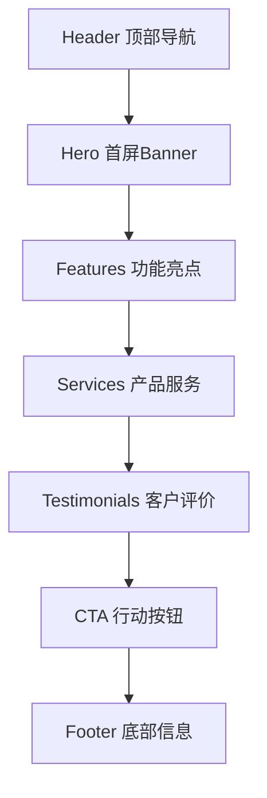

# 一页网页完整结构

## 标准结构（从上到下）

```
Header —— 顶部导航
Hero —— 首屏大banner
Features —— 功能亮点
Services/Products —— 产品服务
Testimonials —— 评价口碑
CTA —— 行动按钮区
Footer —— 底部
```

这就是90%官网、落地页、首页的标准结构。

## 完整结构示意


```mermaid
flowchart TB
    A[Header 顶部导航] --> B[Hero 首屏Banner]
    B --> C[Features 功能亮点]
    C --> D[Services 产品服务]
    D --> E[Testimonials 客户评价]
    E --> F[CTA 行动按钮]
    F --> G[Footer 底部信息]
```

>