# 深入理解视频原理：从人眼视觉到数字编码

> 视频技术的本质，是用数学欺骗人眼的艺术

## 一、引言：视频的本质是什么？

当我们观看一部电影、一段短视频，或是一场直播时，屏幕上呈现的是"会动的画面"。但这些画面为什么能动起来？数字世界里的视频究竟是什么？

**视频的本质，是一系列静态图像按时间顺序快速播放的序列。**

这个看似简单的定义背后，蕴含着光学、生理学、数学和工程学的深刻原理。本文将从最基础的人眼视觉特性出发，逐步深入到视频编码的核心技术，揭示视频技术的底层逻辑。

---

## 二、人眼视觉系统：一切技术的生物学基础

### 2.1 视觉暂留效应

视频技术存在的前提，是人类的视觉暂留现象（Persistence of Vision）。这是视频能够成立的**根本生物学原因**。

当光线刺激视网膜时，视神经会产生电信号传向大脑。当光线消失后，视网膜上的影像不会立即消失，而是会保留约 **1/16 秒（约62.5毫秒）** 的时间。这段残留的影像被称为"正后像"。

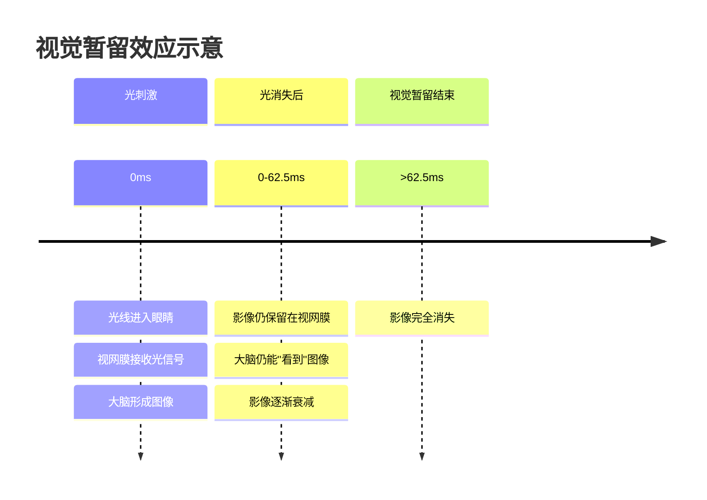

这个效应的意义在于：**如果我们在前一个影像还未消失之前，就让下一个影像出现，人眼就会感受到连续的动态效果。**

### 2.2 临界闪烁频率

视觉暂留效应带来了一个关键参数：**临界闪烁频率（Critical Flicker Frequency, CFF）**。

当图像以足够快的速度连续播放时，人眼就不再能感知到单张图像之间的切换，而是感受到连续平滑的动态画面。这个"足够快"的速度就是临界闪烁频率。

研究表明：
- **人眼对闪烁的感知阈值约为 46Hz**（即每秒46帧）
- 早期电影的 **24帧/秒** 标准刚好低于这个阈值，这也是为什么早期电影有种特殊的"电影感"
- 现代显示器的 **60Hz、120Hz、144Hz** 刷新率远高于这个阈值，确保了流畅的视觉体验

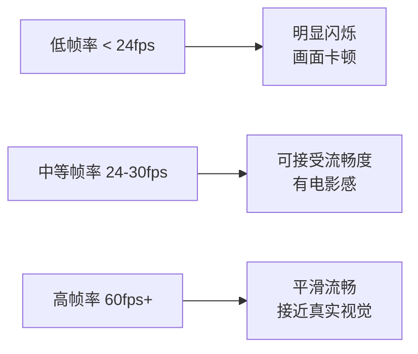

**为什么选择24帧？**

电影工业选择24帧/秒并非完全科学，而是历史和经济妥协的结果。24帧可以提供基本的动态效果，同时胶片成本可控。值得注意的是，24帧配合 **快门角度180度（即每帧曝光1/48秒）** 会产生自然的运动模糊，这种模糊反而增加了画面的流畅感。

---

## 三、从模拟到数字：视频的数字化表示

### 3.1 像素：数字图像的基本单元

数字图像由**像素（Pixel）**组成。每个像素是图像的最小可控制单位，携带颜色和亮度信息。

对于一张 **1920×1080** 分辨率的图像：
- 横向有 1920 个像素
- 纵向有 1080 个像素
- 总像素数 = 1920 × 1080 = **2,073,600 个像素**（约207万像素，即2K）

### 3.2 色彩表示：RGB与YUV

每个像素的颜色如何表示？这涉及到**色彩空间**的概念。

#### RGB色彩空间

最直观的方式是RGB（红、绿、蓝）三原色模型。每个颜色通道用8位（1字节）表示，取值范围0-255。

- **纯红**：RGB(255, 0, 0)
- **纯绿**：RGB(0, 255, 0)
- **纯蓝**：RGB(0, 0, 255)
- **白色**：RGB(255, 255, 255)
- **黑色**：RGB(0, 0, 0)

每个像素需要 **3字节（24位）** 存储空间。

#### YUV色彩空间

视频领域更常用的是YUV（或YCbCr）色彩空间，这源于人眼的另一个特性：**人眼对亮度变化比对色彩变化更敏感**。

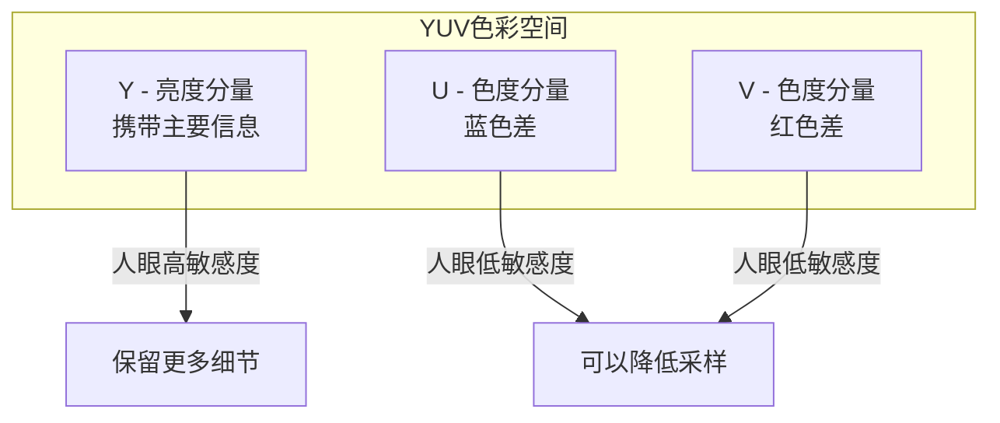

YUV的核心优势在于可以**分离亮度和色度**，从而对人眼不敏感的色度信息进行压缩，这就是**色度子采样（Chroma Subsampling）**技术。

#### 常见的色度子采样格式

| 格式 | 名称 | 说明 | 数据量 |
|------|------|------|--------|
| 4:4:4 | 无子采样 | 每个像素都有Y、U、V | 100% |
| 4:2:2 | 水平子采样 | 水平方向色度减半 | 67% |
| 4:2:0 | 水平垂直子采样 | 水平和垂直色度都减半 | 50% |

**4:2:0** 是视频中最常用的格式，意味着在2×2的像素块中，4个像素共享同一组UV值。这直接减少了50%的数据量，而人眼几乎感知不到差异。

---

## 四、视频的数据量：为什么要压缩？

### 4.1 原始视频的数据量计算

让我们计算一段原始视频的数据量：

假设一段 **10秒、1080p、30fps、RGB格式** 的视频：

```
每帧数据量 = 1920 × 1080 × 3字节 = 6,220,800字节 ≈ 5.93MB
每秒数据量 = 5.93MB × 30帧 = 177.8MB
10秒总数据量 = 177.8MB × 10秒 ≈ 1.74GB
```

一个 **2小时** 的1080p电影原始数据量：

```
1.74GB × 60秒 × 2小时 ≈ 208.8GB
```

而实际上，一部2小时的1080p电影通常只有 **2-8GB**。这就是视频压缩的魔力。

### 4.2 数据冗余：压缩的理论基础

为什么视频可以压缩？因为原始数据中存在大量的**冗余（Redundancy）**。

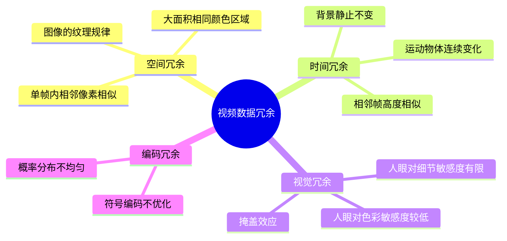

#### 空间冗余（Spatial Redundancy）

在一帧图像中，相邻像素通常高度相关。例如，一片蓝天、一面白墙，成千上万的像素值几乎相同。这种冗余可以通过**帧内压缩（Intra-frame Compression）**消除。

#### 时间冗余（Temporal Redundancy）

视频的相邻帧之间变化通常很小。例如新闻播报，背景几乎不变，只有主持人的表情和动作在变化。这种冗余可以通过**帧间压缩（Inter-frame Compression）**消除。

**时间冗余是视频压缩最核心、收益最大的来源。**

#### 视觉冗余（Visual Redundancy）

人眼的感知能力有限。对于高频细节、色彩变化，人眼的分辨能力远低于图像实际包含的信息量。这些"人眼看不出来"的信息就是视觉冗余。

---

## 五、视频压缩的核心原理

### 5.1 帧内压缩：消除空间冗余

帧内压缩针对单帧图像进行压缩，核心思想是**利用图像内部的空间相关性**。

#### 步骤一：图像分块

将整帧图像划分为固定大小的块，现代编码标准通常使用 **8×8 或 4×4** 的像素块。

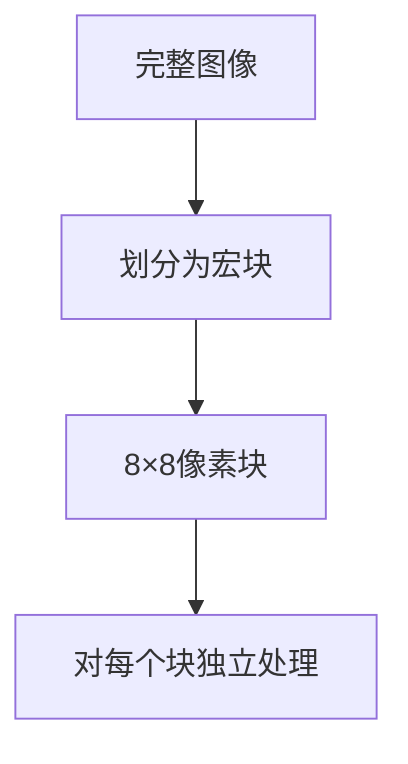

#### 步骤二：预测编码

对于每个块，尝试从周围已编码的像素预测当前块的值。预测方式包括：

- **DC预测**：用周围块的平均值预测
- **方向预测**：沿特定方向（水平、垂直、对角线等）预测

预测值与实际值的差值（残差）通常比原始值小得多，更易于压缩。

#### 步骤三：变换编码

对残差数据进行**离散余弦变换（DCT）**。DCT的神奇之处在于，它将图像从"空间域"转换到"频率域"。

```
空间域：图像数据以像素位置(x,y)表示
频率域：图像数据以频率成分表示
```

DCT后，大部分能量集中在**低频系数**（左上角），而**高频系数**（右下角）通常很小或为零。

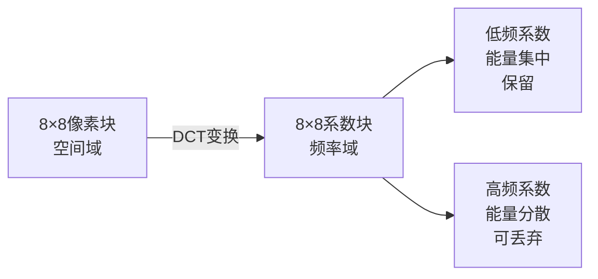

#### 步骤四：量化

量化是压缩中**唯一引入失真的步骤**。其原理是：

```
量化系数 = 原始值 / 量化步长
反量化值 = 量化系数 × 量化步长
```

由于除法取整，量化会丢失信息。较大的量化步长带来更高的压缩率，但也带来更大的失真。

#### 步骤五：熵编码

量化后的数据通过**熵编码**进一步压缩。常见的熵编码方法：

- **霍夫曼编码**：高频符号用短码，低频符号用长码
- **算术编码**：更高效，但计算复杂
- **CABAC**（上下文自适应二进制算术编码）：H.264/HEVC使用，效率极高

### 5.2 帧间压缩：消除时间冗余

**帧间压缩是视频压缩的核心，也是视频与图像压缩的本质区别。**

#### 三种帧类型

视频编码定义了三种帧类型：

| 帧类型 | 名称 | 特点 | 压缩方式 |
|--------|------|------|----------|
| I帧 | 关键帧 | 独立编码，不依赖其他帧 | 仅帧内压缩 |
| P帧 | 前向预测帧 | 参考之前的帧编码 | 帧内压缩 + 前向预测 |
| B帧 | 双向预测帧 | 参考前后的帧编码 | 帧内压缩 + 双向预测 |

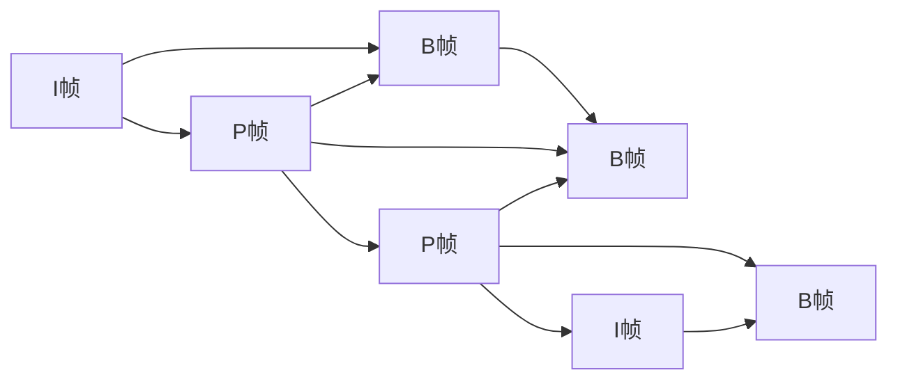

**压缩效果：**
- I帧数据量最大（100%）
- P帧数据量约为I帧的50%
- B帧数据量约为I帧的25%

#### GOP结构

**GOP（Group of Pictures）** 是视频编码的基本单元，定义了帧的组织结构。

```
典型GOP结构：IBBPBBPBBP...（长度12帧）
```

GOP长度影响压缩效率和随机访问能力：
- **长GOP**：压缩效率高，但随机访问慢，延迟高
- **短GOP**：随机访问快，但压缩效率低

#### 运动估计与运动补偿

这是帧间压缩的核心技术，其根本原理是：**视频中的运动物体在相邻帧之间是连续的。**

**运动估计（Motion Estimation）**

在参考帧中搜索当前块的最佳匹配位置，找到后计算**运动向量（Motion Vector）**。

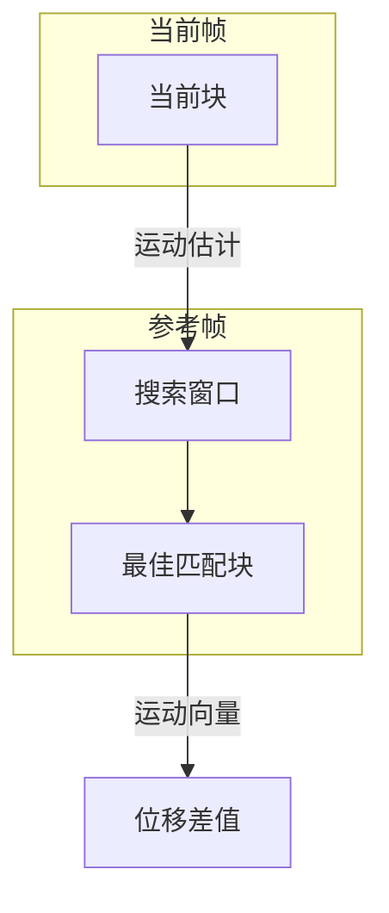

**运动补偿（Motion Compensation）**

根据运动向量，将参考帧中的匹配块移动到当前位置，计算与当前块的残差。

```
预测块 = 参考帧(当前位置 + 运动向量)
残差 = 当前块 - 预测块
```

只编码运动向量和残差，而不是编码整个块，大大减少了数据量。

**运动估计的计算复杂度**

运动估计需要在参考帧中搜索最佳匹配，这是视频编码最耗时的步骤。搜索范围通常设置为：
- 水平方向：±16 到 ±64 像素
- 垂直方向：±16 到 ±64 像素

快速搜索算法（如三步搜索、钻石搜索）用于加速这一过程。

---

## 六、视频编码标准演进

### 6.1 编码标准发展历程

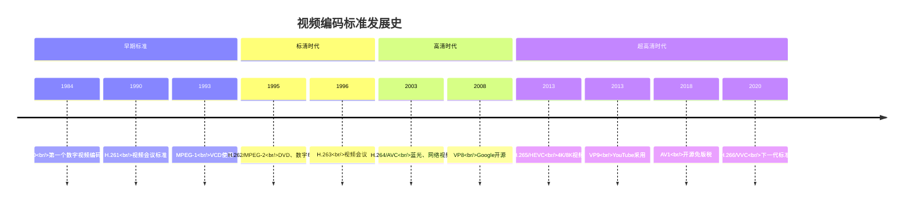

### 6.2 H.264/AVC：最成功的标准

H.264是目前应用最广泛的视频编码标准，其成功源于多个技术创新：

#### 多参考帧预测

不再只参考前一帧，而是可以参考多帧（最多16帧），在复杂运动场景中找到更好的预测。

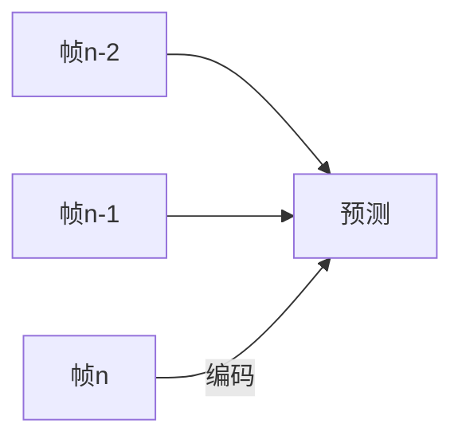

#### 可变块大小运动补偿

将一个宏块（16×16）划分为不同大小的子块，适应不同大小的运动物体：

```
16×16 → 16×8 → 8×16 → 8×8 → 8×4 → 4×8 → 4×4
```

#### 环路滤波

在解码环路中加入去块滤波器（Deblocking Filter），消除块效应，提升图像质量。

### 6.3 H.265/HEVC：面向4K/8K

H.265相比H.264，压缩效率提升约50%，但计算复杂度提高数倍。

**核心技术改进：**

| 特性 | H.264 | H.265 |
|------|-------|-------|
| 编码树单元 | 16×16宏块 | 64×64 CTU（编码树单元）|
| 预测模式 | 9种帧内预测 | 35种帧内预测 |
| 运动补偿 | 可变块7种 | 可变块更多，四叉树结构 |
| 并行工具 | 片（Slice）| 波前并行处理（WPP）、Tile |

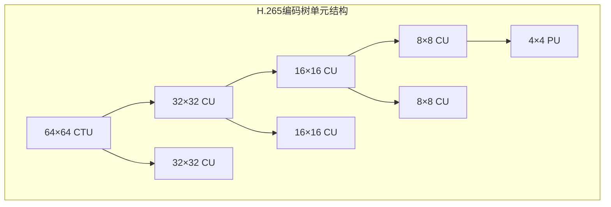

### 6.4 AV1：开源的未来

AV1由开放媒体联盟（AOM）开发，目标是提供免版税的高效编码标准。

**优势：**
- 完全免版税，无专利风险
- 压缩效率接近或超过H.265
- 获得Google、Netflix、Mozilla等支持

**挑战：**
- 编码速度慢（数十倍于H.265）
- 硬件支持尚在普及中

---

## 七、视频容器格式：视频的"包装盒"

很多人容易混淆**编码格式**和**容器格式**：

- **编码格式**：视频如何压缩（如H.264、H.265）
- **容器格式**：视频如何封装（如MP4、MKV）

容器格式就像一个盒子，里面装着：

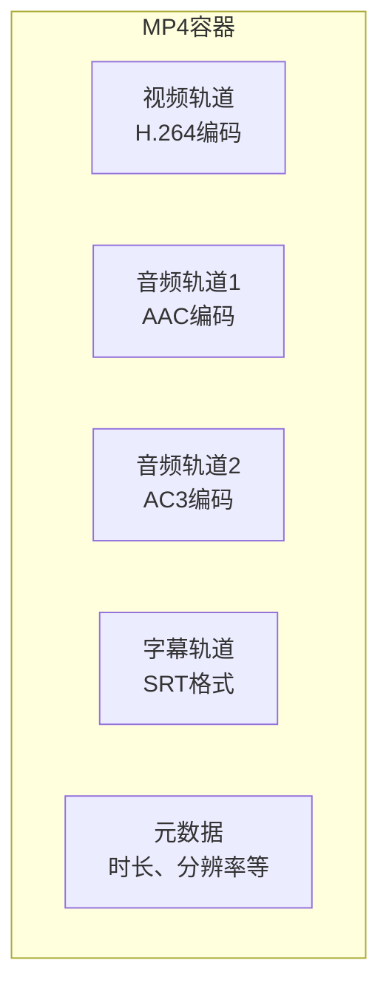

### 常见容器格式

| 格式 | 扩展名 | 特点 | 应用场景 |
|------|--------|------|----------|
| MP4 | .mp4 | 兼容性最好，支持流媒体 | 网络、移动设备 |
| MKV | .mkv | 支持多音轨、多字幕、章节 | 高清视频、蓝光压制 |
| WebM | .webm | 开源，专为Web优化 | 网络视频 |
| MOV | .mov | Apple开发，QuickTime格式 | iOS/macOS生态 |
| TS | .ts | 传输流，支持流媒体 | 广播电视、直播 |

**容器格式选择建议：**
- 一般使用：**MP4**（兼容性最好）
- 高清收藏：**MKV**（功能最全）
- 网页视频：**WebM**（开源免版税）

---

## 八、视频质量与码率

### 8.1 码率控制模式

码率决定视频的数据量和质量的平衡。常见的码率控制模式：

| 模式 | 说明 | 优点 | 缺点 |
|------|------|------|------|
| CBR | 恒定码率 | 文件大小可预测 | 复杂场景质量下降 |
| VBR | 可变码率 | 质量稳定 | 文件大小不确定 |
| CRF | 恒定质量 | 质量最稳定 | 文件大小不确定 |

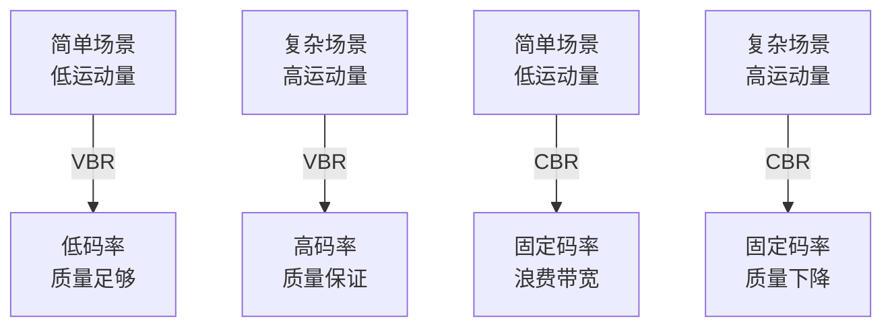

### 8.2 CRF：x264/x265的质量控制

CRF（Constant Rate Factor）是x264/x265编码器的默认模式，其核心思想是**根据内容复杂度动态调整码率，保持主观质量恒定**。

**CRF取值范围：**
- **0**：无损编码
- **18-23**：视觉无损（推荐值）
- **23**：x264默认值
- **28**：明显可见质量下降
- **51**：最差质量

### 8.3 视频质量评估

如何衡量视频质量？有两种方法：

#### 客观评估

使用数学公式计算，常见指标：

- **PSNR（峰值信噪比）**：简单但与人眼感知不完全一致
- **SSIM（结构相似性）**：更接近人眼感知
- **VMAF（视频多方法评估融合）**：Netflix开发，最先进

#### 主观评估

让真人观看打分，计算 **MOS（Mean Opinion Score）**：

```
5分：优秀
4分：良好
3分：一般
2分：差
1分：极差
```

---

## 九、从原理到实践：视频处理的完整流程

### 9.1 视频编码流程

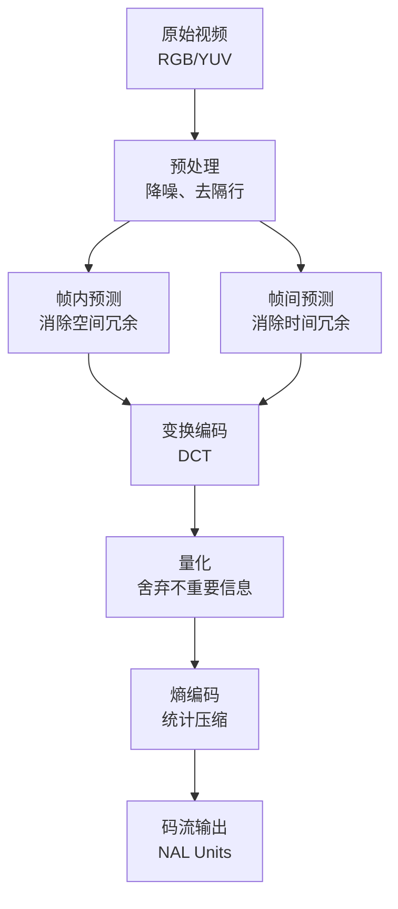

### 9.2 视频解码流程

解码是编码的逆过程：

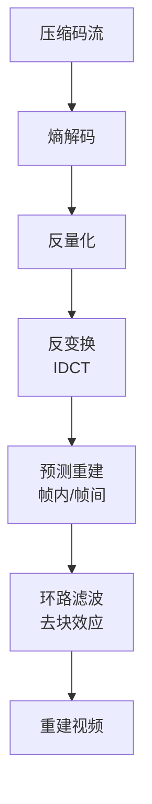

### 9.3 视频传输

网络视频传输的关键技术：

#### 自适应码率（ABR）

根据网络带宽动态切换不同质量的视频流。

```mermaid
sequenceDiagram
    player as 播放器
    server as 服务器

    player->>server: 请求视频
    server->>player: 返回manifest文件<br/>（包含多个码率版本）

    loop 播放过程
        player->>player: 监测网络带宽
        player->>player: 选择合适码率
        player->>server: 请求对应片段
        server->>player: 返回视频片段
    end
```

**常见ABR协议：**
- **HLS**（HTTP Live Streaming）：Apple开发，最广泛使用
- **DASH**（Dynamic Adaptive Streaming over HTTP）：国际标准
- **Smooth Streaming**：Microsoft开发

---

## 十、视频技术的未来趋势

### 10.1 更高分辨率

```
1080p (2K) → 4K → 8K → ...
```

分辨率提升带来的挑战：
- 数据量指数增长
- 编码复杂度增加
- 存储和传输带宽需求增加

### 10.2 更高帧率

```
24fps → 30fps → 60fps → 120fps → ...
```

高帧率带来更流畅的体验，但也会增加运动模糊控制的难度。

### 10.3 更广色域

从 **sRGB** 到 **DCI-P3** 再到 **Rec.2020**，色彩表现力不断增强。


### 10.4 高动态范围（HDR）

HDR技术大幅扩展了亮度和对比度范围：

- **SDR**：亮度 100 nits
- **HDR10**：亮度 1000-4000 nits
- **Dolby Vision**：动态元数据，逐帧优化

### 10.5 AI增强编码

人工智能正在改变视频编码：

- **AI超分辨率**：低分辨率传输，终端AI增强
- **AI编码优化**：神经网络替代传统编码工具
- **AI质量增强**：修复压缩损失

---

让我们回到最初的问题：**视频技术的本质是什么？**

通过本文的探讨，我们可以得出：

### 11.1 根本原理

**视频技术的根本原理，是利用人眼视觉系统的局限性，通过数学方法减少数据冗余。**

这包含三个层次：

1. **生物学层面**：利用视觉暂留效应和感知局限性
2. **数学层面**：利用空间、时间、编码上的数据冗余
3. **工程层面**：通过预测、变换、量化、熵编码实现压缩

### 11.2 核心权衡

视频技术的所有决策都是权衡：

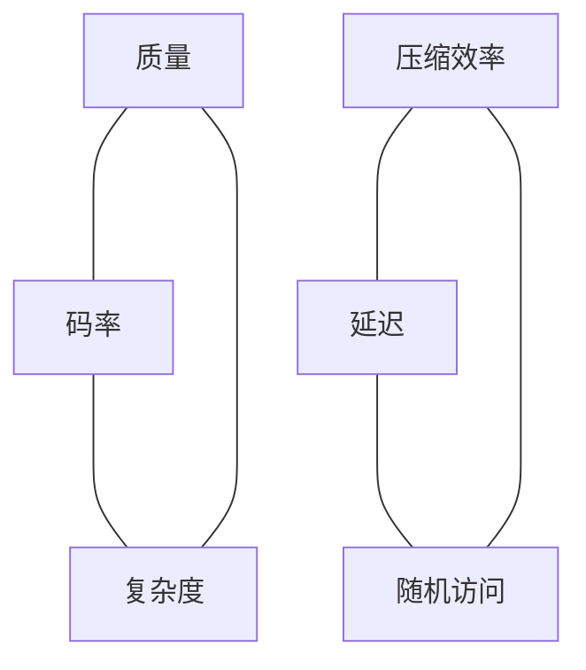

### 11.3 技术演进逻辑

视频编码标准演进遵循清晰逻辑：

1. **更高压缩效率**：在相同质量下减少码率
2. **更高复杂度容忍**：利用增长的算力
3. **更好并行性**：适应多核处理器
4. **更优算法**：AI与传统方法的融合

---